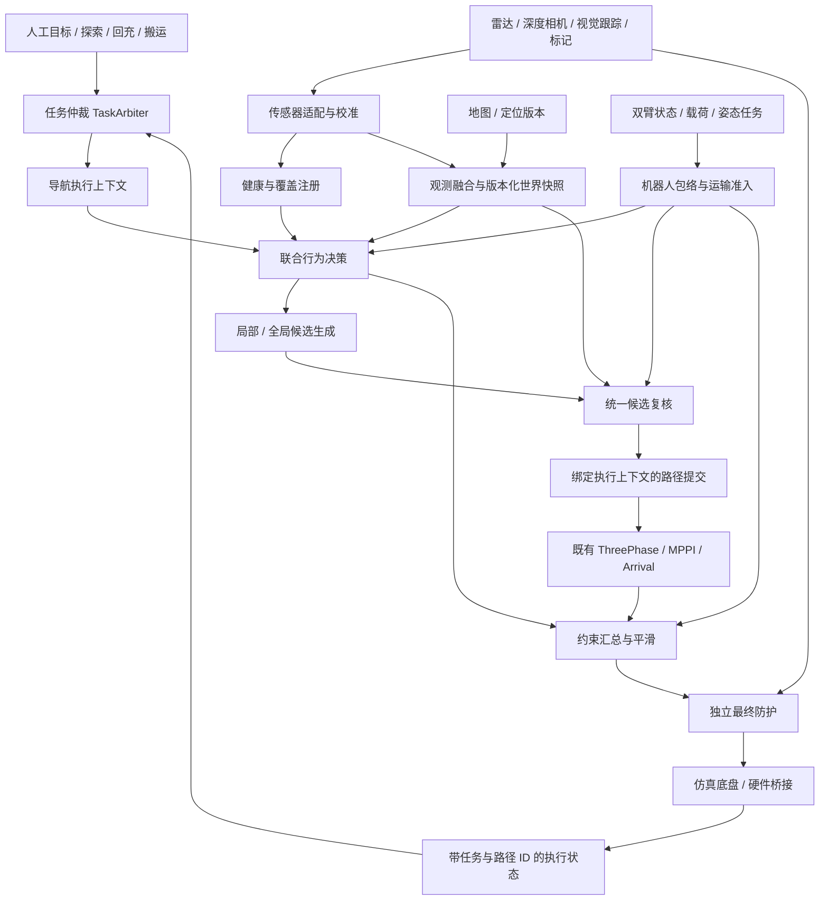

# 整合后架构审查与改进方案

日期：2026-09-14。性质：当前源码静态审查与设计建议，不是阶段放行或真机安全认证。本轮不修改运行算法、控制参数或启动中的仿真。

## 结论与范围

当前按“纯算法—感知适配—探索任务—导航策略—路径执行”划分的方向合理，适合继续增量建设。主要缺口是运行时的任务所有权、世界与机器人状态契约、并发及配置事务，不是包数量不足。建议保留现有包结构，通过端口与组合逐步完善，不做全面重写，也不把每个模块强行拆成独立进程。

检查了 `ws_robot/src/*/package.xml` 中 20 个直接子目录包的内部依赖，未发现声明层面的依赖环；该结论不包含所有深层第三方包，也不证明运行时无循环调用。检查覆盖纯算法、感知、探索、策略、跟踪、启动与双臂/底盘桥接交互边界；不声称已逐行审计全部 SDK、双臂算法或二进制实现。

评价采用职责分离、显式接口、依赖倒置等原则；其一般依据见 [Microsoft 架构原则](https://learn.microsoft.com/en-us/dotnet/architecture/modern-web-apps-azure/architectural-principles)。[ISO/IEC/IEEE 42010:2022](https://www.iso.org/standard/74393.html) 用于区分架构、架构描述及视点，不用于宣称某种目录结构或“八大原则”得到标准认证。

## 1. 现有划分是否合理

| 模块 | 判断 | 建议边界 |
|---|---|---|
| `astribot_autonomy_core` | 合理。两个可分别链接的纯 C++ 算法目标，不依赖 ROS/PCL/Nav2 | 保留几何和探索两个内部领域；以后增加算法先判断是否同一领域，避免变成通用杂物库 |
| `astribot_s1_perception_components` | 合理。承接点云、PCL、TF、ROS 组件 | 保留 C++ 高频数据处理；不要为统一语言重写已有 Python 感知 |
| `astribot_s1_perception` | 与 C++ 包并存合理，但职责说明偏宽 | 明确原始传感器适配、点云融合、定位/地图提供各自接口；“点云拼接”与“目标级融合”不能混称一个 Fusion |
| `astribot_s1_exploration` | 探索只提交 NavigateToPose 是正确边界 | 包内再分任务状态机、候选生成、规划预筛、动作适配；不恢复底盘速度出口 |
| `astribot_s1_navigation_policy` | 适合作为策略应用入口，但当前内部职责集中 | 从 ROS Node 抽出观测适配、世界读取、候选协调和行为选择；保留已有纯领域计算 |
| `astribot_s1_path_tracking` | 当前兼容部署可保留 | 在内部区分控制器、规划器适配、BT 提交三部分；公共消息留在接口包，后续再按独立发布需求拆物理包 |
| `astribot_s1_navigation` | 适合做系统装配入口 | 组装实现、配置和行为树，不承担新的感知/决策算法 |
| `astribot_s1_autonomy` | 作为旧入口门面合理 | 只做兼容转发，新业务直接依赖新归属；不要再向门面添加业务实现 |
| dynamics/manipulation/trajectory bridge | 保留专门执行与硬件适配职责 | 增加姿态、载荷、执行状态契约，与导航共享约束和任务归属，而不是互相读取私有字段 |

依据：[纯算法构建](../ws_robot/src/astribot_autonomy_core/CMakeLists.txt)、[感知构建](../ws_robot/src/astribot_s1_perception_components/CMakeLists.txt)、[探索构建](../ws_robot/src/astribot_s1_exploration/CMakeLists.txt)、[兼容门面](../ws_robot/src/astribot_s1_autonomy/CMakeLists.txt)。拆分后编译依赖方向已改善；“类和运行交互也完全解耦”则尚未成立。

## 2. 具体缺口及处理优先级

### A1 — 高：任务来源缺少统一所有权和抢占契约

探索已有本节点在途标志、请求代号和取消屏障，这是有效保护。但人工目标、探索、路线任务、后续回充/搬运任务之间没有统一的业务仲裁。Nav2 能执行一个当前 action，不等于已经定义了谁有权抢占、谁可以恢复、谁负责消费终态。

证据：[探索创建动作客户端](../ws_robot/src/astribot_s1_exploration/src/exploration_coordinator_node.cpp:149)、[取消与终态处理](../ws_robot/src/astribot_s1_exploration/src/exploration_coordinator_node.cpp:1950)；[整合记录](AUTONOMY_ARCHITECTURE_INTEGRATION.md)也明确尚无跨节点任务锁。

方案：在任务层增加 `TaskArbiter`，统一接收 `TaskRequest{task_id, source, priority, preemption_policy}`；向导航下发带执行代号的目标，维护 `RUNNING/CANCEL_PENDING/SUSPENDED/TERMINAL`。旧执行终态前不开启下一任务；无法确认取消则进入可诊断的受阻状态。人工遥控如进入另一控制通道，应由独立命令模式仲裁器排他选择，最终防护仍保留。

验收：探索与人工目标同时到达、取消前迟到接受、导航服务重启等场景中，旧执行不能继续被新任务误认领；探索不能自行夺回人工任务的控制权。

### A2 — 高：世界和执行版本存在于类型中，尚未端到端统一

`Version` 已定义目标、路径、地图、包络版本，但观察器使用 `Version('observed-route', revision, 0, 0)`，P3 协调器也将地图/包络版本初始化为 0。当前执行令牌是 BT 生命周期令牌，不是统一任务 ID 或 ROS action UUID。它能保护当前单目标候选归属，不能外推为地图热切换、动态载荷、多任务共享世界的完整协议。

证据：[观察器](../ws_robot/src/astribot_s1_navigation_policy/astribot_s1_navigation_policy/observer_node.py:98)、[协调器](../ws_robot/src/astribot_s1_navigation_policy/astribot_s1_navigation_policy/route_coordinator.py:30)、[执行消息](../ws_robot/src/astribot_navigation_msgs/msg/MotionConstraint.msg)、[候选查询](../ws_robot/src/astribot_navigation_msgs/srv/ResolveRoute.srv)。

方案：分开 `WorldVersion{map_epoch, localization_epoch, calibration_epoch, envelope_epoch, observation_seq}` 与 `ExecutionContext{task_id, execution_id, action_id, path_revision}`。传感器世界不属于某一个导航目标；候选同时引用世界和执行两个上下文。地图换版/重定位使旧候选失效，普通 costmap 更新仅要求最新复核，避免每帧重新规划。

验收：重定位跳变、地图替换、机械臂伸展/抓取、候选生成期间换目标，旧候选均被拒绝；普通地图刷新不导致请求饥饿。

### A3 — 高：双臂限速与导航几何包络尚未统一

机械臂耦合节点根据关节/TF 改变速度；策略 profile 使用固定半长、半宽，Nav2 costmap 也配置固定方形 footprint。限速不能代替“机械臂或载荷是否能通过”的几何判断。当前空载运输姿态仿真可以保持，但窄通道和携物需要统一输入。

证据：[耦合节点](../ws_robot/src/astribot_s1_dynamics_coupling/astribot_s1_dynamics_coupling/arm_chassis_speed_coupling_node.py:287)、[策略参数](../ws_robot/src/astribot_s1_navigation_policy/config/simulation.json)、[Nav2 footprint](../ws_robot/src/astribot_s1_navigation/config/nav2_params_mppi.yaml:347)。

方案：增加 `RobotEnvelopeProvider` 与 `TransportReadiness` 契约，输出实际姿态、载荷几何、几何版本、有效期、准入状态与原因。通道策略、候选检查、costmap 和最终防护依据同一几何来源派生所需表示；机械臂收拢请求必须有动作完成及观测确认，不能由导航自行设置“已收拢”。迁移时先只发布影子约束，与现有限速链比对，再替换约束汇总，保留独立防护。

验收：夹持物变宽、姿态消息过期、通道内包络变化时停止或拒绝准入；不能靠缩小 footprint 或仅降速通过。

### A4 — 高：点云配置更新不是原子事务

参数回调对多数参数先返回成功并设置 dirty；工作线程随后 `loadParameters()`。该函数逐项修改成员、清空并重建过滤链，途中可返回失败，因此日志中的“继续使用上一套有效配置”并没有完整回滚保障。

证据：[逐项写配置](../ws_robot/src/astribot_s1_perception_components/src/pointcloud_slice_scan_node.cpp:180)、[过滤链更新/参数接受](../ws_robot/src/astribot_s1_perception_components/src/pointcloud_slice_scan_node.cpp:322)、[异步应用](../ws_robot/src/astribot_s1_perception_components/src/pointcloud_slice_scan_node.cpp:441)。这是源码确认的失效路径，尚未进行现场故障注入。

方案：完整参数集解析为不可变 `PerceptionConfig`，先完成范围、关联约束及派生对象检查，再在帧边界一次替换有效快照。区分“参数存储接受”和“运行配置已应用”，带 `config_revision` 与应用结果；失败不改变任何有效配置。ROS 参数最终提交与运行快照更新的先后关系需明确，不能在仍可能被其他校验拒绝的回调中提前切换运行对象。

验收：一次提交同时含合法滤波参数与非法连杆半径，整组拒绝且下一帧输出与旧配置一致；合法更新只能整组生效。

### A5 — 高：探索搜索占用状态锁，取消响应缺少上界

`controlTick()` 持有 `state_mutex_` 后进入搜索/TF/候选处理；暂停服务获取同一把锁。多个 callback group 不会消除共享锁的阻塞。约 2138 行的协调器还同时承担配置、状态机、搜索、ROS 动作与诊断，新增任务逻辑容易扩大临界区。

证据：[状态锁](../ws_robot/src/astribot_s1_exploration/src/exploration_coordinator_node.cpp:1158)、[候选生成](../ws_robot/src/astribot_s1_exploration/src/exploration_coordinator_node.cpp:1284)、[暂停服务](../ws_robot/src/astribot_s1_exploration/src/exploration_coordinator_node.cpp:2095)。

方案：状态机只生成意图；地图/位姿取不可变快照，搜索在有限工作队列执行，结果按 `map_epoch/task_epoch/request_id` 提交。暂停先设置调度屏障并发起取消，重型工作可协作取消；保留现有终态屏障。将 ROS 动作适配与纯 `ExplorationSession` 组合，避免继续扩充 Node 的大状态机。

验收：大地图搜索期间测暂停到取消请求的 p99/最大延迟，采用现有整合方案的 100 ms 目标；迟到搜索结果不能解除暂停。不能以离线均值 3.52 ms 代替最坏响应证据。

### A6 — 中高：多传感器已预留数据类型，但接入流程仍需改中心节点

已有 `Observation`、来源、协方差、采集时刻、标定 epoch；视觉支持三维框、二维框、方位锥。也有 `ObservationAdapter`、`SensorHealthReader`、`CameraCalibrationReader` 等协议。具体运行却由 `PolicyObserver` 直接处理扫描/视觉、查询 TF、构建观测、实例化融合器并计算风险；新增传感器通常仍需编辑此类。Livox 点云融合固定为左右两路同步，适合当前硬件，尚不是通用 N 路传感器框架。

证据：[端口](../ws_robot/src/astribot_s1_navigation_policy/astribot_s1_navigation_policy/ports.py:73)、[观察器装配](../ws_robot/src/astribot_s1_navigation_policy/astribot_s1_navigation_policy/observer_node.py:37)、[视觉适配](../ws_robot/src/astribot_s1_navigation_policy/astribot_s1_navigation_policy/observer_node.py:199)、[双雷达同步](../ws_robot/src/astribot_s1_perception/astribot_s1_perception/livox_fusion_node.py:45)。

方案：按传感器注册 Adapter 工厂，分别处理 LaserScan、PointCloud2、深度相机、跟踪目标和无深度检测；配置每个来源的 frame、时间策略、校准版本、队列上限、覆盖区域、必需/可选角色。点云拼接和目标融合保留各自算法，转换到统一观测边界后交互。异步多频率来源不强制等待全体同步。

验收：增加第三路深度传感器只增适配器与配置，不修改风险、让行、跟踪算法；重复来源不重复增加置信度；缺一可选来源时按覆盖需求降级。

### A7 — 中高：健康/覆盖接口尚未接成可用能力模型

`WorldSnapshot.sensors` 已存在，但当前 `ConservativeFusion.sensors` 初始化为空，源码中未发现生产路径填充它。`SensorHealthReader` 与 `CameraCalibrationReader` 仍主要是契约预留。当前实际有效性依靠扫描、里程计及地图检查，不能宣称已具备完整多传感器健康融合。

证据：[融合初始化](../ws_robot/src/astribot_s1_navigation_policy/astribot_s1_navigation_policy/fusion.py:105)、[健康类型](../ws_robot/src/astribot_s1_navigation_policy/astribot_s1_navigation_policy/contracts.py:250)。

方案：`SensorHealthRegistry` 提供可查询的时间、深度、标定、可观测覆盖与原因；行为声明 `RequiredCoverage`。前进、横移、旋转、后退需要的覆盖不同，准入基于这些能力，不能只看节点在线或某路传感器是否发布。无深度视觉保留不确定性，不能直接转成可通行几何，也不宜不分相关区域地永久阻止全部行为。

验收：前向有效、后向失效时禁止自动后退；侧方无深度告警、重复/乱序/过期消息按明确定义处理；标定变更后旧观测不能复用。

### A8 — 中高：跨模块类型和失败语义不统一，预算叠加不透明

部分关键数据已经采用自定义 ROS 消息，但视觉输入与策略诊断仍使用 JSON/String，探索状态是拼接字符串，完成是 Bool。探索只有导航总超时及一般 action 结果处理，并未消费 P3 的让行/阻塞原因；一次合理的长等待可能消耗上层总预算。任务超时不是质量评分，但预算的用途和时钟必须明确。

证据：[探索状态发布](../ws_robot/src/astribot_s1_exploration/src/exploration_coordinator_node.cpp:2060)、[导航超时](../ws_robot/src/astribot_s1_exploration/src/exploration_coordinator_node.cpp:1438)、[策略状态与视觉消息](../ws_robot/src/astribot_s1_navigation_policy/astribot_s1_navigation_policy/policy_node.py)。

方案：扩充已有接口包，定义机器消费的 `ObservationBatch`、`SensorHealth`、`NavigationExecutionStatus`、`TaskResult`、`RobotEnvelope`；字符串保留解释和日志用途。明确 SUCCESS、用户取消、被抢占、暂时阻塞、定位丢失、规划失败的不同恢复规则；区分执行进展计时、感知/通信看门狗和任务总预算。使用同一关联 ID 串起请求、候选拒绝、路径版本、保护停车、探索结果。

验收：P3 报暂时阻塞时探索不会误报完成，也不会通过生成新目标无限刷新预算；暂停/抢占不会误记为同一种算法失败。

### A9 — 中：协议存在，但应用层仍依赖具体 Node 内部状态

Python Protocol 不要求显式继承；问题不是“没写 implements”，而是 `PolicyNode` 继承 `PolicyObserver`，协调器直接读取 `node.last_world/last_robot/path/tf/active_path_key`。若更换世界模型或回放源，需要模拟很多 Node 内部字段。`WorldModelReader.snapshot()` 等预留签名也尚未成为实际调用边界。

证据：[继承关系](../ws_robot/src/astribot_s1_navigation_policy/astribot_s1_navigation_policy/policy_node.py:14)、[协调器读取节点](../ws_robot/src/astribot_s1_navigation_policy/astribot_s1_navigation_policy/route_coordinator.py:66)、[端口](../ws_robot/src/astribot_s1_navigation_policy/astribot_s1_navigation_policy/ports.py:91)。

方案：组合注入 `WorldModelReader`、`RobotStateReader`、`CandidatePlanner`、`FrameTransformer`、`Clock`；输出 `Decision/Proposal`。ROS Node 只负责装配、消息转换和生命周期。先用当前实现做适配，保持行为等价，不同时更换算法和依赖边界。

验收：同一策略可消费实时 ROS、日志回放、人工构造快照，领域模块无需导入 rclpy 或访问 Node 私有状态。

### A10 — 中：退役逻辑仍占据正常配置面，架构说明存在漂移

探索虽已拒绝旧直控模式，但仍有 `publishBootstrapCmd()` 空实现、旧状态、旧跟踪/脱困参数和对应诊断字段。`docs/ARCHITECTURE.md` 仍描述旧自主包职责和自举/脱困运动，与最新整合说明不一致。这会让接入方误判可用能力。

证据：[退役分支](../ws_robot/src/astribot_s1_exploration/src/exploration_coordinator_node.cpp:1255)、[配置遗留](../ws_robot/src/astribot_s1_exploration/config/exploration_coordinator_params.yaml:33)、[旧总览](ARCHITECTURE.md)。

方案：在兼容加载器中集中识别旧参数并给出明确迁移结果；正常业务配置和状态机移除不可执行能力。保留用户要求的 ThreePhase 核心特性与参数。将 ARCHITECTURE 设为当前唯一总览，历史说明归档；链接到版本化 ADR 和验证回执。

验收：旧危险模式仍明确拒绝，新配置不再展示不可用旋钮；文档中的默认能力与实际启动参数一致。

### A11 — 中：打包完成不等于部署与集成完成

整合记录明确目前主要是离线验证，探索真实 Action 故障注入和闭环仍待做。多包迁移后只更新 launch 或部分 install 会出现“新包被引用但不存在”的混合部署。不能用单包构建成功替代完整应用装配验证。

方案：生成部署清单，绑定源码/构建版本、启用能力、配置摘要与接口版本；用依赖闭包构建和干净安装空间做 launch 解析、组件装载及仿真验收。配置兼容、依赖边界、动作故障注入和跟踪基线都纳入固定外部验证工程与可归档流水线，不向产品仓库堆放临时实验脚本。

验收：不依赖旧 build 目录或 shell 残留环境也能启动；回执区分“构建通过、节点就绪、场景通过、阶段放行”。

## 3. 建议的目标架构

以下是逻辑组件，不要求每个框都建一个 ROS 进程或软件包。

消息用于连续观测与状态；Action 用于有生命周期的任务和取消；Service 用于有界查询或配置提交。高频点云不应为统一接口强制 JSON 化或多次跨进程复制；世界快照可以在同一进程内通过端口读取，跨进程时再用对应 ROS 表示。

## 4. 设计原则如何落地

| 原则 | 当前基础 | 下一步对应动作 |
|---|---|---|
| 单一职责 SRP | 包层面已改善 | 拆协调器与观察器内部职责，A5/A6/A9 |
| 开闭 OCP | 策略类型与端口已预留 | 适配器注册、候选策略组合，新增传感器不改决策核心 |
| 里氏替换 LSP | 搜索质量状态、观测校验已有基础 | 相同端口统一超时、未知、取消、失败语义，不以空结果冒充成功 |
| 接口隔离 ISP | 两个核心库分别链接 | 按读取世界、查询候选、提交任务分小接口，避免传整个 Node |
| 依赖倒置 DIP | C++ 核心已去 ROS 依赖 | Python 应用层也依赖端口，ROS 适配在装配层注入 |
| 迪米特法则 | 探索不再穿透控制器 | 协调器不读取观察器私有字段，A9 |
| 组合复用 | 组件、BT、核心库已组合 | 优先组合会话和策略，保留当前控制器能力，避免扩充继承链 |
| DRY | 源码/配置归属已改善 | 统一概念与版本来源；独立防护与探索预筛具有不同职责，应保留 |

适用模式：Adapter（传感器与 ROS 转换）、Strategy（风险/候选策略）、State（任务会话）、Facade（旧包兼容）、不可变 Snapshot、Command/事件（任务与结果）。只在已有替换需求的边界使用这些模式，不为套模式增加层级。

## 5. 建议实施顺序与不退化约束

1. **A4/A5：先修运行时可靠性。** 配置事务、搜索工作队列、取消屏障与响应上界。冻结当前算法、控制参数、输出语义，做故障注入及等价回放。
2. **A1/A2/A8：统一任务与执行契约。** 先提供适配层并影子记录，验证抢占/取消/地图版本后，再切换真实任务入口；不重置原有失败预算。
3. **A6/A7/A9：把传感器预留变成可扩展接入。** 接入模拟第三传感器、健康/覆盖与回放源，保持原激光+模拟视觉场景结果。
4. **A3：完善机器人包络与姿态协作，再推进窄通道。** 先固定仿真运输姿态，随后验证载荷和动态包络；后退必须有后向观测与扫掠证据。
5. **A10/A11：兼容收敛和交付验证贯穿各步。** 每步固定外部验证回执、源码/配置摘要，完成后清理已退役表面接口。

跟踪基线仍要求到点欧式误差 ≤3 cm、角度误差 ≤1.5°；保留航向、横向误差、加减速、异常旋转、曲率及换路次数评价，完成时长不进入跟踪质量评分。任务与安全超时仍保留且明确用途。逐项通过仿真后再推进，不因架构拆包而宣称性能自动改善。

P3 已有专项闭环证据，但完整六点路线回归在本次审查前尚未执行完成；P4/P5 不因本审查而放行。自主探索整合的离线证据也不能替代“探索发目标 → P3 避障 → 原控制链到点”的整条闭环验证。
