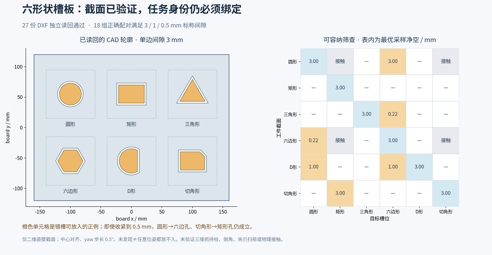

# 槽板 S0：二维截面、间隙与错槽筛查

2026-09-23。本次完成 S0 的截面子项，**完整三维 CAD、抓持/退出扫掠、可达性与接触仿真仍未验收**。维持已批准的顶部抓持段路线与六形状布局；不改现有 ROS 控制链、不启动仿真。

## 本轮产物与实测

- [参数 v2](assets/assembly_20260923/scene_spec_v2.yaml)：原工件尺寸不变；明确 D 孔为 `disk(R+c) ∩ {x≤a+c}`，圆弧/直线相交处采用尖角；多边形按外法向偏置支持线后取交点。入口/尖端倒角和制造圆角仍未定义。
- [当前 CAD 目录](assets/assembly_20260923/profiles_v2/)：6 个工件截面、18 个三级间隙孔截面、3 个板布局，共27份 DXF，单位 mm；上游参数仍用 m。圆与D形圆弧保持解析 CIRCLE/ARC，未用示意多边形代替。
- [打包下载](assets/assembly_20260923/assembly_profiles_v2.zip)：包含上述27份DXF、参数、图和生成记录，压缩包完整性检查通过。
- [解析几何报告](assets/assembly_20260923/profiles_v2/report.json)：7项几何边界测试通过，六种形状在3/1/0.5 mm三级的18组正确配对均满足标称直壁净空。
- [独立读回](evidence/assembly_s0_20260923/dxf_readback_v2.json)：ezdxf1.4.3成功读取27份DXF，审计错误/修复均0；用独立SciPy ConvexHull半平面重算多边形净空，并核对圆/D形尺寸、闭合、板尺寸与6孔位置。这里没有运行商业CAD软件或制造检验。
- [完整矩阵CSV](evidence/assembly_s0_20260923/centered_yaw_screening.csv)：108个形状×槽位×间隙组合，中心对齐，yaw每0.5°采样；正例附具体yaw及解析净空。未找到的组合只表示这些采样姿态未发现，不证明任意平移/旋转均无法放入。

| 单边间隙 | 正确配对 | 模块边界最小几何余量 | 错槽且有正净空的组合 |
|---|---:|---:|---:|
| 3 mm | 6/6 | 10 mm | 6 |
| 1 mm | 6/6 | 14 mm | 2 |
| 0.5 mm | 6/6 | 15 mm | 2 |

模块余量仅指孔截面到80×80 mm模块外边界，不代表紧固件、夹爪或其他已装工件的净空。

## 对任务编排的直接约束

圆形件在六边孔、切角件在矩形孔中，**三级间隙均有正净空**。在3 mm级，D形件放进圆孔仍有1 mm净空，六边形件放进圆孔约有0.21539 mm净空；三角形旋转30°也能放进该级六边孔。总计10个间隙组合，涉及6个不同错配形状对。

因此收紧间隙本身不足以机械防错。编排必须验证 `object_instance → model_id → assigned_slot_id → socket_revision`，保留错槽/占用/身份歧义拒绝路径；几何可容纳、低插入力或到底均不得替代指定槽位匹配。**本轮提供了几何证据，运行时绑定门控尚未实现。**

图中“接触”表示理论零净空，不是可稳定插入的正例。负结果也不能升级为机械防错证书：例如3 mm级圆形件中心对齐时不满足D孔直边，但向−x平移5 mm可形成理论相切容纳。

## 版本与复现

[生成工具](../tools/assembly/generate_profiles.py)为离线准备脚本；[独立读回工具](../tools/assembly/verify_profiles.py)不导入生成器。实现与已知限制见[工具说明](../tools/assembly/README.md)。ezdxf固定1.4.3，从官方PyPI取得并核对发布方SHA256，只安装在本任务缓存，未改宿主软件包。

首版 `profiles_v1` 的解析结果保留，但其 DXF 缺少 R2000 的实体子类标记，独立读取矩形/板文件实际报错；[拒绝记录](evidence/assembly_s0_20260923/dxf_v1_rejection.json)保留原现象。按[Autodesk DXF定义](https://help.autodesk.com/cloudhelp/2015/ENU/AutoCAD-DXF/files/GUID-748FC305-F3F2-4F74-825A-61F04D757A50.htm)补齐实体标记后生成全新的 `profiles_v2`，独立读回通过。**交付使用v2，不能把v1当作可用CAD轮廓。**

下一项为三维实体：抓持柱与下部截面的真实并集、肩部、tip/入口倒角、拓扑、质量/惯量及接触网格。当前主机未发现OpenSCAD/FreeCAD/Blender或可用Python CAD布尔内核；需在允许依赖准备的时段配置独立工具，维持导航任务的运行/下载资源所有权。之后再做完整夹爪/腕部开合退出扫掠、IK与板位置选择，不由二维通过推定三维通过。[本轮检查点](evidence/assembly_s0_20260923/checkpoint.json)
