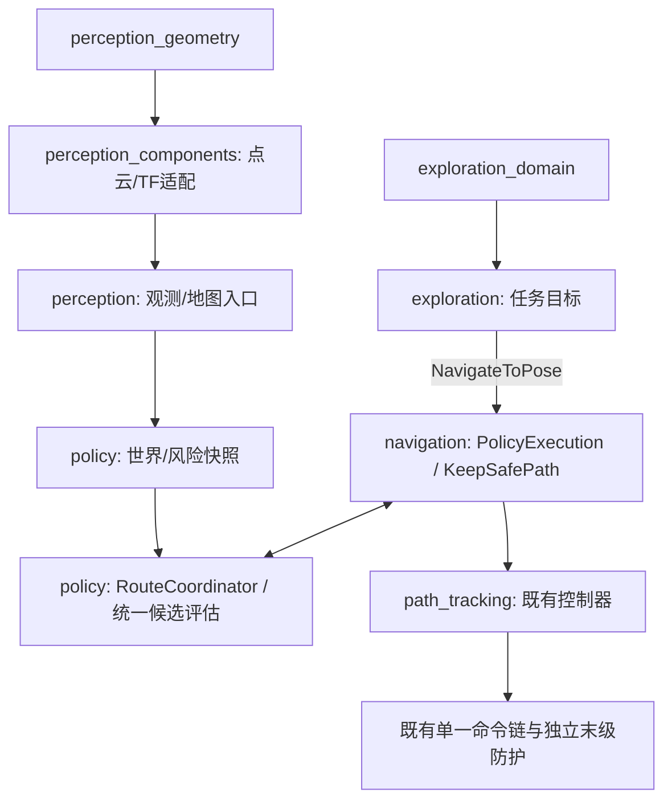

# 自主感知与探索的架构整合

日期：2026-09-14。状态：代码拆分、离线验证；未进行仿真闭环或真机放行。

本记录落实 [动态避障与窄通道设计](DYNAMIC_AVOIDANCE_AND_NARROW_PASSAGE_DESIGN.md) 第 4、8、9 节。按 [ISO/IEC/IEEE 42010:2022 公开说明](https://www.iso.org/standard/74393.html) 组织利益相关方、关注点、视图与决策；按 [ISO/IEC 25010:2023 公开说明](https://www.iso.org/standard/78176.html) 建立可测质量要求。没有访问标准全文，也不声称完成标准符合性评定。标准不指定避障算法或统一的“八大原则”。分层与依赖倒置参考 [Microsoft 架构原则](https://learn.microsoft.com/en-us/dotnet/architecture/modern-web-apps-azure/architectural-principles)。

## 1. 利益相关方、关注点与视点

| 参与者 | 关注点 | 采用的视点 / 验收入口 |
|---|---|---|
| 操作者、现场集成人员 | 暂停是否阻止后续目标；地图不可用时不能误报完成；旧启动入口能否迁移 | 运行与失效视图，Q-R1～R4、Q-C1 |
| 感知与算法维护者 | 点云处理不依赖 Nav2；算法可离线复现；配置单一来源 | 开发与依赖视图，Q-M1～M3 |
| 导航策略与控制维护者 | 唯一路径执行权；统一候选评估、版本提交、最终防护 | 控制权视图，Q-R1、Q-C2 |
| 验证与性能维护者 | 明确质量状态；耗时、资源上界和闭环证据可测 | 质量视图，Q-P1～P2；外部验证目录 |

## 2. 开发视图：物理包与职责

| 包 / 目标 | 内容 | 不承担的职责 |
|---|---|---|
| `astribot_autonomy_core::perception_geometry` | `slice_projector`、`self_filter`、`scan_guard_policy`、`livox_custom_convert` | ROS 节点、PCL、TF 查询、导航动作 |
| `astribot_autonomy_core::exploration_domain` | `frontier_search`、`path_validator`、`costmap_adapter`、`failure_budget`、`exploration_state`、`escape_logic` | ROS 通信、动作提交、速度发布 |
| `astribot_s1_perception_components` | 点云切片 ROS 组件、PCL/TF 适配、可选 Livox 转换节点，以及对应 launch/config | 探索任务与路径控制 |
| `astribot_s1_perception`（已有 Python 包） | 传感器/地图启动编排、SLAM 适配及世界观测入口 | 不因接入 C++ 切片而改变构建类型 |
| `astribot_s1_exploration` | 前沿建议组件、探索任务协调器；访问历史、候选预筛、失败预算、顺序目标、驻留及暂停 | 自举速度、脱困速度、直接 FollowPath、跟踪期重规划 |
| `astribot_s1_navigation_policy`（已有 Python 包） | 快照、风险、行为决策、RouteCoordinator、候选验证及版本管理 | 不复制一套探索状态机 |
| `astribot_s1_path_tracking`（已有 C++ 包） | PolicyExecution/KeepSafePath BT 接口、候选规划适配、既有跟踪控制器 | 前沿搜索和传感器自体过滤 |
| `astribot_s1_navigation` | 行为树、系统启动、单一命令链和末级防护配置 | 不重新实现几何算法 |
| `astribot_s1_autonomy` | 旧 launch、配置路径、可执行入口及组件发现的兼容门面 | 不再编译算法或节点实现 |



图中箭头表示数据或调用流；编译依赖方向是 ROS 适配依赖纯算法库，纯库不反向依赖适配。两个纯库分别链接，探索组件不链接 PCL 或点云几何库。`escape_logic` 暂保留为无副作用的历史算法接口，不接入运动执行；后续恢复策略若复用它，仍必须走统一候选验证，不能恢复旧速度出口。

## 3. 运行与控制权视图

1. 感知组件将点云转换为扫描，保留既有质量/时效保护。探索读取 `/map` 找前沿，读取 costmap 做探索任务的未知区预筛。
2. 任务协调器请求 ComputePathToPose 只是评估候选目标是否值得提交。此路径不会送给 FollowPath，也不是最终可执行路径的安全凭证。
3. 通过预筛的目标以 NavigateToPose 交给导航栈。默认不覆盖行为树，使用 `navigation.launch.py` 配置的 `navigate_to_pose_precise_goal.xml`。保留的探索专用树也接入 PolicyExecution，并将 session 传给 KeepSafePath。
4. 实际路径的生成、局部/全局候选选择、后验验证、版本提交、风险暂停及跟踪属于现有导航策略链。探索预筛不能代替此处的验证；世界变化后必须按当前证据重新评估。
5. 探索协调器不再创建 Twist publisher 或 FollowPath client。旧配置 `follow_path`、`escape_enabled=true`、`bootstrap_mode=rotate` 会在创建业务通信端点前报错，而非悄悄启用旁路。
6. 无地图或冷启动地图不足时等待有效输入；本次没有将“原地转一转”隐式迁入另一层。恢复动作需要明确的上层任务和验证，默认没有自动自举运动。

部署开关 `navigation_policy_stage` 保持既有默认 `off`，本次不自动提高阶段；只有选择并验证相应阶段（例如 `p3`）才会启用 RouteCoordinator 动态候选流程。进入策略行为树不等同于所有动态避障阶段已启用或已通过验收。

前沿建议组件只发布候选位姿，适合观察和调参；不要把它与协调器同时接成两个自动导航目标源。是否允许外部用户任务抢占探索，仍由部署时的上层任务仲裁约定决定；本次没有引入跨节点全局任务锁。

### 异步与失效语义

- 规划请求携带递增请求代号；超时、暂停或清理本轮候选会使旧代号失效。迟到接受则取消，迟到结果不修改新候选。
- 导航取消使当前代号失效，但保持在途屏障直到目标拒绝或终态结果。取消发生在 goal response 之前时，迟到的接受也会被取消，不允许提前再下发一个目标。
- 若服务端永不返回终态，屏障保持关闭；这是拒绝继续调度，不是“取消已完成”。需要运维确认服务端状态后处理，不能超时后盲目开放下一目标。
- 探索请求代号只负责本节点异步归属，不替代策略层的 goal/path/map/envelope/request 版本契约。
- FrontierSearch 显式返回 `kOk / kNotConfigured / kInvalidMap / kResourceLimit / kNoReachableSpace`。只有 `kOk` 才能依据前沿数判断完成；无法找到可达自由格时不再跳过可达性过滤。

## 4. 八项原则的具体映射

| 原则 | 本次实现边界 |
|---|---|
| SRP | 感知适配、纯算法、探索任务、导航策略与控制执行分包；删除探索中的独立运动执行 |
| OCP | 保留既有策略端口与候选链；探索作为新的任务来源接入 NavigateToPose，不向控制器添加前沿分支 |
| LSP | 搜索返回显式质量状态；错误不能替代“无前沿”；任务目标不能冒充已获准执行的路径 |
| ISP | 感知只依赖点云几何目标；探索只依赖探索算法目标；调用 NavigateToPose/ComputePathToPose 的小范围 ROS 接口 |
| DIP | 核心计算使用标准 C++ 数据，不依赖 rclcpp/Nav2/PCL；ROS 层做转换，策略继续使用现有 contracts/ports |
| 迪米特法则 | 探索只消费地图/costmap 快照和动作接口，不穿透访问风险、跟踪器或控制器的内部对象 |
| 组合复用 | 保留两个独立算法库、ROS 组件和既有 BT 组合，不新建控制器继承体系；Python 包无需改建制 |
| DRY | 配置与源文件只有一个归属；旧入口转发；实际可执行候选沿用既有 RouteCoordinator 验证，不复制动态避障决策 |

不要求每个纯函数都套抽象接口，也不把独立末级防护视为应被 DRY 删除的重复逻辑。

## 5. 设计决策记录

| 决策 | 选择与原因 | 替代方案 / 代价 |
|---|---|---|
| ADR-A01：按职责拆包 | 新建一个纯算法包（两个链接目标）、一个 C++ 感知组件包、一个探索任务包 | 直接把 C++ 塞进现有 ament_python 包会牵动 Python 安装和部署；仅拆源目录无法约束 PCL/Nav2 依赖 |
| ADR-A02：探索只提交任务 | 统一 NavigateToPose → 策略 BT；移除 FollowPath/速度旁路 | 保留双执行模式更易“回退”，但会绕过统一会话与候选提交，故拒绝旧直控参数 |
| ADR-A03：兼容命名与入口 | 保留 `astribot_s1_autonomy` C++ 命名空间、头文件 include 名、组件类 ID；实现和库所有权迁移 | 本次不做全仓库无语义收益的类型改名；**不承诺二进制 ABI 兼容**，依赖方须重新构建 |
| ADR-A04：失效关闭 | 搜索错误不完成，取消未终结不下发下一目标 | 服务端失联时牺牲自动恢复可用性，避免旧目标仍在执行时叠加任务 |
| ADR-A05：保留独立预筛 | 探索仅判断目标可用性；真正执行的路径仍由策略验证 | 预筛可能增加一次规划请求，但避免将探索未知区规则变成所有导航任务的通用规则 |

后续优化：协调器仍包含配置加载和 ROS 状态机；重型搜索仍在状态锁内，应在独立快照/工作队列完成后按版本提交。点云运行时配置的事务化也尚未在本次重构中解决。这些是明确的改进边界，不能用“已拆包”替代并发可靠性验证。

## 6. 可测质量要求与验证状态

| ID / 质量 | 可测要求 | 本次证据 / 放行边界 |
|---|---|---|
| Q-M1 可维护性 | 两个核心库可用 C++17 编译器独立编译；无 ROS/PCL/Nav2 include/link | 核心算法离线编译及链接依赖检查 |
| Q-M2 模块性 | 感知组件不链接探索库；探索组件不链接 PCL/点云库；旧门面无实现源文件 | CMake 构建与链接清单检查 |
| Q-M3 单一来源 | 4 份旧配置与对应新归属内容一致；4 个旧 executable 转发；3 个旧组件 ID 指向新库 | 安装路径与入口静态检查；不加载组件 |
| Q-R1 可靠性 | 探索创建的 Twist publisher 和 FollowPath client 数均为 0 | 源码边界检查；本次没有启动业务节点 |
| Q-R2 可靠性 | 未配置/畸形/超限/无可达空间不得报告搜索成功；未知区目标拒绝率 100% | 离线算法断言通过 |
| Q-R3 可靠性 | 暂停后迟到接受必须取消；旧结果不得修改新任务；上一目标终态前新目标数为 0 | 请求代号与取消屏障已实现；真实 Action 故障注入尚未验证 |
| Q-R4 可恢复性 | 无地图等待；搜索错误进入暂停；不可自动恢复为 COMPLETED | 代码分支检查，闭环验证待执行 |
| Q-C1 兼容性 | 旧/新 launch 的参数入口可解析；内部集成直接引用新包 | launch 描述解析，不执行节点 |
| Q-C2 集成性 | 探索可执行路径进入 PolicyExecution，KeepSafePath 接收同一 session | 行为树 XML 静态检查；动态绕障闭环待验证 |
| Q-P1 性能效率 | 400×400 地图、固定配置，20 次离线搜索均值 < 50 ms（本机开发基线） | 本次均值约 3.52 ms；不是最坏耗时或真机保证 |
| Q-P2 资源利用 | 超过 16,000,000 格必须在工作掩码分配/搜索之前返回资源超限 | 4001×4000 输入断言通过；传入快照本身的内存不包括在此保护内 |
| Q-R5 集成响应 | 在部署目标硬件上测暂停到取消请求 p99 ≤ 100 ms，并报告最大值；任何迟到回调不能放行旧任务 | 本次未测；当前状态锁内搜索可能影响该指标，未满足前不能声称实时保证 |

最终工作区构建：9 个包通过（含消息、策略、跟踪、导航集成依赖）；旧/新探索 launch 的 `--show-args` 输出完全一致。链接检查确认两个核心目标分别被对应组件使用，所有动态库依赖可解析。汇总与源码 SHA-256 见外部 `results.json`。

验证代码与原始证据放在外部 `/tmp/astribot-autonomy-validation/`；隔离构建使用 `/tmp/astribot-refactor-build`、`/tmp/astribot-refactor-install`。不新增仓库内零散测试脚本。临时目录会被系统清理，应在发布前由验证流程归档。本记录只声明已完成的离线项目，动态目标跟踪、窄通道和真机链路仍需设计文档第 9 节的闭环验收。

## 7. 迁移与构建

新入口：

- 切片：`astribot_s1_perception_components / slice_scan.launch.py`
- Livox 转换：`astribot_s1_perception_components / livox_custom_to_pc2.launch.py`
- 前沿建议：`astribot_s1_exploration / frontier_explore.launch.py`
- 探索任务：`astribot_s1_exploration / exploration_coordinator.launch.py`

旧包的同名 launch、ros2 run 名称、配置路径仍有兼容入口。旧单体 `astribot_s1_autonomy_components` 库已经停止构建；二进制依赖方必须重新构建并链接相应新导出目标。兼容配置在源码中用相对符号链接，在安装时通过目标包实际配置路径安装，避免孤立 install prefix 下的断链。

```bash
source /opt/ros/humble/setup.bash
source ws_robot/install/local_setup.bash
colcon build --base-paths ws_robot/src --build-base ws_robot/build \
  --install-base ws_robot/install --symlink-install \
  --packages-select astribot_autonomy_core astribot_s1_perception_components \
  astribot_s1_exploration astribot_s1_autonomy \
  astribot_s1_perception astribot_s1_navigation
```

Livox 转换器仍取决于构建环境中可用的 CustomMsg/typesupport；缺失时 CMake 明确报告跳过，不把“核心构建成功”当成 Livox 真机链路通过。构建不会热替换已经运行的节点；部署应按现有栈运维流程另行进行。
