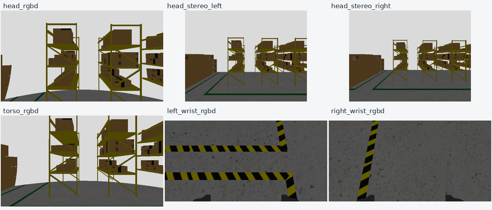

# 六相机参考安装与腕部外参（2026-09-21）

本轮根据用户的整机标注图、两张夹爪实拍，以及现有机器人网格，将相机安装到可用于仿真的参考位置。照片确定安装部位和大致朝向；平移尺寸由现有 CAD/URDF 几何辅助选取，**不是从照片测量得到的真机标定结果**。当前状态为 `provisional_reference`，安装版本 `2026092101`，仅用于等待完整标定期间的仿真。

## 腕部相机参考外参

两张实拍显示，相机固定在夹爪掌座侧面的支架上，镜头朝向夹指伸出方向。参考安装附着于固定掌座，不能挂到活动夹指。照片本身无法确定左右手身份或原点尺寸，因此左右暂按相同的局部安装面配置，后续分别标定。

约定 `p_parent = T_parent_optical · p_optical`；平移为米，四元数顺序为 **x、y、z、w**。光学坐标为 X 向图像右、Y 向图像下、Z 向镜头前。

| 相机 | 父坐标系 | 光学中心 XYZ（m） | 光学系四元数 XYZW |
|---|---|---|---|
| left_wrist_rgbd | astribot_arm_left_link_7 | `[0.006, -0.088, -0.060]` | `[0.70710678, 0, 0, 0.70710678]` |
| right_wrist_rgbd | astribot_arm_right_link_7 | `[0.006, -0.088, -0.060]` | `[0.70710678, 0, 0, 0.70710678]` |
| left_wrist_rgbd | astribot_gripper_left_base | 约 `[0, -0.060, 0.040]` | 约 `[0, 0, 0, 1]` |
| right_wrist_rgbd | astribot_gripper_right_base | 约 `[0, -0.060, 0.040]` | 约 `[0, 0, 0, 1]` |

其中腕部第 7 连杆到光学系的变换为：

```text
T_arm7_optical =
[ 1   0   0    0.006 ]
[ 0   0  -1   -0.088 ]
[ 0   1   0   -0.060 ]
[ 0   0   0    1     ]
```

在夹爪基座系中，镜头中心位于负 Y 侧约 60 mm、沿夹指伸出方向正 Z 约 40 mm，光轴沿正 Z。该 60 mm 包含从基座原点到镜头中心的偏移，不是支架长度。厂商 URDF 的固定安装角写为 `1.5708`，与 π/2 有舍入差；因此上表夹爪基座数值是近似值，精确 FK 差约 0.265 µm / 3.673 µrad，远小于当前未标定的实际安装不确定度。

**不要将 camera_link 的安装 RPY 直接当成 optical_frame 的 RPY。** 本实现的 wrist `camera_link` 使用 `[π, 0, -π/2]`，经过标准 optical 固定旋转后，才得到上表光学系的 `[π/2, 0, 0]`。所有精确矩阵与四元数保存在 [reference_extrinsics.json](evidence/camera_reference_20260921/reference_extrinsics.json)。

## 整机安装位置与命名

唯一参考安装配置为 [camera_mounts_reference_sim.yaml](../ws_robot/src/astribot_s1_description/config/camera_mounts_reference_sim.yaml)。下表为 **parent→camera_link**，单位 m/rad；相机光学中心与 camera_link 原点同点，方向经标准 optical 关节转换。

| 照片/文档名称 | 仿真实例 | URDF 父坐标系 | XYZ | camera_link RPY |
|---|---|---|---|---|
| head_rgbd | head_rgbd | astribot_head_link_2 | `[0.107328,-0.220,0]` | `[π/2,0,0]` |
| head_stereo | head_stereo_left | astribot_head_link_2 | `[0.115197,-0.150,0.030]` | `[π/2,0,0]` |
| head_stereo | head_stereo_right | astribot_head_link_2 | `[0.115197,-0.150,-0.030]` | `[π/2,0,0]` |
| torso_rgbd | torso_rgbd | astribot_torso_link_4 | `[0.104390,0,0.120]` | `[0,0,0]` |
| left_wrist_rgbd | left_wrist_rgbd | astribot_arm_left_link_7 | `[0.006,-0.088,-0.060]` | `[π,0,-π/2]` |
| right_wrist_rgbd | right_wrist_rgbd | astribot_arm_right_link_7 | `[0.006,-0.088,-0.060]` | `[π,0,-π/2]` |

头部局部系的负 Y 是向上、正 Z 是机器人左侧，因此双目 60 mm 基线写在局部 Z 上。双目左右内参仍各自保留，不宣称完成双目校正或视差深度。腹部相机改为随上身 `torso_link_4` 运动，原先相机直接挂底盘不符合照片位置。腕部跟随各自第 7 连杆，且与夹爪固定基座保持刚性关系。


## 已实施的模型和启动修正

- 镜头原点位于不透明壳体前方，壳体和小支架贴合真实机身/固定掌座；没有隐藏机器人或夹指来消除遮挡。
- Gazebo 原生 sensor frame、TF 别名与健康模块版本从同一安装配置解析。腹部 raw frame 为 `astribot_s1/astribot_torso_link_4/torso_rgbd_sensor`。
- 导航仓库仿真默认选取新参考配置；MoveIt 在 `use_sim_time=true` 时同样选取它。自定义配置须向两处传入同一个 `camera_mounts_profile`。
- 直接 xacro 和 MoveIt 真机模式默认不启用临时安装配置。原始 JSON 与六份相机 YAML 的七项 SHA-256 全部保持不变。空配置恢复的是历史映射，不代表历史值已通过物理标定。
- MoveIt 启动时仅对实际 URDF 中全固定关节连通的六组安装接触添加邻接豁免，不修改共用 SRDF。原真机/空配置的 SRDF 字节保持不变；不增加腹部相机与活动 `torso_link_3` 的豁免。
- 腹部相机部分壳体和整个支架已被固定 `torso_link_4` 的保守碰撞盒覆盖。去掉重复部分、保留露出的壳体碰撞盒后，**整个固定组件碰撞体积并集不变**。区间覆盖测试验证这一点，外部障碍测试也证明被去重区域仍由父体检测。可见外形、惯性和光学外参不变。
- 未增加 Python 运行时节点。新增 Python 仅用于启动和离线/采集验证；规划碰撞检查使用 C++ MoveIt/FCL。

## 验证与适用范围

离线验证已完成：

| 验证 | 结果 | 证据范围 |
|---|---|---|
| 描述包测试 | 29/29，3 个测试套件 | 原始标定保留、覆盖参数、光学轴、安装名称和碰撞体积并集 |
| 相机启动检查 | 9 项通过 | 参考/空配置的帧、版本、话题和 bridge 选择 |
| 规划启动契约 | 4 项通过 | 仅 6 对刚性接触、原真机语义不变、活动连接反例不豁免 |
| MoveIt/FCL | 24/24 状态无自碰撞 | 零位/home/左右 ready/双 ready，加躯干 yaw −1.2/0/+1.2；各配开/半闭/闭夹爪 |
| 外障碍探针 | 6/6 壳体、2/2 父体覆盖检出 | 安装豁免没有关闭相机对环境的碰撞 |
| 网格视线采样 | 18 组，每组 1025 条射线 | 头部三路和腹部无自遮挡；双腕中央视线在三开度下畅通 |

腕部外围 1.37–3.32% 的采样射线命中真实夹指，最近约 93.46 mm；这属于正常夹指可见范围，不宣称整个画面零自遮挡。离线射线检查使用零机械臂姿态和三种夹爪开度，不代表任意姿态、负载或动态遮挡验收。原 visual 网格审计与最终模型的所有 visual/joint 已逐项比较相同，只有上述腹部重复 collision 去重；见 [等价性记录](evidence/camera_reference_20260921/final_geometry_equivalence.json)。

实际六路渲染、深度、健康、点云和同戳 TF 数据保存在 [实时采集摘要](evidence/camera_reference_20260921/live_six_cameras/summary.json)。最终模型采集 20.000 s，仿真时钟推进 19.995 s；头/腹各 199/200 组完整同戳 RGB+depth+info，双目各 100 组 RGB+info，左/右腕各 100/99 组 RGB+depth+info。两路健康检查各 400/400 OK，均为 revision `2026092101`；头/腹全图有效深度比例约 40.9%/56.1%，双腕均为 100%，双腕中央 11×11 深度全部有效。实际读取运行中 `robot_description`，六相机的固定关节、可见外形与碰撞几何均与最终离线 MoveIt 模型相同。

本轮头/腹为 640×360、10 Hz，双腕 640×320、5 Hz，双目 400×300、5 Hz，属于仿真验证分辨率和速率；缩放内参另存运行目录，未改原标定。只给头/腹配置了健康和 C++ 点云消费者，双腕/双目数据以原始帧与同戳 TF 核验，不将未配置的健康消费者计为通过。



本轮仅静态导航仓库内的相机安装验证，不包含 VLA、抓取执行、导航负载或真机验收。头和腹部中央深度像素因开放远景超出约 5 m 量程为无效值，不能把这一点等同于被机身挡住；对应 RGB 显示开放仓库，其他区域仍有有效深度。

完整证据： [碰撞检查](evidence/camera_reference_20260921/moveit_collision_green.json)、[独立代码复核](evidence/camera_reference_20260921/review.md)、[几何审计](../runs/camera_reference_20260921/final_source_overlay_all_visuals/README.md)。

仿真沿用唯一导航仓库资产，隔离 domain `88`、partition `astribot_camera_reference_20260921`。会话日志绝对路径：`/home/yjh/WorkSpace/astribot_sdk_ros2/runs/camera_reference_20260921/session/session.log`；查询环境在同目录 `query_env.sh`。本轮只停止或重启已核实身份的本任务相机会话；旧证据保留在 `archive/`。

## 后续替换完整标定

分别测量每个固定父坐标系到各相机光学中心的变换，明确旋转定义、左右设备身份和标定来源。更新安装 profile，增加 revision，并用同一 profile 重建/启动仿真与规划模型；重跑安装契约、覆盖证明、碰撞和传感器验证。若安装改变使父碰撞盒不再覆盖腹部去重区域，应恢复完整相机碰撞体，不能沿用当前尺寸。真机配置需独立标定和验收，不因本次模拟画面正常而放行。
