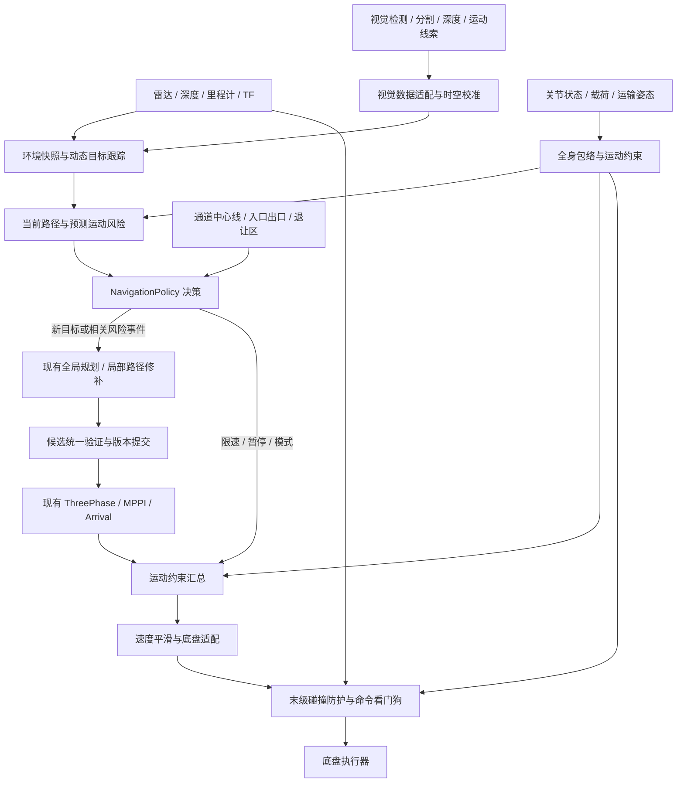
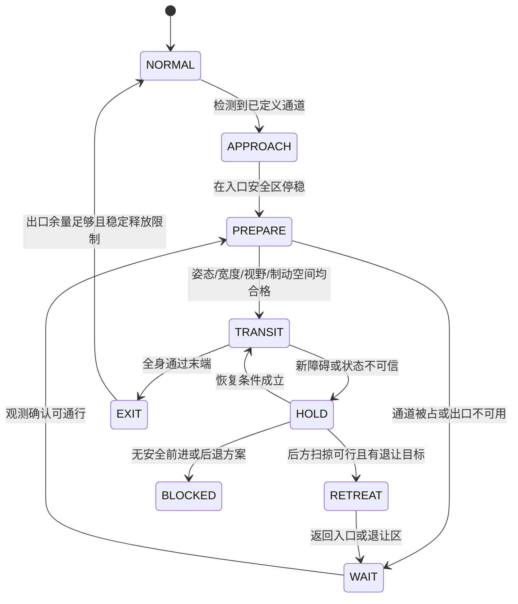

# 动态避障、事件重规划与窄通道设计

日期：2026-09-13。按用户最新要求，先用现有仿真配置参数化全部阶段，仿真验证通过即可顺序推进。P0–P2 已通过，P3 开始实施，P4/P5 尚未放行。真机实测不阻塞仿真开发，但真机放行仍需独立证据。实施状态见[阶段记录](NAVIGATION_POLICY_IMPLEMENTATION.md)。

## 1. 设计结论和基线

采用“全身感知与风险预测 → 行为决策 → 候选路径验证 → 现有跟踪器 → 最终碰撞防护”的分层方案。短暂动态障碍优先减速、等待；持续阻塞才绕行或改全局路线；窄通道采用进入前评估、预对齐、单向通过和安全退出。正常无障碍时保持当前路径与控制输出，不周期性重规划。

保留当前 ThreePhaseController、MPPI、ArrivalController 和 ArrivalGoalChecker。当前质量基线使用仿真最大线速度 0.35 m/s、PathAlign 方向评分、offset=6、平移正加速度上限 0.5 m/s²。两轮 12/12 到点通过，最大 2.128 cm / 1.126°；这些是仿真结果，不是硬件极限。详见 [航向与平顺性验证](HEADING_CONVERGENCE_VALIDATION.md)。

约束：

- 到点欧氏误差 ≤3 cm、角度误差 ≤1.5°，同时停稳；避障不修改目标或放宽精度。
- 跟踪总时长不参与性能排序；允许更慢、更长的安全路线。感知反应延迟、制动时间、故障超时仍需约束。
- 以航向偏差、横向误差、加减速平滑性和稳定通行为主要质量指标。当前基线存在部分横向和角加速度问题，新策略不能用到点成功掩盖过程退化。
- 第一阶段按“双臂处于已验证运输姿态、载荷已知”设计。未知载荷、任意伸臂移动不作为默认可通行工况。

## 2. 参考依据与适用边界

| 来源 | 已公开的机制 | 本项目借鉴方式 |
|---|---|---|
| [iRobot Roomba j7 官方说明](https://media.irobot.com/2021-09-09-iRobot-Introduces-Roomba-R-j7-Robot-Vacuum-with-Genius-TM-3-0-Home-Intelligence-Clean-the-Way-You-Want,-So-You-Can-Human) | 视觉识别障碍，区分需要避开的物体，支持用户反馈 | 几何检测负责是否有障碍，语义分类调整避让余量和等待策略；分类不确定不能当作自由空间 |
| [Husqvarna 障碍检测说明](https://www.husqvarna.com/uk/support/husqvarna-self-service/object-avoidance-with-radar-or-ultrasonic-sensors-in-automower-robotic-lawn-mowers-ka-70110/) | 雷达/超声探测、遇障改变方向；存在低矮物体漏检和特定边界区域例外 | 借鉴持续探测和局部绕障；双臂机器人不复制碰撞试探、边界附近关闭避障等产品特定行为 |
| [Husqvarna 窄通道说明](https://www.husqvarna.com/au/support/husqvarna-self-service/how-to-create-a-passage-in-an-automower-boundary-wire-installation-ka-01710/) | 引导线、专门通道模式、通道结束后恢复正常作业 | 用经过验证的通道中心线和入口/出口区域代替引导线；不要照搬割草机通道宽度或为减少草坪车辙而横向游走 |
| [Nav2 Humble Collision Monitor](https://github.com/ros-navigation/navigation2/blob/humble/nav2_collision_monitor/README.md) | 与路径规划分离的碰撞防护组件 | 作为末级碰撞防护的实现候选，先验证本机 Humble 版本的行为，不把它等同于动态目标预测或功能安全认证 |

上述产品资料未公开完整内部规划算法。本文的目标跟踪、时间预测、重规划事务和软件接口是面向本仓库的设计推导，不声称是厂商内部实现。避障任务与覆盖清扫不同：本项目允许等待，不追求贴边覆盖率；携带物品、双臂伸展和人员共处改变了碰撞与制动约束。

## 3. 已核对的代码及能力缺口

| 当前实现 | 对本设计的影响 | 后续落点 |
|---|---|---|
| [KeepSafePath](../ws_robot/src/astribot_s1_path_tracking/src/path_guard_bt.cpp)：约每 200 ms 检查路径，碰撞即重规划，每目标最多 5 次；检查不可用持续 2 s 则失败 | 没有动态目标身份、速度、预计清空时间；人穿过路径也可能消耗重规划预算。2 s 是服务故障阈值，不是允许继续向障碍运动的时间 | 保留静态路径检查契约，增加结构化风险和决策层，不把全部策略塞进 BT 条件节点 |
| [ExactGoalPlanner](../ws_robot/src/astribot_s1_path_tracking/src/exact_goal_planner.cpp)：Smac2D 搜索、精确终点、曲率检查和有限平滑 | 搜索没有显式动态目标时间预测；曲率可接受分支直接返回，其他分支有 footprint 复查，后验验证入口不统一 | 所有候选统一经过完整轮廓、时空风险及连续性验证，之后才提交执行 |
| [代价地图配置](../ws_robot/src/astribot_s1_navigation/config/nav2_params_mppi.yaml)：固定 ±0.31 m 方形 footprint；局部更新 5 Hz、全局 1 Hz | 0.62 m 是配置轮廓，不等于所有双臂姿态的外包络；地图更新不能充当快速防碰撞链路 | 增加带版本的全身包络，快速原始观测防护独立于全局地图 |
| [点云切片配置](../ws_robot/src/astribot_s1_autonomy/config/pointcloud_slice_scan_params.yaml)：多高度切片；scan 最小距离 0.35 m；低层自身过滤半径 0.44 m | 已有多高度感知基础，但 2D scan 丢失高度归属；近距离过滤和手臂遮挡需专门验证 | 复用 3D 自滤点云并校核过滤范围；不能直接把规划 scan 当作无盲区的紧急防护输入 |
| [机械臂限速](../ws_robot/src/astribot_s1_navigation/astribot_s1_navigation/arm_speed_limiter_node.py)及 [动态耦合](../ws_robot/src/astribot_s1_dynamics_coupling/astribot_s1_dynamics_coupling/arm_chassis_speed_coupling_node.py) | 伸展/活动可限速，但限速不缩小几何轮廓；新增速度发布者会与现有限速争用 | 单一约束汇总出口，输入包括双臂和载荷限制；几何包络另行管理 |
| [ArrivalController](../ws_robot/src/astribot_s1_path_tracking/src/arrival_controller.cpp)：无运动进展、总预算、精调预算；setPlan 空档识别新尝试 | 主动让行可能误触发 NO_MOTION_PROGRESS；取消后重发会影响相位和预算 | 增加显式、可审计的 hold/resume 契约，区分运动时间和合法等待时间 |
| [ThreePhaseController](../ws_robot/src/astribot_s1_path_tracking/src/three_phase_controller.cpp)：同目标重规划保持相位 | FOLLOW 中突然换成相反方向路径不会自动完成安全预对齐；窄通道内原地旋转可能碰壁 | 路径接管检查决定连续切换或停车预对齐，预对齐仅能在全身旋转空间足够时执行 |

这些是设计输入；本次不修改上述文件。

## 4. 总体结构与运行部署



逻辑分层不要求每个类一个 ROS 进程。建议初始部署为：一个行为协调节点、现有 Nav2 节点、一个独立末级防护节点；动态目标跟踪可放感知进程。纯几何、风险和策略算法是进程内库，避免在控制回调中同步等待规划或 TF。

建议频率仅作工程预算：跟踪/决策 10–20 Hz，快速防护 20–50 Hz，环境更新沿用传感器实际频率；重规划无固定频率。高频空转不提高低频传感器的新鲜度。每条快照记录观测时间、frame、map_epoch、envelope_epoch、有效期和质量状态。

速度链路后续接入时，将所有可能通向执行器的导航/遥控/恢复分支汇入唯一出口。Collision Monitor 位于平滑及机械臂耦合之后，零速度防护不能被下游平滑或另一发布者覆盖。确认当前车体系链路后使用 `astribot_torso_base`；若启用坐标转换，必须明确在正确坐标系执行防护。硬件急停和底盘自身命令超时独立保留。

本机已安装 `nav2_collision_monitor`，随包配置使用 Humble 的 `max_points`、`cmd_vel_in_topic`、`cmd_vel_out_topic` 等参数；不得直接复制新版本文档里的 `min_points` 或未验证接口。软件节点自身失效时依靠底盘看门狗停止，不能假定防护节点总能发布零速。

## 5. 动态障碍：预测风险，优先让行

### 5.1 环境与全身模型

维护三类信息，禁止相互混淆：静态地图、当前观测的即时占据、带 ID 的动态目标。初期可用点云聚类、里程计补偿、数据关联和恒速 Kalman 预测；视觉类别是附加属性，不是几何检测的前提。无法可靠匹配的点仍留在即时占据中。

目标数据至少包括 `track_id, stamp, frame, position, velocity, polygon/3D_extent, covariance, confidence, last_seen`。在连续的 odom 坐标系估速，避免 SLAM 的 map→odom 跳变被误判为障碍运动；地图跳变增加版本并使在途候选失效。预测默认覆盖机器人停下所需时间及短程绕行时间，初始试验可取 2–3 s，按速度和可视范围缩短或扩展；远期预测不确定性过大时选择等待。

遮挡后不立即删除目标，也不永久留下障碍：短期用扩大不确定包络保守保持；只有新的自由空间观测支持清除时才释放相关占据。TTL 到期但区域不可见表示“未知”，而不是“空闲”。动态障碍不写入永久静态地图，临时阻塞标签带证据和有效期。

全身模型由 URDF 碰撞几何、实际关节角、夹爪和载荷模型产生。第一阶段采用已验证运输姿态的保守投影包络；后续按高度分层，使用对应障碍高度检查底盘、躯干、双臂和载荷。单一 2D 包络可保守挡住上层风险，但会损失桌下等可通行空间，不能用缩小 footprint 补偿。

自滤使用同一几何和时间基准，只剔除机器人自身；外伸手臂和载荷也应同步更新。不新鲜的关节/载荷状态不允许使用旧的小包络进入窄通道。缩小包络须等实际姿态确认，扩大包络先使旧路径许可失效。移动机械臂还必须检查关节运动扫掠体；初期通过运输姿态约束避免该复杂度。

### 5.1.1 多传感器融合与视觉扩展接口

视觉接口在首版架构中预留，是否接入某个视觉模型不影响策略核心。采用 `传感器/模型输出 → ObservationAdapter → 带来源的观测 → FusionEngine → WorldSnapshot` 的数据流；策略只消费统一环境快照，不直接订阅某厂商视觉模型的输出。

以下是建议的数据契约和逻辑入口，尚未创建 ROS 消息或话题；实际消息类型在实现时按已安装依赖选择或通过小型自定义消息适配。

| 视觉输入 | 必须携带的信息 | 融合用途与限制 |
|---|---|---|
| 图像、深度及相机标定 | 采集时间、camera_id、光学坐标系、内参/畸变、深度单位和无效值约定、标定版本 | 在感知侧配准和几何投影；原始图像不进入规划控制回调 |
| 2D 检测/实例分割 | 像素框或 mask、类别分布、检测置信度、局部目标 ID、原始帧引用 | 与雷达/深度关联补充语义；无可靠深度时只形成方位/视锥约束，不能凭单目框编造米制位置 |
| 3D 检测/深度几何 | 位置、尺寸/轮廓、朝向及其不确定性、有效高度范围 | 补充雷达稀疏或遮挡处的即时占据，参与全身分层碰撞检查 |
| 光流/视觉目标运动 | 观测时间区间、像素或米制速度的明确单位、估计质量、自身运动补偿状态 | 作为目标运动估计的测量或辅助线索；像素速度不能直接当作障碍物世界速度 |
| 可通行区域/障碍语义 | mask/区域几何、类别概率、视野范围、几何验证状态 | 辅助识别门洞、推车、人体等；视觉判断“可通行”不能覆盖雷达已确认占据或硬安全边界 |

统一 `ObstacleObservation` 至少包含 `sensor_id, measurement_id, source_track_id, capture_stamp, received_at, frame_id, calibration_epoch, geometry_kind, geometry, covariance, class_probabilities, geometry_quality, semantic_quality, valid_until, provenance`。2D/方位/3D 数据使用可区分的几何类型，不用零值伪装缺失深度。融合结果另分配 `fused_track_id`，不能把不同相机的局部 ID 当作同一目标。

融合要求：

- 按采集时刻而非推理完成时刻变换坐标；头部或手腕相机使用该时刻的关节/TF。超过时间、标定或 TF 误差预算的观测降级或拒收，不能用最新 TF 静默替代。
- 支持异步和不同频率输入：雷达防护不等待视觉推理；视觉迟到结果只有在估计器支持的有界历史窗口内才能更新，不能让旧帧把当前目标位置拉回过去。
- 通过空间重叠、时间一致性、速度和不确定性做关联，语义类别作为辅助。保留测量来源与相关性，防止同一深度图导出的点云和 3D 框被作为独立证据重复融合，虚假缩小协方差。
- 未关联观测仍保留风险：视觉独有的可靠 3D 障碍进入占据；仅有 2D 障碍且距离未知时，按相关视锥和可能停止空间选择减速/等待，不把整个画面永久封死，也不当作障碍不存在。
- 视觉与雷达冲突时保留保守占据及冲突标志，依靠新观测解决。没有检测到某类别不代表自由空间；反复识别类别变化不得造成避障余量突变。
- `SensorHealth` 报告有效视野、深度可用性、遮挡/曝光/推理延迟、标定状态和必要性。视觉失效后，只有其余传感器仍覆盖该动作所需区域才降级运行；视觉是某通道/载荷工况的必要输入时，失效应停止或拒绝进入。

预留端口：`IObservationAdapter` 规范化观测，`IFusionEngine` 关联与融合，`IWorldModelReader` 提供一致快照，`ISensorHealthReader` 提供覆盖与健康状态。相机型号或检测模型变化只替换适配器。视觉里程计/定位走定位适配接口；视觉或 mark 到位位姿仍走 Arrival 的定位来源接口，不与障碍物观测混用。其定位不确定性可通过机器人状态快照影响风险余量。

### 5.2 风险判据

同时评估正在执行的速度及可行预测运动，不只判断二维路径线上有没有点：

`Risk(t) = RobotSweptVolume(t, envelope, tracking_error) ∩ ObstaclePrediction(t, uncertainty)`

使用膨胀后的几何包络和可达范围检测风险；不把一次恒速预测或检测概率当作安全保证。所有底盘方向均需覆盖，全向横移与转动都可能撞到侧方或后方。

制动模型采用实测最不利载荷和姿态：

`d_stop = v·latency_bound + v²/(2·a_brake_verified) + uncertainty_margin`

这是匀减速近似；存在 jerk 限制、坡度、打滑时，用实测停止包络或积分模型替代。检测距离还要覆盖目标在机器人响应和停止期间的接近量。YAML 中的 max_decel 不是已验证制动能力。终端防护不允许因追求平滑而延误必要制动。

| 场景 | 动作 | 全局重规划 |
|---|---|---|
| 障碍不在预测扫掠区，路径仍有效 | 保持当前跟踪 | 否 |
| 行人横穿，预计短暂占用 | 提前平缓减速；必要时在冲突区前等待；观测确认清空后恢复原路径 | 通常否 |
| 同向缓慢行人 | 保持安全间隔跟随或等待；默认不贴身侧向超越 | 否，持续阻塞且有宽敞替代路线时才考虑 |
| 宽区域局部阻塞，短程绕行能安全接回 | 一次局部路径修补，固定通过侧，避免左右切换 | 不必全局重算 |
| 通道持续封堵、没有局部可行走廊 | 等待预算耗尽后标记临时不可通行边，重算全局路线 | 是，属于当前路径风险升级 |
| 目标突然出现、TTC/距离不足、任一必要输入失效 | 末级防护停车；记录原因 | 停车本身不触发盲目重规划 |
| 目标精调区域被占据 | 保留精确目标，停止精调并等待；超出独立等待预算返回 TEMPORARILY_BLOCKED | 不自动换一个近似目标 |

建议起始试验的恢复清空保持时间为 0.5–1 s、策略阻塞确认时间为 1–2 s、等待预算为 5–10 s；仅用于仿真扫描调参。风险停车没有这些确认延时。等待可能促使环境改变，但等待本身不构成再次规划的充分条件。

减速采用前方可用停止距离形成连续速度上限，进入限制快、释放限制慢，避免代价图跳动导致频繁加减速。一般软限速尽量保持平移方向和转弯比例；若改变了控制比例，必须重新验证预测轨迹。双臂、载荷、路径曲率、动态风险、窄通道限制由一个组件求约束交集，不让多个节点相乘限速或互相覆盖。

### 5.3 暂停与恢复

增加内部 `HoldContext{goal_id, reason, hold_epoch, issued_at, valid_until}`。暂停期间继续感知、碰撞检查、姿态检查和 hold 心跳；只暂停合法等待期间的“运动无进展计时”，不冻结传感器过期、执行器超时或总等待预算。心跳失效转故障停车，不能悄悄恢复。

Nav2 的 progress checker、ArrivalController 和 ThreePhase 的相位计时需一致识别暂停。恢复前验证同一目标、路径版本、当前位姿和包络，必要时重新生成安全接管段。不能通过无限重置总预算避免不可达异常。恢复继续原 action 上下文；Humble 没有现成的通用暂停契约时，需要明确实现适配层，不假定仅发布零速即可。

当前 5 次碰撞重规划预算在第一阶段保留；未来改为独立的阻塞 episode 预算需单独评审，避免同一人穿行反复耗尽，也避免通过更换 obstacle ID 无限重试。

## 6. 重规划：事件触发，候选验证后提交

### 6.0 让行、局部绕行和全局重规划的统一决策

三种行为由同一个 `BehaviorArbiter` 综合选择，不能分别设置三个触发器各自发速度、改路径，也不能机械执行“先等够时间，再局部绕行，最后全局重规划”。短暂横穿时等待可能最稳妥；确认长期封堵且已有安全替代路线时可以直接进入全局重规划，无需先耗尽等待预算。第 5.2 节的场景表是默认偏好，最终选择必须结合当前所有相关障碍、可行候选和通道条件。

**统一输入**：机器人实测运动/控制阶段、全身和载荷包络、所有相关障碍的预测与可信度、当前路径剩余安全区、可观测自由空间、局部绕行与前方接回可行性、全局替代路线、通道占用/退让区、历史决策和阻塞预算。行人经过同一区域的预计时间只用于冲突预测与判断阻塞是否短暂，不作为导航完成时间评分。

每次决策使用同一快照生成有限个候选：保持原路径并限速、安全等待、左/右局部绕行、全局改道；窄通道中另允许经过验证的退让动作。先判断哪些动作在物理上安全且有足够观测，再比较其风险余量、与人的交互冲突、跟踪难度、平滑性和路径稳定性。等待也必须验证当前位置不会占据对方必经空间；“底盘停下”不等于整场交互已经安全。

| 综合条件 | 推荐决策 | 升级、恢复或退回条件 |
|---|---|---|
| 单人短暂横穿，机器人可在冲突区前停下，绕行会再次切入行人轨迹 | 减速/让行，保留原路径 | 观测确认清空后恢复；阻塞转为持续状态时重新比较候选 |
| 障碍持续占用原路径，侧方空间、视野及前方接回段充足 | 经验证后局部绕行 | 任一障碍使绕行走廊或接回点失效，先安全减速/停下，再考虑等待或全局路线 |
| 局部几何可绕，但会穿过另一行人预测轨迹，或双臂/负载间隙不足 | 拒绝局部绕行，选择安全让行或全局改道 | 不以“局部规划成功”覆盖时空交互和全身约束 |
| 多人/推车占用多条局部通路，长期阻塞成立且全局有替代走廊 | 在可安全停留/行进的位置发起一次全局重规划 | 新候选验证和接管通过后才执行；无可行路线则有界等待或返回暂时阻塞 |
| 窄通道迎面来人、出口阻塞或无侧向绕行空间 | 入口让行；已进入则停下并评估退让 | 仅在后方安全且退让点有效时后退；不在通道内反复局部绕行或转身 |
| 障碍突然出现、预测不可靠或所需传感器过期 | 立即进入防护停车/受限状态 | 输入恢复并重新验证后才决策；不得用盲目重规划替代缺失感知 |
| 让行时障碍持续存在，但等待预算即将用尽且没有安全候选 | 返回可解释的 TEMPORARILY_BLOCKED 或请求上层处置 | 预算结束不是强行绕行或进入未知空间的许可 |

决策可先按保守风险估计作出，在需要路线证据时异步生成候选。保留“执行意图”和“规划意图”两部分：例如当前执行 HOLD，同时请求 GLOBAL_CANDIDATE。规划器没有运动控制权，候选尚未就绪时不会退出 HOLD。局部与全局候选生成共用请求调度器，同一目标最多一个有效请求；取消/取代请求后的迟到结果不得提交。

局部绕行是临时路径，不意味着放弃后续让行：执行期间持续评估全部障碍和接回段；若需暂停，保持该绕行 episode 和通过侧，恢复时重新验证，而不是每次停车都换边重算。障碍消失后也不立即跳回旧路径，只有平滑、安全接回且收益明确时才切换，否则完成当前稳定绕行。

切换使用带原因的滞回：当前行为仍安全有效时，小幅代价变化不触发切换；释放限制要求连续清空证据；同一 episode 保持通过侧及请求去重。最短行为保持时间不能阻止紧急停车，冷却时间不能压制新出现的真实危险。高频风险复核只更新决策有效性，不恢复定时全局规划。

记录 `decision_id, episode_id, selected_action, planning_intent, alternatives, rejection_reasons, expected_clearance, prediction_confidence, switch_reason`。被拒绝的局部路径、等待不安全的原因和全局路线不可用的原因都应可回放，便于定位“为什么等、为什么绕、为什么重规划”。

### 6.1 事件和局部/全局选择

保留两类根事件：新目标、当前路径出现相关碰撞风险。包络变大、通道关闭、地图修正只有使当前路径不再安全时才升级成风险事件。地图普通刷新、障碍远离当前路径、冷却时间结束均不自动重规划。

由统一决策判定需要改路后，本地可安全绕过且能在前方接回时，优先在局部走廊内修补；否则评估是否使用现有 Smac/ExactGoalPlanner 重新计算全局路径。局部修补失败不自动等于应当全局重规划，仍需判断让行和全局替代路线是否适用。保持原目标，不为了加快到点改变目标 yaw。初期全局绕行可继续使用静态几何搜索，再做短程时空验证；它不等于完整时空全局规划。拥挤环境中若预测不足，先等待，后续再考虑时间维度规划器。

局部修补首版可采用“前方接回点 + 受限区域搜索”：在阻塞段之后选多个沿原路径单调前进的接回点，在当前位姿至接回点的有界区域内复用 Smac 搜索，对已选绕行侧和原路径偏离施加偏好；接入原路径后做受走廊约束的平滑、恢复点密度及统一验证。近期动态目标的预测占据可保守并集化用于搜索，但最终仍按可执行速度做时空复查。无合格接回点则放弃局部修补，不在同一堵点无限调整虚拟目标。局部接回点属于内部规划约束，不替换用户最终目标，也不作为新的到点 action。

记录 `episode_id, track_id, path_revision, reason` 做事件去重。一次只保留一个有效规划请求；同阻塞反复观测合并。候选相似且旧路径仍安全时保持旧路径；不因代价稍小频繁切换。通过侧在一个绕行 episode 内保持，失效才能改变。

### 6.2 统一验收流水线

所有候选（包括原始曲率合格路径）执行：

1. **请求有效性**：goal_id、request_id、起始状态、地图和包络版本一致；超时或旧请求结果丢弃。
2. **几何合法性**：精确终点、有限数值、连续路径、完整扫掠轮廓和未知区处理；粗 Smac2D 搜索产生的是候选，不是 SE(2) 全身可执行证明。
3. **时空风险**：近期障碍预测与机器人可执行速度区间一致。没有安全到达时间窗时等待或拒绝候选；不能先假设高速穿过，再被限速器减慢后仍沿用旧验证结论。
4. **路径质量**：复用现有曲率 ≤3 m⁻¹、曲率变化率 ≤12 m⁻²、有限位移平滑的基线规则；终点噪声过滤口径与现实现一致。平滑之后重做碰撞检查。
5. **接管连续性**：从最新实测位姿/速度检查位置、切线、曲率及控制变化，不只检查新路径内部；新路径与机器人运动差异大时，停车后在宽区预对齐，或生成可执行连接段。
6. **阶段一致性**：FOLLOW、预对齐和 REFINE 的交接条件明确；不让同目标 setPlan 的“保持相位”语义吞掉必要的预对齐。

原路径曲率超限但低速可执行的回退，仅在完整轮廓无碰撞、运动和制动约束成立时保留。降速不能修复几何碰撞，也不能在窄通道中代替旋转空间检查。

提交采用“生成候选 → 验证 → 提交前按最新快照复核 → 原子替换 path_revision”。规划期间旧路径只在剩余安全区足以制动时继续执行；否则先停。未采用候选不发布到执行路径话题。控制周期只看到完整的旧版或新版，不能看到半更新路径/限制参数。

`map_epoch` 表示地图替换或坐标基准跳变；普通 costmap 更新另有 `observation_seq`。普通刷新要求提交前复核相关走廊，不是一刷新就取消规划，以免请求永远无法提交。包络版本变化也按安全包络是否改变处理，运输姿态内的关节测量微噪声不能制造无穷失效事件。

候选排序按优先级比较：硬安全与可执行性 → 风险余量 → 横向/航向可跟踪性 → 曲率和控制平滑性 → 换路次数/路线稳定性；路径长度仅作末级平局规则，完成时间不参与排序。

## 7. 窄通道：入口决策比通道内补救更重要

### 7.1 通道识别与宽度判据

首版采用人工标注的通道中心线、入口等待区、出口释放区、允许姿态及退让点，叠加实时障碍验证。后续用静态自由空间距离变换/骨架提取候选，再用局部 3D 观测复核。全局 5 cm 栅格足以找候选，不能独立证明几厘米侧向余量。

用真实墙面/障碍边界计算几何间隙，区分 costmap 膨胀成本与物理障碍。默认膨胀半径不等于禁止距离；不得为“能规划进去”缩小真实 footprint 或把致命区变可走。

对于长 L、宽 W 的矩形包络，航向偏差 θ 下的投影宽度近似：

`W_projected(θ) = W·|cos θ| + L·|sin θ|`

`W_free(s) ≥ W_projected(θ(s)) + m_left(s) + m_right(s)`

每侧余量包含传感器/定位/地图边界不确定性、局部跟踪误差上界、载荷摆动和工程余量。误差来源有关联时不能盲目按独立方差合成。通过判据应检查整个通道和入口/出口转接的扫掠体，而不是一个截面的宽度。

仅作算例：当前 0.62 m 方形配置在 5° 航向误差下投影宽度约 0.672 m；假设每侧预算 0.08 m，则需要约 0.832 m。0.80 m 门洞在该预算下不能放行。机械臂/载荷外伸时使用新的 L/W 或真实多边形，不能继续套用 0.62 m。

**3 cm 到点精度不等于 3 cm 沿途横向误差。** 当前误差统计不足以保证任意窄通道通过；先在指定宽度、姿态和定位噪声下建立跟踪包络，再决定准入。

### 7.2 通行状态与异常



- **进入前**：在通道外完成机械臂运输姿态确认、车头对齐与速度收敛。姿态改变属于机械臂任务接口的确认动作，不能只写一个“已收臂”标志。持有不可收拢物品时重新评估，不能强制收臂。
- **进入许可**：包含 corridor_id、方向、envelope_epoch 和有效期。单机器人本地许可只是避免自身状态切换冲突，不代表人会遵守；多机器人场景再接入外部占用预约接口。
- **通过中**：保持中心线、低角速度、有限横向修正；前向通行为默认，保留全向能力用于细小修正，不硬锁 vy=0。允许侧身通过必须另外验证视野、运动包络和感知覆盖。
- **避免通道内转身**：严格检查最大航向允许区间，超出时在可制动区域停下；不能用原地旋转恢复默认路径朝向。直角转弯通道需 SE(2) 轮廓搜索或已验证转接动作，中心线连通不代表转得过去。
- **会车**：在入口等候，不与人挤占窄区。已进入后先停；只有后方观测新鲜、整条后退扫掠安全、且不会把负载撞到出口时，才退到已验证的退让点。未验证后退能力时返回 BLOCKED。
- **恢复**：清空观测保持一定时间、同一姿态/路径许可仍有效才恢复。退出条件是最后端连杆/载荷也离开通道，而不只是底盘中心越过出口线。
- **长盲通道**：不要求传感器看到全部出口；可按已知静态通道加滚动可视区行进，但每一步必须能在可观测自由空间内停止。没有可用停止/退让空间时，留在入口。

窄通道速度由可用间隙、预测横向/航向误差和停止距离共同限制。初始仿真可扫描 0.10–0.20 m/s 等速度档，不能把这些数字当成已验证默认值。入口和出口平滑过渡，禁止模式切换时突然恢复到 0.35 m/s。

## 8. 软件架构原则与实现边界

按 [ISO/IEC/IEEE 42010:2022](https://www.iso.org/standard/74393.html) 组织关注点、视图和设计决策；按 [ISO/IEC 25010:2023](https://www.iso.org/standard/78176.html) 将可靠性、可维护性、性能等转化为可测质量要求。这里只参考公开标准说明，不声称完成标准符合性评定。架构描述标准不规定具体避障算法，也不规定一套统一“八大原则”。

本提案采用 SOLID 五项，加迪米特法则、组合复用、DRY，共八项。分层和依赖倒置的实践也参考 [Microsoft 架构原则](https://learn.microsoft.com/en-us/dotnet/architecture/modern-web-apps-azure/architectural-principles)。若团队使用另一套八项命名，可做术语映射，核心接口和验收约束不变。

| 原则 | 本项目的具体实现约束 | 可检查的证据 |
|---|---|---|
| 单一职责 SRP | 目标跟踪只估计运动；RiskEvaluator 只评估；Policy 只决策；Planner 只生成候选；Validator 只判合法；命令出口只执行约束 | BT 节点没有点云聚类、平滑优化或底盘发布代码 |
| 开闭原则 OCP | 通过避障策略和通道策略接口扩展行为，不给 ThreePhase 增加大量障碍类型分支 | 新增策略不修改正常 FOLLOW 公式；基线模式回放一致 |
| 里氏替换 LSP | 策略实现统一返回结构化决策，规划器统一返回候选；均不得偷偷发布速度/路径；不能把 UNKNOWN 解释成 CLEAR | 每个替代实现经过相同契约检查，失败与超时语义一致 |
| 接口隔离 ISP | 分开风险查询、包络查询、规划、路径验证、速度约束和暂停接口 | 只需 clearance 的模块不依赖载荷抓取或 ROS action 全部接口 |
| 依赖倒置 DIP | 策略核心依赖端口和不可变快照；ROS、Nav2、Gazebo 是适配层 | 核心决策可直接离线回放，不启动 ROS 也能验证 |
| 迪米特法则 LoD | Policy 消费 RiskSnapshot，不逐层访问 tracker 内部容器或 costmap 私有成员 | 跨模块交互只经过显式端口；无全局黑板任意读写 |
| 组合复用 CRP | 用组合组织 RiskEvaluator、Validator、MotionConstraints；新策略不继续叠加 Arrival→ThreePhase→更多派生类 | 当前继承关系原样保留，新能力以组合接入；是否改旧继承另立行为等价迁移 |
| DRY | 几何、角度归一化、单位、包络版本和路径质量口径统一；避免多份常量和冲突限速逻辑 | 配置单一来源、同一候选验证口径。独立最终防护仍保留，不能为去重删掉故障隔离层 |

设计模式用于解决具体变化点：Strategy 选择等待/绕行/窄通道策略；State 约束状态转换；Adapter 接入现有 Nav2；验证流水线组合多个检查；不可变快照与版本提交处理异步结果。避免每个判断都建立抽象类，也不引入全局单例状态机。

### 8.1 建议目录和契约

```text
astribot_s1_navigation_policy/        # 后续新增，当前未创建
  include/.../domain/                # WorldSnapshot、Risk、Decision、Corridor
  include/.../ports/                 # 小接口，领域层不依赖 ROS
  src/policies/                      # Normal、Yield、Detour、Narrow
  src/validation/                    # Geometry、DynamicRisk、Continuity
  src/ros/                           # subscriptions、Nav2 action、BT adapters
astribot_s1_perception/              # 复用并扩展动态目标和 3D 观测
  observation_adapters/             # 预留雷达、深度、2D/3D 视觉适配
  fusion/                           # 时空关联、来源追溯、SensorHealth
astribot_s1_path_tracking/           # 保留算法，增加必要的暂停/接管适配
astribot_s1_navigation/              # 唯一命令链路、版本匹配的配置
```

接口草案（领域契约，不是现有 ROS API）：

```cpp
struct Version { GoalId goal; uint64_t path, map, envelope, request; };
struct RiskSnapshot { Version version; Freshness freshness; RiskLevel risk;
                      double clearance, earliest_conflict; }; // SI units
struct Decision { DecisionId id; Mode mode; Reason reason; MotionConstraints limits;
                  std::optional<ReplanIntent> replan; HoldIntent hold; };

ObservationBatch IObservationAdapter::normalize(const SensorPacket &, const CalibrationSnapshot &);
WorldSnapshot IFusionEngine::update(const ObservationBatch &, const RobotState &);
Decision INavigationPolicy::evaluate(const WorldSnapshot &, const TaskContext &);
Decision IBehaviorArbiter::select(const CandidateActions &, const WorldSnapshot &);
PlanCandidate IPlanner::generate(const PlanningRequest &); // asynchronous adapter
ValidationResult IPlanValidator::validate(const PlanCandidate &, const WorldSnapshot &);
CommitResult IPathExecutor::commit(const ValidatedPlan &, const Version &expected);
```

`MotionConstraints` 表示允许的速度/加速度/转动范围和生效区间，不包含直接向底盘发送命令的能力。新消息使用 SI 单位，时间戳与截止时刻明确区分；Humble `SpeedLimit=0` 表示取消限速，不能用它表示停车。STOP/HOLD 使用独立契约和最终输出零速。

建议状态消息包含 `goal_id, path_revision, envelope_epoch, mode, reason, obstacle_ids, clearance, ttc, selected_limits, held_since, candidate_status`。环境消息丢帧保留 UNKNOWN；命令与 hold 不能依赖过期的 transient-local 状态自动恢复。启动、重连或模式变更需重新建立许可。

## 9. 实现顺序与验证

| 阶段 | 交付内容 | 放行条件 |
|---|---|---|
| P0 固定基线 | 保存当前配置/源码哈希和路线记录，按已有仿真参数固定尺寸、载荷、制动/延迟与覆盖假设，预留真机实测替换接口；定义接口与错误码 | 基线可重现；正常跟踪不受策略模块影响 |
| P1 仅观测 | 动态目标、包络、风险与窄通道判据只记录，不发速度或路径 | 确认误检/漏检、时钟/坐标一致性；所有风险决策可追溯 |
| P2 减速与让行 | 独立末级防护、约束汇总、显式 hold/resume；先不做动态绕行 | 横穿、突现、停留、数据中断都能停止/恢复，无假超时和反复起停 |
| P3 路径修补与全局绕行 | 事件去重、候选统一检查、连续接管、过期结果丢弃 | 无周期重规划，无左右往返；规划失败保持安全停止或安全旧路径 |
| P4 窄通道 | 人工通道、姿态确认、入口对齐、单向通行、出口释放、有限后退 | 指定姿态/宽度/噪声组合下扫掠安全，未知边界不进入 |
| P5 扩展 | 自动通道识别、复杂载荷、动态包络、必要时 SE(2)/时空规划 | 独立场景验收，不将之前的静态成功外推到新工况 |

P0 同时定版视觉观测/健康接口和统一决策契约；P1 接入可用视觉数据做融合回放。P2 就使用统一决策器，但未开放的局部/全局动态改道候选显式标记为“能力未启用”；P3 逐项开放候选生成，不能替换成相互独立的触发器。没有接入视觉硬件时保留适配端口与模拟输入，不能声称已验证多传感器融合效果。

按最新实施要求，P0–P5 顺序开发，每阶段仿真验证通过即开放下一阶段；真机实测证据独立保留，不阻塞仿真功能开发。各阶段都能在不改变当前正常跟踪公式的前提下增量接入。

验证数据至少覆盖：静态六点基线；横穿、同向慢行、迎面、遮挡后突现、转弯处出现的人/推车；短暂/长期堵路；窄门、长廊、直角转接、入口会车、出口突然阻塞；双臂运输/外伸/携物；定位跳变、点云冻结、TF/关节过期、规划超时、旧候选晚到、限速/防护节点退出。起初全部在 Gazebo 注入，真机需先取得硬件包络和制动证据。

新增组合场景：视觉独有障碍、2D 检测无深度、雷达与视觉冲突、同源测量重复输入、相机运动/外参变化、视觉迟到和中断；等待期间阻塞转长期、绕行途中另一人横穿、接回点突然被占、候选完成前障碍消失、局部不可行但全局可行、两者均不可行、窄通道等待后安全退让。检查决策是否正确升级/退回、是否频繁换边或反复提交路径，以及故障降级是否保留真实占据。

验收口径：

- 零接触、零已知安全包络侵犯；实际最小间隙与停止距离满足场景预算。记录漏检风险，不用零碰撞样本声称绝对安全。
- 普通静态路线按同目标多次复现，比较每 10 cm 空间区间以及按阶段统计的航向/横向 RMS、P95、最大值；预先规定容许的实验重复性误差，不能看到退化后临时放宽。
- 动态场景中，绕行段误差相对已提交的新路径计算，同时记录偏离原任务走廊的距离，防止“把参考路径移到机器人脚下”制造零误差。
- 分别报告直线、弯道、弯后、接近和 REFINE 的加速度、角加速度、jerk。安全停车单列原因，不能藏进普通平顺性统计，也不能要求危险时仍优先低 jerk。
- 记录让行后误恢复、侧向选择翻转、每阻塞 episode 的请求/拒绝/提交次数、等待与失败原因。完成时间只用于实验覆盖记录。
- 到点维持 3 cm/1.5° 和停稳条件。主动等待、物理不可通行、输入不可信、预算耗尽分别编码，不全部归为“目标不可达”。

验证脚本、故障注入和回放证据放外部验证目录，遵循当前仓库不新增零散测试脚本的整理要求；不因此取消接口契约和闭环验证。P0 接口实现和已通过项目见阶段记录，以上动态策略验证仍为后续放行要求。

## 10. 待确定项与决策记录

必须在真机参数定版前实测：运输姿态全身尺寸、负载种类/摆动、雷达和深度覆盖/延迟、最差停止包络、定位与跟踪误差界、目标门洞/走廊宽度、是否允许受控后退。未确定时用保守运输包络并拒绝无法证明可通行的窄通道；不能臆造机器人尺寸或通道阈值。

本提案的设计决策：保留当前跟踪器；采用事件重规划；短暂风险优先等待；动态包络和末级防护独立于策略；先人工定义窄通道；用组合接入新能力；所有候选统一后验验证；不以导航完成时间作为优化目标。若后续选择更复杂的规划器，需记录替代方案、原因、控制接口影响和回退条件，保持架构决策可追溯。
