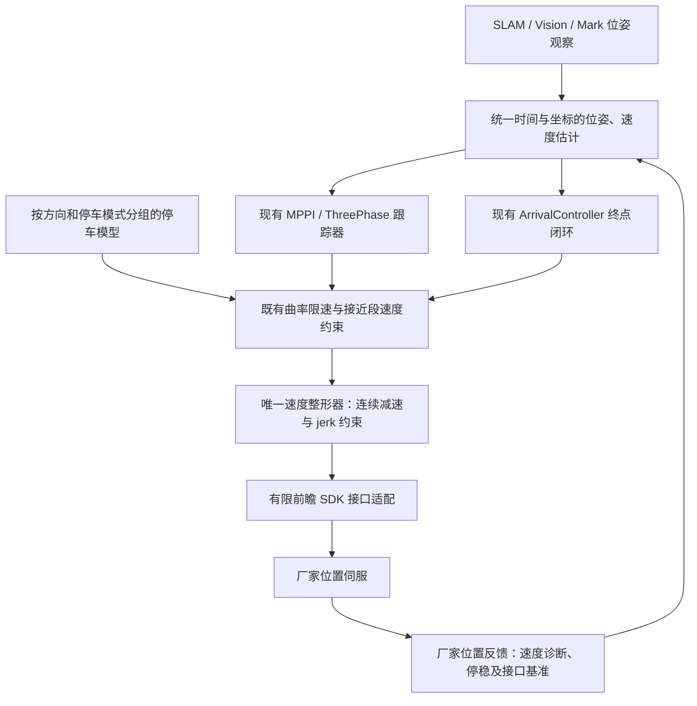
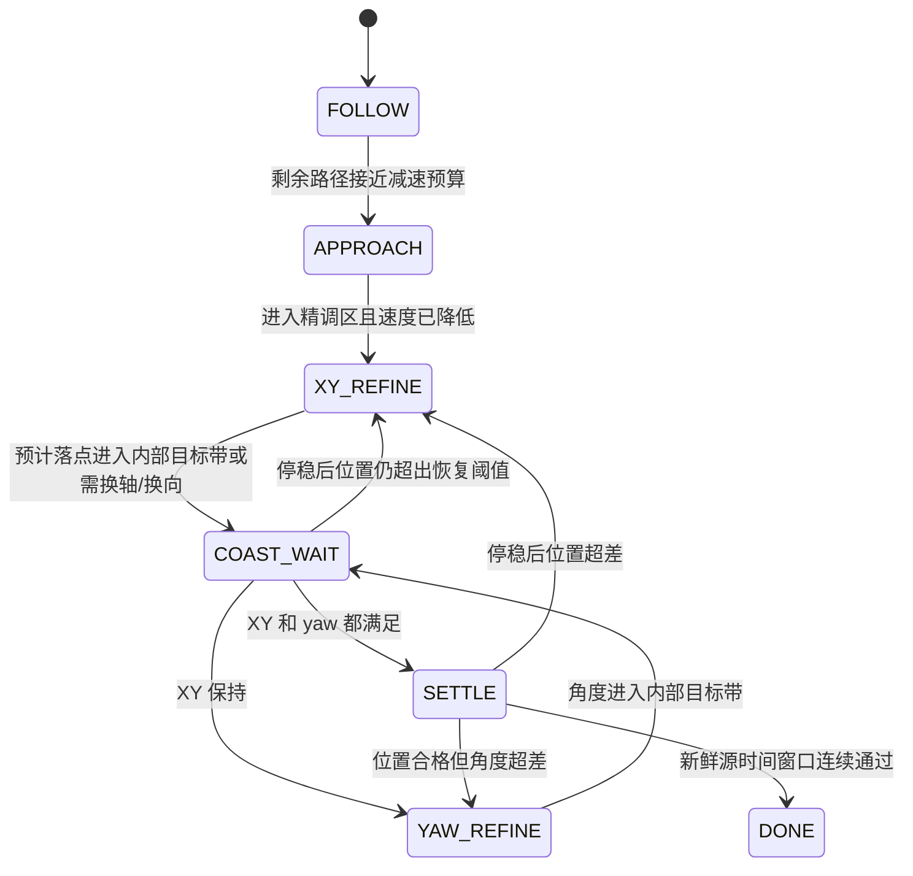

# 真机停车数据与跟踪、到位控制设计

本版按 0.06、0.10、0.20、0.35 m/s 四档、四个方向共 16 组完整试验重写。目标沿用真机 **欧式位置误差 ≤ 3 cm、朝向误差 ≤ 1.5°**，以现有路径跟踪效果为基线，允许增加运行时间改善航向、横向误差和加减速平顺性。

本文件保留四档停车数据与实施前设计依据。桥接基准、正常减速、闭环到位及阶段进展修正已进入仿真和真机验证，具体实现、参数与逐目标结果见 [实施与验证记录](ARRIVAL_CONTROL_VERIFICATION_20260915.md)。下文描述的原配置和“待验证”事项属于设计阶段；旧停车数据不能代替新停止模式的全速度标定，也不能单独构成物理精度保证。

## 1. 测量结果及其含义

| 指令速度 m/s | 置零前 SLAM 实际速度 m/s | 最大滑行 mm | 停稳后残余 mm | 从峰值回退 mm |
|---|---:|---:|---:|---:|
| 0.06 | 0.053–0.056 | 6.30–8.11 | 1.65–3.72 | 4.38–5.67 |
| 0.10 | 0.081–0.093 | 14.26–15.21 | 1.22–3.63 | 11.58–13.20 |
| 0.20 | 0.152–0.161 | 35.56–37.87 | 4.13–7.13 | 29.86–31.93 |
| 0.35 | 0.241–0.249 | 73.94–77.67 | 5.39–11.34 | 65.39–68.55 |

表内范围来自 x+/x−/y+/y− 各一次，不是同方向重复测量得到的置信区间。明细、两源对照、曲线、原始记录散列见 [四档汇总](../runs/bridge_stopping_20260915_201114/summary_006_010_020_035/REPORT.md)。

### 1.1 两种停车距离必须分开

以首次发布零速度的时刻 t0 为准，按源时间插值取得位置 p0：

- `B_peak`：沿原运动方向的最大前冲，负责空间预留、扫掠范围和接近段约束。
- `B_final`：停稳后相对 p0 的最终位移，负责当前停车模式下的终点预测。
- `B_return = B_peak − B_final`：峰值之后的回退，负责判断停车动态是否会与上层再纠偏相互干扰。

本批置零后 3 s 内的速度指令全部为零，厂家位置和 SLAM 均观测到回退。桥接 `chassis_bridge_core.py` 的零速边沿会把 SDK 目标改成当时实际位置并保持。由代码与双源曲线推断：底盘先因动态响应前冲，再受位置伺服作用返回保持点。厂家内部滤波/伺服贡献尚未单独测出。

因此，按 7.8 cm 提前停车后，若机器人又返回近 7 cm，最终可能停在目标前方很远。**B_peak 不能直接当作 B_final 使用。** 反过来，也不能用最后只剩 1 cm 证明过程只需要 1 cm 空间。

### 1.2 数据适用范围

- 斜坡按 0.5 m/s²，平台 1 s。高低档斜坡时长不同；本批不能识别稳定速度增益，禁止直接以 `0.35/0.245` 倍数补偿速度。
- 0.06/0.10/0.20 数据来自 `linear_sweep`；0.35 来自 `four_directions_035`，两批间桥接有过休眠轴启动时对齐接口零点的修改。可用于趋势和候选设计；正式标定必须统一软件版本和工况重采。
- SLAM `/odom` 与 SLAM pose 同源；厂家诊断消息的 twist 未填充，速度由位置差分/拟合计算。SLAM 和厂家反馈不得按两路独立地面真值融合。
- 速度取置零前 0.4 s 拟合，约 4 帧；10 Hz 数据只能给出采样峰值估计。厂家诊断消息时间是桥接发布时间，不能冒充硬件采样时间。
- 本批覆盖的实际线速度约 0.053–0.249 m/s，没有验证实际 0.35 m/s、组合平移、带转弯停车、变载荷或变地面。
- 本批没有新增角速度阶梯测量，线性停车参数不能换单位后用于 yaw。

## 2. 实施前代码中与试验不符的环节

| 位置 | 当前行为 | 数据揭示的问题 | 设计处理 |
|---|---|---|---|
| `chassis_bridge_core.py` / `PoseFrameIntegrator` | SLAM 局部增量累加到 SDK 基准；零速边沿捕获 SDK 实际位置 | 连续混合轴存在横移异常；高速度突然撤前瞻导致大幅回退 | 先验证并修复坐标/时间基准传递；正常停车在上层平滑降至低速后再置零 |
| `arrival_braking.hpp::brakingTranslation` | `error − velocity × 1.5 s` | 0.055 m/s 时预测 82.5 mm，而最大前冲约 8 mm，最终位移仅几 mm | 用匹配当前停车模式的 B_peak/B_final 分工替代固定时域预测；不直接把 1.5 换成另一个常数 |
| `ArrivalController` | 已有独立 XY/yaw 迟滞、ArrivalCoast、源时间停稳窗口 | 基础结构合适，但错误的停车预测可能不断触发提前停止与重新起动 | 复用现有状态、日志和异常接口，调整预测输入与阶段交接 |
| `velocity_smoother` | 20 Hz OPEN_LOOP；当前线性 max_decel 为 −2.5 m/s² | 这是指令约束，不是机械已验证减速度；也不是 jerk 限制 | 保留唯一速度整形环节，先做完整链路的平滑减速辨识，再选实际可跟随的约束 |

例如当前到位误差 5 cm、实际速度 0.055 m/s 时，固定 1.5 s 会使预测剩余误差反号并置零。实机最终只再移动几毫米，于是剩余误差仍近 5 cm，停稳后又要起动。这是与代码和数据一致的潜在反复起停机制，尚未完成正式 Nav2 前后对照验证。

## 3. 控制结构：保留跟踪核心，统一停车动态



路径误差和目标误差只有上层一套闭环；桥接不增加路径 PID、不重新积分一条世界坐标目标轨迹、不再叠加速度限幅器。SLAM 决定导航位置，SDK 反馈用于接口坐标表达、响应监测与停稳佐证，不能因接口对齐而悄悄切换导航定位源。

### 3.1 位姿与速度

`PoseObservation` 至少保留 frame、source stamp、接收时间、质量、协方差及 source ID；沿用已有视觉/mark 输入适配。重复/倒退源时间戳不能刷新有效观测年龄。切换定位源时，先有一致 TF，再重新建立停车观察窗口。

位姿用于闭环时保持低延迟；速度用短窗口拟合并记录有效时间。不能把长窗口的速度当成当前瞬时速度，也不能在噪声很大的差分值上再使用大时域外推。静态位姿质量与运动中速度估计分别处理。

当前 10 Hz 定位不宜直接宣称足够支撑 20 Hz 高响应速度闭环。Nav2 官方要求 CLOSED_LOOP 的 odom 相对平滑频率具有足够高频率、低延迟；在厂家反馈真正提供源时间并验证时延前保留当前模式。参考 [Nav2 Velocity Smoother](https://docs.nav2.org/rolling/configuration_and_development/configuration_guide/core_servers/configuring_velocity_smoother/#feedback)。

### 3.2 桥接基准问题是正式闭环验收的前置项

现有“重新激活单轴时对齐 SDK 零点”只处理启动边沿，没有证明连续运动中的 SLAM/SDK 累积基准始终一致。后续实现应满足这些接口不变量：

1. 同一时刻、同一基点的 SLAM 位姿增量与 SDK 位置反馈对应；先验证 SDK x/y 的累计坐标语义，再选择变换。
2. 每个新 pose 帧接续目标时，不携带之前帧未完成的指令积分，也不无限携带 SLAM 与 SDK 的基准差。
3. 单轴休眠、激活、换向和 pose 更新不能释放旧的跨轴位置差；目标领先量相对 SDK 实际位置可观测、有限且与指令方向一致。
4. 接口重对齐只改变坐标表示，不产生额外运动目标；未验证的时间同步或轴变换不能靠放大速度、提高最小速度来掩盖。

可比较“按每帧同步 SDK 零点传递 SLAM 增量”和“纯 SDK 接口零点、外层 SLAM 全闭环”两种实现。选择必须由相同脚本、相同混合轴输入的回放与实机结果决定；本版不将任何一种未经测试的公式写进生产桥接。

## 4. 停车模型

模型键为 `(软件版本, stop_mode, 方向, 工况)`，接口建议如下：

```text
query(actual_velocity, direction, mode) ->
  peak_excursion_range, settled_offset_range, settling_observation,
  calibrated_speed_range, quality, model_revision
```

同一停止模式下，按四个方向分别保留实测 B_peak 与 B_final。B_final 不强制单调：本批 0.06 与 0.10 档的最终残余没有明显单调关系，强行高阶拟合会误导。

16 点 B_peak 的描述性二次拟合为：

```text
B_peak_nominal(v) = 0.085786 v + 0.921174 v²       [m]
B_peak_candidate(v) = 1.25 × B_peak_nominal(v) + 0.006736  [m]
```

仅讨论实测实际速度范围 0.05275–0.24875 m/s。候选余量覆盖当前 16/16 点，逐方向留出拟合也覆盖留出点；这是有限样本上的拟合检查，不是连续速度包络、统计置信界或物理保证。系数中的二次项不能直接反算机械减速度，因为测量包含位置伺服回退等动态。

曲线只用于候选设计和离线计算，**未配置给任何启动入口**。低于最小已测速度时，不把多项式常数项当成真实停车位移：空间粗预算可暂借最低档经验上界，精细补偿则等待低速实测；v=0 且确认停稳时动态剩余应归零。高于最高实测速度时返回“未标定”，不外推并声称可靠。

当前零速保持模式可使用 B_final 预测最终落点，但不能忽略中间 B_peak 对空间的要求。改成平滑减速、修改前瞻或改变最终保持方式后，要建立新的 stop_mode 模型，旧曲线不能直接认证新模式。

## 5. 跟踪和正常减速

### 5.1 FOLLOW 保留现有控制器

- 保留现有 MPPI/ThreePhase 的核心参数、路径投影、起始对齐和曲率逻辑，不用本批短直线数据替换整个控制器。
- 把停车距离约束接入已有接近段和曲率速度约束，避免再堆一个独立限速节点。
- 路径投影保持段索引连续，分别统计横向误差 e_y、机器人朝向相对路径切线的 e_psi，以及沿路径剩余距离 s_rem。一般前行/倒行路径要按既有策略选择正向或反向切线；终点侧移使用目标误差，不能套前行航向标准。
- 当 e_y、e_psi 增大时，现有速度上限连续降低；不提高最低速度强迫通过，也不因为相邻帧误差小变动就反复切换档位。航向修正继续由现有控制器负责。
- 弯道依据既有 a_lat、曲率及角速度约束降低速度；本批不提供新的横向加速度、旋转响应或曲率阈值标定。

时间缩放优先保持原控制器的运动方向与曲率关系：同一缩放因子作用于平移与路径曲率对应的角速度。对无法在减速中跟随的航向变化，停稳后进入现有对齐过程，不能引入突发额外旋转。唯一整形器按速度、加速度、jerk 约束输出可执行序列；不能独立硬裁 x/y/omega 后假设原曲率仍保持。

### 5.2 APPROACH 先降速，再进入现有精调区域

当前精调 `capture_radius=0.3 m` 保留。正常减速可在其外开始，起点按当前参考速度、实际速度、加速度状态、路径剩余长度和空间余量计算，不能只在进入 0.3 m 时突然从高速切到 0.06。

```text
D_reference = 对唯一整形器预计减速序列逐步积分
D_tail      = 对应停止模式在预计置零时实际速度的峰值余量
D_extra     = 尚未包含的观测年龄误差、调度误差和空间裕量
D_approach  = D_reference + D_tail + D_extra
```

旧 B_peak 已包含首次零指令发布到执行的响应时间；不能把同一段桥接/SDK 延迟再加一遍。若位置已经外推到当前时刻，也不能再次把同一观测年龄全额算成未行驶距离。新平滑停止模式未标定前，上式只是保守设计估算，不能从参考速度积分证明机械位移上界。

可用于离线首版的参考轨迹参数：正常加速/减速 0.25 m/s²，jerk 0.5 m/s³。这些是工程起点，不是真机实测极限。当前配置的正常减速度 2.5 m/s² 不直接改动；先在仿真及完整桥接链路比较，再决定采用值。

在初始参考加速度为 0 时，S 形减速到零的参考行程为：

```text
若 u <= a²/j：D_ref = u × sqrt(u/j)
否则：       D_ref = 0.5 × u × (u/a + a/j)
```

以参考 u=0.35、a=0.25、j=0.5 为例，D_ref=0.3325 m。再加本批高速尾部候选余量及观测误差，接近段可从约 0.5–0.55 m 作首版试验起点，实际应由在线状态求解。不能把 0.3325 m 当作已测机器人停车距离。已有非零加速度或需要转弯时，必须积分完整离散状态，不能套这个特例公式。

正常到点过程逐渐降低请求速度，使有限前瞻 `h×v` 也逐渐收回；不要在实际速度仍约 0.25 m/s 时为了到点精度突然撤销整个前瞻。外部停车、超时停车和急停仍具有独立语义，不得为了平顺延迟这些停止请求。本版不修改它们。

## 6. 到位控制：预测最终位置，确认停稳后才再纠偏



### 6.1 XY_REFINE

继续以 `e = goal − pose`、欧式距离及当前朝向下的本体误差闭环。保留现有 kp_xy=0.5、最大 0.06 m/s、最小 0.008 m/s 的参数；不因响应偏慢而盲目提高增益或最低速度。

在模型有效且模式匹配时，用最终偏移区间预测停点：`p_stop ≈ p_now + R_body_to_goal × B_final(v)`，再求预测终点误差。若不确定性覆盖多个结果，优先继续降速或停稳观察，不能在移动中追随不可靠预测反复换向。

最后几厘米可由 kp 自然降到约 0.01–0.02 m/s；这是控制律输出范围的建议，不是四档试验已证实的低速标定。模型没有覆盖的低速段，必须补采 0.01/0.02/0.03/0.06 的同版本结果，再启用精细前馈补偿；没有补偿时仍可依靠停稳后位置闭环收敛。

停点判断必须同时看两个条件：

- 空间上：预测全过程扫掠满足允许区域，包括前冲 B_peak。
- 精度上：预计最终位置在内部目标带内，或当前速度足够低，可进入停稳观察。

当前混合轴桥接问题未解决前，单轴分段策略可作为受限场地测试/临时精调适配；不得把它扩展成整个 FOLLOW 的走走停停策略。正式混合轴精调恢复前，必须通过相同输入的无额外横移验证。两个轴各自小于 3 cm 不代表欧式误差小于 3 cm，最终统一检查 hypot(dx,dy)。

### 6.2 COAST_WAIT 与迟滞

复用 `ArrivalCoast`，在置零或换向后等待动态结束，期间不再由目标误差触发反向追赶。仅在新鲜、递增源时间上累积停稳时间；位姿穿过目标或峰值时的短暂速度零交叉不能解锁。

首版沿用 0.6 s 的连续停稳窗口，另外检查最近位姿窗口是否稳定。需要同时满足：有效厂家位置差分证明已停、SLAM 位姿稳定、XY/yaw 目标误差满足条件。厂家空 twist 或静止时单帧有噪声均不能单独决定。两个反馈有冲突时保持观察并报告原因，而不是反复启动新的纠偏。

保留已有迟滞参数：

| 项目 | 进入保持 | 恢复纠偏 | 最终验收 |
|---|---:|---:|---:|
| 欧式 XY | 19.5 mm | 27 mm | ≤ 30 mm |
| 精细 yaw | 0.975° | 1.35° | ≤ 1.5° |

这些由现有 0.65 / 0.9 比例产生。位姿保持窗口漂移限值继续取现有 settle_drift_ratio=0.2，即 6 mm / 0.3°，并要求源时间跨度通过；它们是控制配置，不是定位源误差已被测到这个范围。

### 6.3 YAW_REFINE

XY 保持后再完成最终朝向，继续使用最短角度差。平移中允许必要的粗航向保持，避免先把 XY 做好再发生大角度旋转扫掠；最终精调避免 x/y/yaw 同时反复抢占。

yaw+、yaw− 必须分别建立旋转 B_peak、B_final 和回退数据。现有 kp_yaw=0.8、最低 0.02 rad/s、最高 0.15 rad/s 及角向 1.5 s 预测属于待实测复核的原配置，**本批线性数据不能认证它们，也不能推出 1.5° 已保证**。更改角向预测需以独立旋转测试为依据。

### 6.4 不可达与无进展

保留现有超时、无进展、定位无效和扫掠不可行异常及外部停止语义。无进展看停稳后误差是否实质下降，避免把峰值/回退的往复路程当作有效进展；总时间仍有失败上限，不能因为等待停车而无限延期。传感器失效和实际命令无响应要有区别清晰的原因码。

## 7. 精度承诺和验收方法

### 7.1 能够承诺的边界

软件可以严格做到：观测未在 3 cm / 1.5° 内并连续停稳时，不报告到位。它不能仅凭这些数据保证每个目标都可达，也不能保证 SLAM 相对误差等于真实世界绝对误差。

若内部目标分别为 19.5 mm 和 0.975°，想保证地面真实误差不超过 30 mm / 1.5°，必须证明定位、外参、时间残余和停稳漂移的总误差界分别不超过 **10.5 mm / 0.525°**。当前 SDK 与 SLAM 的差不是独立绝对误差界；需要外部测量或可靠 mark/视觉基准完成这部分验证。

### 7.2 保持当前效果不变差的验证顺序

| 阶段 | 验证内容 | 通过标准 | 本版状态 |
|---|---|---|---|
| 数据复算 | 16 组源时间、零命令区间、两源位置与峰值 | 不混入回程、不把空 twist 当反馈、不重复取样 | 已完成 |
| 离线候选 | 停车曲线样本覆盖、留方向检查；S 形参考速度不反向且满足 a/j | 明确模型范围和单位；不超出设计参考约束 | 已完成，仅算法/数据层 |
| 桥接基础修复 | 连续 x/y、很小交叉轴命令、90° 航向下坐标验证、换向/换轴 | 无非指令引起的横移；参考传递不持续漂移 | 未通过，已知问题待修复 |
| 同版本停车复测 | 四方向多档及低速细调；yaw±；直接零/正常平滑停止分别测 | 每方向每工况重复不少于 5 次，模型区间覆盖观测 | 未执行 |
| Gazebo 控制回归 | 直线、90° 弯、S 弯、反向、侧移、目标跨角度边界；延迟/噪声注入 | 原基线和候选同地图同路线同初态成对比较 | 未执行 |
| 真机完整链路 | 上述路线、不同接近方向与末端朝向，加入正常平滑减速 | 所有有效目标停稳误差 ≤3 cm /1.5°；不出现无故反向或额外旋转 | 未执行 |
| 地面绝对精度 | 外部尺量/标记板/独立高精度测量 | 证明定位与终点联合误差预算 | 未执行 |

“效果不变差”需要在多次配对测试中比较横向/航向误差 P95、峰值，速度波动、加速度、jerk、非计划换向/旋转次数、末端重启次数和停车回退量。运行时长不纳入评分；超时仍作为可运行性边界。统计差异若落在重复试验噪声内，不能宣称明确改善；出现回归则先定位，不因为最终到点合格就忽略过程问题。

FOLLOW 的定期汇总沿用现有 2 Hz 日志，误差仍按控制所需频率计算。控制验证录制原生消息频率，统一离线计算变化率，不能用 2 Hz 下采样日志宣称测到了真实 jerk 峰值。建议在现有日志附加：实际/参考速度、source_age、stop_mode、B_peak/B_final、coast 状态、内部迟滞状态、桥接实际目标领先量、模型版本和超范围原因。

## 8. 实现落点与本次交付

- `arrival_controller.cpp`：在已有捕获、XY/yaw 迟滞、COAST 和 SETTLE 逻辑上接入停止模式模型，不新增第二套终点控制节点。
- `arrival_braking.hpp`：把固定时域平移预测抽象成可替换的 `StopPrediction`，保留未标定场景的明确状态及现有测试基线。
- 既有曲率/接近段约束：引入预计减速序列预算，保留路径跟踪核心。
- 唯一速度整形器：承接正常加減速与 jerk 参考轨迹。可扩展或替换现有整形实现，不能在其后再次串接一套同类限速。
- `chassis_integrator.py` / `chassis_bridge_core.py`：先处理已知基准异常和目标传递，严格区分运行、正常减速、最终位置保持及外部停车。
- 位姿源和停车模型分别走小接口，主控制器依赖接口而非具体 SLAM/视觉/mark 实现；模型版本和测量数据通过配置注入，避免写死在算法里。

本次交付：[16 组汇总及曲线](../runs/bridge_stopping_20260915_201114/summary_006_010_020_035/REPORT.md)、[候选模型/参数](../runs/bridge_stopping_20260915_201114/summary_006_010_020_035/control_design_candidate.json)、本设计。此前的 `stopping_profile_candidate.json` 是旧的、不完整的候选文件，不能作为本版的部署入口。
