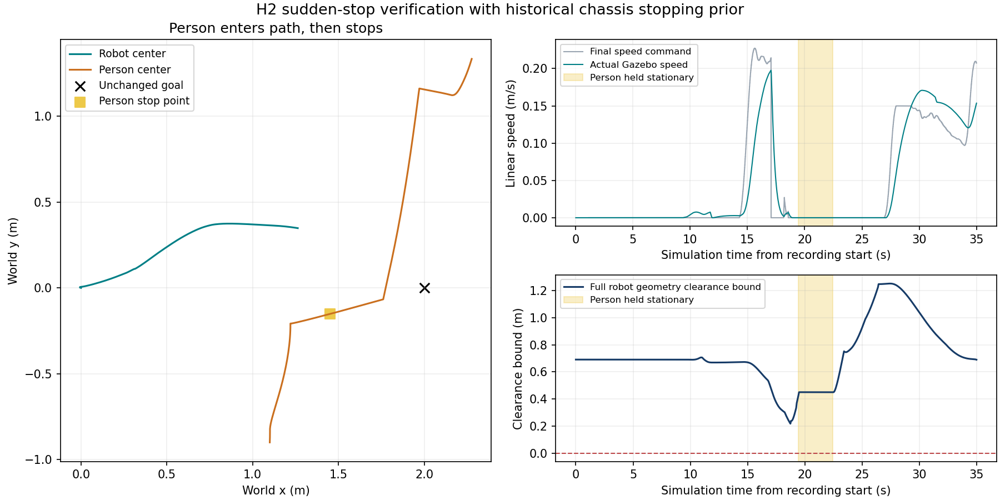

# HuNav/SFW 分阶段施工记录（2026-09-19）

H0 五目标 Gazebo 基线已通过。H1 已接入行人、只读观测和独立几何评测，并通过当前单人往返场景验收。H2 已实现；历史真机停车模型接入后的 8 类基础场景及 3 对无人回归在固定 overlay 中通过，最终 26/26 个目标到位。共享源码的并发修改尚未做合并构建回归，因此不开放下一阶段运动能力。H3–H5 已完善场景设计，尚未实现或开放。本次只运行本机仿真，没有部署或控制真机。

不同场景规控设计、阶段矩阵和停车距离依据见 [社会导航场景设计](SOCIAL_NAVIGATION_SCENARIO_DESIGN.md)。

## 已实现的接口与场景

| 内容 | 实现位置 | 边界 |
|---|---|---|
| 人员接口 | `astribot_navigation_msgs/msg/SocialAgent*.msg` | ID、源 epoch、采集时间、坐标、协方差、遮挡/丢失状态、群组置信度、真值来源 |
| 视觉/融合输入 | `/perception/social_agents` | 接收跟踪器输出；视觉检测、关联与标定尚未实现 |
| 只读观察器 | `astribot_s1_social_navigation/social_observer` | 按采集时刻变换 TF、速度与协方差；拒绝重复/倒序、过期和无效观测 |
| HuNav 真值适配 | `hunav_truth_adapter` | 只允许仿真时钟，输出 `/simulation/social_agents_truth`；移除目标和行为意图 |
| 独立依赖 | `tools/setup_hunav_sim.sh` | 固定提交与逐文件校验；私有 BT.CPP 4，不覆盖 Nav2 的 BT.CPP 3 |
| 往返行人场景 | `--social-scenario`、`config/social/h1_crossing.yaml` | 同一仓储世界、同一受管启动入口；未指定时不加载行人 |
| 场景评测 | `social_scene.cpp`、`tools/social_navigation/validate_scene.py` | 场景真值、完整机身保守几何、扫描关联、TF/Gazebo 对齐；不发布机器人指令 |

观测失效时发布 `valid=false`；空数组不能被解释为环境无人。社会观察器保持只读；H2 在原 PolicyNode 内订阅其输出，限制原路速度、让行和等待，不新建速度出口。原 ThreePhase / MPPI / Arrival 的控制实现和运动参数保留；BT 增加社会等待的有界失败通道及服务时效诊断。H2 停车模型单独从历史实测峰值派生，普通入口保持原值。

## 已验证与当前限制

- **H0**：五目标全部成功，最大到位误差 1.565 mm / 0.0391°；四个平移段 FOLLOW 横向误差 P95 为 3.230、1.508、4.635、2.378 cm，与末端 REFINE 分开记录。
- **接口**：独立 ROS domain 126 中 70 条断言通过，含 HuNav 41 次服务调用；覆盖时间戳、epoch、NaN/协方差、遮挡/过期、真值禁入、TF 和时钟回跳。人工输入不完整的首次失败记录保留。
- **H1 场景**：修复行人位姿叠加、网格地面偏移、航向更新、radius 丢失，以及仿真消息先于 `/clock` 抵达的有界排队。详见 [场景修复报告](SOCIAL_SIM_SCENE_REPAIR_20260919.md)。
- **独立几何评测**：41 个机器人碰撞几何均受支持；浅穿透正例可检出。暂停/恢复正常，两次相同初态的 1–12 s 行人序列一致。深穿透夹具曾导致采样不足，不算通过；穿透/复位检查后须冷启动完整栈和 GUI。
- **导航复查 run8**：`(0.5,0,90°)`、`(0,0,0°)` 均成功，仿真真值到位误差 0.332 mm / 0.0204°、0.740 mm / 0.0587°。2214 个 TF/Gazebo 样本最大差 0.0026 mm / 0.0014°；1109 个有效扫描关联均检测到行人。
- **运动后残留复查 run9**：run8 导航后局部、全局各残留 2 个旧格。补充实际有限射线的连续栅格遍历后，同一路线两目标均到位（最大 1.102 mm / 0.0785°）；运动中和返回后 40 s 观察均为 0 残留，当前行人的占据格保留。1127 个有效扫描关联均检测到行人。已同时查看 Gazebo/RViz 截图；详见修复报告。
- `/map` 是静态仓储基线；`/map_cmap` 是 SLAM 历史窗口，不是实时障碍输入。本轮不证明动态建图栅格长期清除，也不代表实机外部物理精度。

## H2 施工与复验边界

新增纯决策 `social_behavior.py` 与 ROS 边缘适配 `social_adapter.py`：只比较原路继续/减速/等待，对匀速及瞬间停止预测取硬风险并集；社会排斥/舒适代价仅用于安全候选评分。等待清空计时与原扫描策略并行，避免重复累计；观测、执行上下文服务和风险计算分开调度，避免处理队列延迟使有效观测/服务结果过期。默认不开启，显式 `--social-policy h2` 才加载。

增加受管的行人 episode 暂停/恢复、按场景生成行为树、仿真观测丢失/重复帧注入，以及场景与无人 A/B 验证脚本。Humble 无人场景的空数组参数解析已改为使用 HuNav 的类型明确的空默认值。RViz 默认关闭 300 帧里程计箭头，避免把历史轨迹误当作障碍。

历史真机停车峰值接入单独 H2 安全配置，覆盖 16 个历史样本及四方向扫掠反例；不调整跟踪运动/到位参数。具体模型、来源、速度范围与曲线见场景设计第五节。该模型不是新桥接或组合轴的真机制动认证。

共享工作区在 09:46:50 出现到位控制器与 exact_goal_planner 源码的并发修改，随后 fixed-envelope、corridor 和 swept_geometry 源码也发生变化。本社会导航任务没有将这些并发修改构建进本轮验证环境。回归实际加载独立 overlay 中固定的控制器库与 Python 副本；记录为 `h2/runtime_control_binary_manifest.json`、`h2/runtime_python_config_manifest.json`，实际安装的 Python/配置另存于 `h2/runtime_python_config_snapshot.tar.gz`。因此本次证据适用于这套 overlay，不宣称并发修改后的整仓库已通过验收；合并构建回归完成前不开放下一阶段运动能力。

## H2 基础场景结果（历史停车模型接入后）

下表每个场景均为去程 2 m 及返回原点；全部 14 个目标成功。误差使用仿真真值档；横向/航向只统计 FOLLOW，到位单独统计。净空为独立完整机身几何的保守下界，不是人机中心距离。

| 场景 | 最小净空 cm | 最大到位 mm / ° | 去程 / 返程横向 P95 cm | 去程 / 返程航向 P95 ° |
|---|---:|---:|---:|---:|
| 左侧横穿 | 47.28 | 0.949 / 0.0577 | 4.973 / 1.491 | 4.831 / 9.252 |
| 右侧横穿 | 44.41 | 0.984 / 0.0454 | 5.640 / 6.988 | 5.416 / 9.999 |
| 双人交叉 | 28.22 | 1.158 / 0.0569 | 5.846 / 2.317 | 2.960 / 10.803 |
| 前方行人突然停止 | 21.74 | 1.126 / 0.0526 | 6.487 / 2.964 | 10.083 / 12.578 |
| 合作式迎面斜交 | 15.00 | 1.440 / 0.0303 | 14.885 / 1.699 | 13.167 / 10.942 |
| 丢包及旧帧重发 | 无行人 | 1.139 / 0.0604 | 6.228 / 1.409 | 4.402 / 9.901 |
| 目标点占用后离开 | 81.81 | 1.293 / 0.0285 | 5.724 / 2.384 | 2.896 / 10.668 |

所有场景重叠步数为 0，FOLLOW 原地旋转和倒退记录为 0；仅有 initial_goal/new_goal 规划事件。左右横穿、双人和突然停止均实际触发候选冲突，随后恢复。丢包/旧帧期间实际停稳，新鲜数据恢复后才解除等待。目标点占用持续 5 s 时实际等待并停稳，未更改终点；目标占用诊断共出现 19 个样本。

**迎面场景去程横向 P95 14.89 cm、航向 P95 13.17° 仍是跟踪质量限制。** 它通过了基础碰撞/让行/恢复判据，不能由到位成功推导全过程贴线理想。非合作正面冲撞没有做 Gazebo 验收；NO_SAFE_MANEUVER 与 GOAL_OCCUPIED 的长时间失败分支只通过离线决策检查。持续跟随、队列和主动侧绕/超越尚未开放。

[逐场景机器可读结果](evidence/social_navigation_20260919/h2_cases.json) 含原始记录绝对路径。全部最终运行已结束，截图按 Gazebo/RViz 成对保存并查看。

## H2 无人回归（历史停车模型接入后）

三对冷启动，同目标 `(2,0,0°)` 与返回原点，同运动参数。12 个目标全部满足 2 mm / 0.1°，没有新增中途 HOLD，仅有 initial_goal/new_goal 两类规划事件。每项为三个运行的逐目标 P95 中位数；总耗时不评分。

| 指标 | 去程 off → H2 | 回程 off → H2 |
|---|---:|---:|
| 横向误差 cm | 5.400 → 5.365 | 1.777 → 1.877 |
| 航向误差 ° | 5.436 → 5.516 | 11.202 → 11.090 |
| 实际 jerk m/s³ | 0.164 → 0.177 | 0.205 → 0.202 |

[机器可读对照结果](evidence/social_navigation_20260919/empty_ab_comparison.json)。这是通过约定的回归容差，不代表每次运行或每项指标都严格优于基线。

## 历史底盘停车数据的使用

采用四档、四方向共 16 次历史 SLAM 位置测量，按置零前的实测速度建立峰值前冲包络。0.35 m/s 指令对应的实测速度约 0.241–0.249 m/s，峰值前冲 73.94–77.67 mm，最终残余仅 5.39–11.34 mm；安全空间采用前者。模型覆盖全部 16 个峰值，保留原反应预算、完整机身扫掠和人员未来占用，并额外增加工程余量。角向制动时域参数与跟踪运动参数保持原值，公共几何余量随 H2 略增。

突然停车复验 `h2/measured_stop_run1`：暂停 3 s，暂停后的稳定窗口共有 75 个实际运动样本，线速度与角速度均为零；恢复后两目标通过，最大误差 1.126 mm / 0.0526°，最小完整机身净空保守下界 21.74 cm，重叠步数为 0。它验证新模型在当前 Gazebo 执行链中的行为，不证明当前真机停车距离已经标定。

下图截取开始记录后的前 35 s 交互窗口，后续完整到位轨迹见原始 episode 数据。



## 保留的失败及限制

早期横穿失败分别暴露了严格消息浮点类型、场景未放行、缺失场景行为树、观测处理积压和路线服务响应延迟；对应修复后重新运行用例。首次突然停车夹具在规划前就占据原路，没有实际形成所需冲突，已保留为无效夹具并重设计。无人场景首次启动存在空数组参数解析错误与空点云，后者没有证据可直接归因于前者；后续六轮完整无人运行均成功。

历史停车模型下迎面用例的首次运行在导航发起前读取 `/controller_server/get_parameters` 超时，服务端也记录了响应发送超时。这次没有执行目标，不计为社会避让通过，也不混入到位精度统计；保持用例和参数不变冷启动重跑后通过。

截图与点云、代价图复查必须一起使用。左侧横穿复验后的 20 s 检查中，指定 ROI 内局部/全局代价图和过滤点云没有发现人员位置之外的旧占据；未对齐样本排除。这个结果只覆盖所检查区域和观测窗口，不代表整张 SLAM 历史图的清除证明。

## 证据与运行

完整记录：`/home/yjh/WorkSpace/astribot_validation/social_navigation_20260919`。当前阶段状态见 `docs/evidence/social_navigation_20260919/implementation_status.json`。

- `baseline_source.json` / `baseline_source.tar.gz`：H0 指纹及源码归档。
- `h0_route_run1/results.jsonl`：FOLLOW、REFINE、速度、航向、加速度及 jerk。
- `interface_checks.json`：接口成功记录；`interface_checks_incomplete_fixture.json`：失败夹具。
- `dependencies/compatibility.patch`：可复现的上游适配补丁。
- `h1_run9/session.log`：H1 历史统一日志；`session.json`：状态、进程归属和启动数据测量。
- `h2/measured_*/stack/session.log`：本轮 H2 统一日志；最近一轮为 `h2/measured_h2_head_on_run2/stack/session.log`，会话已结束。
- `h2/measured_*/episode/`：原始观测、逐目标指标、策略与故障事件；同级 `gazebo.png` / `rviz.png` 为配对截图。
- [场景脚本操作说明](../tools/social_navigation/README.md)：8 类场景与无人对照的重复方法。

```bash
cd /home/yjh/WorkSpace/astribot_sdk_ros2
ASTRIBOT_OVERLAY_SETUP=/home/yjh/WorkSpace/astribot_validation/social_navigation_20260919/h1_overlay.bash \
  bash tools/launch_sim_stack.sh --mode baseline \
  --social-scenario ws_robot/src/astribot_s1_gazebo_bringup/config/social/h1_crossing.yaml
```

已有仿真时先核实会话归属，不能同时启动第二套。普通入口不启用社会行为。

H2 当前实现原路径上的社会评分、预测减速、让行、等待恢复及有界失败；尚未实现主动绕行。固定 overlay 的基础矩阵已通过，下一步先验收共享源码合并构建，再依次推进持久跟随/队列、绕行/超越、窄通道和综合验收。H3–H5 不因设计表已写完而视为完成。
