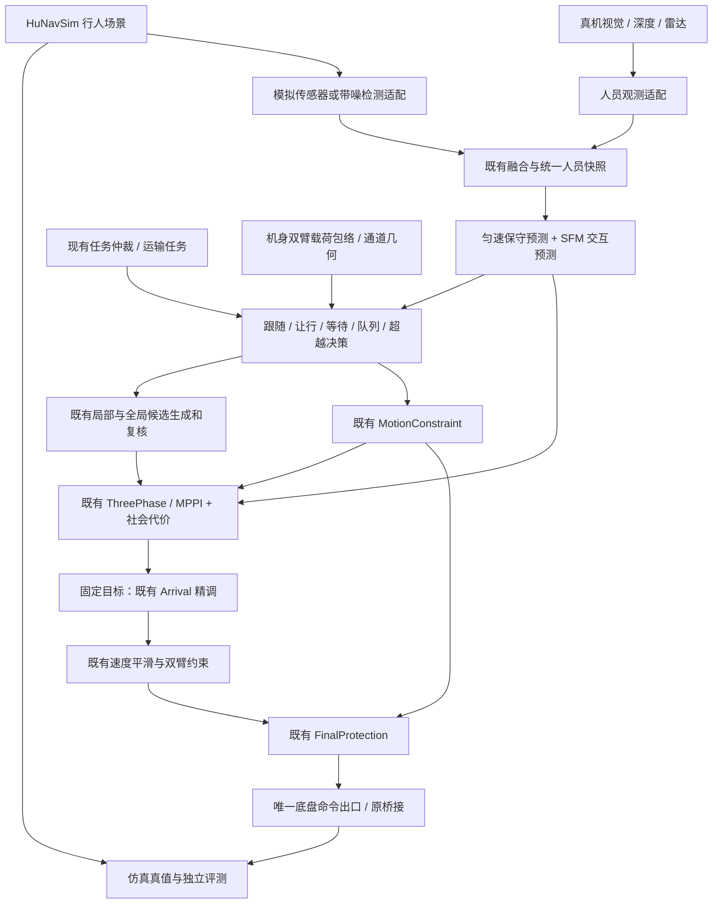

# HuNavSim + SFW：轮式双臂机器人的社会导航集成方案

与原 P2–P5 策略的统一职责、28 类场景、停车模型、候选提交和施工顺序见 [多场景决策规控整合方案](UNIFIED_SOCIAL_NAVIGATION_DECISION_CONTROL_DESIGN_20260919.md)。该文为后续整合设计，不改变本文记录的实现和验收范围。

日期：2026-09-19。原方案保留算法与架构依据；H0/H1 及采用历史停车数据的 H2 基础矩阵已在固定仿真 overlay 中通过，共享源码并发修改的合并构建仍需回归。新增的逐场景规控、退出条件、参数和验收矩阵见 [场景规控设计](SOCIAL_NAVIGATION_SCENARIO_DESIGN.md)，实施状态见 [施工记录](HUNAV_SFW_IMPLEMENTATION_20260919.md)。设计条目不等于已实现或验收。

本文将 SFW 理解为 robotics-upo 的 **Social Force Window Planner**。范围包括跟随、避让、等待、队列和超越，并保留既有全向底盘、路径跟踪、末端精调、携物包络及事件触发重规划。

## 1. 推荐路线

采用 **HuNavSim 仿真与评测 + SFW 交互预测和社会代价 + 现有策略及 MPPI 执行**。

HuNavSim 负责生成有反应的行人和评测数据；借鉴其行为组合方式组织任务。SFW 的价值是对候选机器人运动预测行人反应，并评价机器人对人的扰动。机器人继续通过现有 ThreePhase / MPPI / ArrivalController 产生速度，通过现有平滑、双臂约束和最终防护执行。

| 路线 | 优点 | 主要代价 | 选择 |
|---|---|---|---|
| HuNavSim + 原生 SFW 替换当前控制器 | 快速得到上游算法对照 | 改变全向采样、起步、接近和到位行为；需重做集成验证 | 仅在独立仿真配置中作对照 |
| HuNavSim + 提取 SFW 核心 + 当前 MPPI | 保留底盘和到位优势，可以逐项增加行为 | 需要实现社会预测接口、MPPI critic 和行为状态机 | **推荐产品路线** |
| 只增加行人代价地图膨胀层 | 简单，适合提供个人空间的软偏好 | 不能表达排队次序、动态等待、超越承诺和交互预测 | 只作辅助，不作为完整方案 |

上游 SFW 面向差速机器人；本次核对的采样代码将横向候选速度设为 0。README 也列出末端接近及窄通道方面的待改进项。这与本仓库全向 MPPI、独立末端精调的职责不同。[SFW 官方说明](https://github.com/robotics-upo/social_force_window_planner/tree/70aa4a090af00d1dac94d93ffbce48b59a2518be)

## 2. 可复用内容与适配边界

| 项目 | 本次核对版本 | 可利用部分 | 必须处理的边界 |
|---|---|---|---|
| HuNavSim | `v2.0`，`35c2d81fc0e8166a3d124558fd718dd03e8a914c` | 行人行为树、SFM 行人、群组与评测输入 | 它控制的是仿真人，不是本机器人；不能把其 FollowAgent 直接接到底盘 |
| Fortress wrapper | **显式选 v2.0**，`41f97f764df00303a85227911ec8173f0c25c758` | 在现有 Fortress 世界中加入并驱动行人 | 仓库默认分支仍为 v1.0-humble；需验证与 HuNavSim v2 配套，README 标注在开发中 |
| SFW | `ros2`，`70aa4a090af00d1dac94d93ffbce48b59a2518be` | 候选相关的行人预测、social work 评分 | 不直接复制差速采样、动态圆形碰撞近似及末端处理 |
| lightsfm | `master`，`b30327cca189af2fb90443a5d0040cceb46d7195` | 社会力计算核 | 适配 SI 单位和世界系速度；用独立数据实例，避免并发共享可变 agent 状态 |

HuNavSim / wrapper 为 MIT，SFW / lightsfm 为 BSD-3-Clause，均需保留相应许可和版权；行人网格与动画资源另行核对来源。版本与接口材料见[调研清单](evidence/social_navigation_20260919/reference_manifest.json)。以上是核对到的提交，不是已构建兼容的依赖锁。

HuNavSim 提供 FollowAgent、StopAndWaitTimerAction 等节点，适合参考其行为组合。机器人侧的排队顺序和超越执行语义仍需要自行实现。[HuNavSim 行为节点声明](https://github.com/robotics-upo/hunav_sim/blob/35c2d81fc0e8166a3d124558fd718dd03e8a914c/hunav_agent_manager/behavior_trees/TreeNodesModel.xml)

具体接入注意点：

1. HuNavSim v2 节点模型为 BT.CPP 4，本仓库 `path_tracking` 依赖 `behaviortree_cpp_v3`。HuNavSim 使用独立进程/overlay，以 ROS 消息通信；不把 v4 节点插件加载进现有 Nav2 BT 进程。
2. Fortress wrapper 默认可按 PoseStamped `/goal_pose` 启动人群，而本仓库导航通过 Action。场景运行器应使用显式 episode 启动信号，或关闭该等待选项，不能以“发了 Action”推断人群已开始运动。[wrapper 配置说明](https://github.com/robotics-upo/hunav_gazebo_fortress_wrapper/blob/41f97f764df00303a85227911ec8173f0c25c758/README.md)
3. 仿真人的可见模型不自动证明雷达可检测或具有物理碰撞体。必须分别验证 `/scan`、点云和独立几何接触检测；必要时添加与人形同步的碰撞/传感器代理几何。
4. 使用仿真时间推进预测和行为持续时间，验证暂停、低 RTF、复位；上游存在使用 `steady_clock` 的行为节点，不能未经适配就假定它们全部按仿真时间计时。
5. `/people` 的 HuNavSim 适配存在把 yaw 放入 `position.z`、把 yaw rate 放入 `velocity.z` 的特殊约定。只在 HuNav 适配器解释该格式；不得把它当作真实三维位置/速度传播。优先读取字段更明确的 `hunav_msgs/Agents`。[HuNavSim 数据接口说明](https://github.com/robotics-upo/hunav_sim/blob/35c2d81fc0e8166a3d124558fd718dd03e8a914c/README.md)

## 3. 仓库已有能力及真正缺口

| 当前实现 | 能复用什么 | 新增内容 |
|---|---|---|
| [observation_adapters.py](../ws_robot/src/astribot_s1_navigation_policy/astribot_s1_navigation_policy/observation_adapters.py)、[fusion.py](../ws_robot/src/astribot_s1_navigation_policy/astribot_s1_navigation_policy/fusion.py) | 采集时间 TF、视觉米制框、协方差、来源去重和融合跟踪 | 人员身份稳定性、朝向可信度、群组、队列及遮挡生命周期 |
| [ports.py](../ws_robot/src/astribot_s1_navigation_policy/astribot_s1_navigation_policy/ports.py)、[risk.py](../ws_robot/src/astribot_s1_navigation_policy/astribot_s1_navigation_policy/risk.py) | 世界快照、匀速预测、完整包络与停止过程风险 | 可替换的人体预测器、候选相关 SFM 预测；保留保守风险模型 |
| [behavior.py](../ws_robot/src/astribot_s1_navigation_policy/astribot_s1_navigation_policy/behavior.py) | SLOW / HOLD / CONTINUE、清空确认、阻塞 episode | 跟随、队列、等待原因和超越状态机，统一行为仲裁 |
| [route_coordinator.py](../ws_robot/src/astribot_s1_navigation_policy/astribot_s1_navigation_policy/route_coordinator.py) | 局部接回/全局候选、版本校验、有限规划预算、停稳提交 | 按行为生成候选，评价绕行能否优于等待；显式区分原任务和临时路线 |
| [corridor.py](../ws_robot/src/astribot_s1_navigation_policy/astribot_s1_navigation_policy/corridor.py) | 入口准备、包络准入、通道许可、通道内约束 | 通道排队、对向让行及等待位置；不把本机许可当作他人已让路 |
| [task_arbiter_node.py](../ws_robot/src/astribot_s1_navigation_policy/astribot_s1_navigation_policy/task_arbiter_node.py) | 人工/路线/探索任务所有权及取消交接 | 跟随/排队任务类型；与现有运输任务协调，不增加第二个导航仲裁器 |
| [critics.xml](../ws_robot/src/astribot_s1_path_tracking/critics.xml) | 已有 MPPI critic 插件出口 | 社会空间及交互影响评分；不复制 MPPI 优化器 |
| [arrival_controller.cpp](../ws_robot/src/astribot_s1_path_tracking/src/arrival_controller.cpp) | 固定目标终端精调和稳定到位 | 移动目标的明确执行模式；不能每次移动参考更新都重置到位状态 |

源码现有 MPPI 为 `Omni`，2000 条候选、56 步 × 0.05 s；已有预测 profile 为 2.8 s。真机探索入口在 [hardware_exploration.py](../tools/robot/hardware_exploration.py) 明确传入 `navigation_policy_stage:=off`。因此“模块代码已存在”不等于“真机正在使用”，新功能不能通过新增文件自动启用。

2026-09-17 真机记录只能作为历史性能参考：6/8 到点成功，成功点最大误差 1.885 cm / 0.896°，FOLLOW 横向 P95 17.906 cm、最大 30.035 cm。不能以这份记录放行狭窄人机交会，也不能把它当作 9 月 19 日当前工作区的同版本基线。[历史报告](../runs/pre_estop_diagnosis_20260917/ACCURACY_REPORT.md)

## 4. 推荐分层和数据流

图中移动目标走持续跟踪模式；只有明确的固定终点或“跟随结束并停靠”才进入 Arrival 精调。跟随对象短暂停下不等于跟随任务成功。

新增代码建议限定为三个边界：

- `astribot_s1_social_navigation`：纯 C++ 人体预测/社会代价库及 ROS 快照适配，包含 HuNav、视觉、people_msgs 边缘转换；不持有速度发布权。
- 现有 `navigation_policy` 内新增组合式 `social_behavior`、`follow_reference`、`queue_model`、`overtake_policy`，由同一个策略仲裁入口选择，复用 `RouteCoordinator` 和 `MotionConstraint`。
- 仿真扩展与场景放在 `astribot_s1_gazebo_bringup` 的可选配置中；上游 HuNav/SFW 依赖独立 overlay，首期不增加产品包的强依赖。可复用场景运行工具保留，临时故障注入与测试结果放独立验证目录。

## 5. 五类功能的执行定义

| 功能 | 进入依据 | 核心动作 | 退出/退化 |
|---|---|---|---|
| 跟随 FOLLOW_AGENT | 明确指定并确认的 `target_track_id`，定位与深度有效 | 沿目标历史运动轨迹保持间距，按距离误差和目标速度调整参考；保留机头沿路径的偏好 | 目标停则保持距离；丢失则减速停车并等待同 ID 重新确认；超出预算报告 TARGET_LOST |
| 避让 YIELD / LOCAL_AVOID | 与人预测运动存在冲突 | 近处先停、远处可减速；优先让人通过。确有净空时才选局部侧绕并接回原路 | 冲突连续消失才恢复；持续封堵且已有路线不可通行时评价全局候选 |
| 等待 WAIT | 短暂横穿、通道占用、队列未推进、人工要求 | 保持原任务和明确等待原因；零速期间继续观测，不重复创建导航任务 | 条件满足后平滑恢复；传感器失效、超时和不可达分别报告 |
| 队列 QUEUE | 指定队列区域/方向/目的地及稳定前车关系 | 锁定 predecessor ID，沿队列中心线保持间距，队列推进后才前移；默认禁止插队和超越 | 前车离队/新成员插入后重建关系并停车确认；有序等待不消耗普通“障碍无进展”预算 |
| 超越 OVERTAKE | 前方同向慢行者阻碍原导航且允许超越 | PREPARE → PASS → REJOIN；确认侧面净空、对向预测、末端合流位置及停车空间后选边并锁定 | 风险增加优先减速/停到已验证位置；不得在 PASS 途中突然换边、掉头或盲退 |

### 5.1 跟随：跟路径上的人，不是每帧追一个点

目标近期轨迹按弧长保留，选取落后目标适当间距的参考点；按机器人包络检查连接路径，不能在拐角把人与机器人之间的直线当作可行路线。

建议跟随间距沿轨迹定义为中心距离，至少覆盖双方投影外形、净空、感知不确定性和机器人自己的停车距离：

`d_ref = max(d_user, extent_robot + extent_person + clearance + uncertainty + stop_distance(v_robot), d0 + T_headway * v_robot)`。

停止距离复用既有模型及真机响应参数；不知道人的制动行为时，不用“人也会继续向前走”缩短机器人所需距离。临时遮挡可预测并逐渐扩大不确定性，但预测身份不能替代新鲜测量。

关键改造：新增持久的 FollowAgent Action（建议接口，尚不存在），目标至少包含目标 ID、期望间距、是否允许跟随结束后停靠和任务时限。一个跟随任务只持有一个仲裁所有权，内部更新 `reference_revision`；取消、超时和目标 ID 变化使旧引用失效。

当前 `ArrivalController::setPlan` / P3 换路会涉及阶段重置及起始对齐。首版必须增加**显式移动参考执行模式**：有效的小幅连续更新保持 FOLLOW；明显方向突变先停车，再经既有起步检查。不得用连续 cancel/send NavigateToPose、无限更新最终目标或周期 `setPlan` 冒充顺滑跟随。旧固定目标模式默认行为保持。

### 5.2 避让和等待：联合比较，不按固定计时盲目绕行

决策顺序是：

1. 真实碰撞/停止距离风险 → HOLD；没有合法预测不授予新运动。
2. 预计短时间内横穿结束，原路径仍有价值 → 减速或等待。
3. 原路径存在持续碰撞风险且可在邻近区域接回 → 评价局部绕行。
4. 局部候选全部不可行、阻塞持续且存在替代通路 → 评价全局候选。
5. 无安全候选 → 保留原因的有界等待或失败。

比较候选时考虑人机净空、人的避让负担、曲率、曲率变化、路径偏移、换边次数及可恢复性。用既有全包络硬检查筛选后再比较代价；不是把障碍约束乘一个低权重就允许通行。

“空闲可等待位置”若不在原位，也必须先验证移动到该位置的路径。停在门中央而阻断他人时，可规划到已知侧方等待区；没有明确净空时保持停车，不凭 SFM 斥力直接后退。

### 5.3 队列：队列身份与间距独立于避障

第一版采用人工/任务给定的队列区域和方向，或机器人队列广播；视觉自动识别队伍放后续阶段。稳定前后顺序、速度一致性和驻留时间可以作为证据，但不能把一个站立的人自动认作队首。

跟随前车经过的路径，避免跳过前车去追队首；ID 交换、有人插入、前车离队时使旧间距参考失效。队列中的合法驻留使用任务自己的等待预算；传感器失效、命令执行无响应仍按故障处理。多机器人可用 FIFO 租约预约通道，实体行人不受预约控制，仍以当前观测为准。

### 5.4 超越：先证明可以回来

只在普通导航被同向慢行目标持续阻挡时尝试；显式跟随任务、队列任务和窄通道中默认不超越。

候选必须同时具备侧向驶出、并行通过、前方重新合流及各阶段停止空间。用相对速度估计所需通过时间；相对速度不足、前方可见区不覆盖所需距离或看不到合流区时选择跟行。当前速度上限仍取任务、载荷及运动基线的最小值，不为超越抬高 0.35 m/s 基线。

超越预测通常长于短时控制时域：行为层需评估整个超越走廊和对向占用，控制器每周期重查近期轨迹，不能把 2.8 s 内无碰撞当作完整超越可行。锁边抑制左右摆动，但任何新的碰撞风险都能立即打断承诺。

## 6. SFW 核心如何接入 MPPI

保留当前全向候选 `u=(vx,vy,wz)`，不另开一个 SFW 控制器同时发速度。

### 6.1 两类预测承担不同职责

- **保守预测**：匀速、突然停下及不确定性膨胀，用于硬几何/停车风险约束；不能假定人一定避让机器人。
- **交互预测**：复用 lightsfm 的目标吸引、障碍排斥、人与人及机器人作用，针对候选机器人轨迹计算行人反应，用于候选评分。

真实感知不知道人的目标点和行为标签，只能从历史速度/轨迹估计短期意图并保留不确定性；HuNavSim 的隐藏目标、行为类型和群组真值只能用于仿真评测或明确标注的 oracle 对照，不能泄漏给产品策略。

SFM 交互模型一般形式为 `a_i = (v_des_i - v_i)/tau + f_obstacle_i + sum(f_social_ij) + f_group_i`。候选评分借鉴 SFW 的 social work：机器人受到的社会/障碍作用，以及机器人对周围人的社会作用。它是模型代价值，不等于物理能量或安全距离。[SFW 评分源码](https://github.com/robotics-upo/social_force_window_planner/blob/70aa4a090af00d1dac94d93ffbce48b59a2518be/src/sfw_planner.cpp#L492)

建议增加可配置的 `SocialInteractionCritic`：

`J = J_existing + w_space*J_space + w_work*J_work + w_group*J_group + w_behavior*J_behavior`。

- `J_space`：沿候选预测的前向/侧向个人空间侵入，按外形边界和不确定性计算。
- `J_work`：按相同时间步长积分的交互影响，避免改变采样步长导致代价尺度飘移。
- `J_group`：不从已确认的结伴者或交谈群体中间穿过。
- `J_behavior`：当前行为所需的距离、队列顺序或合流偏好；不同任务只启用相关项。

初期不改已有路径、航向、曲率、加减速权重。社会代价默认关闭；启用且无相关行人时增量为零。受约束轨迹不存在时返回明确失败/等待，由策略处理，不能以“次优但碰撞”轨迹兜底。

个人空间等社会软代价保持在独立评分/短时动态层，不写回 SLAM 静态地图，也不把一片软偏好直接标成全局 lethal 区来触发反复重规划。人体真实占据继续参加局部碰撞检查；不能因为检测到“这是人”就从原始扫描或最终防护中清除它。动态占据的清除需新鲜观测证据，避免跟踪 ID 消失后留下永久障碍或立即虚构空闲空间。

核对的上游动态碰撞分支用圆形距离近似，且 `mayIStop` 调用被注释；移植时继续使用本仓库完整机身/双臂/载荷扫掠与停止过程检查，不把上游评分直接当作执行许可。[对应实现](https://github.com/robotics-upo/social_force_window_planner/blob/70aa4a090af00d1dac94d93ffbce48b59a2518be/src/sfw_planner.cpp#L627)

### 6.2 实时预算

直接对 2000 × 56 个机器人状态逐一运行完整多人 SFM，成本可能过高。建议分两阶段：

1. 首版：全部 MPPI 轨迹使用缓存的保守人体轨迹和向量化个人空间代价；少量行为级候选做 SFW 交互评价。此时明确叫“借鉴 SFW”，不声称等价实现原生 SFW。
2. 后续：在明确的前 K 条可行候选上执行候选相关 SFM 重评分，改动 MPPI 后必须重新验证。不能假定普通 critic 插件天然支持优化结束后的 top-K 重选。

快照在控制周期边界切换，critic 不做 TF 查询、ROS 同步服务或 Python 调用。初始预算目标为新增计算 P99 ≤ 5 ms，整体控制仍满足本机周期；这是待验证预算。超过预算或人员数量超出可处理范围时，保留所有相关人的保守风险检测，禁用超越等复杂决策并减速/等待，不能静默丢弃远处但快速接近的人。

## 7. 接口、重规划与控制权

建议新增 `SocialAgentArray` / `SocialIntent` / `SocialBehaviorStatus`，以下是设计字段而非现有消息：

| 消息/动作 | 关键字段 |
|---|---|
| SocialAgentArray | `capture_stamp, frame_id, localization_epoch, observation_seq`；每个人的 `track_id, pose, velocity, covariance, shape, confidence, lifecycle, provenance`，可选 `group_id` |
| SocialIntent | `task_id, target_track_id, behavior, desired_gap, pass_side, reference_revision, validity` |
| SocialBehaviorStatus | `task_id, state, reason, predecessor_id, clearance, TTC, observation_age, candidate_id, wait_reason, planning_event` |
| FollowAgent.action | 目标 ID、间距及结束条件；反馈目标距离/身份质量/行为状态；结果区分取消、目标丢失、阻塞和完成 |
| Queue.action 或任务配置 | 队列 ID、中心线/等待区、前车选择、离队条件；禁止复用“到一点即成功”的语义 |

米制几何与图像检测继续分离；只有框没有深度时，不能计算跟随距离。速度从足够时域的去重轨迹估计，记录采集时间和估计窗口；不能再次用相邻抖动 pose 的差分冒充稳定运动量。SLAM 负责机器人自身定位，人员运动来自跟踪器，两者职责不同。

路线提交继续使用既有版本和任务约束，增加人员/行为引用版本；过期预测、换 ID、取消、重定位、载荷包络变化都使候选失效。`MotionConstraint` 仍只限制已有运动，不授予控制权。

**不恢复全局定时重规划。**

| 情况 | 行为 |
|---|---|
| 普通目标、原路径安全 | 不重新全局规划；局部控制/预测周期更新不算全局重规划 |
| 短暂人员横穿 | 原路径上减速/等待；确有风险才生成候选 |
| 原路径持续有碰撞风险 | 局部接回与全局候选联合评估，复用有限预算和完整二次判别 |
| 跟随目标实际移动 | 先更新可安全复用的跟随轨迹；有效参考目标越过位移/方向阈值时按“目标变化”事件规划，不以每个检测帧触发 |
| 队列前移 | 更新已验证中心线上的参考位置；拓扑/障碍变化才请求新路线 |

跟随任务的目标变化不得刷新同一阻塞 episode 的计时和规划预算，否则人轻微抖动即可无限延长失败。需要为移动目标进展、合法等待与不可达分别计时；合法等待豁免基于明确状态，不能全局禁用 progress checker。

所有重规划仍执行 `path_quality.hpp`、曲率连续性及完整足迹检查；合流点切线不连续、需要通道内大角度旋转、终端足迹不合法的候选必须拒绝。现有 P3 默认要求停稳接管，新方案首期沿用；无停车的连续换路应单独实现、单独验收。

需同时调整旧 `YieldPolicy` 与新行为策略的组合：旧策略若只看原路径上的人而持续 HOLD，会压住已验证的绕行。一个仲裁器统一选择生效路径及其匹配风险证据；不能简单把多个策略输出互相覆盖，也不能跳过 FinalProtection。

## 8. 双臂与窄通道

安全几何使用当前运输姿态、负载、机械臂伸展对应的完整包络及高度覆盖。移动中换臂姿态先经过既有包络握手，刷新规划/预测版本；第一版保持已确认运输姿态，不新增边走边操作。

窄通道策略：入口外完成必要对齐，通道内顺序跟行或等待，默认禁止并排超越和原地大角度转向；对向相遇优先在入口/已知避让区解决。退让必须有已验证的后方覆盖和退出路径，不能自动盲退。

已对齐、当前包络与预测均安全的入口，不仅因宽度档位而新增一次强制停车。是否停车由真实准入条件决定，保留既有安全检查及当前接管所需的停稳约束。

准入由可用宽度和实际朝向投影计算：

`W_required = 2*(half_width*abs(cos(theta)) + half_length*abs(sin(theta))) + 2*(clearance + boundary_uncertainty + tracking_budget + payload_extra)`。

社会舒适间距和真实碰撞净空分层配置：可以因环境改变舒适偏好，不能自动减小硬净空来“挤过去”。人机并排还要计入人的外形及不确定性，不能用只容机器人一台通过的公式批准超越。

此前约定的 85 cm 通道内不原地转向、每侧 8 cm 余量继续作为设计约束；**85 cm 能否通行仍需结合当前实际包络及横向误差单独验证**。已有日志出现 30 cm 横向偏差，不能靠新增社会评分宣称窄通道已可用。

## 9. 仿真初始参数建议

以下全部是新功能仿真起点，不是真机验证值，也不覆盖现有运动参数。

| 参数 | 建议起点 | 用途 |
|---|---:|---|
| 行为决策频率 | 10 Hz | 状态/候选选择，不在该回调直接发速度 |
| 人员观测/预测更新 | 10–20 Hz | 尽量匹配有效采集频率 |
| 近期预测时域 / 步长 | 2.8 s / 0.1 s | 初始对齐既有 policy 时域，评分时插值到控制时域 |
| 目标观测超时 | 0.3 s | 沿用现有时效起点；过期后不继续盲目追赶 |
| 跟随距离候选 | 中心距离 1.2 m，时间间隔 1.5 s | 最终取与外形/停车预算计算值的较大者 |
| 跟随距离死区 | ±0.10 m | 抑制队列与跟随中的小幅启停，不能代替停车预算 |
| 清空确认 / 行为最短驻留 | 0.5 s / 1.0 s | 降低停走和左右切换；紧急风险不受驻留限制 |
| 超越进入条件 | 同向速度差 ≥0.08 m/s，持续 ≥2 s | 还必须通过全段几何、对向和合流检查 |
| 有效目标变化阈值 | 位移 0.30 m 或方向 15° | 仅是去抖起点，碰撞风险事件可立即触发 |
| 运行诊断 | 2 Hz + 状态事件即时记录 | 复用 session.log；不依赖全话题 bag |

队列最大等待、目标丢失重捕获和超越超时由任务配置，不在公共跟踪器里硬编码。人体尺寸、个人空间方向性参数、感知协方差、目标 ID 稳定性和带载制动需要真机辨识；不复用 HuNav 默认行人速度作为机器人的速度上限。

## 10. 分阶段实施与验收

使用独立 H0–H5 阶段名称，不混淆既有 P0–P5 放行记录。每阶段先完成仿真，通过后开放下一阶段；真机作为后续同接口验证。

| 阶段 | 实施内容 | 必须看到的证据 |
|---|---|---|
| H0：基线与接口 | 固定源码/配置、保存当前空场路线，统一人员快照与任务语义，确认 overlay/BT 版本 | 关闭新功能时命令链和参数不变；当前版本固定目标到位、横向、航向和 jerk 基线可复现 |
| H1：仿真人和评测 | HuNavSim + Fortress adapter，实体/扫描/真值关联；只观察 | 人能按剧本运动，机器人扫描能看见；暂停/复位和固定随机种子重复有效；真值不泄漏给正常策略 |
| H2：让行与等待 | 社会空间评分、预测冲突与等待恢复，暂不开主动超越 | 横穿、迎面、突然停下、无反应行人、多行人交会中不碰撞；冲突解除能恢复；原空场质量不退化 |
| H3：跟随与队列 | 持久任务、移动参考、身份和队列关系 | 直线/直角/掉头/遮挡跟随，目标停车/重启、ID 交换、插队；无追错人、切角或反复起始旋转 |
| H4：绕行与超越 | 有限局部接回、全局替代、超越承诺/中止 | 慢行者、有对向来人、合流区被占、空间不足、携物外形变更；不冒险合流、不反复左右换边 |
| H5：窄通道与整体验收 | 多任务、通道 FIFO、长时间运行、感知异常 | 宽度矩阵、对向会车、队列驻留、取消/重定位/时间回跳；不能安全通行时有界失败 |

建议场景最小集：无人基线、单人横穿、两人交叉、迎面不让行、同向慢行、突然停止、跟随拐角、目标遮挡/换 ID、静止队列、走停队列、插队/离队、宽通道超越、窄通道拒绝超越、超越中出现对向行人、手臂/载荷包络变化、传感器延迟/丢失、取消任务、SLAM 重定位。

验收分为三组，均保存失败样本：

- **硬约束**：独立碰撞检测为零、包络净空达标、输入失效按期限停车；原路径/候选的占据检查不被社会评分绕过。
- **行为正确性**：跟随目标 ID 不错、队列次序不破坏、等待有原因且能恢复、超越能够合流或安全中止；分别统计误跟随、无故停车、换边、异常原地旋转与任务失败原因。
- **性能回归**：无人场同种子成对比较横向/航向误差、曲率、加减速/jerk、到位精度。真机仍以 3 cm / 1.5° 验收；仿真真值精度档才用 2 mm / 0.1°。绕行时同时报告“相对已提交路径的跟踪误差”和“相对原任务路径的主动偏离”，避免把合理绕行当成跟踪失控。

HuNav evaluator 可提供人机距离、个人/群体空间侵入和社会影响指标；其默认 completed 距离阈值为 0.20 m，不能代替本仓库 ArrivalGoalChecker。社会力评价与 SFM 控制同源，需再用不响应机器人的脚本行人、匀速/突停行人验证，避免模型相同造成结果过于乐观。[官方评测定义](https://github.com/robotics-upo/hunav_sim/blob/35c2d81fc0e8166a3d124558fd718dd03e8a914c/hunav_evaluator/README.md)

按之前要求，完成时间不进入跟踪质量评分；等待时长只用于区分合理等待、故障和超时预算。安全评价需原频率事件或独立采样，不把 2 Hz 日志中的最大值当作真实连续峰值。记录精选状态/速度/人员轨迹与事件即可，不默认录制全话题包。

首批对照采用相同场景和至少 20 个固定种子，并同时保存轨迹分布、分位数及失败原因；样本数量只是工程起点，不能据此声称安全概率保证。当前历史横向误差偏大的问题继续单独评价，不用到位达标掩盖。

## 11. 八项工程设计原则的落地

这里采用单一职责、开闭、里氏替换、依赖倒置、接口隔离、最少知识、组合复用及避免重复这八项工程约束；不把“八大原则”当作存在统一编号的强制标准。

| 原则 | 落地方式 |
|---|---|
| 单一职责 | 仿真生成人；感知估计人；策略选择行为；控制器跟踪；防护裁决输出 |
| 开闭 | PredictionModel、SocialCost 和 BehaviorPolicy 可注册替换，新增超越不改 Arrival 公式 |
| 里氏替换 | HuNav/视觉适配器实现同一时间、坐标、协方差和失效契约；SFM 输出不冒充“已证明安全” |
| 依赖倒置 | 策略依赖快照/规划/包络接口，不直接依赖 HuNav 消息、Gazebo 或 SDK |
| 接口隔离 | FollowAgent 与固定目标 Action 分开；观察、预测、请求规划和执行权限分开 |
| 最少知识 | 行为模块不穿透到 SDK 或直接读取其他模块可变缓存，只消费版本化快照 |
| 组合复用 | Follow/Queue/Overtake 组合已有候选检查、通道和停止能力，不派生庞大控制器层级 |
| 避免重复 | 唯一任务所有权、唯一路径提交、唯一速度平滑、唯一最终防护；复用停车、曲率与误差统计实现 |

## 12. 交付与上线边界

首先交付 H0/H1 的依赖锁、人员接口、HuNav 场景和基线报告；随后逐阶段交付行为模块及证据，不一次开启全部策略。

建议未来新增独立配置 `social_navigation_mode=off|observe|active`（当前尚无此参数），并用明确功能清单限制已验证行为。`observe` 仅出诊断；`active` 还需复用对应已验证的 navigation_policy 配置，不能在原 `off` 链路上静默省掉独立防护。回退到 `off` 时恢复既有配置及控制路径。

真机迁移仅替换模拟人员观测为已标定的视觉/深度/雷达跟踪输入；HuNav 行人仿真与评测服务不进入机器人控制必需依赖。先只读观察，再在受控场地逐项验证让行、跟随、队列和超越，最后验证载荷与通道；每次同步保存源码、参数、观察源和阶段结果。

本方案不能直接解决历史探索中“起点处于致命栅格”的地图问题，也不自动修复既有横向误差。它为人机交互增加可解释的任务、预测与决策能力，并以原跟踪/到位性能和碰撞检查作为回归约束。
