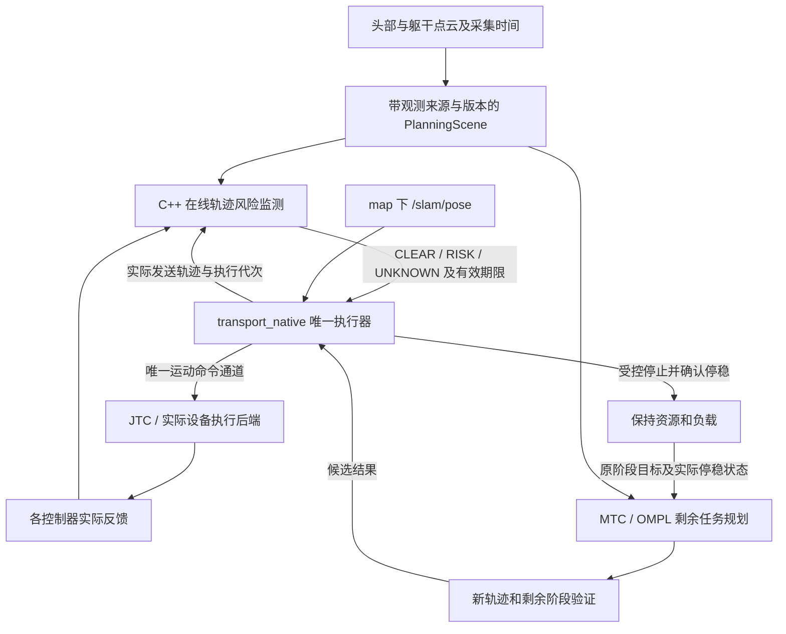

# 机械臂运动中动态避障、自动恢复与重规划落地方案

日期：2026-09-28。状态：**技术方案；功能尚未按本方案实施，新增实验均为 NOT_RUN。**

本方案以当前工作区源码为依据。Git HEAD 为 `854a8206d295dce5249c7adf5229e9e439559eb8`；工作区已有其他未提交修改，实际审阅文件以 [源码审计清单](/home/yjh/WorkSpace/astribot_sdk_ros2/docs/evidence/moveit_dynamic_avoidance_20260928/source_audit.json) 的 SHA-256 为准。清单记录的是本机安装版本，不代表在线进程实际使用的 overlay。此次没有启动、停止或接管 ROS/Gazebo 会话。

## 1. 决策与能力边界

建议沿现有 C++ 主线实现：**在线轨迹风险监测 → 现有唯一执行器受控停止 → 实测停稳并保持负载 → 有界等待或重规划 → 重新验证后继续原任务。**

第一版面向底盘固定、感知覆盖内的机械臂运动，先左臂空载，再左臂持物；右臂与双臂分别通过验证后开放。障碍短暂经过时可以等待；持续挡路时重新绕行；没有满足原约束的路径时保持并明确结束自动恢复。全过程保持原任务目标、抓放顺序、物体账本、碰撞约束和资源所有权。

“动态避障”第一版允许先停再绕行。持续运动中每周期改轨迹属于后续独立能力，需要另外验证实时性、控制平滑性和执行权交接。本方案不把底盘同时移动、未知接触操作或未经验证的人机协作纳入首版运行范围。

成功标准：

1. 在已验证的感知时延、障碍速度、机械臂速度及负载范围内，在制动安全余量耗尽前触发并完成停止。
2. 未实测停稳、旧执行尚未收束、场景证据过期或负载事实不明时，禁止自动继续。
3. 可恢复扰动解除后，机械臂从实际停稳状态完成原任务；不可恢复情况在有限时间内返回明确结果。
4. 不产生重复抓取、释放、附着、分离，不出现两个运动写入者，不放宽现有边界以换取通过。
5. 正常场景的任务行为、成功率及性能变化均有对照实验；源代码、配置、构建产物和失败证据可追溯。

以上目标需要逐级验证。普通深度相机、ROS 节点与 MoveIt 检查不能单独构成安全认证；突然进入已经无法制停区域的物体也不能靠重规划消除物理风险。首版必须明确可观测范围、允许速度、负载和停止能力。

## 2. 本项目已具备的基础与实际缺口

| 当前模块 | 源码确认的能力 | 本次需要补齐的部分 |
|---|---|---|
| [collision_validator.cpp](/home/yjh/WorkSpace/astribot_sdk_ros2/ws_robot/src/astribot_s1_manipulation/src/collision_validator.cpp) | 自碰撞、环境碰撞、ACM 约束、离散状态检查 | 执行中未来轨迹与制动过程的连续区间覆盖 |
| [external_trajectory_validator.hpp](/home/yjh/WorkSpace/astribot_sdk_ros2/ws_robot/src/astribot_s1_manipulation/include/astribot_s1_manipulation/external_trajectory_validator.hpp) | 时间参数化、关节限制、位置插值碰撞和奇异性验证 | 文件已明确：位置插值不证明控制器实际样条的扫掠体安全 |
| [dual_arm_planner.cpp](/home/yjh/WorkSpace/astribot_sdk_ros2/ws_robot/src/astribot_s1_manipulation/src/dual_arm_planner.cpp) | 同一场景快照上的规划尝试与候选验证 | 规划阶段重试不等于运动中自动恢复 |
| [mtc_planner.cpp](/home/yjh/WorkSpace/astribot_sdk_ros2/ws_robot/src/astribot_s1_transport_mtc/src/mtc_planner.cpp) | 已有剩余阶段复核、MTC/OMPL 规划基础 | `/transport/revalidate_manipulation` 主要检查已有路径；需要从中断后的实际状态重新生成候选 |
| [payload_transition.cpp](/home/yjh/WorkSpace/astribot_sdk_ros2/ws_robot/src/astribot_s1_transport_mtc/src/payload_transition.cpp) | PICK 附着确认后，限定条件下重规划 `TRANSPORT_POSTURE` | 现有限定重规划不能直接处理任意运动中断 |
| [hold_executor.cpp](/home/yjh/WorkSpace/astribot_sdk_ros2/ws_robot/src/astribot_s1_transport_native/src/hold_executor.cpp) | 原生执行权、FJT 子目标、实际轨迹摘要、取消与结果处理、阶段前场景复核 | 增加任务内部的“可恢复停止”，保留父任务和资源；不能将已终止任务重新置为执行中 |
| [execution_guard.cpp](/home/yjh/WorkSpace/astribot_sdk_ros2/ws_robot/src/astribot_s1_transport_mtc/src/execution_guard.cpp) | 跟踪误差及基于 `/slam/pose` 的底盘偏移保护 | 当前反馈订阅为 `/arm_left_controller/state`；需要按实际控制器覆盖关节并检查新鲜度，没有未来碰撞预测 |
| [sensors_3d.yaml](/home/yjh/WorkSpace/astribot_sdk_ros2/ws_robot/src/astribot_s1_moveit_config/config/sensors_3d.yaml) | 头部、躯干点云接入 Octomap；配置分辨率 5 cm，各更新器上限 10 Hz | 配置存在不等于当前有效覆盖；缺少用于恢复决策的“源观测已真正合入场景”的可核验契约 |

另有两个部署边界：

- 当前 MTC 节点显式限制 `use_sim_time=true`。真机接入需要单独验证设备停止、反馈、负载和执行接口，不能删除这个检查就认定支持真机。
- 原生主线直接向控制器发送 `FollowJointTrajectory`。部署时必须核验 MoveGroup 执行能力关闭、只有一个运动写入者；不能依据 launch 默认值或文档推断在线配置正确。

## 3. 复用现有模块的架构

模块职责保持清楚：监测器报告风险，规划器生成候选，执行器决定是否停止及是否接纳候选；只有执行器可以提交运动目标。设备侧仍负责已验证的末级停止和失联处置。

### 3.1 最小代码落点

以下名称为拟新增实现，不代表文件或接口已经存在。

| 改动位置 | 具体工作 |
|---|---|
| `astribot_s1_manipulation` | 增加与实际 JTC 插值一致的轨迹采样及扫掠区间验证核心；复用现有碰撞与关节限制检查 |
| `astribot_s1_transport_mtc` | 增加 `trajectory_collision_monitor` C++ 组件和从停稳状态生成剩余轨迹的规划入口；复用已有 MoveIt 依赖 |
| `astribot_s1_transport_native` | 扩展执行状态机、子目标代次、停止证据、候选接纳及恢复预算；保留唯一写入者 |
| `astribot_transport_msgs` | 增加实际执行轨迹绑定、风险报告及 `ReplanRemainingManipulation` Action 契约；仅传运行决策所需字段 |
| `astribot_s1_moveit_config` 与实际 Octomap 更新接入点 | 场景观测来源、覆盖、新鲜度及版本关联；只有现有更新器无法给出可靠关联时才增加 C++ 更新器插件 |
| 实际控制器或设备后端 | 若现有实现不能证明进程失联后的有界停止，补齐执行期看门狗/停止接口；具体落点在 P0 核验部署后确定 |
| launch、验证与分析脚本 | 配置接线、场景注入、统计和报告；运行逻辑继续使用 C++，不引入 pybind |

不另建通用任务框架，不为此替换整条控制链。原有检查接口有独立职责的继续保留；被新实现取代的旧运行入口，在验证通过及调用点迁移完成后删除，不留下兼容回退开关。

### 3.2 关键接口契约

- **执行绑定**：现有 `context_id`、事务/阶段标识、执行代次、计划修订号；每个实际控制器 Goal UUID、实际发送轨迹摘要、开始时间及反馈进度。监测使用最终发送给 JTC 的内容，不能仅使用上游 MTC 原始轨迹。
- **风险报告**：执行绑定、场景版本、观测时间、计算完成时间、有效期限、`CLEAR/RISK/UNKNOWN`、原因、最早危险区间及涉及的机器人部位。距离只有在确实计算得到时才提供；不得把缺失值置零并表示成功。
- **重规划请求**：原任务及阶段目标、实际停稳关节状态、已完成阶段、实际负载账本、最新场景、原约束、剩余期限和剩余次数。
- **重规划结果**：相同上下文与代次、候选剩余阶段、预期起点、约束和场景绑定、失败原因。结果不直接执行；超时、取消或代次变化后的结果失效。

同进程可靠内部契约不重复层层校验。校验集中在传感器、ROS 请求/结果、控制器反馈及计划接纳边界。旧的正常消息不能覆盖已收到的撤销或结构性故障；处理队列时保留故障锁存语义。

发送前先按执行代次和最终轨迹摘要建立监测并完成准入，Goal 接受后补齐实际 UUID；不能等目标开始运动才启动监测。若本机客户端在发送前已能确定 UUID，则直接绑定，但以实际客户端实现为准。

## 4. 在线动态避障如何实现

### 4.1 先建立可信的动态场景

监测器读取不可变场景快照，耗时碰撞检查放在有界工作线程，避免阻塞反馈和停止处理。每个快照需要区分：

1. 机器人/碰撞模型、静态几何、ACM、附着物、标定和坐标纪元等结构版本。
2. Octomap 内容变化及已合入的观测来源、采集时间和序号。
3. 未来运动区域是否被近期有效观测，空闲空间判断有哪些有效证据。

不能用“收到过点云”“收到 PlanningScene 消息”或“节点有心跳”替代点云已经正确变换并合入当前场景的证明。只订阅原始点云再独立记录时间，也不能完成这个关联；需要在实际集成路径形成原子版本记录。

对遮挡、视野外及过期区域，返回 `UNKNOWN` 并停止/拒绝恢复。旧障碍消失必须有有效清空证据，不能因为新一帧没看到、清空整张 Octomap 或自体过滤就认定通道空闲。载荷和机械臂的遮挡尤其需要测试。

首版不依赖不可靠的体素速度估计。对运动障碍使用运行范围内经过验证的速度上界，按观测年龄和停止时间保守膨胀；识别不到可信上界时不开放该场景自动执行。后续确有需求再加入目标跟踪与速度不确定度。

### 4.2 检查真实轨迹和制动过程

**不能继续把 0.025 rad 的关节直线插值作为完整执行安全证明。** JTC 的插值取决于轨迹携带的位置、速度、加速度字段；带导数的轨迹会使用三次或五次样条，路径可能偏离位置连线。[JTC 官方插值说明](https://control.ros.org/humble/doc/ros2_controllers/joint_trajectory_controller/doc/trajectory.html)

本项目已经有 [trajectory_time_scaling_test.cpp](/home/yjh/WorkSpace/astribot_sdk_ros2/ws_robot/src/astribot_s1_transport_mtc/test/trajectory_time_scaling_test.cpp) 调用实际安装的 JTC 插值实现，可复用这一验证方法，但还要覆盖首段起点、初始速度、轨迹开始时间及停止/替换语义。

每次计算检查三部分：

- 当前实际全机器人状态，包括另一条机械臂、躯干、夹爪和实际负载。
- 从真实执行进度出发的未来轨迹区间，覆盖完整连杆及载荷几何，不能只检查末端。
- 从现在发现风险到命令生效，再到实测停稳的可达范围，含跟踪偏差、控制器时延和负载影响。

算法先用保守几何包围体筛选，再做精细碰撞/距离检查；曲率大、净空小的区间自适应细分。每段必须有相邻采样间连杆位移和障碍位移的保守界，再将其计入几何膨胀。仅提高采样频率不能证明连续区间无碰撞；无法建立界或耗尽计算预算的区间为 `UNKNOWN`。

可将所需净空近似分解为下式，实际实现按各连杆及障碍几何计算：

`所需净空 ≥ 机器人响应阶段位移 + 机器人制动位移 + 障碍速度上界 × (观测年龄 + 响应时间 + 制动时间) + 几何/定位/离散化误差裕量`

所有项都需要实验或保守模型依据。安全前视范围至少覆盖这一反应及制动时间，并继续检查更远的候选路径。不能直接指定一个固定“距离 10 cm 就安全”，也不能用 P99 时延替代最大允许时延；超出已接受时延预算即退出自动执行。

首版遇险执行已验证的停止动作，不在中途任意缩放时间或替换局部轨迹。在线降速、平滑续接以后单独验证。

## 5. 停止、自动恢复与执行权

### 5.1 状态机

`EXECUTING → RISK_STOP_REQUESTED → STOPPING → STOP_CONFIRMED/HOLDING → WAIT_CLEAR 或 REPLANNING → VALIDATING → RESUMING → EXECUTING`

用户取消、资源撤销、控制器异常、负载事实不明等进入现有终止/故障处理，不参与普通障碍自动恢复。停止未被证实时保持隔离，禁止释放控制资源给另一运动写入者。

当前全局停止分支可能结束父任务，因此需要明确的“任务内部可恢复停止”状态。它保留任务上下文和合法资源租约，但不得延长任务原始期限。每轮恢复使用新执行代次；旧 Goal 的迟到成功、取消结果和未决发送结果都不能推进新一轮状态机。

### 5.2 停止必须有三层证据

1. **停止请求已发出**：记录风险发生、取消/停止发送的单调时钟时间。
2. **旧执行已收束**：所有相关子目标终态已知；迟到的 Goal 接受仍须取消并等待。仅收到取消响应不满足此条件。
3. **实际停稳**：新鲜关节位置/速度在规定窗口内满足已验证停止标准，负载维持成立；底盘也满足现有 SLAM 停稳条件。

本机对应版本的 JTC 取消回调会终结 Action 并安排保持位置，这本身不证明机械臂已物理停稳，也不证明减速度/冲击受限。必须测量取消到命令改变、再到实测停稳的全链路；不能满足制动边界时，补齐控制器或设备侧受控停止接口。[JTC 2.53.3 源码](https://raw.githubusercontent.com/ros-controls/ros2_controllers/2.53.3/joint_trajectory_controller/src/joint_trajectory_controller.cpp)

夹持保持与手臂运动分开处理：停止运动不能顺带打开夹爪或撤销持物保持。耦合双臂需要作为一组停止并验证两侧时序及物体受力，不能把两个独立取消视为同步制动。

底盘监测严格只使用 map 下 `/slam/pose`，不使用 `/odom` 或 TF 回退。沿用 [slam_pose_stop_window.hpp](/home/yjh/WorkSpace/astribot_sdk_ros2/ws_robot/src/astribot_s1_transport_native/include/astribot_s1_transport_native/slam_pose_stop_window.hpp) 的有符号净增量、最短转角和窗口语义；正反抖动抵消，但窗口内已经超过净偏差阈值的样本不能被后续返回掩盖。缺少 SLAM 数据不能判停稳。机械臂自身仍使用关节反馈。保持 `idle_position_hold=true`、`idle_position_kp=3.0`。

### 5.3 进程失联是单独的必要门槛

监测器失联时，仍在运行的执行器应停止；执行器也崩溃时，应用层定时器无法再发停止命令。已经交给 JTC 的整段轨迹可能继续执行。

必须确认实际执行后端在轨迹执行期间有可验证的命令存活期/看门狗及失联停止路径。本机对应 JTC 源码中的 `cmd_timeout` 检查涉及轨迹最后一点之后的行为，不能把这个参数直接当作执行所有者的运行期心跳。若现有设备接口不能提供该保证，P2 必须补齐并通过故障注入，才能开放自动恢复。

停止动作不等待日志持久化成功；但开始新运动、采用新计划及移交资源前，必须满足现有持久化与所有权契约。日志失败不能伪装成功，也不能阻止立即停止。

### 5.4 何时允许自动恢复

| 情况 | 处理 |
|---|---|
| 障碍短暂穿过，原剩余路径恢复有效 | 新鲜有效场景持续满足清空条件；从实际停稳状态生成/验证连接轨迹后继续 |
| 障碍持续挡路，存在保持原约束的绕行路径 | 从实际停稳状态重规划，验证剩余阶段并接纳 |
| 所有路径被阻断或超过恢复预算 | 保持负载，返回明确失败/人工处理状态；不无限重试 |
| 感知过期、遮挡、反馈过期 | 停止保持；只有证据恢复且未发生结构性故障时才重新评估 |
| 用户取消、资源所有权变化、时钟/定位纪元变化、物体丢失或控制器故障 | 终止本轮自动恢复；需要重新准入或人工确认，禁止障碍消失后自行启动 |
| 停止未确认 | 保持隔离，禁止重发运动目标 |

可在仿真起步使用“至少 3 个不同源观测且持续 0.5 s 清空、最多 2 次重规划、单次至多 5 s、等待累计至多 10 s”的候选配置。它们**不是已验证阈值**，需要结合时延和任务期限确定；取值不能放宽现有期限。当前计划 120 s 有效期及负载事务、场景复核等各自期限继续约束恢复，不能因恢复而重新计时。

## 6. 重规划保持任务语义

### 6.1 按阶段定义可恢复范围

| 阶段类型 | 允许的恢复 | 必须保持的约束 |
|---|---|---|
| `PREGRASP`、`PREPLACE`、`TRANSPORT_POSTURE`、`STOW` | 停稳后从实测关节状态规划到原批准目标 | 同一负载、原关节/姿态限制、碰撞模型、ACM、后续阶段可衔接；初版优先保留原关节终点 |
| `GRASP_APPROACH`、`PLACE_APPROACH`、`LIFT`、`RETREAT` | 满足原方向、姿态及接触要求的受约束剩余运动 | 不能把直线接近、抬升或退出改为任意 OMPL 绕行；不能保持约束时停止自动恢复 |
| `GRASP_CONFIRM`、`ATTACH_CONFIRM`、`RELEASE`、`DETACH_CONFIRM` | 先核对实际物理事件和账本，再决定后续阶段 | 不因重规划重复夹持、释放、附着或分离；事实未决时禁止自动重放 |
| 双臂共同持物 | 通过专项验证后使用耦合规划与成组停止 | 物体相对位姿、闭链约束、两臂碰撞及同步；不能独立重规划两臂 |

释放前仍需验证分离后的退出路径；规划场景中的附着/分离不能替代实物确认。遇到障碍也不能通过扩大 ACM、删除障碍或改变物体状态来制造可行路径。

### 6.2 新候选接纳流程

1. 从实测停稳状态建立新起点，保留原阶段目标和已经发生的物理事件。禁止直接从旧轨迹的下一个点继续发送。
2. 用最新一致场景生成当前阶段及必要剩余阶段；只复用边界状态完全匹配且通过重新验证的旧后缀。
3. 验证全机器人碰撞、实际样条、制动可达范围、关节/速度/加速度限制、原路径约束、负载及所有后续状态转换。
4. 执行器在接纳边界复核实际状态、上下文、期限和场景有效性，原子替换尚未执行部分；在首条恢复命令前建立新轨迹的监测绑定。
5. 接纳期间结构性版本改变则拒绝；普通点云更新用最新快照重新检查受影响区域，不能要求动态地图长期完全不变。检查与发送之间继续受在线监测和已验证反应余量约束。

现有 [mtc_plan.cpp](/home/yjh/WorkSpace/astribot_sdk_ros2/ws_robot/src/astribot_s1_transport_native/src/mtc_plan.cpp) 的 `adoptPayloadSuffix()` 严格限定阶段和端点，其重规划起点来自既定 LIFT 终点。**不能放宽此函数的检查来接纳任意中断后的轨迹。**应增加明确的“已停稳阶段替换”契约，保留不同物理语义；若最后统一内部实现，再在全部调用点验证后删除被替代的旧入口。

## 7. 分阶段实施与验收门槛

| 阶段 | 交付 | 进入下一阶段的必要证据 |
|---|---|---|
| P0：冻结基线和运行范围 | 实际 overlay/控制器/模型/参数清单；单写入者核验；感知覆盖、采集到集成时延、制动曲线及负载范围 | 明确实际插值和停止行为；场景来源可关联；识别设备失联停止缺口；不以默认参数代替读回 |
| P1：影子监测 | C++ 真实轨迹采样、保守区间验证、带版本风险输出；不接管运动 | 离线/回放碰撞真值对照；样条中段碰撞、另一臂及载荷覆盖；超时明确 UNKNOWN；计算预算满足目标负载 |
| P2：在线停止 | 风险触发停止、旧 Goal 收束、实测停稳、负载保持、下游失联处置 | 隔离 ROS 与仿真下的障碍、丢反馈、进程崩溃、迟到回调实验通过；自动继续仍关闭 |
| P3：有限自动恢复 | 空载左臂自由空间阶段的等待、重规划、验证、继续，再扩展到持物 | 原任务/约束保持；有限恢复；无重复副作用；停止到恢复各项状态证据完整 |
| P4：扩展阶段与机械臂 | 受约束接近/退出阶段、右臂、双臂协同分别接入 | 各自场景、控制器反馈、成组停止和载荷实验；未通过的能力不对外声明支持 |
| P5：交付切换 | 相同场景对照报告、稳定性回归、C++ 唯一运行入口、Git 提交链与回滚说明 | 对照验收通过；清理被替代入口和过期参数；构建/安装引用无残留；真机另行验收 |

P0 可以先完成源码与离线基线，在线测量需使用有归属的隔离会话。不得接管其他窗口控制器、ROS domain、Gazebo 分区或正在使用的 GPU。问题排查满一小时按项目规则留存证据并暂缓，推进不依赖该问题的工作，不降低门槛。

## 8. 正确性、稳定性和性能实验

以下全部为计划实验，当前状态为 **NOT_RUN**。

| 编号 | 场景与注入 | 必须观察的结果 |
|---|---|---|
| SC-01 | 无障碍，相同起点/目标/负载/随机种子 | 影子监测时原目标及发送轨迹不被改变；任务结果和物理副作用保持；记录额外开销 |
| SC-02 | 前方、侧方、后方障碍在运动中进入；分别接近上臂、前臂、夹爪、载荷 | 完整几何均可触发；在接受的制动边界外完成停止；覆盖刚检查完或刚发送目标时出现障碍 |
| SC-03 | 短暂穿越与持续挡路 | 前者可等待后恢复；后者能在允许阶段绕行；目标和抓放顺序不变 |
| SC-04 | 封死全部路径、障碍反复进出 | 有界失败/保持；无忙循环、无限重规划或反复抖动启动 |
| SC-05 | 轨迹点无碰撞、样条中段发生碰撞；取消后的制动路径贴障碍 | 拒绝候选或提前停止；不能因路点检查通过而继续 |
| SC-06 | 点云延迟/丢失/遮挡、TF 无效、收到原始帧但未合入地图、旧地图仍在发布 | 返回 UNKNOWN；不误判新鲜，不自动清障，不以心跳代替有效观测 |
| SC-07 | 时间回拨、未来时间戳、定位/标定/场景纪元变化，故障后排队到达 CLEAR | 旧正向证据不能复活执行；锁存、期限和重新准入语义正确 |
| SC-08 | 发送未获 Goal handle 时取消、迟到接受/成功、旧规划超时后返回 | 旧目标正确收束；旧结果不能推进新代次；没有第二写入者 |
| SC-09 | 监测器/执行器退出、控制器反馈断流、控制器重启 | 实际设备路径在预算内停止；无法证明停止时隔离；不得仅观察 Action 状态就通过 |
| SC-10 | 抓取、附着、释放、分离前后插入障碍/取消 | 物理事件只发生一次；真实账本一致；保持负载，释放后的退出路径仍受约束 |
| SC-11 | SLAM 正反抖动、跨 ±π、净偏移越界、缺 SLAM、只有 odom/TF 可用 | 有符号净增量正确；越界和缺样本不能判停稳；无 odom/TF 回退 |
| SC-12 | 已批准范围内最大负载、速度和姿态；右臂；双臂共同持物 | 每项独立验收；不能以左臂空载结果代替；覆盖协调停止及载荷稳定 |
| SC-13 | 项目既有全部正常任务场景，叠加完整感知与规划负载 | 无场景退化；监测/停止尾延迟、队列和内存有界；过载触发明确处置 |

验证层级依次为：纯 C++ 核心 → 录制回放/故障序列 → 隔离 ROS/真实控制器插件 → Gazebo 全链路 → 接触与负载验证 → 真机。前一层通过不能替代后一层。

参考真值必须独立于被测监测器：仿真物体实际位姿、独立几何检查和接触记录、控制器实际状态及设备反馈共同作证。传感器中没检测到障碍不代表物理场景无障碍；没有接触日志也不能单独证明整个连续过程安全。报告注明净空是采样最小值还是带区间误差界的下界。

### 8.1 量化指标

| 类别 | 统一记录口径 |
|---|---|
| 时延 | 采集→场景合入→风险输出→停止请求→控制输出变化→实际停稳；P50/P95/P99/最大值及预算超限次数 |
| 碰撞裕量 | 全连杆及负载最小净空、制动位移/时间、预测与实测误差；注明采样率和区间界 |
| 正确性 | 预期可检测危险的漏检数、误停数、错误恢复数、旧事件误接纳数、重复物理副作用数 |
| 恢复效果 | 可恢复场景成功数/可恢复场景总数、恢复耗时、尝试次数、整项任务成功率和耗时；不可恢复场景单独统计 |
| 性能 | 监测周期超限、计算耗时、队列峰值、CPU 核占用、RSS、规划时延；有/无监测的绝对值和百分比变化 |
| 稳定性 | 长时运行内存趋势、残留 Goal、失效租约、日志完整性、进程/设备故障后的实际停止与恢复结果 |

仿真同步报告 ROS 时间、单调墙钟时间和 RTF，避免把低 RTF 下的宽裕计算时间当成真机能力。停止窗口/租约等墙钟契约按其现有定义验证；相机帧重复发布不能增加“独立新观测”的计数。

初始实验规模可设为每个可重复场景至少 30 次 A/B 交错运行、竞争/故障序列至少 100 个固定种子、2 小时完整负载稳定性运行。根据观测方差和低频故障继续补样；这些样本数不构成安全证明。

监测可先以 50 Hz、单轮计算 P99 ≤ 10 ms 作为仿真性能目标，再依据 P0 测量修订；超过单轮预算必须显式处理。该数值不是已测性能，也不能代替最坏时延约束。只有 10 Hz 的地图更新时，50 Hz 监测不会制造新的环境观测。

对照组在隔离仿真/回放中运行，不把缺少动态保护的基线拿到真人或设备危险场景复现。非确定性规划使用相同种子和多次交错试验；无法保证二进制轨迹相同的实验，用目标/约束/事件及完整轨迹几何对照，不以均值相近代替正确性。

### 8.2 需求到证据的追溯

| 需求/危险编号 | 要防止的问题 | 对应场景 | 待产生证据 |
|---|---|---|---|
| R-01 / H-碰撞 | 真实样条、制动或载荷扫掠被漏检 | SC-02、05、12 | E-01：独立几何/接触真值、区间界与实测停止记录 |
| R-02 / H-误恢复 | 未停稳、证据失效、旧事件导致继续运动 | SC-06、07、08、09、11 | E-02：事件序列、源时间、实际反馈、代次和旧 Goal 终态 |
| R-03 / H-任务变义 | 为绕障改变约束或重复执行抓放 | SC-01、03、10、12 | E-03：阶段/目标/约束对照及独立负载事件记录 |
| R-04 / H-失控重试 | 无解、抖动或失联造成无限重试和资源错误释放 | SC-04、08、09 | E-04：期限、次数、资源状态和末级停止证明 |
| R-05 / H-场景退化 | 原有正常任务失效，完整负载下响应超时 | SC-01、13 | E-05：逐场景 A/B 结果及延迟、CPU、RSS、RTF 分布 |

这些 E 编号目前只是证据索引，均为 NOT_RUN。P0 固定各项验收预算；碰撞、错误恢复、重复物理事件等正确性失败不能通过放宽性能或成功率口径消除。每次报告保留失败案例及其原始数据。

## 9. Git、证据和唯一入口交付

每个阶段保留独立可审阅提交：接口与不变量 → 监测核心及测试 → 停止协议 → 恢复规划 → 集成与唯一入口清理。提交仅覆盖本任务文件，由实际工作区/主线所有者管理，不混入他人未提交修改。

每次实验关联：Git 提交、未提交源码摘要、构建产物摘要、URDF/SRDF/碰撞模型、控制器参数、场景/负载、随机种子、会话归属、日志/bag、结果和失败原因。录包必须确认写入成功、关键主题覆盖及终态证据完整；失败实验原样留存。

验证通过后删除被替代的旧入口及配置，重新检查安装目录和 launch 引用，使用干净构建/安装前缀防止旧文件继续被发现。回滚依据 Git 恢复已知版本，并经过所属会话的安全停机与重新启动；运行时不保留旧链条兜底。

## 10. 主要卡点与技术取舍

真正决定能否落地的是四项证据：**传感器观测到场景的延迟和覆盖、真实控制器样条与制动范围、进程失联后的末级停止、阶段中断后的物理语义与执行权收束。**这些未解决时，换规划算法不能完成闭环。

MoveIt Hybrid Planning 的全局/局部规划分工可供后续连续避障参考；其碰撞事件触发全局重规划机制与这里的监督思路相符。但直接整体接入会改变本项目执行所有权和阶段接纳方式，因此建议先完成上述闭环，再按需要适配局部规划器。[MoveIt Humble Hybrid Planning](https://moveit.picknik.ai/humble/doc/concepts/hybrid_planning/hybrid_planning.html)

MoveIt Servo 提供流式关节/笛卡尔命令及接近碰撞时的降速/停止能力，可以作为后续连续运动候选；它本身不能代替本项目的绕行规划、负载事务和任务恢复。接入时必须由同一所有者明确切换控制模式，禁止与当前 FJT 写入并行。[MoveIt Humble Servo](https://moveit.picknik.ai/humble/doc/examples/realtime_servo/realtime_servo_tutorial.html)

本方案建议先推进 P0–P2，获得“能发现风险，并能实测证明及时停住”的证据；P3 再开放自动恢复，P4 按能力逐项扩展。完整闭环通过之前，对外状态应明确为设计中、影子监测或停止保护，不能统称为已经完成动态避障。
