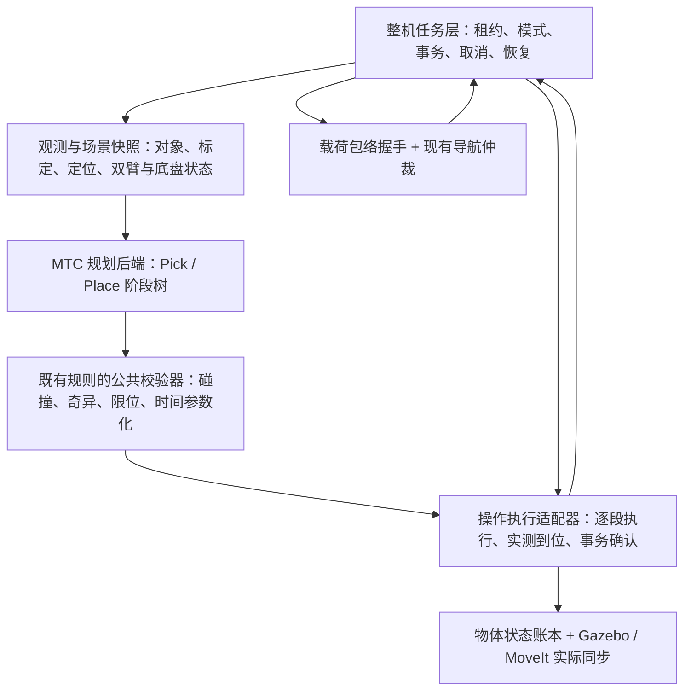

# MoveIt Task Constructor 与整机搬运架构融合方案

实施记录：[MTC 接入与统一导航仿真](MTC_NAVIGATION_SIMULATION_20260919.md)。本文中的验收集仍是目标，实际已完成项以实施记录为准。

日期：2026-09-19。状态：实施前架构评估快照，保留原决策依据。
评估时只核对源码、既有运行证据与官方资料；之后已开始接入 MTC 并统一导航仓库仿真。当前实现与验收结果以顶部实施记录为准，真机仍未连接。

## 1. 建议决策

建议引入原生 MoveIt Task Constructor（MTC），定位为**机械臂操作的多阶段规划后端**。
整机任务层继续拥有资源租约、运行模式、导航调用、取消、物体状态提交和故障恢复。
先接入“到站后的放置—释放—退臂—收臂”规划，再扩展到抓取与运输姿态。

MTC 能把多阶段运动和假设场景变化一起求解，并保留多个候选解；它的价值超出把现有步骤改名或分组。
官方提供 Humble 分支，适合本仓库 ROS 2 Humble；接入时应锁定发布版本或提交，不跟随开发分支。
[官方仓库与分支说明](https://github.com/moveit/moveit_task_constructor)

| 选择 | 收益与代价 | 建议 |
|---|---|---|
| 仅借鉴 Stage/Container，继续自己实现规划搜索 | 依赖少，容易改善流程可读性；多 IK、候选传播、场景分支、代价筛选仍需自己建设 | 适合作为第一步整理，不应称为已接入 MTC |
| 原生 MTC + 现有整机任务层 | 复用阶段规划与候选搜索；需要场景、校验、执行适配 | 推荐 |
| 用单个 MTC Task 承担整机抓取、导航、放置、恢复 | 要重做导航和运行时仲裁适配，固定基座与长期场景变化也不匹配 | 当前不采用 |

评估时，本机 apt 索引提供 `moveit-task-constructor-core` / `msgs` 0.1.3 候选包，尚未安装。
这只证明依赖有获取路径，不证明与本地 MoveIt 构建的 ABI、规划插件或模型兼容；第一阶段需独立 overlay 构建验证。

## 2. 现状与改造动因

| 已核对的实现 | 当前效果 | 对 MTC 接入的含义 |
|---|---|---|
| [core.py](../ws_robot/src/astribot_s1_transport/astribot_s1_transport/core.py)，`TransportTask.run()` | 已有阶段、物体事务、保载失败和 PLACED 恢复；各动作依次规划并执行 | 保留运行时事务，把一段操作的规划提前完成 |
| [ros_backend.py](../ws_robot/src/astribot_s1_transport/astribot_s1_transport/ros_backend.py)，`skill()` | 每次 PlanSkill 返回一条轨迹后立即执行并等待实测收敛 | 拆出“规划、结果校验、受控执行”，消费多阶段计划 |
| [PlanSkill.srv](../ws_robot/src/astribot_transport_msgs/srv/PlanSkill.srv) | 单目标、单轨迹，无计划版本或后续阶段表示 | 保留兼容；新增独立规划 action，不直接改变旧接口语义 |
| [transport_skill_planner.cpp](../ws_robot/src/astribot_s1_manipulation/src/transport_skill_planner.cpp) | 已复用碰撞、奇异点、限位和时间参数化校验 | MTC 轨迹也必须通过同等校验，不能只看 MTC SUCCESS |
| [astribot_s1.srdf](../ws_robot/src/astribot_s1_moveit_config/config/astribot_s1.srdf) | 已有 arm_left/right、gripper_left/right、eef_left/right、TCP；基座 virtual_joint 为 fixed | 可建立 MTC 操作任务；移动后必须刷新相对底盘的场景 |
| `navigate()`、`transport_envelope()` | 原导航仲裁 action、实测运输姿态与包络握手 | 继续作为整机层的移动阶段 |

已有失败记录直接说明“提前规划后续阶段”的价值：

- [task18 账本](evidence/transport_20260919/task18_events.jsonl)：箱体释放后，退臂轨迹才被奇异点校验拒绝，条件数 87.0 > 80。后来通过斜向退臂和 PLACED 恢复完成。改造目标是在松爪前识别这类问题，而不是事后才恢复。
- [task19 账本](evidence/transport_20260919/task19_events.jsonl)：Gazebo 位姿同步过期导致保载停止。MTC 不解决传感器或仿真通信故障，现有同步时效门控仍必须保留。
- [task20 账本](evidence/transport_20260919/task20_events.jsonl)：既有版本完整成功，是接入回归基线；不能宣称其结果已经验证 MTC。

从 task20 首次进入各阶段的墙钟时间统计：

| 区间 | 耗时 |
|---|---:|
| ADMISSION → TRANSPORT：准入、感知与抓取等 | 15.977 s |
| TRANSPORT → PLACE_HOLD：四段导航及阶段切换 | 173.273 s |
| PLACE_HOLD → SUCCEEDED：放置与收尾 | 12.622 s |
| 合计 | 201.872 s |

导航区间占约 85.8%。因此第一阶段以减少后段规划失败、改善可诊断性为目标；
整段搬运提速要另行评估进站位姿、路径长度和对准过程。不能用 MTC 接入承诺大幅缩短总耗时。
以上仅为一次成功样本，不是平均值、P95 或成功率。

## 3. 分层与控制归属



| 能力 | 权威责任方 | MTC 的角色 |
|---|---|---|
| 谁可控制底盘、双臂、躯干、夹爪 | 整机任务/资源协调 | 请求规划使用的组，不自行获得设备控制权 |
| 抓取候选、IK、接近、抬升、运输姿态、放置、退臂 | MTC + 公共校验器 | 生成、组合、筛选候选轨迹 |
| 搬运移动和到位 | 现有导航仲裁/控制/保护 | 不发布底盘速度、不接管路径跟踪 |
| 夹爪是否到位、物体是否实际附着或放下 | 执行适配器 + 场景同步 + 传感器证据 | 规划中的 attach/detach 只是预测状态 |
| 取消完成、异常保载、断点恢复 | 整机任务层 | 提供规划取消和阶段诊断，不决定物理恢复 |
| 碰撞与奇异点门槛、轨迹限位 | 公共校验器与底层保护 | 所有 MTC 输出接受同等约束 |

第一版为停止底盘后操作，导航时固定携物姿态。双臂共同抓物仍使用已有闭链约束能力；
不能把 MTC 的 Merger 当成闭链、力控或整机动力学求解器。
官方 `SerialContainer`、`Alternatives`、`Fallbacks`、`Merger` 分别提供顺序组合、候选组合、
顺序尝试替代规划和合并不同组的子解。本文的控制归属是针对本仓库的设计选择。
[Humble 容器源码](https://github.com/moveit/moveit_task_constructor/blob/humble/core/include/moveit/task_constructor/container.h)

## 4. 优化后的搬运流程

整机流程建议分成以下阶段；其中两个 MTC Task 在各自的静止底盘场景内求解：

```text
准入 / 资源租约 / 操作 HOLD
  → 感知三帧稳定 + 场景快照
  → PICK_PLAN：求解预抓取—接近—关爪—附着—抬升—运输姿态全段
  → PICK_EXECUTE：逐段执行，在关爪和附着处做实测确认
  → CARRY_READY：实测姿态 → 载荷包络 → 双 costmap 确认
  → TRANSPORT：现有导航 → 到站静止
  → PLACE_SCENE_REFRESH：重新投影障碍物、校验目标与定位质量
  → PLACE_PLAN：求解预放置—接近—松爪—脱离—退臂—收臂全段
  → PLACE_EXECUTE：松爪前确认位置和后续退路，分段执行与提交
  → EMPTY_HOLD / 放置验收 / SUCCEEDED
```

底盘移动前可以做目标工位可达性预评估，但它只能用于候选评分，不能授权执行。
到站后必须基于实际底盘位姿、关节和世界物体状态重建 Place Task。

MTC 的基础阶段包括状态生成、姿态/IK 生成、运动连接、相对运动和规划场景修改；
可以通过 SerialContainer 组合拾取操作。接近阶段使用 CartesianPath 与 MoveRelative，
跨较远构型的连接用 PipelinePlanner 等。具体分组与使用方式见
[官方 Humble 抓放教程](https://moveit.picknik.ai/humble/doc/tutorials/pick_and_place_with_moveit_task_constructor/pick_and_place_with_moveit_task_constructor.html)。

### Pick Task 的建议组成

| 子阶段 | 规划构件 | 执行约束 |
|---|---|---|
| 捕获起点、夹爪准备 | 当前状态快照、MoveTo | 右臂和躯干也属于完整状态；其他组变化会使计划失效 |
| 生成抓取候选 | GenerateGraspPose 或受约束的自定义生成器 + ComputeIK | 输入当前 RGB-D 对象位姿、质量和版本；起步保留现有已验证姿态作为候选 |
| 连接预抓取 | Connect / PipelinePlanner | 同时筛选后续抬升、运输姿态是否可达 |
| 接近 | MoveRelative / CartesianPath | 明确参考系、方向和距离；接触附近不自动退化为任意绕行 |
| 关爪、预测附着 | MoveTo + ModifyPlanningScene | 抓取宽度复用 GripperCommander；执行后实测确认才能提交 ATTACHED |
| 抬升、运输姿态 | MoveRelative + MoveTo | 带物体碰撞几何规划，并校验候选姿态的包络约束 |

候选抓取必须服从箱体形状、允许接近方向和夹爪几何，不能直接把圆柱示例的整圈旋转采样套到箱体上。
第一轮可先只用现有抓取位姿建立等价性，再逐步启用多候选，避免一次改动同时改变识别、抓取策略和执行器。

### Place Task 的建议组成

| 子阶段 | 规划构件 | 执行约束 |
|---|---|---|
| 读取当前附着状态 | 当前场景快照 | 必须包含实测 TCP→物体变换、运输后姿态与新工位坐标 |
| 预放置、接近目标 | MoveTo / Connect + MoveRelative | 目标由物体放置姿态反求 TCP，不能忽略实际抓取偏置 |
| 松爪、预测解除附着 | MoveTo + ModifyPlanningScene | 在规划副本中模拟，不能修改当前真实场景或账本 |
| 退臂候选 | 受约束的多个 MoveRelative 方案 | 先评估已验证斜向退臂；所有候选保持碰撞和奇异点门槛 |
| 收臂 | MoveTo | 后续收臂也必须可达，才把该候选交给执行层 |

**松爪前至少有一条经校验的“释放后退臂—收臂”路径。**
若所有路径不通过，维持夹持并返回 `NO_VALID_RELEASE_EXIT`（建议新增错误码），由整机层决定
调整候选放置姿态或终止；不先松爪再寻找退路。前瞻规划不替代执行前检查，也不能保证执行中环境不变化。

## 5. 计划与真实状态的边界

MTC 的规划分支可以假设“夹爪已关、物体已附着、物体已放到台面”，但这些假设不等于传感器确认。
建议把三个状态空间分开：规划副本由 MTC 拥有；实时 PlanningScene 由场景管理接口维护；
任务账本由整机执行流程按证据提交。后两者可能因通信而暂时不一致，必须显式记录待确认状态。

| 事件 | 先记账 | 执行动作 | 确认后提交 |
|---|---|---|---|
| 抓取附着 | ATTACH_PENDING | 确认关爪/抓取证据，应用附着并等待同步 | ATTACHED |
| 放置释放 | RELEASE_PENDING | 位置与退路检查通过后松爪，解除附着并同步 | PLACED |
| 超时或取消 | 保留最后确认状态及未确认操作 | 等待执行器终态，底盘 HOLD | 未确认的附着/释放不得冒充成功 |

MTC 原生有 `Task.execute()` 和 `ExecuteTaskSolution` 执行路径，也有规划 preempt 接口，
不是“只能规划”的库。第一版由本仓库主动选择只消费其规划结果，避免并存两套控制入口。
原生执行能力可取消，但不会自动理解我们的包络 epoch、Gazebo 同步和物体账本。
[Humble Task 接口](https://github.com/moveit/moveit_task_constructor/blob/humble/core/include/moveit/task_constructor/task.h)，
[Humble 执行 capability](https://github.com/moveit/moveit_task_constructor/blob/humble/capabilities/src/execute_task_solution_capability.cpp)

执行适配必须保留有序的非运动阶段、附着/解除附着、允许接触关系及屏障；不能只提取
RobotTrajectory 列表拼起来。接触许可仅限定到目标物体与批准的夹爪 link，按阶段生效，
相应几何校验使用同一阶段的场景；不能全局关闭物体碰撞来换取规划通过。

复用现有 CollisionValidator、SingularityMonitor、TrajectoryTimeOptimizer 等模块，建立统一的
外部轨迹校验入口。最终时间参数化后的轨迹需检查采样密度、关节限位、碰撞及奇异点；
重采样或平滑改变路径时重新检查。保留现有奇异点阈值及受控的起点逃离规则，不为接入放宽条件。

## 6. 建议新增接口与包边界

以下均为待实施接口，不表示当前仓库已存在。

| 模块 | 建议变更 |
|---|---|
| `astribot_s1_transport` | 增加操作计划的数据模型与执行适配；保留整机状态机、账本和导航入口 |
| 新 `astribot_s1_transport_mtc`（C++） | 独立可选依赖；构建 Pick/Place Task、返回候选与阶段诊断；不直接控制设备 |
| `astribot_transport_msgs` | 新增 `PlanManipulation.action` 及阶段结果类型；旧 PlanSkill 保持兼容 |
| `astribot_s1_manipulation` | 公开公共轨迹校验接口；现有单臂/闭链能力保持独立 |
| 场景/感知适配 | 发布规划快照标识和质量信息，管理规划失效条件 |
| 启动配置 | 显式 `manipulation_planner:=legacy|mtc`；缺少 MTC 时报清晰错误，不悄悄降级 |

建议 PlanManipulation action 的逻辑契约：

```text
Goal
  task_id / operation(PICK|PLACE) / object_id
  PlanningContext
  permitted_candidates / target_object_pose / constraints
  planning_budget / max_solutions
Feedback
  phase=PLANNING / stage_path / candidates_found / rejection_reason
Result
  status / plan_id / source_context
  ordered_segments[]:
    stage_id / executor_kind / trajectory or scene_operation
    expected_start / expected_end / preconditions / confirmation_barrier
  validated_cost / rejection_summary
```

PlanningContext 至少关联对象版本、外部场景版本、标定版本、定位版本、模型与策略版本、
完整关节状态、底盘位姿、附着变换、计划创建时间与时效策略。
它不能只保存 object_id；右臂移动、底盘漂移或场景新增障碍也可能使左臂计划失效。

执行前检查每个分段的实际起点、场景及有效期；任务自己已确认的预期 attach/detach
通过明确的后继上下文衔接。外部场景变化或未预期偏差触发失效并停止/重规划，
不能因为任何 version 增长就把合法后继全部作废，也不能为了继续执行忽略版本变化。

Action 用于承载较长的规划过程、诊断反馈与取消。取消时调用 MTC preempt 并等待工作线程退出；
还需检验具体 solver 对中断的响应时间，不能把取消请求受理当成完成。
规划取消和设备运动取消分别记录；资源归还以前者线程退出、后者 action 终态及静止证据为准。

候选评分先执行硬约束，再比较轨迹长度、时长、净空、奇异余量及运输包络等代价。
代价函数不能抵消碰撞或限位失败。首轮使用明确且有限的候选数、时间预算，不做无限重试。

## 7. 与图片七类模块的对应关系

| 模块 | MTC 可带来的改进 | 仍需本架构负责 |
|---|---|---|
| 整机任务与资源协调 | 输出层级阶段与依赖 | 资源互斥、跨客户端仲裁、抢占、取消完成确认 |
| 运输姿态与载荷 | 抓取时前瞻验证抬升和携物姿态，多候选评分 | 实测包络、质量、导航准入、两张 costmap 确认 |
| 整机模式与健康 | 报告具体规划阶段失败原因 | 模式切换、能力健康、时效检查和保护 |
| 操作场景与物体 | 在候选中传播假设附着和释放 | 唯一对象身份、真实世界版本、Gazebo/MoveIt 一致性 |
| 正式操作技能 | Pick/Place 可组合，规划反馈更细 | 实际执行、传感器确认、可取消和可恢复语义 |
| 标定与定位质量 | 使用冻结的质量合格场景快照 | 相机/TF 来源、质量准入、移动后重新观测和计划失效 |
| 长期运行 | 阶段耗时、候选拒绝原因更易追踪 | 电源、回充、耐久、异常恢复和持久化 |

MTC 也不会把当前运动学附着变成物理夹持。夹持力、摩擦、滑落和真机相机外参仍需单独接入与验收。

## 8. 分步实施与验收

| 步骤 | 可审查的交付 | 进入下一步的条件 |
|---|---|---|
| A：接口和基线 | 固定 task20 场景；公共校验接口；规划上下文与执行屏障契约；显式后端选择 | 原路径行为不回退，故障和取消契约测试通过 |
| B：Place 的只规划对照 | 在同一个到站/附着快照上运行原生 MTC，产出“接近—释放—退臂—收臂”全段；不执行其结果 | 合法斜向退路被接受；所有退路被阻断时在释放前无解；原生依赖构建和模型加载通过 |
| C：受控执行 Place | 把 MTC 分段交给现有执行器，保留账本和实际同步 | 全段仿真成功；过期计划、漂移、取消、释放不确定都正确终止；保留原 PLACED 恢复 |
| D：Pick 与候选扩展 | 抓取候选—IK—抬升—携物姿态联动规划 | 候选不可收臂时换解；包络确认后才能导航；视觉过期时禁止抓取 |
| E：再评估全局效率 | 基于运行数据优化进站位姿和路线；必要时加入上层站位候选评估 | 导航与操作分别统计，未降低避障和到位标准 |

建议验收集至少覆盖以下独立情形，阈值沿用现有有效配置；新增阈值必须单独说明来源：

1. 固定基线成功，所有已执行阶段都有实际反馈与账本证据。
2. 预抓取可达但抬升/运输姿态不可达：关爪前拒绝该候选或选另一候选。
3. 放置可达但全部退路失败：松爪前失败，物体保持 ATTACHED。
4. 到站后底盘/右臂姿态或场景变化：旧计划拒绝执行，基于新快照重新规划。
5. 在规划、机械臂执行、导航和释放确认期间分别取消：不重复松爪，不提前归还资源。
6. RGB-D/TF 过期、包络失效、Gazebo 同步超时：仍触发既有保护。
7. 进程中断后账本处于 ATTACH_PENDING / RELEASE_PENDING：不盲目恢复；PLACED 尾段恢复独立验收。
8. 保留碰撞、奇异点和速度/加速度限制；故意违反约束的候选不能因代价更低而获准。

可先使用一组预先固定的至少 10 个可行场景扰动/随机种子做对照，再单列故障注入结果。
报告规划成功率、执行成功率、规划时间 P50/P95、失败发生在提交前/后、导航耗时、操作耗时及恢复次数。
这只是建议验收规模，不是已完成测试，也不能代替长期耐久与真机验收。

实施优先顺序为 A → B → C → D。第一项能直接改善现有失败模式的交付，是
**放置前完成包含释放后退路的整段规划，并仍由现有执行器逐段确认**。
