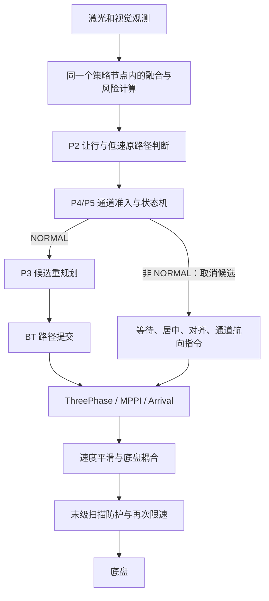

# 窄通道整体复审与不退化约束

本次复审结论：**当前 P5 整体未通过，不满足“不可低于引入窄通道前的表现”，不能作为已验收版本。** 问题包含额外控制干预、几何与时间判据不一致、状态机恢复缺口和实时性退化，不能靠继续降低速度或放宽宽度阈值解决。

本轮停止了 `/tmp/astribot_priority_indexed` 试验栈，完成源码审查、既有仿真回执复核和 9 个离线分支反例。本轮没有继续修改控制器、策略或安全阈值，也没有声称完成新的仿真回归。启动默认仍为 `off`；工作区保留的 P5 实验代码没有自动回滚，因此“默认关闭”不等于“源码已经恢复到历史基线”。

## 1. 对照证据与结论边界

| 证据 | 结果 | 可以说明什么 |
|---|---|---|
| 引入窄通道前 `native_quality`，0.35 m/s、仓库六点、两轮 | 12/12 到位；最大 2.1281 cm / 1.1258° | 用户认可的历史质量基线，需保留其过程指标，不能只保留到位率 |
| 本轮之前的 OFF 接近段修复，完整目标 | 1.8167 cm / 0.9794°，Action 成功 | 原来关闭策略也失败的近终点问题已有同起点完整复现和修复证据 |
| 同一 OFF 修复，南侧门口反向退出、重复进入 | 2.4051 cm / 0.0044°；1.8204 cm / 0.9509° | 南侧入口正反向专项通过；反向目标在人工长通道之外，不代表再次穿过人工通道 |
| 最近 8 个不同 P5 修改版本的完整目标试验 | 全部 Action 失败 | 改进尚未形成完整闭环；这些是不同版本试验，不能计算为同一版本的统计成功率 |
| 最新 `p5_indexed_full` | 人工直通道内最大横偏 0.8722 cm、航向 1.1871°，完整目标失败 | 某一段更直，不能抵消全程可达性退化 |

OFF 修复只把 `PathFollowCritic.threshold_to_consider` 从 1.4 m 调到 0.5 m，延长接近转弯时沿路径推进评分；因此它是“历史基线加接近段修复”，不是完全未修改的历史版本。最近门口试验启动上限为 0.32 m/s，与历史 0.35 m/s 的整路线数据不能直接作单变量性能比较。

历史基线的直线/弯道/弯后 1 m 航向 P95 分别为 4.12° / 12.74° / 2.69°，横向 P95 为 4.56 / 9.02 / 6.19 cm，来自[航向调优报告](HEADING_CONVERGENCE_VALIDATION.md)。这些是历史场景统计，不是所有通道的允许误差上限。历史基线原始配置、路线、采样、回执已经复制到本次外部证据目录，避免只引用报告摘要。

当前 OFF 专项没有录到完整活动路径，不能从空的 `.paths.json` 推导全程路径航向/横向指标，也不能使用运行器在 OFF 时填充的 `hold=true` 判断停车。需要补录后才可完成严格的全程非退化比较。

## 2. 现有链路为什么会相互干扰

`p5` 不是单独的“窄通道开关”：它也启用 P2、P3、策略感知、包络确认、路径协商、进展检查替换和末级输出防护。OFF/P5 对比只能判断整套集成的差异，不能把所有停车归因于窄通道识别。

原南侧门口失败时 `corridor_state=NORMAL`、没有通道许可或航向引导，P3 的 `NO_FORWARD_REJOIN` / 候选预测拒绝阻断了任务。最新失败时仍为 `NORMAL`，末级防护继承 `REQUIRED_COVERAGE_UNAVAILABLE`，BT 的实际终止原因是 `POLICY_ROUTE_UNAVAILABLE`。两条故障链都在窄通道专项控制之外。

## 3. 八类问题与修改方向

### R1：P3 质量债务带入 P5，专项通过替代了整路线验收（阻塞放行）

依据：[阶段记录](NAVIGATION_POLICY_IMPLEMENTATION.md)、[启动组合](../ws_robot/src/astribot_s1_navigation/launch/navigation.launch.py)、`policy_node.py:39–45`。

P3 的冷启动和过程质量仍有待办，后续长直通道专项通过并没有补齐完整路线。用户先前允许搁置冷启动问题，不等于已经证明其没有影响。源码核心文件哈希相同也不能证明输出相同，因为外层已改变控制、限速、停走和路径提交。

**修改方向：** 先恢复可重复的基线对照，明确“历史基线”“基线加独立修复”“策略候选”三份清单。保留现有阶段入口，但验证必须逐一隔离感知/末级防护、P3 和通道干预。每次只变一个责任边界；完整路线和过程指标通过后才合入下一项。不能用短出口目标代替原完整目标。

### R2：感知重计算与规划服务串行，系统因自身处理过慢而停车（阻塞放行）

依据：[observer_node.py](../ws_robot/src/astribot_s1_navigation_policy/astribot_s1_navigation_policy/observer_node.py) 的 `processing_group`、`process_scan`、`tick`；[route_coordinator.py](../ws_robot/src/astribot_s1_navigation_policy/astribot_s1_navigation_policy/route_coordinator.py) 的服务回调；[route_commit.hpp](../ws_robot/src/astribot_s1_path_tracking/include/astribot_s1_path_tracking/route_commit.hpp)。

当前每 0.1 s 在同一个互斥回调组中执行融合、世界快照、风险计算、通道计算和候选验证；`ResolveRoute` 服务也在该组。三个 executor 线程不能使同一互斥组内的任务并行。最新 5 cm 占据单元实验增加了跟踪条目，缓存与身份索引改进后完整任务仍失败。不能将离线缓存加速认定为实时问题已修复。

最新原始轨迹中，末级独立扫描最大龄期约 0.142 s；结束前扫描龄期 0.094 s、里程计龄期 0.014 s，却收到上游 `REQUIRED_COVERAGE_UNAVAILABLE`。日志随后明确记录 BT 服务不可用异常。它支持“原始数据存在而策略链失效”，不支持“激光器整体停发”。精确到各函数的耗时归因仍需补齐：现有 `processing_wall_s` 在父类返回前结束，**没有包含子类随后执行的通道/候选计算**。

**修改方向：** 感知归一化与空间索引生成不可变快照；策略读取最新快照；规划请求和响应使用独立、短回调，不在 RPC 内执行重型候选计算。优先让静态/占据数据采用有界空间索引，动态对象保留跟踪接口。不能简单将共享可变状态改成多线程，也不能通过加大 0.3 s 过期阈值掩盖积压。记录端到端快照年龄、队列延迟、完整策略周期、候选耗时与 RPC 往返。

### R3：安全几何只部分共用，范围与时间含义仍不一致（阻塞放行）

依据：[risk.py](../ws_robot/src/astribot_s1_navigation_policy/astribot_s1_navigation_policy/risk.py)、[candidate_safety.py](../ws_robot/src/astribot_s1_navigation_policy/astribot_s1_navigation_policy/candidate_safety.py)、[corridor_adapter.py](../ws_robot/src/astribot_s1_navigation_policy/astribot_s1_navigation_policy/corridor_adapter.py)、[protection.py](../ws_robot/src/astribot_s1_navigation_policy/astribot_s1_navigation_policy/protection.py)。

目前运行风险使用某一速度下的未来位置，候选使用“到该时刻的全部可达前缀”，通道使用“整条固定条带 × 所有预测占据”，入口转向/横移又使用整个外接圆。共享 SAT 函数没有统一这些语义。通道几何拒绝会直接触发 HOLD，绕过 P2 对远处冲突允许低速前进的处理。

本次反例：机器人在入口前 0.75 m，障碍位于长通道内 3.8 m 处，当前运行风险无冲突，通道整体扫掠却立即拒绝。对于出口无法等待、不能会车的通道，入口预先等候可能合理；**当前接口没有区分这种通行预约问题与近场碰撞问题**，因而一律停车。

另一个反例：只需转动 0.02 rad，按矩形和现有全部通道余量仍剩 7.89 cm，却因为完整外接圆碰墙被拒绝。旧大聚类 AABB 填满凹角与新细栅格造成计算量膨胀，是同一占据表示问题的两个极端。

也不能把“更保守”理解为已经覆盖所有安全漏洞：运行风险用 XY 路径切线代替实际可实现的航向过渡；部分扫描清除通过中心及四角的五条射线判定，尚不足以证明整个占据框的自由空间；各扫掠的时间离散余量也不一致。这些属于代码审查发现的证明缺口，本轮没有对应碰撞实测。

**修改方向：** 统一机器人包络、误差预算、地图/观测版本和扫掠几何核；明确区分 `EXECUTION_STOPPING`、`ROUTE_PREFIX`、`CANDIDATE_TAKEOVER`、`PASSAGE_RESERVATION` 等查询用途。每个结果返回检查范围、时间范围、最早冲突、可停位置和证据，不能只返回布尔值。近场按当前运动与可实现制动轨迹判定；远场触发减速/预约/候选预计算；完整通道确需预约时明确给出占用和出口可用性依据。转向只检查实际所需角度。清除占据仍需新鲜覆盖证据，不能用 TTL 直接把未知变为自由。

### R4：固定对齐与居中阈值成为原路径的硬性门槛（高优先级）

依据：[corridor.py](../ws_robot/src/astribot_s1_navigation_policy/astribot_s1_navigation_policy/corridor.py) 的 `route_fits`、`evaluate`。

反例均已在当前源码复现：

- 路径居中、车头已对齐、几何安全、以 0.15 m/s 接近，仍强制 `CORRIDOR_PREPARE` 停稳并确认 0.6 s。
- 偏离中心 10 cm，但扣除机器人尺寸及全部既有通道余量仍有 8.5 cm 空间，仍强制 CENTER，要求收敛到约 1 cm。
- 安全路径与通道轴夹角 3.43°，在整个通道内扣除全部余量后仍剩至少 4.70 cm，却因超过固定 2.86° 路径航向上限被拒绝。

这些阈值把“提高跟踪质量的偏好”变成了“必须停车或换路的条件”。对开放平行通道，几何安全不等于必须精确走中心线；对短斜门口，整段路径切线也不必等于通道轴。

**修改方向：** 原路径在当前包络和跟踪误差预算内可执行时，保持原跟踪，可按净空平滑减速；仅当预测包络将越界、必须预约或确需姿态变换时才启动专项恢复。允许的横向偏差/航向组合从剩余几何净空推导，中心线作为软目标。恢复动作需要独立的可行轨迹和失败出口，不能仅修改 1 cm 或 2.86° 数值。

### R5：在 MPPI 输出之后改角速度，破坏控制结果的一致性（高优先级）

依据：[arrival_controller.cpp](../ws_robot/src/astribot_s1_path_tracking/src/arrival_controller.cpp) 的 `corridor_tracking` FOLLOW 分支；[protection.py](../ws_robot/src/astribot_s1_navigation_policy/astribot_s1_navigation_policy/protection.py) 的 `CommandRestriction.apply`。

通道跟踪保留 MPPI 的 XY 输出，却把角速度替换为相对通道固定航向的比例控制。MPPI 的候选轨迹已经按原角速度计算平移、姿态、路径代价和避碰，覆盖后执行的不再是该优化结果。末级再按线/角上限共同缩放，增加状态切换时的平顺性风险。直接原因是控制权分散，不能以 ThreePhaseController 源文件未变证明跟踪核心效果未变。

最近补充的“将线速度上限传入内层”也不是纯平移约束：Humble MPPI 的 `setSpeedLimit` 会同步缩放 `vx/vy/wz`，`reset()` 又会恢复基础约束；仅在外层调用前设置不能保证同次优化器内部恢复后的预测仍使用该上限。[Nav2 Humble 实现](https://raw.githubusercontent.com/ros-navigation/navigation2/humble/nav2_mppi_controller/src/optimizer.cpp)

**修改方向：** 正常 FOLLOW 保留原跟踪器对 XY/角速度的联合控制。通道只提供环境约束和经过验证的速度参考，不在优化后另写角速度。若确需专项横移/对齐，使用明确的独占恢复状态和经过相同安全检查的短轨迹，退出时与原控制器一致交接。末级硬防护继续独立保留；常规舒适性减速由一个速度参考源协调，真实紧急风险不等待舒适性渐变。

### R6：检测器只适用于长直通道，却能够全局否决导航（高优先级）

依据：[corridor_detection.py](../ws_robot/src/astribot_s1_navigation_policy/astribot_s1_navigation_policy/corridor_detection.py) 和 `CorridorAdapter.advance`。

自动检测要求近似同方向、至少 0.8 m 连续双侧边界；本来就不能可靠覆盖短门、斜入口、收缩/扩张和弯曲通道。检测对整条路径扫描，远处未知单元会抛出 `UNKNOWN_CORRIDOR_ROUTE`，适配器再转换成全局 `CORRIDOR_FRAME_UNAVAILABLE` HOLD，连尚未接近通道时也可能受影响。将几何未知解释成 TF 故障还会误导诊断。

**修改方向：** 检测输出局部候选与 `NOT_APPLICABLE / UNKNOWN_REGION / MAP_UNAVAILABLE` 等明确状态；检测没有适用结果时，继续由当前路径与实际安全证据判断，不能仅因识别失败停车，也不能因此把近场未知放行为安全。增加沿路径的左右净空剖面与入口/主体/出口分段表示，短门独立建模；实际姿态扫掠负责证明可通行，识别标签不负责发控制许可。

### R7：许可失效之后缺少安全续行状态，容易永久卡在通道中（高优先级）

依据：`CorridorPolicy.evaluate` 的许可绑定和重新准入分支，`CorridorAdapter.advance` 的活动通道使用方式。

本次复现：几何完全相同，仅路径 revision 改变，通道内部先报 `CORRIDOR_PERMISSION_CHANGED`，下一次变为 `CORRIDOR_ENTRY_PERMISSION_MISSING`；新任务从通道内部开始也无法获得许可。另一个反例是在入口前换成已不经过该通道的路径，旧 `active` 仍不释放，持续以 `CORRIDOR_ROUTE_OUTSIDE_ENVELOPE` 阻挡。

适配器更新了候选列表的坐标变换，但 `policy.active` 持有旧对象；需要补齐重定位/地图更新时活动几何重新绑定的规则。失效后停止是合理的，缺陷在于缺少“重新证明当前姿态到安全出口”后的合法恢复路径。

**修改方向：** 将通道上下文、几何版本、路径版本、任务版本及恢复动作绑定到同一会话。路径已绕开且机器人在外时释放旧通道；通道内发生版本变化时先停稳和重新验证，安全续行走原方向的短路径，不能强制返回入口、盲退或原地旋转。定位/包络实质变化必须重新证明净空；不直接继承旧许可。

### R8：等待、绕行与重规划缺少完整的候选比较和事件归属（高优先级）

依据：`PolicyNode.tick:130–137`、`RouteCoordinator.advance`、`RouteCommit.update`。

通道状态只要不是 NORMAL，就取消协调器候选，包含尚在入口外的 APPROACH；因此某些入口已封堵但外部存在安全绕行的情况，没有正常的策略出口。另一方面，P3 的局部/全局候选已经触发后，再补充“低速可继续”的判断可能反复取消/重开；已有一次完整试验耗尽每目标 5 次预算。预算本身应保留，需要修复触发和事件生命周期。

当前低速原路径判断只在地图报告 CLEAR 时进入；地图认为前方有占据时，其远近判断仍按 profile 最大速度换算，并不能完整覆盖“原路减速等待即可”的场景。候选排序主要使用净空、曲率、曲率变化率，缺少完整原路径候选的同口径比较。

**修改方向：** 一次决策同时比较“原路保持、原路减速、在可停位置让行、局部绕行、全局重规划”。先排除不安全方案，再优先原路径稳定性和跟踪连续性；当前路径确有风险时可以提前计算候选，但路径提交仍由 BT 单点执行。通道内部禁止未经证明的掉头/横穿，入口外则允许安全候选参与。一次障碍事件只拥有一个预算和会话；取消、返回和清空必须幂等，只有有意义的新证据才能重试。不得恢复定时全局重规划。

## 4. 建议的责任边界

保留现有感知适配器、视觉接口、机器人包络、ThreePhase/MPPI/Arrival 和 BT 提交边界，逐项收敛职责，不整体替换控制系统。

| 组件 | 输入/输出契约 | 不应承担的职责 |
|---|---|---|
| Observation / WorldModel | 传感器适配 → 带采集时间、覆盖、版本的不可变世界快照；占据与动态对象分开建索引 | 不在请求服务内生成整套世界或直接改速度 |
| SafetyEvaluator | 真实包络、轨迹/制动/恢复动作、用途及范围 → 带证据的风险结果 | 不把所有未来位置无条件当成当前碰撞 |
| PassageAdvisor | 净空剖面、入口/出口状态 → 适用性、净空预算、通行预约建议 | 不直接发角速度，不以识别失败取代安全判断 |
| BehaviorArbiter | 同一快照下的原路/减速/等待/局部/全局候选 → 单一决策 | 不分别维护互相竞争的通道和绕行等待状态 |
| Tracking / Recovery | 正常跟踪沿用原控制；只有明确接管的恢复动作临时独占 | 不在正常 MPPI 输出上另行叠加固定航向控制 |
| FinalProtection | 实际指令、实测速率和近场扫描 → 独立限制/停车 | 不兼任规划器或常规路径质量调节器 |

安全查询和候选评分面向接口，状态会话独立于 ROS 节点；用组合替代 `PolicyNode` 对观察节点的大量继承耦合。新增视觉/深度/mark 来源只扩展适配器，新增通道类型只扩展净空描述和规划候选。这样才能落实单一职责、开闭、依赖倒置、接口隔离和替换时保持行为契约，避免形式上分文件、运行时仍混在一个回调中。

## 5. 不低于原表现的验收办法

这是修改的放行条件，不是已经兑现的全场景保证。

1. **冻结真实对照。** 历史 0.35 m/s 配置/六点路线保留；基线加 PathFollow 接近段修复另列版本。固定源码、库、配置、地图、实体、起始位姿、机械臂姿态、定位、启动速度与路线。同一几何通过回放隔离判据差异，再用相同场景做闭环比较。MPPI 存在采样波动，至少进行 5 组交替基线/候选重复；不支持固定随机种子的版本记录实际条件，不声称完全确定性。
2. **完整任务必须通过。** 原可通过场景不得出现新增任务失败、永久停车、无障碍反复停走、无理由绕行、倒退或 FOLLOW 异常旋转。最终位置 ≤3 cm、角度 ≤1.5°；不借成功到点掩盖中途退化。检测适用范围之外、正常宽路上的策略应保持原跟踪行为。
3. **过程指标逐窗口比较。** 分直线、弯道、弯后 1 m、入口接近、通道内、出口转弯和最后 1.4/0.5 m，统计路径航向/横偏的 P95 与峰值、实际矩形最小净空、线速度波动、加速度、jerk、角加速度、异常旋转及路径切换次数。使用每 10 cm 路径进度等权统计并保留原时域曲线，避免低速/停车造成采样权重变化。
4. **不得靠指标互抵放行。** 同场景安全净空与任务可达性不能降低，航向/横偏/平顺性不得靠其他路段的改善掩盖退化。对采样波动使用成对重复与不确定性区间判断；证据不足记为“未通过/待补证”，不擅自引入 10% 等回退容差。当前两轮历史记录不足以证明任意工况下的非退化。
5. **耗时不参与质量排序。** 可以更慢，但实时数据必须有效、故障等待必须有界。放行时仍应满足现有传感器/租约时限与服务契约：传感器、约束 0.3 s；路径证据 0.5 s；路由回复年龄 ≤0.15 s、往返 ≤0.3 s，连续不可用不能达到 2 s。10 Hz 策略的完整计算预算应小于 100 ms，并留出传输余量。平均耗时合格不能覆盖长尾超时。
6. **完整场景矩阵。** 历史六点；原完整南侧目标及反向；长直通道；短斜入口；左右偏置接近；紧贴入口起步；通道内暂停/新目标/路径更新；出口即转弯或目标就在门后；宽窄过渡；远端占据可前进到等待点；出口无等待空间须预约；横穿/迎面/短暂与持续封堵；未知地图、TF 跳变、观测积压、晚到候选及包络变化。永久封堵的期望是明确有界失败，不能要求强行通过。

1.30 m 仍只是旧人工长直通道矩阵的专项宽度，不是机器人通行的通用最小宽度；1.20 m 居中通过也不是任意入口的保证。重新评估宽度时，应对同一 physical width、入口姿态与实际包络做 OFF/候选成对比较。检测器收窄、栅格量化、边界误差和跟踪误差预算应逐项列出，核实是否覆盖同一误差来源，不能直接叠加历史峰值再称为机械极限。

## 6. 建议实施顺序与当前状态

| 顺序 | 工作 | 进入下一步的证据 |
|---|---|---|
| A | 固定基线与原完整目标；隔离未通过的细栅格/限速/航向等实验；补齐活动路径和全链时延记录 | 能重现历史路线与接近段，版本和评价口径一致 |
| B | 修复感知/服务时延，统一包络、查询范围和原因码；先只观测，之后验证 P2/P3 | 无策略自身数据失效；普通路线与原门口完整目标不退化 |
| C | 修复活动通道释放、版本变更后安全续行；检测器取消全局否决职责 | 本文反例从“复现错误行为”变为“满足明确的新契约”；闭环验证取消/重启/更新场景 |
| D | 原路径优先，去除默认强制停车居中和正常 FOLLOW 角速度覆盖；一次只开放一项 | 入口/主体/出口及历史六点成对指标不退化 |
| E | 加入短斜入口、预约/让行与候选统一决策，再开展宽度和动态场景矩阵 | 原完整目标、动态矩阵和边界条件全部通过，才开放完整 P5 |

上述是修改方案，尚未实施完成。现在最应该优先解决的是 **R2 的可用性与 R3 的判据范围，再消除 R4/R5 对原跟踪的强制干预**。不继续在同一未通过版本上堆叠参数调优，也不以放宽碰撞阈值、忽略过期数据、盲目切 OFF 或移除最终防护恢复运动。

## 7. 本次审查产物

- [9 个分支反例回执](/home/yjh/WorkSpace/astribot_validation/narrow_review_20260914/witnesses.json)：`reproduced` 表示成功复现问题，不是修复通过。
- [既有闭环结果复核](/home/yjh/WorkSpace/astribot_validation/narrow_review_20260914/evidence_summary.json)：历史 12 点、OFF 3 项及 8 个 P5 修改版本。
- [审查源码哈希](/home/yjh/WorkSpace/astribot_validation/narrow_review_20260914/source_manifest.json) 与同目录 `reviewed_source.tar.gz`：冻结当前待审实验，不代表获准发布。
- 外部目录同时保存历史基线原始数据、反例运行器、工作区差异和停止后的会话清单。没有向产品目录添加测试脚本。

本轮结束时 `count.sh` 输出“存活 0”。Gazebo/RViz 未再次启动；已有失败日志、原始轨迹和独立反例已经足够否决当前 P5，继续实跑相同版本不能代替上述结构修复。
