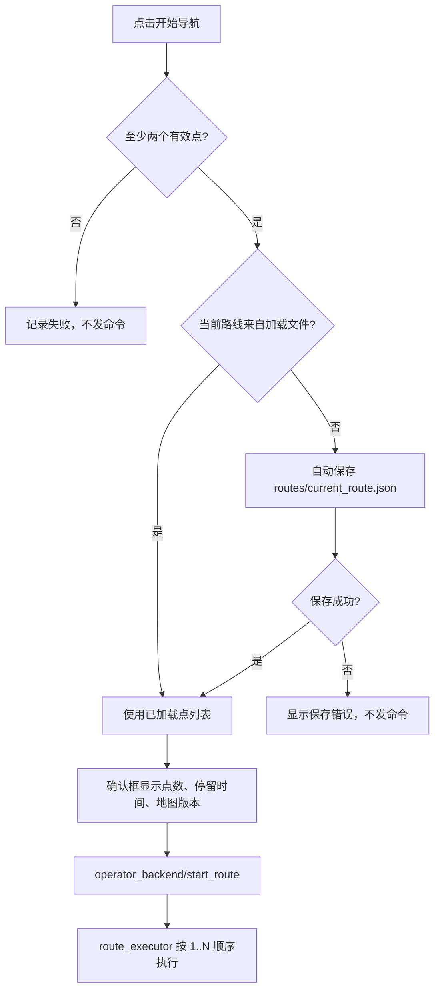
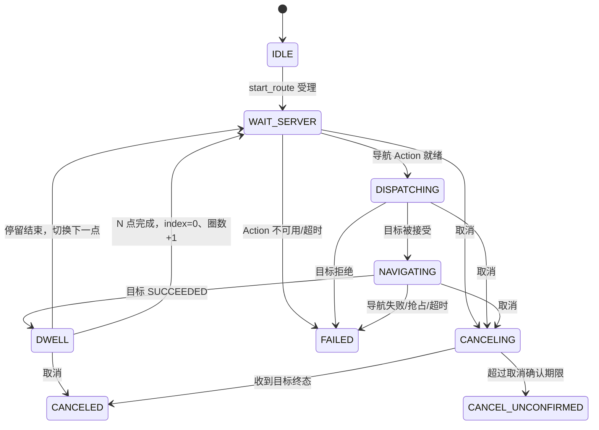
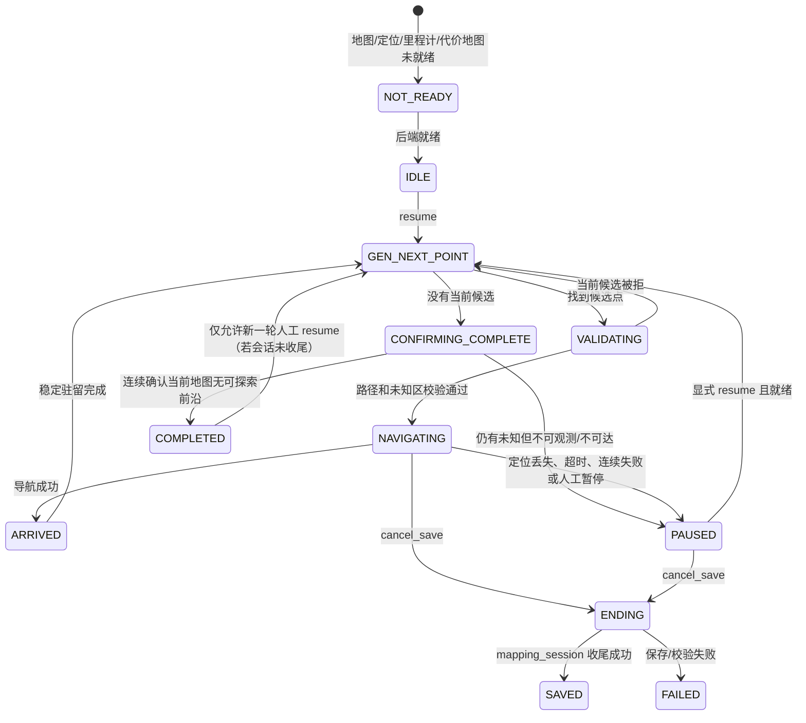
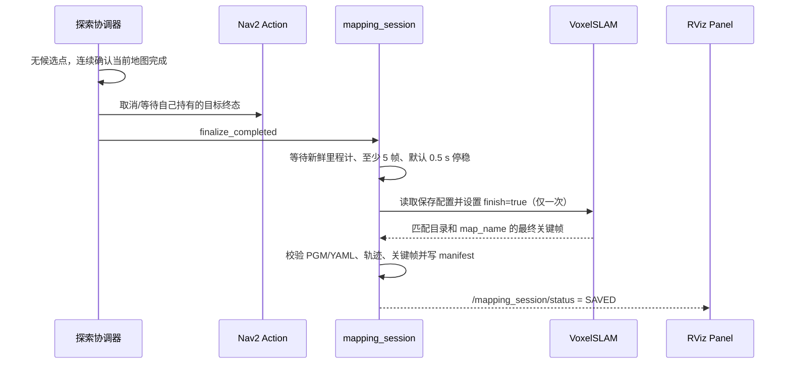

# 导航与路线、探索建图交互逻辑

版本：2026-09-20  
适用界面：`astribot_operator_station` 的 `WorkstationPanel`（RViz 自定义 Panel）  
适用后端：`astribot_operator_backend`、`astribot_route_executor`、`astribot_s1_exploration`、`mapping_runtime`、`mapping_session`

本文描述当前代码中的实际交互契约。界面只保存草稿、发起受控命令和展示事实；导航目标、探索目标、地图保存和控制权均由机器人端后端持有。

## 1. 公共交互约束

两条业务链共用以下前置条件：

1. Panel 收到新鲜的 `/operator_backend/status`，且后端只有一个有效发布者。
2. 后端 `boot_id` 与 Panel 当前快照一致；发生重启时清空租约和待确认命令。
3. 操作者先点击“申请控制权”。租约失效、状态过期或后端进入 `STOP_UNCONFIRMED` 时，所有运动类按钮关闭。
4. 命令使用 `command_id` 幂等。服务响应超时显示“结果未知”，先查询原命令，不能生成新 ID 盲目重试。
5. “已受理”“动作终态”“物理停稳”分别展示，取消 ACK 不等于已经停稳。

后端状态中最重要的事实域如下：

| 域 | 主要字段 | 用途 |
| --- | --- | --- |
| 控制 | `control_state`、`control_owner`、`control_session` | 判断是否允许提交命令 |
| 导航 | `navigation`、`nav_outstanding`、`nav_operation_id` | 单点导航和取消归属 |
| 路线 | `route`、`route_id`、`index`、`completed_cycles` | 循环路线进度与取消归属 |
| 探索 | `exploration` | 当前探索状态、版本、候选判定和结束原因 |
| 建图 | `mapping`、`mapping_runtime` | 收尾、保存、重试和会话生命周期 |
| 地图 | `map_catalog`、`active_map` | 地图版本门控，避免旧路线作用于新地图 |

面板只能在 `quality=VALID` 且状态未超过约 3 秒时开放相关操作。地图版本变化或建图会话变化时，路线草稿自动清空，必须重新选点。

探索状态还包含 `session_started`：只有显式恢复/暂停、拥有会话以暂停启动，或真正进入目标生成后才置为 true。未建立会话时，暂停、恢复和“取消并保存”均保持关闭，避免对空闲节点误触发建图收尾。

当 `mapping_runtime` 状态可见时，后端还要求其为 `RUNNING` 才允许取消保存；RViz 同步关闭按钮。这样静态地图或建图运行时处于 `IDLE/FAILED` 时，不会把一个空闲探索协调器误当作可保存的 SLAM 会话。

## 2. 导航与路线页

### 2.1 页面元素与职责

“导航与路线”页包含：

- 坐标系输入，默认 `map`；有点后锁定，防止改变坐标系而继续使用旧点。
- 到点停留时间，应用于循环路线每个点。
- 路线点表格 `X / Y / Yaw`，最多 200 个点。
- “地图连续选点”工具：按下、拖动确定朝向、松开产生一个草稿点，只发布 `/operator/route_point` 和 `/operator/route_preview`，不发导航任务。
- **开始导航**：统一入口，启动当前路线循环执行。
- “保存路线”“加载路线”：JSON 文件操作。
- “导航到选中点”：一次性单点 operator 导航。
- 后端仍保留 `start_route` 服务供外部客户端兼容调用；默认 RViz 页面只提供“开始导航”一个循环启动按钮，避免绕过自动保存规则。
- “取消本后端导航”“取消本后端循环路线”：只取消本 Panel/后端拥有的目标或路线。

### 2.2 草稿、保存和加载

路线文件格式为：

```json
{
  "version": 1,
  "frame": "map",
  "dwell_sec": 0.5,
  "points_xy_yaw_rad": [[0.5, 0.0, 0.0], [1.0, 0.0, 1.57]]
}
```

- 默认目录为当前启动工作目录下的相对目录 `routes/`。
- 手工保存的默认文件名为 `routes/route.json`；未输入 `.json` 时自动补后缀。
- 如果保存对话框选择的是已有目录，则写入该目录下的 `route.json`。
- 加载对话框始终从 `routes/` 打开；目录不存在时先创建。
- 程序内部使用绝对路径，日志展示相对路径，便于把整个工作目录迁移到另一台机器。
- 保存采用 `QSaveFile` 原子提交，目录创建、打开、写入和提交失败均在日志中显示具体原因。
- 加载后，表格、坐标系和停留时间一次性恢复；加载的路线标记为 `route_loaded=true`。
- 任意新增、删除、排序或编辑点都会使加载标记失效，防止把旧文件误当作当前草稿。

### 2.3 “开始导航”分支

点击“开始导航”后，Panel 先检查至少两个有效点、当前地图版本、租约和后端能力 `loop_route`。



具体规则：

1. 当前路线是加载路线：不覆盖原文件，直接以表格内容启动。
2. 当前路线是草稿：先写入 `routes/current_route.json`，写入成功后再提交启动命令。
3. 自动保存失败时不发导航命令，避免界面显示已开始而没有可恢复文件。
4. 通过 `operator_backend` 提交时，后端再次校验租约、地图版本和 `loop_route` 能力。
5. Panel 关闭或失联不会把路线事实删除；路线执行器在机器人端独立运行。租约到期会请求停止所属任务，但没有收到终态前不会允许新路线。

### 2.4 路线执行状态

`astribot_route_executor` 是路线唯一所有者，只向导航 Action 发送一个目标，前一个目标成功后才发送下一个。



运行期间表格、坐标系和路线编辑按钮关闭。失败停止整条路线，不跳过失败点、不自动抢回被 operator 抢占的目标。状态中的 `index` 从 0 开始，`completed_cycles` 只有完整通过 N 个点并完成最后一次停留后才增加。

### 2.5 取消和异常

| 场景 | Panel 行为 | 后端行为 |
| --- | --- | --- |
| 点击取消路线 | 显示“取消请求中” | 只取消当前 `route_id` 的目标 |
| 取消 ACK 已返回 | 仍等待路线状态 | 等待 Action 终态后发布 `CANCELED` |
| 取消超时 | 显示“取消未确认”，禁用新路线 | 保留所有权，禁止第二条路线 |
| 后端重启 | 清空租约和旧请求 | 新 `boot_id` 下拒绝旧请求 |
| 地图版本变化 | 清空草稿并要求重新选点 | 拒绝旧 `map_version` |
| Nav2 失败 | 显示失败原因和最后点 | 路线进入 `FAILED`，不跳点 |

单点导航与循环路线互斥。单点导航走 `operator` 优先级；循环路线走 `route` 优先级。实际优先级和抢占结果以 `/navigation/execution_status`、后端状态和路线状态为准。

## 3. 探索建图页

### 3.1 角色分工

| 组件 | 责任 |
| --- | --- |
| `mapping_runtime` | 启动/管理一个拥有的 SLAM + 探索进程组，防止重复启动 |
| `exploration_coordinator_node` | 前沿搜索、候选路径校验、单点导航、完成判断和探索命令 |
| `mapping_session` | 停稳证据、SLAM `finish`、文件校验、manifest 原子提交 |
| `operator_backend` | 控制租约、命令幂等、地图/探索状态门控 |
| WorkstationPanel | 展示状态并提交开始/暂停/恢复/取消保存/重试 |

探索协调器不发布速度，只提交 `NavigateToPose`；地图保存节点也不发布速度，只观察 `/odom` 的停稳证据。

### 3.2 会话启动

“开始新建图会话”只能在以下条件同时满足时开放：

- 机器人有新鲜里程计，已连续停稳；
- 没有正在执行的单点导航、循环路线或探索目标；
- 当前地图事务未锁定；
- `mapping_runtime.can_start=true`，配置 profile 和保存根目录有效；
- 没有外部 `/voxelslam`、探索协调器或旧 `mapping_session` 实例。

提交后 `mapping_runtime` 创建唯一会话目录并启动拥有的进程组，初始为 `STARTING`/暂停等待态。只有观察到地图、探索和定位状态新鲜后，Panel 才允许“恢复探索”。

如果用户只启动了 RViz，面板没有发现唯一的 `/operator_backend/status` 发布者时，按钮切换为“启动默认仿真并开始建图”。确认后由面板启动默认 `sim/small_warehouse` 全链路（Gazebo、传感器、Nav2、operator backend），并以 `launch_slam:=false` 留出 SLAM 所有权给 `mapping_runtime`；复用当前 `ROS_DOMAIN_ID`，不启动第二个 RViz。后端出现后自动申请本地租约并提交同一个 `new_mapping_session` 命令。已有后端但状态过期、存在多个发布者或控制权属于其他客户端时，不执行自举。

### 3.3 探索控制状态



状态含义：

- `NOT_READY` / `EXPLORATION.NOT_READY`：资源不足，不能判定建图完成。
- `UNREACHABLE_FRONTIERS`：有前沿但当前包络下不可达，进入暂停，不算完成。
- `UNOBSERVABLE_UNKNOWN`：仍有无法观测的未知区，进入暂停，不算完成。
- `CONFIRMING_COMPLETE`：无候选点，正在做多次、持续时间确认。
- `CURRENT_MAP_COMPLETE`：当前地图范围完成，不代表其他楼层或未加载区域完成。
- `EXPLORATION.PAUSED`：人工暂停，目标发布冻结。
- `EXPLORATION.RETRY_WAIT`：自动恢复冷却或失败预算等待。
- `EXPLORATION.ENDING`：已经进入建图收尾，禁止 resume。

“没有目标点”只触发完成判定流程，不由 Panel 直接宣布建图结束。协调器必须结合地图已知量、未知量、候选可达性和连续确认参数决定 `COMPLETED` 或 `PAUSED`。

### 3.4 探索按钮逻辑

| 按钮 | 前置条件 | 成功后的下一步 |
| --- | --- | --- |
| 开始新建图会话 | `mapping_runtime.can_start`、停稳、无运动任务 | 启动新 SLAM 会话；等待资源就绪 |
| 恢复当前探索 | `can_resume=true`、无在途目标、地图保存状态 `IDLE` | 清除失败预算，重新生成候选 |
| 暂停探索 | `can_pause=true` | 取消探索自己持有的目标，等待 Action 终态，保持 SLAM 会话 |
| 取消探索并保存地图 | `can_cancel_save=true`、保存域新鲜 | 冻结目标、取消目标、等待终态后开始收尾 |
| 重试地图保存 | `mapping.state=FAILED` | 只重试文件/收尾检查，不重发已经发送的 SLAM `finish` |

暂停不保存地图，也不结束 SLAM；取消保存和自动完成都会结束当前 SLAM 会话，新的探索必须使用新会话。

### 3.5 自动完成与存图顺序



取消保存使用同一流程，但 manifest 中 `exploration_outcome=CANCELED_PARTIAL`。以下任一情况都不显示 `SAVED`：SLAM 未启用保存、里程计过期或仍运动、最终关键帧目录不匹配、地图文件缺失/损坏、manifest 提交失败。

### 3.6 建图失败与恢复

| 状态/原因 | 允许操作 | 禁止操作 |
| --- | --- | --- |
| `WAIT_STOP` / `READ_CONFIG` / `WAIT_FINISH` / `FINALIZING` | 等待状态或关闭界面 | resume、重复 finish |
| `FAILED` | 检查目录和日志后点击“重试地图保存” | 重新启动同一 SLAM 会话、把失败显示为完成 |
| `SAVED` | 导出/加载地图，开启新会话 | resume 旧 SLAM 会话 |
| `cancel_pending` | 等待导航终态 | 新探索、新路线 |
| 后端/SLAM 进程退出 | 保留目录和日志，人工检查 | 用“进程空闲”推断已经停稳或保存成功 |

## 4. 两条链的互斥与优先级

| 当前状态 | 单点导航 | 循环路线 | 探索恢复 | 新建图会话 | 地图切换 |
| --- | --- | --- | --- | --- | --- |
| OBSERVER/无租约 | 禁止 | 禁止 | 禁止 | 禁止 | 禁止 |
| 单点导航运行 | 取消/抢占按后端策略 | 拒绝 | 拒绝 | 拒绝 | 拒绝 |
| 循环路线运行 | 按 operator 优先级抢占 | 拒绝第二条 | 拒绝 | 拒绝 | 拒绝 |
| 探索导航运行 | 按 operator 优先级接管 | 拒绝 | 当前目标终态后才能恢复 | 拒绝 | 拒绝 |
| 探索暂停 | 可在租约和地图版本满足时提交 | 可提交前需确认探索未持有运动任务 | 可恢复 | 拒绝 | 拒绝 |
| 建图收尾 | 禁止 | 禁止 | 禁止 | 拒绝 | 等 `SAVED` 或失败后人工处理 |
| 地图切换事务中 | 禁止 | 禁止 | 禁止 | 禁止 | 仅允许事务自身步骤 |

保留既有仲裁优先级：`operator > route > exploration`。优先级只决定任务抢占，不替代取消确认和物理停稳检查。

## 5. 操作员标准流程

### 5.1 多点路线

1. 申请控制权，确认地图版本和坐标系。
2. 进入“导航与路线”，连续选点或编辑点表。
3. 手工保存时选择 `routes/` 下文件；需要迁移时只复制该相对目录。
4. 直接使用当前草稿时点击“开始导航”，系统先保存 `routes/current_route.json`。
5. 确认点数、停留时间和地图版本，等待路线状态变为 `NAVIGATING`。
6. 观察当前点和圈数；取消时使用“取消本后端循环路线”，等待 `CANCELED` 或处理 `CANCEL_UNCONFIRMED`。

### 5.2 探索建图

1. 确认机器人停稳、地图/定位/里程计/代价地图均为新鲜状态。
2. 点击“开始新建图会话”，等待 `mapping_runtime=RUNNING` 且探索状态可恢复。
3. 点击“恢复当前探索”，观察候选、校验、导航和驻留进度。
4. 暂停只冻结目标，不结束 SLAM；需要结束时点击“取消探索并保存地图”。
5. 等待 `WAIT_STOP → READ_CONFIG → WAIT_FINISH → FINALIZING → SAVED`，以 `/mapping_session/status` 为准。
6. `FAILED` 时先保留现场和日志，确认目录后点击“重试地图保存”；`SAVED` 后使用新会话继续探索。

## 6. 当前仿真验收边界

已验证的界面/接口侧行为：

- 路线 JSON 相对目录、自动补 `.json`、目录创建和原子写入逻辑已编译。
- “开始导航”已接入 `start_route`，未加载草稿会自动生成 `routes/current_route.json`。
- 路线执行器接受双点列表并返回“按顺序循环直到取消”的路线 ID。
- Gazebo 时钟、物理统计、Nav2 lifecycle 服务和六路相机话题可见。

当前这次仿真中，路线服务受理后导航动作立即失败，原因是启动时 `local_costmap` 仍为 `unconfigured`；这会阻断真实移动验收，但不影响路线文件和路线服务的受理逻辑。修复 Nav2 local costmap 生命周期后，应重新执行“自动保存草稿 → 开始导航 → 观察点 1/点 2 → 取消 → 终态”的完整链路。

## 7. 相关实现入口

- [WorkstationPanel](/home/yjh/WorkSpace/astribot_sdk_ros2/ws_robot/src/astribot_operator_station/src/workstation_panel.cpp)
- [WorkstationPanel 头文件](/home/yjh/WorkSpace/astribot_sdk_ros2/ws_robot/src/astribot_operator_station/include/astribot_operator_station/workstation_panel.hpp)
- [路线执行器](/home/yjh/WorkSpace/astribot_sdk_ros2/ws_robot/src/astribot_route_executor/src/loop_route_executor.cpp)
- [Operator 后端](/home/yjh/WorkSpace/astribot_sdk_ros2/ws_robot/src/astribot_operator_backend/src/operator_backend.cpp)
- [探索协调器](/home/yjh/WorkSpace/astribot_sdk_ros2/ws_robot/src/astribot_s1_exploration/src/exploration_coordinator_node.cpp)
- [建图会话收尾](/home/yjh/WorkSpace/astribot_sdk_ros2/ws_robot/src/astribot_s1_exploration/src/mapping_session_node.cpp)
- [探索与 SLAM 收尾说明](EXPLORATION_SLAM_FINALIZATION_20260919.md)
- [多点循环导航说明](RVIZ_LOOP_ROUTE_DESIGN_20260919.md)
