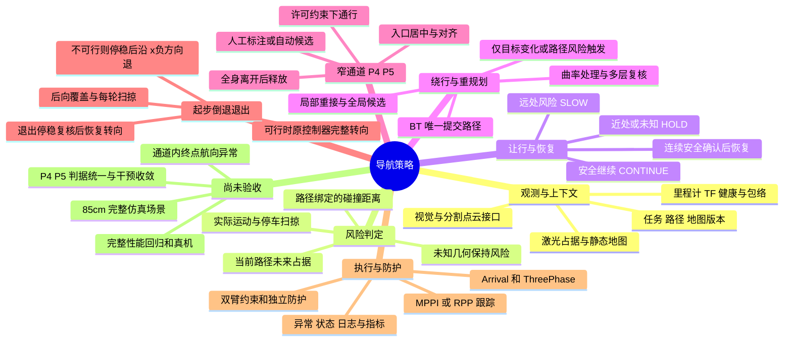
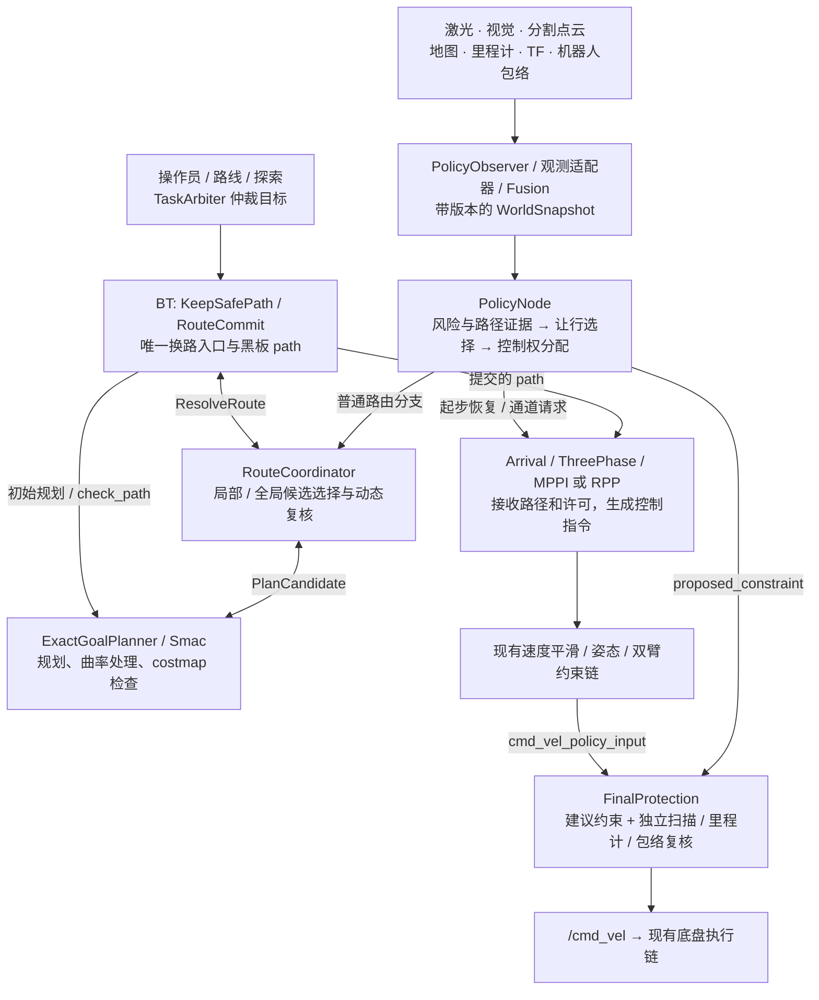
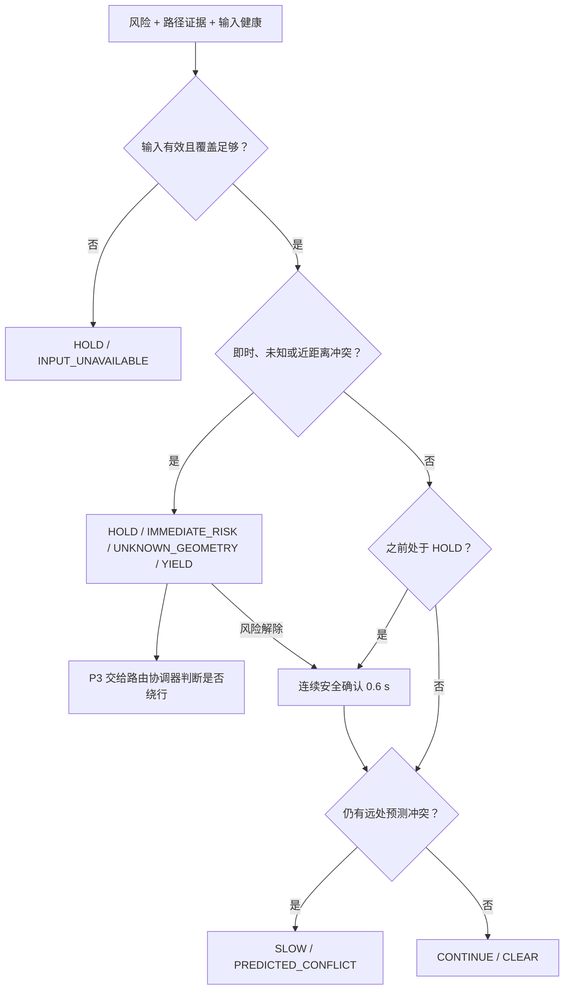
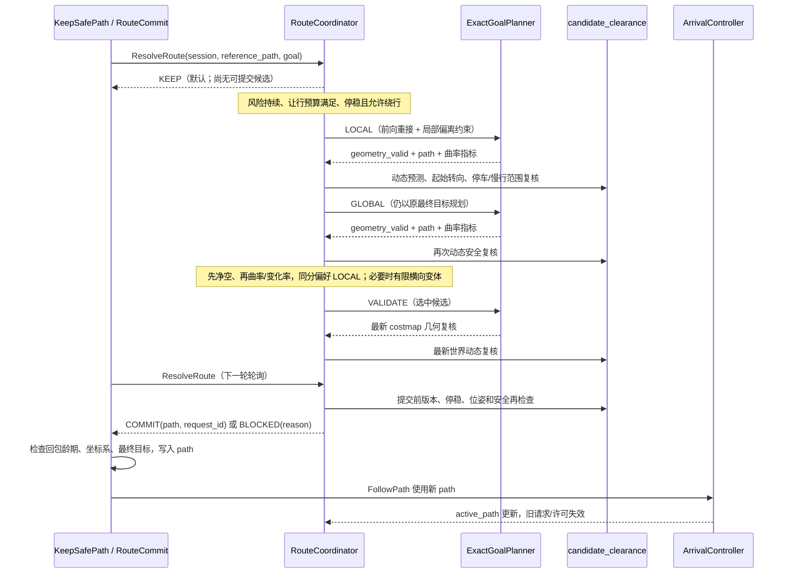
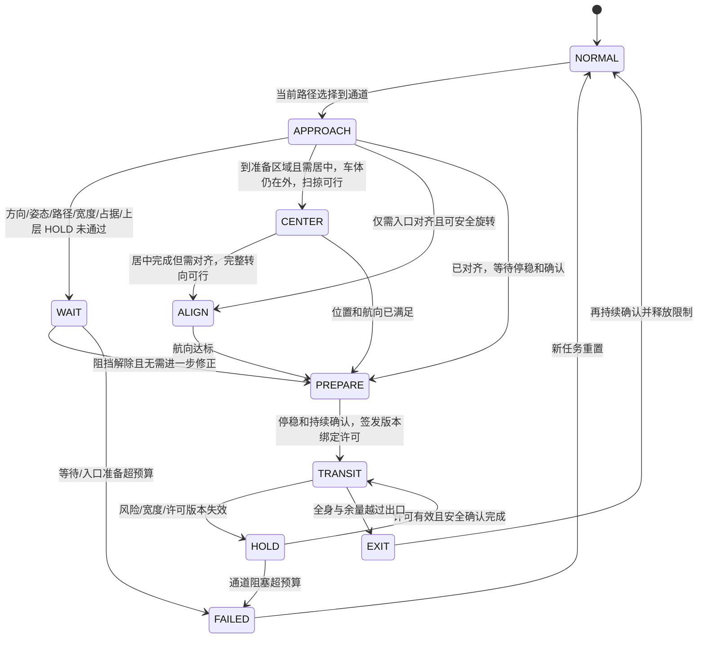
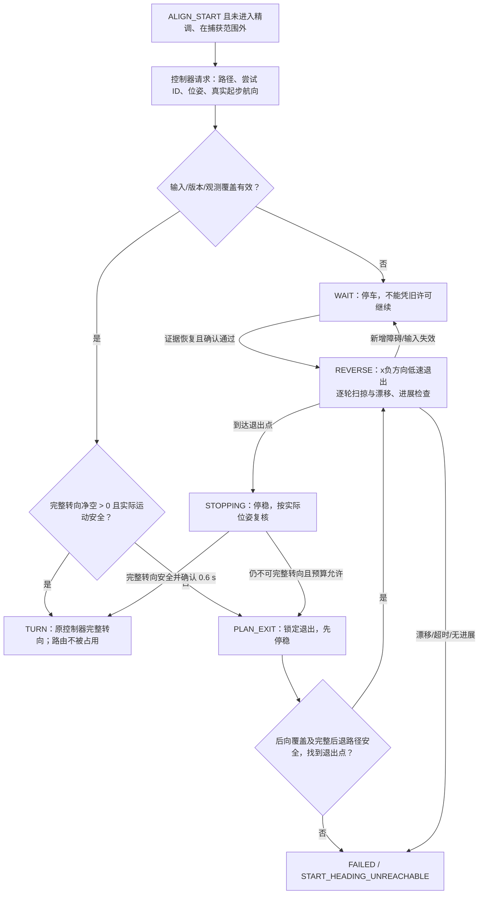

# 窄通道、绕行、让行与重规划：逻辑数据流和代码导读

**版本：2026-09-15 当前磁盘源码快照。** 阅读顺序：思维导图 → 总数据流 → 决策和重规划 → 窄通道与倒退退出 → 接口、参数和边界。本文只整理实现，不修改控制逻辑，不启动自动跑机。

> **实现、启用、验收是三件不同的事。** P4/P5 代码已经存在，但窄通道重建计划仍停留在 B 的完整质量/实时性回归，C/D/E 未放行。85 cm 通道、1.0/1.1 m 外部对齐阈值以及通道内终点禁止旋转，不能按已完成能力理解。代码摘录来自本次快照，包含上下文说明；摘录不是可以直接替换完整函数的补丁。运行中的进程可能仍加载较早构建，本文不证明运行二进制与磁盘一致。

## 1. 思维导图



### 阶段与模块开关

| 启动阶段 | 实际启用内容 | 不应误解为 |
|---|---|---|
| `off` | 原跟踪器、事件触发的路径检查/规划；公共任务仲裁仍存在 | 完全没有路径安全检查 |
| `p2` | 融合风险、让行/减速、独立末级防护 | 已具备动态候选绕行 |
| `p3` | P2 + `RouteCoordinator` + `StartManeuverAdapter` | 已启用窄通道许可状态机 |
| `p4` | P3 + 人工通道文件 + `CorridorPolicy` | 已实现新的 85 cm 通道设计 |
| `p5` | P4 准入逻辑 + 沿已有路径的地图直通道候选检测 | 自动检测可以直接授权通行、支持任意弯曲窄通道 |

开关依据：[policy_node.py:41](/home/yjh/WorkSpace/astribot_sdk_ros2/ws_robot/src/astribot_s1_navigation_policy/astribot_s1_navigation_policy/policy_node.py:41)。P4 必须提供通道文件；P5 可自动检测，但仍受 P4 实时准入约束。

## 2. 总体逻辑数据流



上图显示主链，回传接口在图外列明，以免控制与证据连线混淆：`Arrival → Observer` 回传 `active_path`；`ExactGoalPlanner → PolicyNode` 回传 `PathRisk`；`TaskArbiter → ExecutionContext` 回传执行状态；`FinalProtection → Arrival` 回传最终 `constraint`；`Arrival → StartManeuverAdapter` 发送起步请求，策略再返回许可。

图中数据与控制权分离：融合产出世界状态；策略产出约束或动作请求；候选服务产出几何结果；**BT 才能换路径，控制器才生成跟踪速度，启用策略时 FinalProtection 是最终 `/cmd_vel` 发布者**。`/plan` 与 `active_path` 也不能混同：策略以控制器已经接收的 `/path_tracking/active_path` 绑定证据，候选尚未提交时不能冒充活动路径。

### 2.1 任务入口：为什么 RViz 新目标会打断自动跑机

`TaskArbiter` 将三个来源合并到 `/navigation_executor/navigate_to_pose` 或 `navigate_through_poses`：

| 来源 | 外部 Action 前缀 | 优先级 |
|---|---|---:|
| 操作员 / RViz | `/navigate_to_pose`、`/navigate_through_poses` | 100 |
| 路线验证 | `/route/…` | 50 |
| 自主探索 | `/exploration/…` | 10 |

低优先级不能抢占活动任务；已接受的新任务会先取消旧任务再交接。新任务带来新的 `task_id` 和执行会话，因此旧候选、旧许可需要失效。它与“遇到障碍自动重规划”是不同事件。

源码：[task_arbiter_node.py:45](/home/yjh/WorkSpace/astribot_sdk_ros2/ws_robot/src/astribot_s1_navigation_policy/astribot_s1_navigation_policy/task_arbiter_node.py:45)，第 45–61 行（连续摘录）。

```python
        for kind, name in ((NavigateToPose, 'navigate_to_pose'), (NavigateThroughPoses, 'navigate_through_poses')):
            client = ActionClient(self, kind, '/navigation_executor/' + name, callback_group=self.group)
            for source, priority, front in (('operator',100,'/'+name),
                    ('route',50,'/route/'+name),('exploration',10,'/exploration/'+name)):
                self.servers.append(ActionServer(self, kind, front,
                    execute_callback=self.execute,
                    goal_callback=lambda request,p=priority: self.admit(p),
                    handle_accepted_callback=lambda h,c=client,k=kind,s=source,p=priority:self.accept(h,c,k,s,p),
                    cancel_callback=self.cancel, callback_group=self.group))

    def admit(self, priority):
        with self.lock:
            if (self.reserved or self.pending is not None or
                    (self.active is not None and priority < self.active.priority)):
                return GoalResponse.REJECT
            self.reserved = True
            return GoalResponse.ACCEPT
```

### 2.2 从传感器到世界快照

1. 扫描通过**采集时刻 TF** 转换，形成固定分辨率占据；只有新的自由空间证据才清除已有占据。扫描簇形状变化不直接当作物体运动。
2. 视觉和分割点云通过 `normalize()` 形成 `Observation`。米制框提供几何/协方差；有可靠 `track_id` 或显式速度证据时才能形成有意义的运动预测。
3. `ConservativeFusion` 关联观测、保留 provenance，避免相关来源被重复当作独立证据；输出含预测框、未关联观测和传感器健康的 `WorldSnapshot`。
4. 规划在 `map`，策略跟踪坐标系当前为 `odom`，速度/包络在机器人基坐标语义下检查。地图、路径和观测在适配层转换，不能跨坐标系直接比较 XY。
5. `Version` 绑定任务、路径、地图、定位、包络和时钟 epoch。改变地图或定位只会使旧证明失效，不等同于立即产生新规划请求。

对应入口：[observer_node.py:45](/home/yjh/WorkSpace/astribot_sdk_ros2/ws_robot/src/astribot_s1_navigation_policy/astribot_s1_navigation_policy/observer_node.py:45)、[observation_adapters.py:1](/home/yjh/WorkSpace/astribot_sdk_ros2/ws_robot/src/astribot_s1_navigation_policy/astribot_s1_navigation_policy/observation_adapters.py:1)、[fusion.py:122](/home/yjh/WorkSpace/astribot_sdk_ros2/ws_robot/src/astribot_s1_navigation_policy/astribot_s1_navigation_policy/fusion.py:122)、[contracts.py:282](/home/yjh/WorkSpace/astribot_sdk_ros2/ws_robot/src/astribot_s1_navigation_policy/astribot_s1_navigation_policy/contracts.py:282)。

## 3. 风险 → 让行 → 恢复

### 3.1 两种风险来源，三种运动决策

| 输入 | 含义 | 主要使用者 |
|---|---|---|
| `Risk.immediate` | 当前车体或**实测速度**在停车预测时域内冲突 | 立即 HOLD；完整转向/恢复也不能忽略 |
| `Risk.blocked` / `conflict_time_s` | 沿当前路径的未来预测占据 | 按冲突距离/时间决定慢行还是让行 |
| `Risk.uncertain` | 未关联或无可靠几何的风险仍存在 | HOLD，不凭空生成安全绕行 |
| `PathRisk` | 全局 costmap 足迹检查给出的已绑定路径、已评估起点和首个冲突段距离 | `assess_path()` 扣除消息龄期运动预算和安全余量，再合并风险 |

远处路径占据不是无条件立即停车。当前停止判据为：

`停止时间阈值 = reaction_time_s + max_speed_m_s / brake_deceleration_m_s2 + 0.5 s`

按现有仿真参数为 **2.2 s**；即时风险、未知风险直接停止。`assess_path()` 先把碰撞距离折算成更保守的冲突时间；过期/不匹配证据使用保守后备，不能据此放行。

源码：[behavior.py:13](/home/yjh/WorkSpace/astribot_sdk_ros2/ws_robot/src/astribot_s1_navigation_policy/astribot_s1_navigation_policy/behavior.py:13)，第 13–16 行（连续摘录）。

```python
def requires_stop(risk, profile):
    stop_time=profile.reaction_time_s+profile.max_speed_m_s/profile.brake_deceleration_m_s2
    return (risk.immediate or risk.uncertain or
            (risk.blocked and not risk.conflict_time_s>stop_time+.5))
```



如果全局路径检查 CLEAR、只是高速度预测有风险，`PolicyNode` 会再按 `narrow_speed_m_s` 预测；低速可安全继续时标记 `ORIGINAL_PATH_SLOW_SAFE`，保留原路径。`blocked_at` 计停车让行时间，慢行时清空；`clear_hold_s` 防止障碍短时抖动造成反复启停。

源码：[policy_node.py:135](/home/yjh/WorkSpace/astribot_sdk_ros2/ws_robot/src/astribot_s1_navigation_policy/astribot_s1_navigation_policy/policy_node.py:135)，第 135–145 行（连续摘录）。

```python
        slow_original=False
        if (valid and path_risk.status=='CLEAR' and risk is not None and
            risk.blocked and not risk.immediate and not risk.uncertain):
            slow_risk=evaluate_risk(self.last_world,robot,self.path,self.profile,
                                    speed_limit=self.profile.narrow_speed_m_s)
            if not requires_stop(slow_risk,self.profile):
                risk=slow_risk;slow_original=True
        selection=self.selector.select(risk,valid,seconds)
        if slow_original and selection.motion!='HOLD':
            selection=replace(selection,motion='SLOW',speed=self.profile.narrow_speed_m_s,
                              reason='ORIGINAL_PATH_SLOW_SAFE')
```

### 3.2 最终决策的执行顺序

每轮先计算基本让行选择，再交起步恢复；只有起步恢复未占用时才进入通道适配；通道未占用才交路由协调器。最后统一发布约束，末级保护还能再次拒绝。

源码：[policy_node.py:147](/home/yjh/WorkSpace/astribot_sdk_ros2/ws_robot/src/astribot_s1_navigation_policy/astribot_s1_navigation_policy/policy_node.py:147)，第 147–160 行（连续摘录）。

```python
        start_active=False
        if self.start_maneuver:
            selection,start_active=self.start_maneuver.advance(selection,valid)
        passage=self.corridor.advance(selection,valid,time.monotonic()) if self.corridor and not start_active else None
        if passage is not None and passage.state!='NORMAL':
            selection=passage.selection
            # A constrained passage owns waiting; no candidate may turn inside it.
            self.coordinator.cancel()
            if passage.failure:self.coordinator.failure=passage.failure
        elif start_active:
            self.coordinator.cancel()
            self.coordinator.blocked_since=None
        elif self.coordinator is not None:
            selection=self.coordinator.advance(selection,risk,valid)
```

这里的“占用”是模块控制权：P4/P5 通道激活后会取消普通候选评估；起步 WAIT/REVERSE 也会取消候选。**起步 TURN 许可必须释放路由控制权**，否则退出后原路径仍被判占据时可能无法进入重规划。

## 4. 绕行与事件触发重规划

### 4.1 没有全局定时重规划，不代表没有周期检查

BT 使用 `KeepSafePath` 与 `ComputePathToPose` 的 ReactiveFallback。当前路径可保留时一直返回 SUCCESS，后者不会执行；新目标/新会话或缺少路径才进入规划。`KeepSafePath` 的 **200 ms 是碰撞检查间隔**，`RouteCommit` 的 **100 ms 是路由结果轮询间隔**，都不是定时生成全局路径。

源码：[navigate_to_pose_precise_goal.xml:1](/home/yjh/WorkSpace/astribot_sdk_ros2/ws_robot/src/astribot_s1_navigation/behavior_trees/navigate_to_pose_precise_goal.xml:1)，第 1–13 行（连续摘录）。

```xml
<root main_tree_to_execute="MainTree">
  <BehaviorTree ID="MainTree">
    <PolicyExecution session="{policy_session}" goal="{goal}">
    <ReactiveSequence>
      <ReactiveFallback>
        <KeepSafePath session="{policy_session}" path="{path}" goal="{goal}"/>
        <ComputePathToPose goal="{goal}" path="{path}" planner_id="GridBased"/>
      </ReactiveFallback>
      <FollowPath path="{path}" controller_id="FollowPath" goal_checker_id="precise_goal_checker"/>
    </ReactiveSequence>
    </PolicyExecution>
  </BehaviorTree>
</root>
```

- `off`：确认碰撞后，`KeepSafePath` 返回 FAILURE，触发规划；有重复碰撞规划次数限制。
- `p2`：发布路径阻挡，交由让行策略处理，不拥有动态候选绕行。
- `p3/p4/p5`：碰撞证据上送策略；路由协调器申请候选，BT 经 `RouteCommit` 提交。通道或起步恢复占用期间另有控制权规则。
- 多目标 Action 的 `allow_detour = goals.size()==1`：**当前候选绕行只对单目标开放**，不能把单点导航的绕行效果直接扩展为多航点连续 Action 的保证。

对应代码：[path_guard_bt.cpp:1](/home/yjh/WorkSpace/astribot_sdk_ros2/ws_robot/src/astribot_s1_path_tracking/src/path_guard_bt.cpp:1)、[route_commit.hpp:1](/home/yjh/WorkSpace/astribot_sdk_ros2/ws_robot/src/astribot_s1_path_tracking/include/astribot_s1_path_tracking/route_commit.hpp:1)。

### 4.2 什么条件才发起候选请求

必须同时满足：存在当前执行上下文且路径身份匹配；输入有效；确有阻挡且不是未知几何；已进入停车窗口；阻挡持续达到 1.5 s；若是移动障碍，路由协调器按墙钟先等待至少 8 s；单目标允许绕行；距终点大于 0.6 m；车速不超过 0.02 m/s 且角速度不超过 0.03 rad/s；候选服务可用；版本和请求预算有效。

同一 episode 不无休止重试。除新 episode 外，只有几何变化持续确认才重试，不能仅凭 track ID 换号重复规划。`ObstructionRetry` 使用 0.12 m 等价容差、距上次尝试至少 1 s、变化稳定至少 0.5 s。30 s episode 和每目标最多 5 次请求仍约束整体过程。

源码：[route_coordinator.py:246](/home/yjh/WorkSpace/astribot_sdk_ros2/ws_robot/src/astribot_s1_navigation_policy/astribot_s1_navigation_policy/route_coordinator.py:246)，第 246–259 行（连续摘录）。

```python
        if (self.request is None and self.allow_detour and obstructed and not risk.uncertain and self.blocked_since is not None and
            now-self.blocked_since>=self.profile.blocked_confirm_s and
            (self.attempted_episode!=selection.episode or self.retry.changed(n.last_world,now)) and
            (not risk.moving or now-self.blocked_since>=self.profile.wait_budget_s)):
            # Never replace the terminal refinement goal with a detour target.
            if n.path and math.dist(n.path[-1],(n.last_robot.x,n.last_robot.y))>self.takeover['terminal_exclusion_m'] and self.client.service_is_ready():
                self.holding=True
                if math.hypot(n.last_robot.vx,n.last_robot.vy)<=self.takeover['linear_speed_m_s'] and abs(n.last_robot.wz)<=self.takeover['angular_speed_rad_s']:
                    try:
                        self.request=self.session.request(self.version,Trigger.PATH_RISK,
                            frozenset((Planning.LOCAL,Planning.GLOBAL)),n.last_world.observation_seq,self.steady())
                        self.attempted_episode=selection.episode;self.retry.attempted(n.last_world,now)
                        self.send(PlanCandidate.Request.LOCAL)
                    except PlanningBudgetExhausted as error:self.failure=str(error)
```

### 4.3 局部与全局候选如何联合选择



LOCAL 的本质是：从实测当前位置规划到原路径前方约 3 m 的重接点，再拼回原路径尾部；局部最大偏离为 1.2 m。它仍调用现有 Smac 规划能力，**不是新增了一个直接输出速度的局部避障控制器**。

GLOBAL 从当前位置规划到同一个最终目标。即使 LOCAL 几何成功，也仍评估 GLOBAL。选择键为：净空（截断到 1 m）越大越好 → 曲率越小越好 → 曲率变化率越小越好 → 同分优先 LOCAL。

源码：[route_coordinator.py:237](/home/yjh/WorkSpace/astribot_sdk_ros2/ws_robot/src/astribot_s1_navigation_policy/astribot_s1_navigation_policy/route_coordinator.py:237)，第 237–245 行（连续摘录）。

```python
                if self.mode==PlanCandidate.Request.LOCAL:self.send(PlanCandidate.Request.GLOBAL)
                elif self.mode==PlanCandidate.Request.GLOBAL:
                    if self.options:
                        # Hard safety precedes quality; local stability wins ties.
                        self.chosen=min(self.options,key=lambda o:(-min(o[2],1.),o[1].curvature,
                            o[1].curvature_rate,o[0]!=PlanCandidate.Request.LOCAL))
                        self.send(PlanCandidate.Request.VALIDATE,self.chosen[1].path)
                    else:self.next_variant()
                elif self.ready is None:self.next_variant()
```

`geometry_valid=true` 只表示候选服务这一层通过。它还必须经过动态安全、版本、停稳和最终提交检查。路由缓存只有短时效；取消时清空缓存，防止旧 COMMIT 继续有效。

### 4.4 重规划路径曲率突变的处理

`pathQuality()` 按约 0.1 m 重采样，计算路径转角与弧长比值的最大曲率，以及相邻曲率差除以距离的变化率；行进段指标省略端部若干采样点，到点方向由 Arrival 处理。默认阈值为 **3 m⁻¹ / 12 m⁻²**。

普通规划先保留满足质量要求的路径；超过阈值时有限平滑，最多 200 次、相对参考点最大位移 0.20 m，恢复路径密度并复查碰撞。无法安全平滑但原路径足迹无碰撞时可保留原路径，由控制器的局部路径质量限速减速通过；连原路径也不安全则失败。**P3 候选提交比这个后备分支严格：质量仍超限会被 `CANDIDATE_CURVATURE` 拒绝。**

源码：[exact_goal_planner.cpp:88](/home/yjh/WorkSpace/astribot_sdk_ros2/ws_robot/src/astribot_s1_path_tracking/src/exact_goal_planner.cpp:88)，第 88–109 行（连续摘录）。

```cpp
    auto before=pathQuality(path);
    if (acceptableQuality(before,max_k_,max_rate_)) {emit("accepted",before,before);return path;}
    auto reference=resamplePath(path);auto candidate=reference;
    for (int iteration=1;iteration<=200;++iteration) {
      smoothPathStep(candidate,reference,displacement_);
      if (iteration%10) {continue;}
      auto after=pathQuality(candidate);
      if (!acceptableQuality(after,max_k_,max_rate_)) {continue;}
      auto output=restorePathDensity(candidate,path);
      after=pathQuality(output);
      if (!acceptableQuality(after,max_k_,max_rate_)) {continue;}
      for (size_t i=0;i+1<output.poses.size();++i) {
        auto & a=output.poses[i].pose; const auto & b=output.poses[i+1].pose;
        double yaw=std::atan2(b.position.y-a.position.y,b.position.x-a.position.x);
        a.orientation.x=a.orientation.y=0; a.orientation.z=std::sin(yaw/2);a.orientation.w=std::cos(yaw/2);
      }
      output.poses.front()=path.poses.front();output.poses.back()=path.poses.back();
      if (collisionIndex(output,0)==-2) {emit("smoothed",before,after);return output;}
    }
    if (collisionIndex(path,0)==-2) {emit("speed_limited",before,before);return path;}
    emit("rejected",before,pathQuality(candidate));
    throw nav2_core::PlannerException("PATH_QUALITY_UNSAFE: cannot smooth curvature within collision-free corridor");
```

限速并非由 `PATH_QUALITY` 日志直接驱动。`ArrivalController` 重新评估前方路径窗口，通过 `sharpPathSpeedLimit()` 约束输出；当前限速函数自身使用 3/12 阈值，若以后开放调参，需要同步核对它与规划器参数。

## 5. 窄通道：检测、准入、通行与释放

### 5.1 P4 人工标注与 P5 自动候选

人工通道由 entry、exit、物理宽度、允许姿态和边界/跟踪余量定义。P5 沿**已有路径**检查两侧占据栅格，聚合航向近似一致的直线段，生成同一种 `Corridor`；不直接生成替代路径。

自动候选当前最大宽度 1.8 m、最短长度 0.8 m。未知栅格不算自由空间，也不能当作已确认墙体。自动检测所得保守宽度、栅格边界余量，与尺量物理宽度不是完全相同的口径。来源：[corridor_detection.py:33](/home/yjh/WorkSpace/astribot_sdk_ros2/ws_robot/src/astribot_s1_navigation_policy/astribot_s1_navigation_policy/corridor_detection.py:33)、[corridor_adapter.py:1](/home/yjh/WorkSpace/astribot_sdk_ros2/ws_robot/src/astribot_s1_navigation_policy/astribot_s1_navigation_policy/corridor_adapter.py:1)。

### 5.2 当前宽度判定到底加了什么

当前旧 P4 使用：

`M = clearance_margin + payload_extra_margin + boundary_margin + tracking_margin`

`半侧向投影 = half_width × |cos(θ)| + half_length × |sin(θ)|`

`可容纳条件：|横向偏离| + 半侧向投影 + M < 通道宽度 / 2`

人工标注默认额外余量是 2.5 cm + 5 cm，另叠加基础 8 cm；以 0.62 m 方形机身、θ=0.05 rad、无载荷为例，零横向偏离也需要约 **0.960 m**。这解释了为什么**当前旧 P4 不能直接当作 0.85 m 新方案**。自动候选另用栅格分辨率作为 boundary margin，还需结合其宽度测量口径看待。

源码：[corridor.py:90](/home/yjh/WorkSpace/astribot_sdk_ros2/ws_robot/src/astribot_s1_navigation_policy/astribot_s1_navigation_policy/corridor.py:90)，第 90–92 行（连续摘录）。

```python
    def margin(self, c):
        return (self.profile.clearance_margin_m + self.profile.payload_extra_margin_m +
                c.boundary_margin_m + c.tracking_margin_m)
```

源码：[corridor.py:94](/home/yjh/WorkSpace/astribot_sdk_ros2/ws_robot/src/astribot_s1_navigation_policy/astribot_s1_navigation_policy/corridor.py:94)，第 94–96 行（连续摘录）。

```python
    def half_projection(self, theta):
        p = self.profile
        return p.half_width_m*abs(math.cos(theta)) + p.half_length_m*abs(math.sin(theta))
```

源码：[corridor.py:98](/home/yjh/WorkSpace/astribot_sdk_ros2/ws_robot/src/astribot_s1_navigation_policy/astribot_s1_navigation_policy/corridor.py:98)，第 98–115 行（连续摘录）。

```python
    def route_fits(self, c, path):
        """Check segments, including sparse paths which cross the whole strip."""
        seen = False
        lateral_bound = c.width_m/2 - self.margin(c) - self.half_projection(self.profile.narrow_heading_limit_rad)
        for a, b in zip(path, path[1:]):
            sa, la = c.coordinates(*a);sb, lb = c.coordinates(*b)
            if max(sa, sb) < 0 or min(sa, sb) > c.length:continue
            if max(sa, sb)-min(sa, sb) < 1e-8:
                if 0 <= sa <= c.length:return False
                continue
            lo = max(0., min((0-sa)/(sb-sa), (c.length-sa)/(sb-sa)))
            hi = min(1., max((0-sa)/(sb-sa), (c.length-sa)/(sb-sa)))
            if lo > hi:continue
            seen = True
            if sb <= sa or abs(angle(math.atan2(b[1]-a[1], b[0]-a[0])-c.heading)) > self.profile.narrow_heading_limit_rad:
                return False
            if max(abs(la+(lb-la)*lo), abs(la+(lb-la)*hi)) > lateral_bound:return False
        return seen
```

`route_fits()` 同时检查穿越方向、每一段相对通道航向是否在 0.05 rad 内，以及路径是否落入允许横向范围。因此短斜入口、曲线接近和稀疏路径，都不能只看某一个目标点是否在通道中心。

### 5.3 许可状态机



图是状态关系摘要；例如 WAIT 后仍可能先走 CENTER/ALIGN，具体以条件分支为准。图中的 FAILED 表示 `Passage.failure` 非空这一终止结果，不是 `CorridorPolicy.state` 的独立状态值。关键行为是：

| 过程 | 当前实现 |
|---|---|
| APPROACH | 选中通道后以通道速度接近；准备距离包含完整转向半径及制动距离 |
| CENTER | 车体仍在入口外，最大修正 0.30 m、速度 0.05 m/s；当前以更保守的圆形包络复核居中段 |
| ALIGN | 车体仍在外且转向安全，调用控制器原转向能力 |
| PREPARE | 停稳和 0.6 s 确认，许可绑定通道、方向、目标、路径、地图、定位、包络、时钟版本 |
| TRANSIT | 限速 0.15 m/s、角速度上限 0.20 rad/s；当前还会发送 `tracking_heading` 干预航向 |
| HOLD / WAIT | 上层/局部风险不可被通道许可覆盖；通道占用期间暂停普通路由候选 |
| EXIT | 必须全身和余量通过出口，再持续确认；不是机器人中心一过出口就解除限制 |

### 5.4 实际安全实现尚有多层差异

`CorridorAdapter.geometry_clear()` 当前对**整段通道及入口/出口扩展区域**做静态地图和预测占据检查；`rotation_clear()` 使用完整外接圆及栅格扩展。它尚未完全复用新起步策略的连续区间扫掠。

同时，P3 候选服务还有一层 **360° 原地旋转的 costmap 检查**，而起步恢复和动态候选判据检查的是到目标路径航向的转角。这些口径差异都应保留在理解中，不能只看到 `continuous_sweep.py` 就认为全链路已经统一。

源码：[exact_goal_planner.cpp:206](/home/yjh/WorkSpace/astribot_sdk_ros2/ws_robot/src/astribot_s1_path_tracking/src/exact_goal_planner.cpp:206)，第 206–211 行（连续摘录）。

```cpp
      nav_msgs::msg::Path rotation;rotation.header=output.header;
      for(int i=0;i<=64;++i) {
        auto pose=res.evaluated_start;tf2::Quaternion q;
        q.setRPY(0,0,2*M_PI*i/64);pose.pose.orientation=tf2::toMsg(q);rotation.poses.push_back(pose);
      }
      if(collisionIndex(rotation,0)!=-2) {res.reason="TAKEOVER_ROTATION_COLLISION";return;}
```

通道跟踪模式下，当前 Arrival 会保留内层平移输出，覆写角速度为通道航向比例反馈，然后复查修改后的足迹扫掠；这是旧 P4/P5 的明确控制干预，后续 D 阶段要继续评估。

源码：[arrival_controller.cpp:569](/home/yjh/WorkSpace/astribot_sdk_ros2/ws_robot/src/astribot_s1_path_tracking/src/arrival_controller.cpp:569)，第 569–573 行（连续摘录）。

```cpp
      if (corridor_tracking) {
        const double angular_cap=std::min(.2,max_w_)*speed_scale_;
        cmd.twist.angular.z=std::clamp(kp_yaw_*yawError(current.pose,corridor_heading),-angular_cap,angular_cap);
        if (!safeCommand(pose,cmd.twist,velocity)) {fail("CORRIDOR_TRACKING_BLOCKED: unsafe footprint sweep");}
      }
```

## 6. 起步完整转向与倒退退出

这是 **P3 及之后的通用起步恢复**，不依赖通道状态机才存在；历史“反向起步”问题发生位置也可能在人工通道外。



WAIT 的恢复目标取决于保存的状态；图中回 REVERSE 表示退出中等待后恢复，不表示所有 WAIT 都直接倒退。若起始完整转向已经不被允许，就不先试转；若原本被允许的转向在实际运动中出现风险，则先停稳再锁定退出，不反复 TURN/STOP 试探。

源码：[start_maneuver.py:66](/home/yjh/WorkSpace/astribot_sdk_ros2/ws_robot/src/astribot_s1_navigation_policy/astribot_s1_navigation_policy/start_maneuver.py:66)，第 66–95 行（连续摘录）。

```python
        if self.state in ('CHECK','TURN'):
            gap=scene.turn(pose,heading)
            self.evidence={'turn_clearance_m':gap if math.isfinite(gap) else None}
            if gap>0 and rotation_covered and turn_motion_safe:
                self.state='TURN'
                return Maneuver('TURN','START_FULL_TURN_CLEAR')
            if not rotation_covered:
                return Maneuver('WAIT','START_ROTATION_COVERAGE_UNAVAILABLE')
            self.evidence['turn_motion_safe']=turn_motion_safe
            self.state='PLAN_EXIT';self.clear_at=None
        if self.state=='PLAN_EXIT':
            if not stopped:return Maneuver('WAIT','START_STOP_BEFORE_REVERSE')
            if not rear_covered:return self.fail('REVERSE_COVERAGE_UNAVAILABLE')
            self.anchor=pose
            self.target=None
            budget=o['max_distance_m']-math.dist(self.origin[:2],pose[:2])
            for distance in np.arange(o['search_step_m'],budget+1e-9,o['search_step_m']):
                distance=float(distance)
                # The complete swept body, not only the center, must clear the exit.
                if scene.clearance(pose,(-distance,0.,0.))<=0:break
                target=(robot.x-distance*math.cos(robot.yaw),robot.y-distance*math.sin(robot.yaw),robot.yaw)
                early_distance=max(0.,distance-o['position_tolerance_m'])
                early=(robot.x-early_distance*math.cos(robot.yaw),robot.y-early_distance*math.sin(robot.yaw),robot.yaw)
                # The exit destination must also accommodate the already-allowed
                # position deviation. Current-pose turn admission still uses zero.
                reserve=o['lateral_tolerance_m']
                if scene.turn(target,heading,reserve)>reserve and scene.turn(early,heading,reserve)>reserve:
                    self.target=target;break
            if self.target is None:return self.fail('NO_SAFE_REVERSE_EXIT')
            self.state='REVERSE';self.best=0.;self.progress_at=now
```

倒退退出点会预留现有位置偏差预算；每轮检查剩余后退段和实际修正指令停车扫掠。最大倒退速度 0.05 m/s，横向修正最多 0.01 m/s，航向修正最多 0.1 rad/s，且仅在实测已经后退时启用；漂移仍受 3 cm / 0.03 rad 约束。2 m 是搜索范围预算口径，不应写成已经严格累计了所有实际行驶里程。

退出停稳后恢复完整转向，随后保留安全原路径或由既有路由协调器处理风险。控制器收到 REVERSE 许可也必须经过外部限速、局部 costmap 足迹复核及末级防护。

源码：[start_maneuver_adapter.py:112](/home/yjh/WorkSpace/astribot_sdk_ros2/ws_robot/src/astribot_s1_navigation_policy/astribot_s1_navigation_policy/start_maneuver_adapter.py:112)，第 112–118 行（连续摘录）。

```python
        if decision.mode=='TURN':
            # A turn permit grants no ownership of route planning. A blocked
            # forward path must still be assessed/rejoined after the retreat.
            return selection,False
        if decision.mode=='REVERSE':
            return Selection('SLOW',math.hypot(decision.speed,decision.lateral),decision.reason,episode=selection.episode),True
        return Selection('HOLD',0.,decision.reason,episode=selection.episode),True
```

消息接口以 `request_id` 隔离尝试，换路径/新尝试不能复用旧许可：

源码：[StartManeuverRequest.msg:1](/home/yjh/WorkSpace/astribot_sdk_ros2/ws_robot/src/astribot_navigation_msgs/msg/StartManeuverRequest.msg:1)，第 1–6 行（连续摘录）。

```text
# Controller-owned attempt; heading is the controller's actual lookahead heading.
builtin_interfaces/Time stamp
uint64 request_id
nav_msgs/Path reference_path
geometry_msgs/PoseStamped current_pose
float64 target_heading_rad
```

源码：[StartManeuver.msg:1](/home/yjh/WorkSpace/astribot_sdk_ros2/ws_robot/src/astribot_navigation_msgs/msg/StartManeuver.msg:1)，第 1–11 行（连续摘录）。

```text
uint8 WAIT=0
uint8 TURN=1
uint8 REVERSE=2
uint8 FAILED=3
builtin_interfaces/Time stamp
uint64 request_id
float64 lease_s
uint8 mode
geometry_msgs/PoseStamped evaluated_pose
geometry_msgs/Twist command
string reason
```

## 7. 最终执行、异常与可观测性

`proposed_constraint` 只是策略建议。FinalProtection 独立验证扫描/里程计时效、策略租约、机器人包络、动作方向覆盖和指令/实测速度扫掠，再发布真正的约束和 `/cmd_vel`。通道 permit、TURN 许可和候选规划成功均不能解除独立停车。

源码：[protection_node.py:140](/home/yjh/WorkSpace/astribot_sdk_ros2/ws_robot/src/astribot_s1_navigation_policy/astribot_s1_navigation_policy/protection_node.py:140)，第 140–166 行（连续摘录）。

```python
        independent_stop=not fresh or not lease
        if not self.profile.ready(self.envelope_stamp()):
            independent_stop=True;reason='ROBOT_ENVELOPE_UNAVAILABLE'
        if fresh and (not coverage_allows_motion(self.coverage,*self.command) or
                      not coverage_allows_motion(self.coverage,*self.measured)):
            independent_stop=True;reason='INDEPENDENT_COVERAGE_UNAVAILABLE'
        if fresh and (swept_point_collision(self.points,self.command,p) or
                      swept_point_collision(self.points,self.measured,p)):
            independent_stop=True;reason='INDEPENDENT_SWEEP_RISK'
        if not timing.running:
            independent_stop=True;reason='SIM_CLOCK_STALLED'
        # Confirm local safety while the policy is still yielding. Policy HOLD
        # remains authoritative, but does not restart an already-clear guard.
        if independent_stop:self.clear_at=None
        else:
            if self.clear_at is None:self.clear_at=timing.now
        stop=independent_stop or m.hold
        if not stop and timing.now-self.clear_at<p.clear_hold_s:
            stop=True;reason='PROTECTION_CLEAR_CONFIRMATION'
        command=self.command if self.control_time.command_fresh(self.command_ros_at,self.command_at,
                      p.input_command_timeout_s,seconds,wall) else (0.,0.,0.)
        if lease and m.alignment_required:command=(0.,0.,command[2])
        if lease and m.centering_required:command=(command[0],command[1],0.)
        output=self.restriction.apply(command,min(p.max_speed_m_s,m.max_linear_speed) if lease else 0.,
                                      m.max_angular_speed if lease else 0.,stop,timing.dt,
                                      allow_zero_dt=self.control_time.simulated)
        msg=Twist();msg.linear.x,msg.linear.y,msg.angular.z=output;self.output.publish(msg)
```

Arrival 在 HOLD/倒退恢复中排除正常跟踪进度计时，但起步恢复本身仍有总时限和无进展时限；到位精调仍由实际配置的 pose source / ArrivalGoalChecker 判断。标准目标为欧式 3 cm、航向 1.5°，ground-truth `simulation_precision` 使用更严格档位；不得把窄通道未实现的终点航向异常当作现有 Arrival 必然会报出的错误。

### 7.1 运行时先看什么

| 现象 | 首先检查 | 可对应的原因 |
|---|---|---|
| 一直停住 | `/navigation_policy/protection_state` 的 `reason`，再看策略 state | 输入/租约/包络失效、独立扫描碰撞、时钟停滞 |
| 远处障碍就停车 | `path_risk_status`、`path_distance_m`、risk 的 immediate/uncertain/conflict time | 距离证据失效；或确有近处/未知风险，而不是单纯远处占据 |
| 通道门口不走 | `corridor_state`、`corridor_evidence`、`corridor_error` | 路径角度超界、余量叠加、整段占据、无法居中/旋转、许可丢失 |
| 等待后没有绕行 | `candidate_audit`、距离终点、任务是单目标还是多目标 | 让行窗口未过、终点排除区、通道/恢复占用、单目标开关 |
| 候选被拒 | `candidate_safety_evidence`、`path_tracking/path_quality` | 曲率、动态占据、起点移动、版本失效、360° costmap 转向要求 |
| 倒退退出不动 | `start_maneuver.state/mode/reason/evidence` | 后向覆盖、退出点不存在、确认中、漂移、局部足迹或末级防护 |
| 自动测试突然换目标 | `/navigation/execution_status` 的 task/source/reason | 操作员高优先级目标抢占，与障碍重规划分开统计 |

关键错误包括 `TEMPORARILY_BLOCKED`、`PLANNING_BUDGET_EXHAUSTED`、`POLICY_ROUTE_UNAVAILABLE`、`CORRIDOR_BLOCKED`、`START_HEADING_UNREACHABLE` 及各后缀。Humble Action 结果本身不能承载全部详细诊断，必须结合任务相关状态和统一日志，不以“Action 6”单独推断具体根因。

## 8. ROS 接口与模块职责速查

| 通道 / 类型 | 生产者 → 消费者 | 数据和作用 |
|---|---|---|
| `/navigation/execution_status` / NavigationExecutionStatus | TaskArbiter → Observer/ExecutionContext | 当前任务、来源、状态和序号 |
| `/path_tracking/active_path` / Path | ArrivalController → PolicyObserver | 已提交、正在跟踪的路径；身份匹配基准 |
| `/navigation_policy/vision_observations` / String JSON | 视觉适配端 → VisionAdapter | 含采集时间、坐标系、标定 epoch、几何、协方差、来源 |
| `/navigation/robot_envelope` / RobotEnvelope | EnvelopeCoordinator → Observer/FinalProtection | 姿态/载荷包络、版本和时效 |
| `/navigation/sensor_health` / SensorHealthArray | Observer → 诊断/上层模块 | 各来源覆盖、时间和有效性；本地 registry 同时供决策使用 |
| `/navigation_policy/path_risk` / PathRisk | ExactGoalPlanner 检查服务 → PolicyNode | 完整被检查路径、起点、占据段距离和 known 标记 |
| `/navigation_policy/path_blocked` / Bool | KeepSafePath → PolicyNode | 路径检查保守后备 |
| `/path_tracking/check_path` / IsPathValid | BT → ExactGoalPlanner | 周期检查当前路径，不生成新路径 |
| `/navigation_policy/resolve_route` / ResolveRoute | RouteCommit → RouteCoordinator | KEEP / COMMIT / BLOCKED 的执行决策 |
| `/path_tracking/plan_candidate` / PlanCandidate | RouteCoordinator → ExactGoalPlanner | LOCAL / GLOBAL / VALIDATE；几何结果无直接执行权 |
| `/path_tracking/start_maneuver_request` / StartManeuverRequest | Arrival → StartManeuverAdapter | 实际起步航向、路径、尝试 ID、位姿 |
| `/navigation_policy/start_maneuver` / StartManeuver | StartManeuverAdapter → Arrival | WAIT / TURN / REVERSE / FAILED、短租约和有界指令 |
| `/navigation_policy/corridor_alignment` / CorridorAlignment | PolicyNode → Arrival | 入口对齐/居中/通道航向请求，绑定路径和锚点 |
| `/navigation_policy/proposed_constraint` / MotionConstraint | PolicyNode → FinalProtection | 策略停车、速度上限、模式建议 |
| `/navigation_policy/constraint` / MotionConstraint | FinalProtection → Arrival/ProgressChecker | 最终有效停车和限速约束 |
| `/cmd_vel_policy_input` / Twist | 现有平滑/姿态/双臂链 → FinalProtection | 待复核的底盘运动指令 |
| `/cmd_vel` / Twist | FinalProtection → 现有底盘链 | 启用策略时最终输出 |

`WorldSnapshot`、领域 `Risk`、`Selection` 是进程内类型，不要与 ROS 话题误连。`WorldVersion.msg.task_id` 对应领域 `Version.goal_id`，由适配层转换；规划版本绑定不是简单比较时间戳大小。

### 多传感器扩展入口

`observation_sources` 支持内置 `vision_json`、`pointcloud_boxes`，也支持 `module:Class` 工厂扩展。新来源提供 `normalize()` 和对应消息类型；需要声明传感器身份、覆盖、采集时间、标定、可靠几何/方差和 provenance。分割/地面剔除在感知侧完成，空点云不能自动证明自由空间。

源码：[observation_adapters.py:92](/home/yjh/WorkSpace/astribot_sdk_ros2/ws_robot/src/astribot_s1_navigation_policy/astribot_s1_navigation_policy/observation_adapters.py:92)，第 92–110 行（连续摘录）。

```python
_BUILTINS={'vision_json':VisionAdapter,'pointcloud_boxes':PointCloudBoxAdapter}


def adapter_class(name):
    if name in _BUILTINS:return _BUILTINS[name]
    module,attribute=name.split(':',1)
    return getattr(importlib.import_module(module),attribute)


def make_adapter(name,profile,tf,now,options):
    return adapter_class(name)(profile,tf,now,options)


def adapter_message_type(name):
    from sensor_msgs.msg import PointCloud2
    from std_msgs.msg import String
    if name=='pointcloud_boxes':return PointCloud2
    if name=='vision_json':return String
    return adapter_class(name).message_type
```

图像框 `image_box` 和方向锥 `bearing_cone` 可以接入，但没有深度时维持未解决风险；`resolved_measurement_ids` 要有新的清空证据。**视觉障碍观测接口与到点精调的 vision/mark 位姿接口是两条不同的数据链**，不能把目标标记位姿直接当作障碍框，反之亦然。接口的 Protocol 声明见 `ports.py`；现有 ROS 编排仍有具体 node 依赖，不能据此宣称所有模块已经完全通过抽象接口解耦。

## 9. 当前参数及时间域

| 参数 | 当前仿真值 | 作用 |
|---|---:|---|
| 机身半长 / 半宽 | 0.31 / 0.31 m | 基础 0.62 m 包络；动态包络仍需有效 |
| 基础安全净空 | 0.08 m | 不同于观测协方差、通道边界/跟踪余量 |
| 扫描占据分辨率 / 额外 padding | 0.05 / 0.00 m | 额外 padding 去除不等于去除栅格范围或观测不确定性 |
| 最大速度 / 通道与慢行速度 | 0.35 / 0.15 m/s | 最终仍与外部限速取更严值 |
| 预测时域 / 步长 | 2.8 / 0.1 s | 运动预测和扫掠证据 |
| 扫描/里程计预算 / 策略租约 | 0.3 / 0.3 s | 输入/运动许可时效 |
| PathRisk 证据预算 | 0.5 s | 同时扣除消息龄期对应的运动距离 |
| 清除确认 / 阻挡确认 / 移动障碍让行 | 0.6 / 1.5 / 8 s | 防抖、开始候选判断、优先让行 |
| 候选请求 / episode / 每目标请求数 | 2 s / 30 s / 5 | 有界评估和失败 |
| LOCAL 前向重接 / 偏离范围 | 3.0 / 1.2 m | 局部绕行边界 |
| 候选终点排除区 | 0.6 m | 精调附近不替换成绕行目标 |
| 起步退出速度 / 搜索范围 | 0.05 m/s / 2 m | 独立恢复限制 |
| 起步退出航向漂移 / 横向漂移 | 0.03 rad / 0.03 m | 不等于到点航向容差 |
| 起步退出总时限 / 无进展时限 | 120 / 15 s | 恢复专有预算 |

来源：[simulation.json:1](/home/yjh/WorkSpace/astribot_sdk_ros2/ws_robot/src/astribot_s1_navigation_policy/config/simulation.json:1)。P5 自动检测参数在 `CorridorAdapter` 中声明，不在这份 JSON 内；规划质量默认值在 ExactGoalPlanner 中声明。不要混淆参数实际来源。

时间域也不是全链路统一一种时钟：观测、Yield、StartManeuver 和控制器运动租约主要使用 ROS 物理时间；FinalProtection 在仿真中按物理时间检查，同时以墙钟检测仿真冻结；RouteCoordinator/PlanningSession 的请求预算与 CorridorAdapter 传入的等待时间使用 steady/wall；`PathEvidence` 和 `RouteCommit` 仍有墙钟龄期检查。慢速仿真中的尾延迟与时钟口径属于继续回归项，不能把 8 s 让行与各处墙钟预算简单相加。

## 10. 对照场景与未完成项

| 场景 | 当前应走的流程 | 当前边界 |
|---|---|---|
| 安全直线路径 | 继续原路径 → 原 FOLLOW | 不因周期检查重新规划 |
| 远处静态占据 | 扣除龄期距离预算 → 有足够空间则慢行 | 即时或未知风险不能因“远处”描述而放行 |
| 行人横穿后离开 | 让行 → 持续安全确认 → 同路径恢复 | 需要有效运动/清空证据 |
| 静态障碍持续挡路 | 停稳 → LOCAL/GLOBAL → 复核 → BT 提交 | 单目标、终点区外、预算内 |
| 动态障碍持续挡路 | 先让行，再进入相同候选流程 | 并非预测到人就立即绕行 |
| 原路径在窄通道可行 | 旧 P4 仍检查入口准备/许可及航向 | 新“安全原路径优先、消除强制干预”尚未全部完成 |
| 起步完整转向可行 | 原 ThreePhase 转向 | 最终防护仍可因新风险停车 |
| 起步转向不可行、后方可退 | 不先试转 → x− 退出 → 停稳复核 → 原转向 | 通用 P3 恢复；不等于 85 cm 全场景验收 |
| 起步与后方均不可行 | 停止并报告 START_HEADING_UNREACHABLE | 不强行转向或倒退 |
| 85 cm 通道终点需原地转向 | 设计要求：GOAL_HEADING_UNREACHABLE | **当前对应禁止/异常逻辑尚未实现** |
| RViz 新目标覆盖路线测试 | TaskArbiter 抢占 → 撤销旧执行上下文 | 受干扰跑机不算原目标自主不可达 |

当前必须保留的六项边界：**P4/P5 判据未全链统一、旧通道保守余量/整段占据检查、普通通道航向干预、仅单目标候选绕行、混合时钟与实时性、85 cm 及终点航向禁止规则尚未验收/实现。** 本文记录这些现状，不借整理文档改变现有行为。

阶段依据：[窄通道重建设计与实施记录](./NARROW_PASSAGE_REBUILD_20260914.md)。外部验证记录：[stages.json](/home/yjh/WorkSpace/astribot_validation/narrow_rebuild_20260914/stages.json)、[reverse_exit/report.md](/home/yjh/WorkSpace/astribot_validation/narrow_rebuild_20260914/reverse_exit/report.md)。已有专项成功不能推导完整性能不退化；完整跟踪的横向误差、航向偏差和平顺性仍需成组回归，跟踪时长不作为质量排名指标。

## 11. 建议按这个顺序读代码

| 顺序 | 文件 | 阅读目标 |
|---:|---|---|
| 1 | [policy_node.py:1](/home/yjh/WorkSpace/astribot_sdk_ros2/ws_robot/src/astribot_s1_navigation_policy/astribot_s1_navigation_policy/policy_node.py:1) | 每轮如何合并风险、分配控制权、发布约束 |
| 2 | [behavior.py:1](/home/yjh/WorkSpace/astribot_sdk_ros2/ws_robot/src/astribot_s1_navigation_policy/astribot_s1_navigation_policy/behavior.py:1) + [risk.py:1](/home/yjh/WorkSpace/astribot_sdk_ros2/ws_robot/src/astribot_s1_navigation_policy/astribot_s1_navigation_policy/risk.py:1) | 停/慢/继续的条件与真实运动风险 |
| 3 | [path_guard_bt.cpp:1](/home/yjh/WorkSpace/astribot_sdk_ros2/ws_robot/src/astribot_s1_path_tracking/src/path_guard_bt.cpp:1) + [route_commit.hpp:1](/home/yjh/WorkSpace/astribot_sdk_ros2/ws_robot/src/astribot_s1_path_tracking/include/astribot_s1_path_tracking/route_commit.hpp:1) | 检查与规划的区别、BT 换路边界 |
| 4 | [route_coordinator.py:1](/home/yjh/WorkSpace/astribot_sdk_ros2/ws_robot/src/astribot_s1_navigation_policy/astribot_s1_navigation_policy/route_coordinator.py:1) + [candidate_safety.py:1](/home/yjh/WorkSpace/astribot_sdk_ros2/ws_robot/src/astribot_s1_navigation_policy/astribot_s1_navigation_policy/candidate_safety.py:1) | 请求时机、候选评选、动态复核 |
| 5 | [exact_goal_planner.cpp:1](/home/yjh/WorkSpace/astribot_sdk_ros2/ws_robot/src/astribot_s1_path_tracking/src/exact_goal_planner.cpp:1) + [path_quality.hpp:1](/home/yjh/WorkSpace/astribot_sdk_ros2/ws_robot/src/astribot_s1_path_tracking/include/astribot_s1_path_tracking/path_quality.hpp:1) | LOCAL 拼接、曲率处理、costmap 检查 |
| 6 | [corridor.py:1](/home/yjh/WorkSpace/astribot_sdk_ros2/ws_robot/src/astribot_s1_navigation_policy/astribot_s1_navigation_policy/corridor.py:1) + [corridor_adapter.py:1](/home/yjh/WorkSpace/astribot_sdk_ros2/ws_robot/src/astribot_s1_navigation_policy/astribot_s1_navigation_policy/corridor_adapter.py:1) + [corridor_detection.py:33](/home/yjh/WorkSpace/astribot_sdk_ros2/ws_robot/src/astribot_s1_navigation_policy/astribot_s1_navigation_policy/corridor_detection.py:33) | 通道状态、地图/预测几何和自动候选 |
| 7 | [start_maneuver.py:1](/home/yjh/WorkSpace/astribot_sdk_ros2/ws_robot/src/astribot_s1_navigation_policy/astribot_s1_navigation_policy/start_maneuver.py:1) + [start_maneuver_adapter.py:1](/home/yjh/WorkSpace/astribot_sdk_ros2/ws_robot/src/astribot_s1_navigation_policy/astribot_s1_navigation_policy/start_maneuver_adapter.py:1) + [start_maneuver_channel.hpp:1](/home/yjh/WorkSpace/astribot_sdk_ros2/ws_robot/src/astribot_s1_path_tracking/include/astribot_s1_path_tracking/start_maneuver_channel.hpp:1) | 起步许可、倒退退出与控制器握手 |
| 8 | [arrival_controller.cpp:1](/home/yjh/WorkSpace/astribot_sdk_ros2/ws_robot/src/astribot_s1_path_tracking/src/arrival_controller.cpp:1) + [protection_node.py:1](/home/yjh/WorkSpace/astribot_sdk_ros2/ws_robot/src/astribot_s1_navigation_policy/astribot_s1_navigation_policy/protection_node.py:1) | 最终执行、模式互斥及独立保护 |
| 9 | [observer_node.py:45](/home/yjh/WorkSpace/astribot_sdk_ros2/ws_robot/src/astribot_s1_navigation_policy/astribot_s1_navigation_policy/observer_node.py:45) + [observation_adapters.py:1](/home/yjh/WorkSpace/astribot_sdk_ros2/ws_robot/src/astribot_s1_navigation_policy/astribot_s1_navigation_policy/observation_adapters.py:1) + [fusion.py:122](/home/yjh/WorkSpace/astribot_sdk_ros2/ws_robot/src/astribot_s1_navigation_policy/astribot_s1_navigation_policy/fusion.py:122) | 扩展传感器和世界模型 |

文档附有源码摘录清单和 SHA-256 快照，便于后续源码变动时定位哪些图示需要更新；本次没有进行新的导航功能验收。

配套附件：[离线图形阅读版](/home/yjh/WorkSpace/astribot_validation/navigation_strategy_doc_20260915/index.html) · [源码摘录与校验清单](/home/yjh/WorkSpace/astribot_validation/navigation_strategy_doc_20260915/source_manifest.json)。
