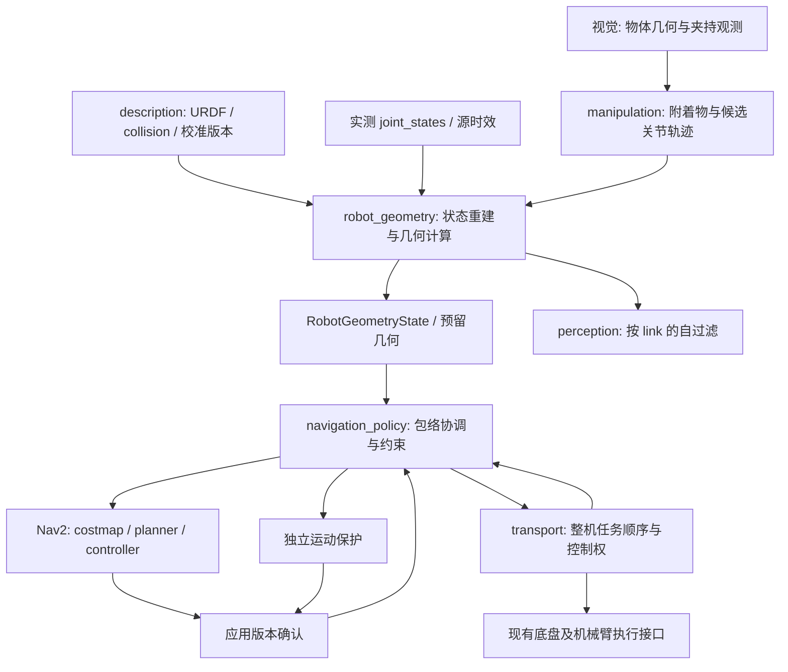

# 非 home 机械臂姿态导航：动态包络与协作接口设计

日期：2026-09-19。状态：原设计已获用户批准并进入首版施工；下文为设计范围，当前实现与验收边界见施工记录。

施工进展：用户已批准固定非 home 姿态首版施工；实现和分级验证见 `NONHOME_NAVIGATION_IMPLEMENTATION_20260919.md`。本文下方保留原设计及后续能力范围，不代表所有阶段已验收。

目标：导航能力不再依赖机械臂是否处于名为 home 的姿态，而取决于实测整机几何、运动约束、环境观测和已确认的导航包络。保持现有到位精度、跟踪效果与安全距离；支持固定非 home 姿态，并为导航中机械臂运动预留完整接口。

## 1. 当前工程已有基础与缺口

| 位置 | 已有能力 | 本次设计需要补齐 |
| --- | --- | --- |
| [RobotEnvelope.msg](../ws_robot/src/astribot_navigation_msgs/msg/RobotEnvelope.msg) | epoch、租约、姿态名、运输就绪、半长/半宽/高度、载荷质量、运动限制 | 不对称多边形、分高度几何、实测状态出处、停止扫掠、模型/载荷版本 |
| [geometry.py](../ws_robot/src/astribot_s1_transport/astribot_s1_transport/geometry.py) | URDF collision、TF 与箱体载荷的保守外接矩形计算 | 当前输出是对称矩形；应推广为公共几何能力，而不是在运输任务内继续扩展 |
| [ros_backend.py](../ws_robot/src/astribot_s1_transport/astribot_s1_transport/ros_backend.py) | change_envelope 在停止后计算运输包络并等待确认 | 非 home 运输已有调用基础；不是持续随关节变化更新的导航几何服务 |
| [envelope_node.py](../ws_robot/src/astribot_s1_navigation_policy/astribot_s1_navigation_policy/envelope_node.py) | 停车、更新两张 costmap footprint、回读确认、发布 ready | 只接受四角矩形；心跳 stamp 不证明关节数据新鲜；回读不能代表所有消费者已应用同一版本 |
| [robot_envelope.py](../ws_robot/src/astribot_s1_navigation_policy/astribot_s1_navigation_policy/robot_envelope.py) | 矩形尺寸验证、限制增速、epoch 与租约检查 | 当前矩形公式不能直接用于任意凸多边形 |
| [state_bridge_node.py](../ws_robot/src/astribot_trajectory_bridge/astribot_trajectory_bridge/state_bridge_node.py) | 厂家反馈模式保留源时间，按部件更新 JointState | 消费方必须按关节保留时间，不能把最后一条局部反馈当成完整整机状态；SDK 轮询模式需明确源数据时效证据 |
| [astribot_s1.srdf](../ws_robot/src/astribot_s1_moveit_config/config/astribot_s1.srdf) | 双臂、躯干、夹爪与 MoveIt 规划组 | virtual_base 为 fixed；底盘移动时必须正确变换三维环境或显式构造世界基座位姿 |
| [self_filter.yaml](../ws_robot/src/astribot_s1_perception_components/config/self_filter.yaml) | 躯干、双臂、夹爪的 TF 胶囊自过滤 | 与新几何模型共享状态版本，补充已确认附着物；不能用整机凸包过滤所有内部点 |

现有 geometry.py 中圆柱/球体用于 AABB 极值的两个点，只适用于其当前矩形边界计算。不能直接把这些点送入 convex hull 算法，声称所得多边形覆盖圆柱/球体。新实现应使用解析支持函数或有外包误差保证的外接多边形。

URDF collision 是计算输入，不自动等于经过实物尺寸认证的外包模型。需审查 collision_overrides.yaml 中简化尺寸、mesh scale、collision origin、夹爪 mimic 和线缆/工具附件，标记几何覆盖不足或未知的 link。TCP 等纯坐标 link 不需要伪造碰撞体。

## 2. 两级能力，分别验收

### 2.1 固定非 home 姿态导航：先实现

- 允许任意经验证的关节姿态，包括单侧伸臂、双臂抱物、偏置载荷。
- 导航期间实际关节应留在已预留的保持误差范围内，执行侧确认保持控制权；不能只凭一次速度为零判断已锁定。
- 用实际整机几何生成导航包络；两张地图、规划器、控制器和独立保护采用同一包络版本。
- 姿态名只用于任务说明、策略偏好和日志，不作为几何是否安全的依据。
- 无法保持、载荷松动或观测失效时，执行已验证的安全停车；不得退回 0.62 m 底盘包络继续行驶。

### 2.2 导航中运动机械臂：后续独立能力

机械臂轨迹必须先预留整个执行及停止过程的空间，再允许执行。Nav2 动态 footprint 本身不提供底盘和机械臂的时序联合规划。

第一版默认在窄通道中保持机械臂姿态；需改姿态时停车、校验姿态过渡、完成调整后恢复导航。后续只在经验证的预留包络内开放低速协同运动，不能把“定时刷新当前凸包”视为协同安全机制。

## 3. 几何模型：三个层次

以 astribot_torso_base 为底盘固定坐标系，所有参与碰撞的 link 均来自同一时刻的关节状态 q。整机占据集合为：

```text
B(q) = 底盘碰撞体 ∪ 躯干/头部/双臂/夹爪碰撞体 ∪ 已附着工具及载荷
H(q) = ConvexHull(ProjectXY(B(q)))
```

### 3.1 二维整机凸包

H(q) 是闭合、逆时针、无自交的凸多边形，保留相对底盘原点的前后/左右不对称。用于现有 Nav2 全局规划、局部控制、路径验证和保守通道判定。底盘固定碰撞体必须始终包含在 H 中。

伸出左臂时，不能简单把 half_width 同时向左右扩张；机械臂主要向前伸出时，也不能误认为通道横向宽度必然增加，但必须重新检查斜入口、拐角和转向扫掠。

凸包填补两臂之间的空隙，可能保守；这属于明确的保守近似。不得用忽略某条臂的方式消除此保守性。

### 3.2 分高度包络与分 link 三维几何

每个高度区间保存覆盖该区间的多边形；另保留每个 link 的碰撞体或凸分解及已附着物。跨越分层边界的形状必须在所有相交层内保守覆盖。

用途：解释二维凸包为何拒绝、区分桌腿/桌面/门框/低障碍，并为三维路径验证预留接口。分层本身不是精确三维碰撞；复杂障碍需使用 link 级几何。

首版继续用完整二维凸包作为导航安全边界。若以后允许机械臂从低障碍上方通过，必须同时升级候选生成、轨迹验证和最终执行保护为具有高度语义的链路，不能只缩小 Nav2 footprint 来绕过拒绝。

### 3.3 预留包络与停止可达集

```text
R_base = 外包络{ B(q(t) + 关节跟踪误差) : 执行、通信延迟和机械臂停止过程 }
S_world = Union_t [ T_world_base(t) · B(q(t)) ]
```

- R_base 在底盘坐标系内；通过各 link 的运动并集得到，不仅计算起点/终点凸包。
- S_world 是底盘与关节同时运动后的世界坐标扫掠，不能只看末端 TCP。
- 固定姿态也要覆盖关节保持误差、负载挠曲及执行停止过程。
- 预留时域覆盖控制响应与底盘/手臂可验证的停止时域；一方收到停止指令不意味着另一方已瞬间静止。
- 离散采样需有基于最大位移的外扩界，或使用适用的连续碰撞方法，不能仅以固定采样数量证明连续安全。

物理模型、关节误差和停止可达集的外包，与环境边界误差和每侧 8 cm 安全距离分别记账。实际安装给 Nav2 的安全足迹由统一预算生成；costmap padding、策略 margin 与 MoveIt padding 不得重复计入同一项。

## 4. 数据结构建议

以下是接口草案，不是已生成可用的 ROS 消息。导航契约继续放在 astribot_navigation_msgs；机械臂轨迹复用 trajectory_msgs/JointTrajectory 或 moveit_msgs/RobotTrajectory，附着物复用 MoveIt 类型，不合并现有领域消息包。

### 4.1 EnvelopeSlice.msg

```text
float64 z_min_m
float64 z_max_m
geometry_msgs/Polygon footprint
```

z 及多边形都在同一底盘坐标系。该多边形包含区间内全部物理几何，padding 语义与父消息一致。

### 4.2 RobotGeometryState.msg：实际观测事实

```text
std_msgs/Header header                 # frame_id=astribot_torso_base；stamp=重建状态时刻
builtin_interfaces/Time published_at
builtin_interfaces/Time valid_until   # 由最旧必要源数据决定，心跳不能单独延长
string source_id
uint64 sequence
uint64 clock_epoch
uint64 model_revision
uint64 attachment_revision

sensor_msgs/JointState joints
builtin_interfaces/Time[] joint_source_stamps  # 与 joints.name 一一对应
float64[] joint_position_error_bounds         # 同名关节单位；非概率置信区间的替代品
bool complete
bool arm_hold_confirmed
bool attachment_state_confirmed

geometry_msgs/Polygon physical_footprint
astribot_navigation_msgs/EnvelopeSlice[] height_slices
string[] attachment_ids
string reason
```

约束：

- 完整状态包含影响几何的躯干、双臂、夹爪、头部；mimic 按模型展开，时间有效性继承其源关节。
- 分部件消息允许合并，但每个必要关节单独检查新鲜度和跨部件时间偏差。缺失值不能填 home 或零。
- 物理多边形不含 8 cm 环境安全距离；模型精度/关节误差如何进入预留包络由模型版本及误差界定义。
- 发布频率与真实采样频率分开记录。ROS 时钟回跳、源重启、模型或附着物版本变化使旧证据失效。
- 大 mesh 不随本消息高频发送：模型按版本缓存，附着物几何通过 PlanningScene/模型更新传递。

### 4.3 RobotEnvelope.msg：升级现有导航承诺

```text
std_msgs/Header header
builtin_interfaces/Time valid_until
string coordinator_session_id
string request_id
uint64 epoch
uint64 clock_epoch
uint64 source_state_sequence
uint64 model_revision
uint64 attachment_revision
string posture_label                  # 仅作说明，不是白名单凭证

uint8 HOLD=0
uint8 FIXED_POSTURE=1
uint8 RESERVED_ARM_MOTION=2
uint8 mode
string arm_motion_id
builtin_interfaces/Time motion_start
builtin_interfaces/Duration horizon

geometry_msgs/Polygon reserved_footprint
astribot_navigation_msgs/EnvelopeSlice[] reserved_height_slices
geometry_msgs/Polygon installed_footprint
string installed_geometry_hash

float64 clearance_m
float64 max_forward_speed_m_s
float64 max_reverse_speed_m_s
float64 max_lateral_speed_m_s
float64 max_angular_speed_rad_s
float64 max_acceleration_m_s2
float64 max_jerk_m_s3
float64 brake_deceleration_m_s2
float64 angular_brake_deceleration_rad_s2
bool in_place_rotation_allowed
bool navigation_allowed
string reason
```

reserved_footprint 已包含模型/关节误差与该动作的物理停止可达范围；不再叠加同一份关节误差。installed_footprint 是按统一环境安全预算最终安装的多边形，其 hash 对规范化点序列、frame、预算版本共同计算；消费者必须知道是否还有 Nav2 padding。

sequence 随观测更新；epoch 只在已批准导航包络、限制或适用证据版本变化时更新。实际姿态变化但仍在已批准预留范围内，不必每帧切换 epoch、取消导航或重规划。

载荷质量、质心、惯量和夹持可靠性由附着物/动力学模型提供并按 attachment_revision 绑定。存在未知载荷时不能当作 0 kg。运动限值由已验证的载荷/姿态配置或动力学模型导出，未知时保持约束，不推断可以增速。

### 4.4 EnvelopeApplyStatus.msg：各消费者已应用的证据

```text
std_msgs/Header header
string coordinator_session_id
string consumer_id
uint64 envelope_epoch
string installed_geometry_hash
uint64 clock_epoch
uint8 APPLIED=1
uint8 REJECTED=2
uint8 state
string reason
```

全局/局部 costmap、规划器、控制器和独立保护按实际应用情况确认。Nav2 标准 Polygon footprint 话题没有 epoch，因此需要适配器或应用回调建立版本确认，不能把“消息已发送”或 RViz 看到了图形当作全部应用完成。

原有 published_footprint 可用于几何回读：在匹配时刻变换回底盘坐标系，比较完整多边形包含关系和外扩预算，不能继续只比较四条边长。

### 4.5 ArmMotionReservation：动作预留契约

请求至少包含：request_id、task_id、WorldVersion、模型/附着物版本、JointTrajectory、关节误差界、执行和停止时限、期望并行模式。响应返回 reservation_id、envelope_epoch、接受的运动限制、有效期和拒绝原因。

预留通过不直接下发运动。整机任务协调器在所有消费者确认后，分别向底盘与机械臂已有执行接口发起动作；执行器持续验证 reservation_id、状态范围和租约。取消时预留持续到双方实际停止及几何收敛确认，不能在收到 cancel 请求时立即释放。

## 5. 模块与数据流



建议新增一个有明确复用边界的 astribot_s1_robot_geometry 包：提供碰撞几何加载、同刻 FK、凸包/分层、支持函数、扫掠界等 C++ 库，及薄 ROS 状态适配组件。它不发底盘/机械臂指令，不决定任务顺序；不再由 transport 业务模块拥有公共几何实现。

- description：模型、碰撞体和校准唯一来源。
- robot_geometry：几何事实；依赖模型与测量，不依赖 transport 业务逻辑。
- manipulation：关节轨迹、附着物、保持/停止状态；复用现有 MoveIt 能力。
- navigation_policy：运动约束、预留与包络版本协调。
- transport：何时导航、何时改姿态、何时执行抓取的任务编排。
- path_tracking：执行约束后的底盘路径跟踪和最终指令检查。
- perception：实体观测与自过滤；视觉可以提议载荷形状/位姿，但不能直接写导航准入布尔值。

几何库通过组合接口复用，不能让 planner 继承整机任务协调器，也不能让 MPPI 的控制回调同步调用 MoveIt 服务。高频路径使用已准备好的不可变几何快照和缓存。

## 6. 包络更新与运动握手

### 固定姿态接入

1. 获取完整且新鲜的实测关节/附着物；确认姿态保持控制权和误差界。
2. 计算整机凸包及停止外包，生成 epoch。
3. 在已验证停止状态下安装全局/局部安全足迹，更新相关缓存和独立保护。
4. 等待所有必要消费者确认版本，校验当前路径及起终点姿态。
5. 原路径仍安全则保留；只有当前路径因新几何不可执行时才进入候选重规划。
6. 导航过程中持续检验实测几何仍包含在批准包络内、限值有效、附着物可信。

### 改变机械臂姿态

1. 先验证整个姿态过渡与双侧停止过程，不仅验证目标姿态。
2. 先安装覆盖旧姿态、过渡姿态和新姿态的预留包络，再允许机械臂运动。
3. 首版底盘保持停止；后续仅在已预留协同模式下允许并行。
4. 只有实测新姿态稳定、载荷确认、旧动作退出且各消费者已确认，才能缩小包络。
5. 失败时保留能覆盖实际状态和停止过程的包络，不自动回 home，不释放为底盘尺寸。

“收臂”并不总是安全：肘部可能先外摆、托盘可能扫到门框。必须验证收臂路径，不得在通道内因规划失败就自动执行回 home。

意外伸臂/漂移超出预留范围时，协调两类执行器采取已验证的停止行为；禁止继续沿用小 footprint，保留当前几何和停止上界。是否机械臂急停、保持或受控制动由执行器能力契约规定，不能假设所有机械臂停止动作等价。

## 7. 窄通道与碰撞判定

设 h_H(n)=max(p∈H) n·p；n 是通道左法向、e 是底盘参考点相对通道中心的横向偏移。直线通道两侧分别满足：

```text
 e + h_(RθH)( n) + m_left  <= W/2
-e + h_(RθH)(-n) + m_right <= W/2
```

如 H 已包含某项安全余量，m 中不重复计算。该公式支持单侧伸臂和偏置负载，允许在剩余空间内选择更合理的底盘轨迹，而不是强迫底盘中心贴通道中心。公式只做局部截面筛选，门框拐角、斜入口、凹障碍仍须完整扫掠验证。

旋转使用实际多边形与转动中心，不能继续硬编码 hypot(0.31, 0.31)。全旋转半径的保守界为 max norm(p)；只需转一个小角度时验证实际角度区间，不要求能转 360°。

85 cm 目标仅适用于当前整机包络满足预算的姿态，不适用于所有非 home 姿态。若横向投影宽度为 0.90 m，仅加两侧 8 cm 就需要至少 1.06 m，尚未计入其他误差；该数值是示例，不是本机伸臂实测尺寸。前伸臂横向宽度可能不增加，但纵向扫掠和转向半径会增大。

到点时仍使用整机包络验证 REFINE；若位置可达、终点航向扫掠不可达，报告 GOAL_HEADING_UNREACHABLE，不能靠机械臂未碰撞底盘就允许旋转。

## 8. 三维感知、自过滤与动力学

- 自过滤使用实际 link/已确认载荷几何与云时间对应的状态，不使用填满双臂间隙的整机凸包。否则会把两臂之间的真实障碍过滤掉。
- 自过滤几何不能使用含 8 cm 安全距离的导航包络；这会抹除机器人附近真实障碍。模型误差只按独立、较小且经验证的自过滤预算处理。
- 地图清障也必须单独处理：Nav2 1.1.20 ObstacleLayer 在 footprint_clearing_enabled 为真时，将 footprint 内部设为 FREE_SPACE。因此安装机械臂凸包或未来预留包络前，应停用这类基于大 footprint 的整片清障，改由精确自过滤与可信观测射线清除；若确需底盘近地自清，使用单独且经过验证的实体范围。否则局部地图可能把两臂之间、手臂下方或尚未运动到的区域中的真实障碍清掉。VoxelLayer 的足迹清障也必须纳入同一审查。
- 对机械臂遮挡后的射线保留 unknown；不能把“无回波”或被自过滤剔除的点一律转换成自由空间。传感器观察原点与时刻保留，尤其是前后视觉/激光融合。
- 视觉载荷输入至少含 object_id、源时间、frame、几何及尺寸误差、位姿及不确定性、所属夹爪/附着关系假设、置信状态。经附着状态管理确认后更新 attachment_revision；视觉检测到物体不等于已经夹持牢固。
- 固定基座 MoveIt PlanningScene 不能自动理解 Nav2 的移动：每次验证需将环境转换到候选底盘姿态，或在验证上下文中显式设置基座世界变换。不能只验证机械臂 q(t) 而忽略底盘位移。
- 伸臂和偏置负载还改变质心、惯量、抗倾覆余量与制动能力。导航限值应绑定姿态/载荷验证配置，包含平移、转向、加速度和 jerk；不能只扩大 footprint 而保持原运动上限。
- 夹爪与已附着载荷的允许接触关系沿用经过审查的 ACM/touch_links；不要扩大为机械臂与外部环境可碰撞。

## 9. 状态与异常

建议内部状态：UNOBSERVED → HOLD → PREPARING → APPLYING → READY_FIXED / READY_RESERVED；状态过期或证据不一致进入受控停止流程。导航允许由协调器推导，任务调用者不能自行声明 transport_ready=true 获得通行。

异常包括 GEOMETRY_STATE_STALE、GEOMETRY_MODEL_INCOMPLETE、PAYLOAD_GEOMETRY_UNKNOWN、ENVELOPE_APPLY_TIMEOUT、POSTURE_OUTSIDE_RESERVATION、ARM_MOTION_NOT_RESERVED、PAYLOAD_STATE_UNCERTAIN、ARM_SWEEP_COLLISION、ENVELOPE_PATH_BLOCKED、GOAL_HEADING_UNREACHABLE。关联 task_id、path_revision、envelope_epoch 与碰撞 link/object，便于区分底盘、机械臂、载荷和数据失效。

局部保护失效时保存最后可信几何并计入失效到停止之间的可达界；不能不断重发新时间戳使过期观测看起来有效。节点重启或时钟回跳后重新确认会话和版本，旧确认不得复用。

## 10. 分阶段落地与验收

| 阶段 | 交付 | 必须通过的验证 |
| --- | --- | --- |
| A | 几何快照、凸包、可视化；不参与控制 | home、任意非 home、单侧伸臂、躯干变化、夹爪开合、载荷偏置的包络覆盖；部件延迟/缺失；模型碰撞体完整性 |
| B | 固定非 home 姿态导航与多消费者确认 | 原路径跟踪基线不退化；双地图一致；观测失效停车；payload attach/detach；启动时已经伸臂；凸包内部真实障碍不被自过滤/足迹清障删除 |
| C | 任意多边形窄通道、斜入口、终点航向判定 | 同宽不同左右偏置；前伸臂拐角；85 cm 收拢姿态目标；不适合的伸臂姿态明确拒绝；不强制整圈旋转 |
| D | 停车后改姿态与预留握手 | 起终姿态安全但中间扫掠碰撞；缩包过早；消息丢失、乱序、重启；收臂失败仍覆盖实际几何 |
| E | 有界协同运动及高度感知链路 | 底盘与双臂同时停止；计划偏差；桌面/门框/悬空障碍；遮挡与视觉数据中断；运行时计算期限 |

仿真记录：全 link/载荷最小间隙与 Gazebo 接触、误拒绝/误停车、真实关节与批准包络偏差、应用确认延迟、超时响应和计算耗时；分别统计 FOLLOW 的横向/航向误差与 REFINE 的 3 cm / 1.5° 到位目标。完成耗时不作为性能优化目标，安全响应时限仍为约束。

真机方案保留：模型尺寸与外参、关节源时间、负载变形/滑移、盲区、驱动保持/停止行为、制动与抗倾覆参数的测量接口。仿真通过不能替代这些实物证据。

## 11. 参考依据

- [MoveIt Humble RobotModel / RobotState](https://moveit.picknik.ai/humble/doc/examples/robot_model_and_robot_state/robot_model_and_robot_state_tutorial.html)：复用模型和正运动学能力。
- [MoveIt Humble PlanningScene](https://moveit.picknik.ai/humble/doc/examples/planning_scene/planning_scene_tutorial.html)：复用状态/环境碰撞验证；留意自碰撞、环境 padding 和 ACM 的区别。
- [MoveIt AttachedCollisionObject](https://raw.githubusercontent.com/moveit/moveit_msgs/ros2/msg/AttachedCollisionObject.msg)：复用附着 link、几何与 touch_links 表达；落地字段以本机安装版本为准。
- [Nav2 1.1.20 Costmap2DROS](https://raw.githubusercontent.com/ros-navigation/navigation2/1.1.20/nav2_costmap_2d/src/costmap_2d_ros.cpp)：动态 footprint 的实际接入与 padding 行为；不把它视为已经提供跨模块版本事务。
- [Nav2 1.1.20 ObstacleLayer](https://raw.githubusercontent.com/ros-navigation/navigation2/1.1.20/nav2_costmap_2d/plugins/obstacle_layer.cpp)：足迹内部清障行为及其与标记、射线清障的关系。

上述组件能力来自官方文档/源码；包络版本协议、消息草案、协同预留和阶段划分是本工程设计建议。
