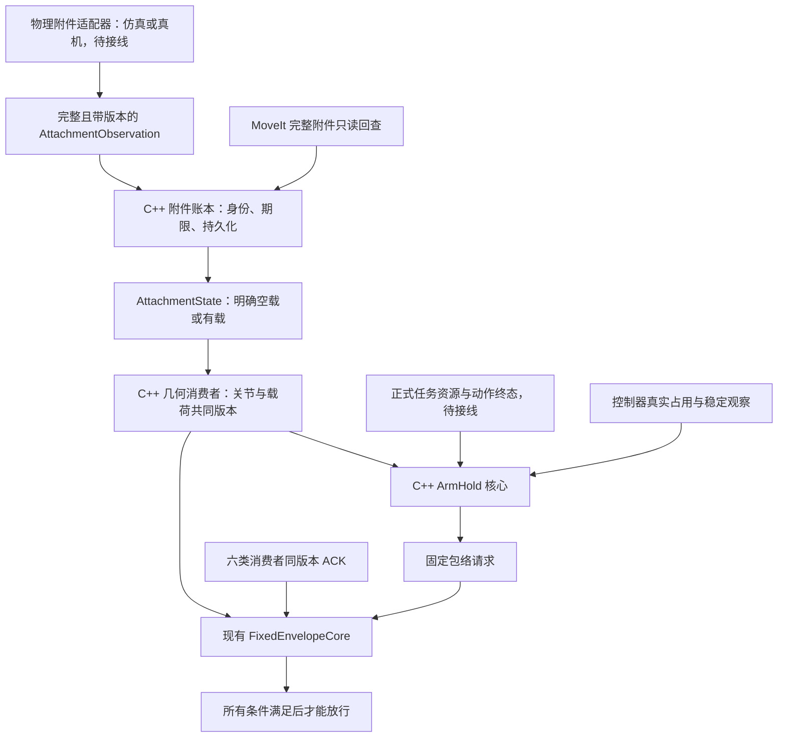

# 附件账本、保持授权与包络：2026-09-23 离线续作

本轮按“账本与几何 → 任务保持 → 包络确认”的依赖顺序施工，每步开始前重新检查数据来源、状态转换、失效和验收逻辑。只进行了代码修改、编译和限定离线验证，没有启动 ROS 节点、仿真或真机。

本次统一计时自 00:13:31 +08 开始，最晚 01:43:31 暂停；内部子步骤不重置预算。最终完成时间和范围见 `evidence/task_chain_20260923_payload_offline/task_timing.json`。

## 已实现的责任和数据流

图中源适配器、资源所有者及 ROS 服务现场连接仍是待办，离线测试用输入不作为在线所有权或物理事实。原任务继续负责抓取/释放和 MoveIt 场景写入，新账本只有核对权。

| 子步骤 | 本轮代码成果 | 验收边界 |
|---|---|---|
| 附件账本 | 新增 `astribot_payload_msgs` 与 C++ `astribot_s1_payload_state`，有界缓存、源/接收双时间期限、场景回查、审计落盘 | 核心离线通过；节点编译，未启动 |
| 几何接入 | 默认消费账本；完整空载也有版本；换版/撤销打断在途计算，完成时收紧期限 | C++ 核心、几何差分、launch 参数测试；ROS 协议测试未运行 |
| 保持授权 | 新增 C++ `astribot_s1_transport_native::ArmHold`，任务租约、动作终态、稳定窗口、controller claims、撤销 | 进程内核心通过；正式任务客户端和实际发布者仍待接线 |
| 包络确认 | 现有 C++ 协调器立即锁存几何换版/保持撤销；负 ACK 立即关闭放行；时钟换代清理旧序列历史 | 真实核心间离线流程通过；原现场负 ACK 问题未复现 |

默认行为有意收紧：`geometry_state` 需要可信账本状态，不能把缺失来源当空载。导航 launch 仅提供显式启用及身份参数，不自动运行物理证据源，也不生成默认空载。现有共享 install 未覆盖；本轮使用 `runs/task_chain_20260923_payload_offline` 内独立构建和安装路径。

## 状态和版本规则

`UNKNOWN`、`TRANSITION`、确认过期、存储失败以及场景不一致均不可执行，并保留最后已知载荷记录供诊断。确认 `EMPTY` 需要权威来源声明完整清单为空，且独立完整场景回查也为空。

来源 `source_epoch / clock_epoch / revision / sequence` 与账本 `ledger_epoch / ledger_revision / attachment_revision` 各司其职。空载→有载→空载必须获得新的执行版本；相同几何哈希不足以复用旧授权。节点重启不从历史日志恢复放行。

来源期限最多 500 ms，排队时间计入原期限。心跳、相同采集、更晚的场景回查和计算完成均不能续源期限。取消、源异常或缓存溢出后的恢复需要故障之后的新采集和重新核对。

保持授权要求正式任务资源、成功的终态动作、至少三帧跨 500 ms 的稳定几何和新鲜控制器占用；授权最多 300 ms。先稳定后收到首次 controller 响应是合法初始化顺序；已确认之后的失效不能自动复活。

包络需要 `global_costmap / local_costmap / planner / controller / policy / protection` 六方确认同一会话、epoch 和安装几何哈希。只有四方确认时，确切原因仍为 `WAITING_FOR:controller,local_costmap`；没有降低碰撞、几何完整性或消费者确认门槛。

## 多场景验证矩阵

| 场景族 | 离线结果与约束 |
|---|---|
| 启动无输入、单独空场景、明确完整空载 | 前两者拒绝，第三者经独立回查及持久化后可确认 |
| 左/右挂载、双臂分别有载、偏置箱体/球体/圆柱 | 受支持的完整清单可核对；偏置几何加入保守包络 |
| 双臂共同持同一物体、mesh、未知完整动力学 | 不作为已支持能力；mesh/不完整几何显式拒绝，正质量不等于质心/惯量验收 |
| 错会话、旧源、重复/乱序、未来时间、长租约 | 不得续期或误恢复；较旧包不覆盖更新证据 |
| 空载→有载→空载、释放中、源/账本重启 | 版本单调变化；旧版本确认或旧源回包不能恢复旧权限 |
| ROS 时间暂停/回退、缓存溢出、工作线程排队、迟到场景 | 单调时间与代次门控；故障后的旧采集/旧回查拒绝 |
| 日志独占、坏路径、写入失败、重启 | 不能据旧日志确认；持久化失败锁存拒绝 |
| 稳定不足、重复序号、资源断档、首次 controller 迟到 | 不足/冲突/断档拒绝；合法首次反馈次序可完成初始化 |
| 保持取消、位置漂移、controller 占用丢失 | 立即撤销；迟到的正常反馈不能恢复旧 hold |
| 缺两方 ACK、旧 epoch ACK、负 ACK、几何换版 | 明确阻塞；负 ACK 及时撤销，同版本新的有效 ACK 可恢复普通缺 ACK 状态；取消/换版必须重新发起事务 |

独立只读审查发现并复现了七项边界缺陷：负版本高水位、故障后重用采集、几何完成未收紧期限、过期乱序包误撤销、资源续约跨断档、稳定观察重用序号、首次 controller 响应顺序。均先加入失败用例再修复。包络流程另补充换版/撤销在定时器间隙丢失、时钟换代序列重置和负 ACK 立即撤销回归。

原 node 的几何订阅已经在每次回调后调用 `tick()`，因此核心换版 ABA 测试是契约加固，不声称该几何时序已在现场发生。保持和 ACK 回调本轮补上及时检查/发布；实际调度延迟未测。

最终测试统计、源文件哈希、构建目录与原始 red/green 日志索引均见同目录证据 JSON；`verify_offline.sh` 只重建并执行列出的纯离线测试，明确排除了会启动节点的协议测试。

本轮共通过 91 个 GTest 用例（账本/消费者 46、附件几何 5、保持核心 25、包络及跨模块组合 15），另通过 5 个原生断言测试程序、26 个几何差分用例和 5 个 launch 参数用例。三类计数分开报告，不将 CTest 的套件包装重复加总。最后七个组合用例直接串联实际 C++ 账本、消费者、附件几何转换、保持核心和包络核心；物理状态、关节/坐标变换、任务资源和控制器输入仍为确定性夹具。它们覆盖明确空载、双臂分别负载成功、换版阻塞、未知质量拒绝、场景不完整及过期撤销。

## 后续任务链及放行条件

1. **正式来源接线。** 在导航仓库仿真中由实际附件机制提供完整物理清单，由正式任务提供资源租约和动作终态；先核对空载、单臂/双臂分别负载和释放过渡。不能用空场景或固定配置伪造授权。这些连接代码与现场证据仍待完成。
2. **ROS 层核对。** 验证实际 GetPlanningScene 回查、消息 QoS、节点重启、发布中断、暂停时钟、队列溢出及在途几何作废；记录源采集/接收/输出时间、所有相关版本及拒绝原因。
3. **复现原负 ACK。** 在同一正式事务下定位 controller 与 local_costmap 的实际安装版本和拒绝原因；六方同时 ACK 才放行。本轮只验证了核心可正确报告缺失，没有复现旧现场问题。
4. **工作负载及感知矩阵。** 继续 SLAM/MPPI 实际运动、推理/点云压力、TF 丢失/源重启、六相机 ROI 与三维覆盖；分别记录净空、延迟、覆盖和失败原因。此前 GPU 压力的历史结论不外推为本轮动态验收。

以上现场环节遵守本次“暂不起仿真”的要求，保持未运行。VLA、真机/完整标定、完整动态抓取搬运放置继续按既有决定暂缓。`full_W1_accepted` 仍为 false。
