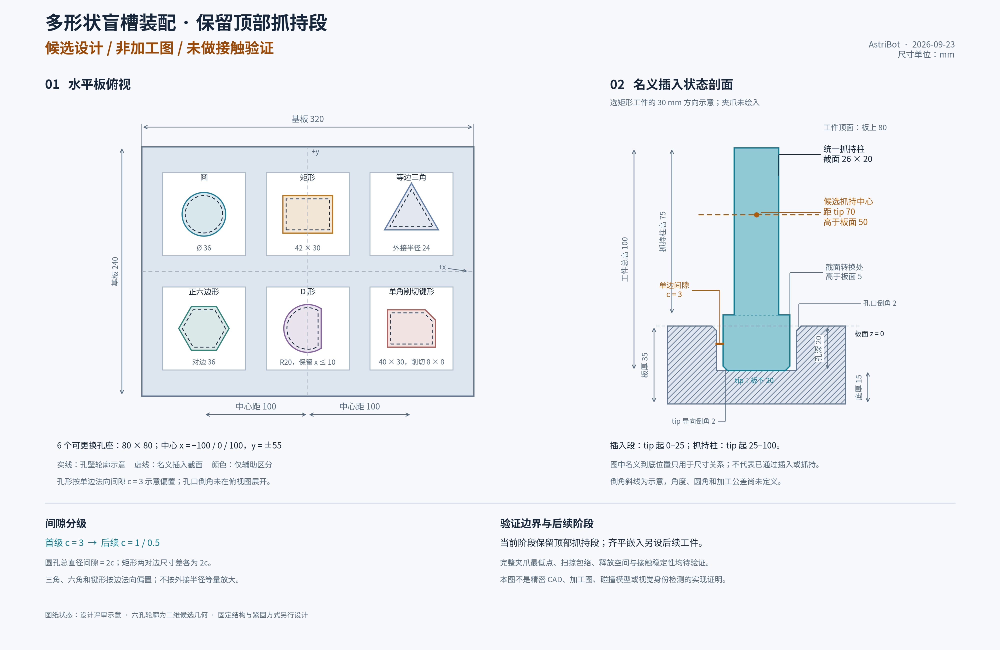

# 多形状 Peg-in-Hole 盲槽装配设计

日期：2026-09-23。状态：**二维截面与DXF子项已验证；精密三维CAD、接触控制与插入仍待验证**。最新证据见 [S0截面验证](ASSEMBLY_S0_PROFILE_VALIDATION_20260923.md)。
用户已确认先保留顶部抓持段，后续再做齐平嵌入；本文不授权绕过现有运行资源交接或直接驱动机器人。
关联：[FoundationPose 整合方案](FOUNDATIONPOSE_INTEGRATION_DESIGN_20260923.md)、[导航与搬运协作契约](FOUNDATIONPOSE_ASSEMBLY_COORDINATION_20260923.md)。

## 1. 首期目标与范围

首期使用固定水平板、固定底盘与躯干、左臂操作、右臂停放，完成“识别工件与指定孔座—抓取—预对准—插入—释放—独立确认”。
FoundationPose 负责已知 CAD 刚体的位姿；板定位另有独立观测；装配任务拥有动作、资源和状态提交。
第一组实验采用六种插入截面、可替换孔座和统一抓持柱，逐级收紧间隙，不同时增加双臂协作、活动底盘或无抓持段工件。
第二阶段齐平嵌入需要独立设计顶部吸取、可退出夹具、侧面让位或其他释放方式；本阶段抓持柱直接删除不能形成可执行方案。
交付证据分为设计、静态/离线、隔离接口、运动学仿真、物理接触仿真和真机；这些层级不相互替代。

## 2. 官方参考与资产许可边界

以下页面于本轮核对。首期采用本项目参数化几何，参考任务组织和评测方法，不直接复制外部 CAD 或声称已移植其控制器。

| 来源 | 可借鉴内容 | 采用与授权边界 |
|---|---|---|
| [ManiSkill AssemblingKits](https://maniskill.readthedocs.io/en/latest/api/mani_skill/envs/tasks/tabletop/assembling_kits/index.html) | 形状与正确孔槽匹配、随机初始位姿、完整嵌入的任务结构 | 框架代码为 [Apache-2.0](https://github.com/mani-skill/ManiSkill/blob/main/LICENSE)；下载的几何资产、原始来源和附带条款仍需逐项登记，不能由框架许可推断所有资产许可。其成功阈值不能直接用于本项目毫米级插入。 |
| [IndustRealKit](https://github.com/NVlabs/industrealkit/blob/main/README.md) | 分离 STL/OBJ/CAD、可制造插入件、接触丰富装配的组织方式 | [NVIDIA License](https://github.com/NVlabs/industrealkit/blob/main/LICENSE) 第 3.3 节将本作品及衍生作品限定为非商业研究/评估，分发还须保留许可及声明；不能称为无条件商业可用的 CAD 库。本期仅参考，不引入该资产。 |
| [robosuite TwoArmPegInHole](https://robosuite.ai/docs/source/robosuite.environments.manipulation.html#module-robosuite.environments.manipulation.two_arm_peg_in_hole) | 插入相对姿态、可配置工件尺寸、双臂任务对照 | 框架 [MIT 许可](https://github.com/ARISE-Initiative/robosuite/blob/master/LICENSE) 要求保留版权和许可声明，所含第三方内容另遵其条款；双臂示例不证明 AstriBot 双臂或 Gazebo 接触可用。 |
| [NIST Practice Task Board](https://www.nist.gov/el/intelligent-systems-division-73500/robotic-grasping-and-manipulation-assembly/robotic-grasping-0) | 多截面插入、可复现工位、CAD/STL/STEP 与制造说明分开 | [NIST 使用声明](https://www.nist.gov/open/license) 区分 NIST 自产与第三方材料；实际下载包逐项核对归属、声明并注明修改，不把网页可下载视为所有材料均无条件授权。 |

资产清单须记录来源 URL、版本/commit、下载日期、SHA256、许可文件、修改项和用途；代码、CAD、纹理、网络权重分别登记。
[NIST 制造说明](https://www.nist.gov/system/files/documents/2020/08/26/Practice_Task_Board%201.pdf)还提醒加工会改变孔的实际通行几何；标称 CAD 尺寸不等于加工件间隙，本方案也不将打印结果当作尺寸真值。

## 3. 与示意图一致的候选尺寸

尺寸单位均为 mm；运行时资产统一转换为 m。以下数值必须与[候选图生成脚本](assets/assembly_20260923/generate_candidate_diagram.py)同步改版。
机器可读候选参数见 [scene_spec_v1.yaml](assets/assembly_20260923/scene_spec_v1.yaml)，其状态必须为 `DESIGN_ONLY`，单位 m/角度 rad；它不是可执行 Gazebo 世界、碰撞模型或接触验收配置。



| 项目 | 候选值与定义 |
|---|---|
| 板平面外廓 | 320 × 240，板面中心为 board 原点，+z 向上 |
| 孔座 | 6 个可更换 80 × 80 孔座；紧固、定位销和更换后重复定位结构尚待设计 |
| 孔中心 | x = −100 / 0 / 100；y = +55 / −55；同排中心距 100，两排间距 110 |
| 垂向截面 | 板厚 35，盲孔深 20，孔底余厚 15；板面 z=0、板底 z=−35 |
| 工件 | tip 起总高 100；插入截面段为 z_part=0–25，统一抓持柱为 25–100 |
| 抓持柱 | 截面 26 × 20，高 75；截面方向与对应 part frame 固定绑定 |
| 候选抓持中心 | tip 上方 70；名义插到底后高于板面 50；它是两指接触中心候选，不等于 TCP 原点 |
| 名义就位 | tip 位于板下 20，截面转换处高于板面 5，工件顶面高于板面 80 |
| 导向 | 孔口倒角 2、tip 导向倒角 2；角度、拐角处理、圆角及加工公差尚未定义 |

六个截面的位置与图一致，不能自行替换为近似外接圆：

| slot_id / 位置 (x,y) | 工件插入截面 | 截面绕插入轴的机械等价旋转 |
|---|---|---|
| circle_01 / (−100,+55) | 圆 Ø36 | 连续旋转 |
| rectangle_01 / (0,+55) | 矩形 42 × 30 | 180° |
| triangle_01 / (+100,+55) | 等边三角形，外接半径 24，顶点朝 +y | 120° |
| hexagon_01 / (−100,−55) | 正六边形，对边 36，顶点之一朝 +x | 60° |
| d_shape_01 / (0,−55) | 圆 R20 与半平面 x≤10 的交集 | 360°，无非平凡绕轴旋转 |
| keyed_01 / (+100,−55) | 40 × 30 矩形右上角削切 8 × 8 | 360°，无非平凡绕轴旋转 |

键形精确顶点为 (−20,−15)、(20,−15)、(20,7)、(12,15)、(−20,15)，按逆时针排列。
孔壁按截面的**单边法向间隙 c**偏置：首级 c=3，后续 c=1、c=0.5；不是把外接半径统一加 c。
圆孔直径为 36+2c，矩形孔两对边尺寸为 42+2c 与 30+2c；多边形各边支持线沿外法向移 c 后求交。
D形弧段与直边在[参数v2](assets/assembly_20260923/scene_spec_v2.yaml)中明确为半径R+c圆盘与x≤a+c半平面的交集，交点保留尖角；生成的DXF保留解析圆弧。加工圆角与入口倒角仍待三维设计。上图的圆弧采样及斜接偏置继续只用于示意，不能作为制造或接触网格。
倒角区域的局部余量与直壁段 c 分开记录，不能用入口宽度代替插入全深度的最小间隙。
板边、孔座与夹爪通行余量仍待检查；80 × 80 孔座不是夹爪只能占用该面积的约束，也不是相邻已插入工件不会干涉的证明。

## 4. 夹爪、TCP 与可达性约束

当前 [arm Xacro](../ws_robot/src/astribot_s1_description/urdf/astribot_s1_arm.xacro) 350–357 行定义 `astribot_arm_{left,right}_tcp_link`，相对法兰 `tool_link` 平移 (0,−0.15,0) m，无旋转。
不能令法兰或 TCP 直接重合孔底；姿态计算必须串联对象原点、tip、抓持中心、TCP 和夹爪实际几何。
[夹爪 Xacro](../ws_robot/src/astribot_s1_description/urdf/astribot_s1_gripper.xacro)给出主动关节 0–0.93 rad、五个 mimic 从动关节，注释的名义开口约 105 mm。
本轮按当前 L11/R11 碰撞网格及 ±0.03 rad 预压角离线投影：q=0 的全网格间隙约 97.527 mm，q=0.93 约 6.024 mm；这是模型计算，不是实测开口。
最终夹持角由加载模型的 [GripperCommander](../ws_robot/src/astribot_s1_manipulation/src/gripper_commander.cpp) 243–259、318–344 行所用张口表和宽度边界确认；26/20 mm 抓持方向要分别检查。
左右 L11 整节碰撞网格局部 AABB 均为 30 × 28 × 71.298 mm，不等于有效胶垫尺寸，也不能代表完整夹爪包络。
模型记录指尖伸出方向约 **7 mm 几何不确定度**；这会影响板面净空和抓持变换，不能直接假定存在亚毫米 tip 定位能力。
抓持中心高于板面 50 不保证指尖有 50 净空：必须解算 pad 接触中心到 TCP 的变换，再求所有夹爪/腕部碰撞体的最低点及全过程扫掠包络。
每种形状、抓取方向、已占用孔组合都检查：关爪、抬升、预插入、到底、开爪和退臂；需要给出净空下界及上述模型误差余量。
若候选不合格，改抓持变换或改版工件高度并同步更新图和 registry，不能通过扩大允许碰撞集合掩盖板面干涉。

[SRDF](../ws_robot/src/astribot_s1_moveit_config/config/astribot_s1.srdf)已有 `arm_left`、`arm_right`、`dual_arm` 和 `dual_arm_with_torso`，单臂 [KDL 配置](../ws_robot/src/astribot_s1_moveit_config/config/kinematics.yaml)可复用。
现有 `home`/`ready` 和运输探测点不构成该板的可达图；逐孔验证 IK、关节余量、奇异性、碰撞以及失败后退出路径。
右臂停放采用本场景验证过的构型和有权资源保持，不能仅凭 home 名称、控制器 active 或零速度认定已安全停放。
桌高、板相对底盘位置作为搜索参数冻结；可参考现有约 1.035 m 工位顶面，但本轮未证明该高度适合全部孔位。
现有 [stations/create_scene](../ws_robot/src/astribot_s1_transport/astribot_s1_transport/ros_backend.py)可参考双侧场景登记方式；其 100 × 100 mm 工位不能直接承载本板。
现有 [DeskC 模型](../ws_robot/src/aws-robomaker-small-warehouse-world/models/aws_robomaker_warehouse_DeskC_01/model.sdf)可复用为环境资产；实验桌与孔板宜使用独立、可审查的参数化碰撞几何。

## 5. 坐标、身份、对称性和相对误差预算

定义 `board`：板顶面中心；`slot_i`：孔入口中心、+z 朝外；`part_i`/`tip`：名义底面中心、+z 朝工件顶部。
定义 `grasp_frame` 为候选两指接触中心；`T_part_grasp` 与 `T_grasp_tcp` 分别保存，后者来自夹爪建模/验证，不可省略。
约定 `T_A_B` 将 B 系坐标转换到 A 系，插入沿 slot 的 −z；`T_slot_part_goal` 含名义 tip 深度 −20 mm 与允许功能朝向。
`T_base_tcp_goal = T_base_board × T_board_slot × T_slot_part_goal × T_part_grasp × T_grasp_tcp`。
`T_board_slot` 是经验证的设计/装配关系，孔座更换后带新的 `socket_revision`；`T_base_board` 必须来自本次有效观测。

板定位首期可用经标定的非共线标记组合配合深度几何，或独立板 CAD 位姿管线；具体识别器与标记到板变换需实现、验证并登记。
“板固定”只减少运动，不证明在机器人坐标系里的准确位置；场景 spawn pose、Gazebo 真值或手填世界坐标不能进入运行时板定位。
工件与板观测均携带 frame、采集时间、source/clock/calibration/association revision、质量、有效期；二者应形成共同时间上下文的相对位姿。
Gazebo 真值只进入独立评分器；真值 mask、真值板位姿的诊断实验标为 oracle-only，从感知闭环验收剔除。
抓取后遮挡时不能重复发布抓取前视觉位姿作为新观测；由已确认的抓持变换传播，并标明来源、误差和滑移监测边界。

分别登记插入截面的机械对称群、完整 CAD 对称群和任务允许朝向；统一矩形抓持柱会改变完整对象的对称性。
例如圆柱插入截面允许任意 yaw，但完整“圆底座+26×20 柱”通常只保留 180°；三角截面和矩形柱的共同绕轴对称通常只有 360°。
颜色或纹理可改善观测身份，但不能制造机械防错结构；机械允许旋转也不能覆盖业务规定的文字/连接器方向。
`model_id`、`object_id`、`track_id`、`slot_id`、`socket_revision` 分开；任务显式绑定指定实例与指定孔。
不同形状尤其在 c=3 时可能装入错误的大孔，必须离线计算跨形状可容纳矩阵；**错误槽即使装得进去也不得算业务成功**。
身份歧义、错槽、空孔与已占用孔冲突分别返回原因；不以最近孔、相同颜色或较低插入力替代身份匹配。

相对预算在每个孔的直壁最不利方向计算，保守准入形式为：

```text
e_lateral + L·sin(e_tilt) + 2r·sin(e_yaw_non_equivalent/2)
  + e_grasp + e_control + e_geometry + margin < c_min
```

各 e 是同口径误差界：工件相对孔横向误差、倾角、非等价 yaw、抓持传播、控制跟踪和有效几何误差；角度用 rad，L 为有效约束长度，r 为截面最远点半径。
若相对估计已包含板和物体误差，不再重复加同一项；采用协方差时处理共模标定误差和相关项，不默认独立后开方相加。
深度与受力预算另列；上式是保守筛选近似，不代替完整几何扫掠/接触验算，倒角不能自动扩大 c_min。
FoundationPose 原方案的 20 mm/10° 只是姿态对照门槛，不能作为本场景 3/1/0.5 mm 间隙的准入阈值。
先测得各项误差和置信覆盖，再冻结每级阈值；预算不成立就保持在观测/预对准阶段，不能通过放宽有效期或成功条件放行。

## 6. Gazebo 接触模型与执行层缺口

本机只读核对为 Ignition Gazebo 6.18.0/Fortress，已安装 DART 插件；仓库 world 的 `type="ode"` 不能证明实际运行后端为 ODE。
现有 launch 未显式选引擎，本机 Physics 库包含默认 DART 插件路径；正式会话必须记录实际引擎、碰撞器、求解器、版本、步长和接触参数。
[运输 spawn](../ws_robot/src/astribot_s1_transport/astribot_s1_transport/ros_backend.py) 967–1021 行将当前载荷建为静态且不带物理碰撞体；[kinematic_payload](../ws_robot/src/astribot_s1_gazebo_bringup/src/kinematic_payload.cpp) 85–89 行每步 `SetWorldPoseCmd` 跟随。
这一机制仅适用于流程/感知夹具，不能证明摩擦抓持、板壁阻挡、卡滞、底部接触或插入成功；给模型增加可视孔洞不能改变该边界。

接触资产需要动态工件、合理质量/惯量、明确材料/摩擦与接触几何；固定孔板仍必须具有正确碰撞壁和孔底。
孔板不能用包含整个外廓的单一凸包，否则孔洞被封死；采用独立孔壁/孔底的复合凸体或经目标后端验证的静态凹网格。
对 c=3/1/0.5 分别验证网格分辨率、最小间隙、薄壁、法向、重叠、允许穿透、步长敏感性及接触稳定性，不能只看渲染图。
视觉网格、规划碰撞网格和接触碰撞网格可以不同，但必须共用单位/原点/版本，差异及保守性明确记录。
MoveIt/MTC 负责自由空间接近、抓取、退臂与接触阶段入口规划；孔壁接触后的推进、力/速度限制和卡滞恢复由独立接触执行器监督，普通无碰撞路径成功不证明接触控制成立。
规划碰撞矩阵 ACM 只对当前指定 `part_id–slot_id` 的接触阶段、接触壁/底和有界几何范围授权；孔板其余区域、其他孔座/工件及机器人碰撞仍有效，禁止 blanket 禁用整板碰撞。
ACM 的对象对许可本身不提供深度、力或接触区域上限；这些边界由阶段几何校验与接触执行保护落实，不能只设置 allowed=true 就视为已受控。
若孔壁与整板共用一个无法细分授权的 collision object，先拆成可独立寻址几何；授权绑定 task/scene revision，在阶段退出、取消或失效时撤销并读回。规划允许接触不能关闭 Gazebo 的物理接触求解或容许无限穿透。

| 证据层 | 允许的夹持/物体处理 | 能支持的结论 |
|---|---|---|
| K：运动学 | 位姿跟随或理想轨迹夹具 | 流程、可见性、坐标和规划诊断；不能报接触插入成功 |
| C1：理想刚性夹持接触 | 动态工件通过物理约束连接夹爪，反力参与求解，无逐步瞬移覆盖 | 理想无滑移夹持条件下的孔壁/孔底接触插入；不能报真实摩擦抓持 |
| C2：摩擦夹持接触 | 指尖接触、可信惯量、夹持力、摩擦和滑移均参与物理计算 | 所声明模型条件下的抓持与接触装配仿真；仍不是真机验收 |

现有双臂 [ros2_control](../ws_robot/src/astribot_s1_description/urdf/astribot_s1_ros2_control.xacro)仅导出 position command，JTC 是位置轨迹控制；effort 状态字段不等于已具备腕部六维力观测。
厂商 [SDK](../astribot_sdk/core/astribot_api/astribot_client.py)有读取/下发关节力矩入口，但当前所查 ROS 操作链未发现已接通的腕部 Wrench、阻抗或导纳执行接口，本文不虚构这些能力。
`set_effector_max_force` 在 SDK 仿真分支直接返回；夹爪 Xacro 137–156 行记录惯量为占位值，不足以验收夹持动力学。
接触阶段先补齐 C++ 接触/力反馈适配、可信时效、限速限行程限载、卡滞判定、受控退回和取消屏障，再讨论柔顺算法参数。
可先选择 C1 隔离验证插入接触；若需要侧接触搜索/导纳恢复，则该控制器、观测器和控制权切换必须独立实现并验证。
未具备反馈和上述保护前，只运行无接触预对准或离线评估；不能用较小位置步长冒充力控制。

## 7. 导航、资源、场景与任务事务

跨任务遵循协作契约的 **I0.2 → A4** 次序；FoundationPose P0 离线准备与本设计完成均不使此门槛自动通过。
共享仿真/GPU须获得当前所有者的明确释放并核对会话归属，约定窗口结束、不同 ROS domain 或 `latest_sim` 索引均不等于资源已空闲。
当前导航独占窗口也禁止实际容器安装/启动；用户对后续安装的授权保留，CPU 离线设计准备不构成该窗口的例外运动或安装权限。
导航 Action 成功之后，读取独立新鲜 TF/odom 连续停稳证据，再由搬运任务确认无新导航执行并获取操作资源。
`ARRIVAL_REACHED`、导航 3 cm/1.5° 指标、SLAM 相对到位和单次零速度均不等于槽位相对精度或底盘保持授权。
现有 `/transport/hold_resources` 与 renew 保持 22 关节/6 个 JTC 的实测姿态；它不是 base 锁、任意姿态规划器或 scene 写锁。
base settling/hold 收据尚需后续接口设计和验证；在此之前明确由现有所有者串行组织，不能赋予现有消息不存在的授权语义。

```text
ADMIT → LEASE/HOLD → OBSERVE_BOARD_AND_PART → PLAN_PICK → EXECUTE_PICK
 → CONFIRM_GRASP → SNAPSHOT_RECHECK → PREALIGN → CONTACT_INSERT
 → VERIFY_SEATED → RELEASE → RETREAT → OBSERVE_STABLE → COMMIT
异常 → REVOKE/STOP → OBSERVE_STOPPED → RECOVER 或 QUARANTINE
```

资源至少覆盖 base、torso、左右臂、夹爪、PlanningScene 和 attachment；单一所有者申请、续租和归还，lease/epoch 失效立即撤销执行准入。
计划绑定 task/context、导航代际、base 稳定采样窗口、hold/geometry epoch、scene/object/attachment/socket revision 及 camera/source/clock/calibration/association revision。
执行前核对起点与所有相关版本；等待、重抓、板移动、孔座更换、定位/时钟重置均使旧计划失效，重新获取有界快照。
感知只提交观测，不改写已 ATTACHED 对象的世界位姿，不提交账本或自行清除附着；scene/attachment 由搬运任务单一写入并独立读回确认。
EMPTY 需要权威完整库存与独立完整 PlanningScene 读回，空检测或缺少目标 TF 不证明空载。
释放前先验证开爪—退臂路径；失败时保持有权夹持或进入隔离，禁止自动松爪后再尝试规划。
取消已受理、子动作终态、独立停稳、结果持久化和资源交接分别记录；按协作方规则完成终态及新稳定窗口后才能释放冲突资源。
接触/视觉反馈过期、板移动、夹持丢失或版本变化时停止继续插入；是否允许受控退出由执行保护和当前几何决定，不能一律原路盲退。

## 8. 分阶段实施与验收

新增运行时算法、Action、执行监督、持久化和反馈适配采用 C++；Python 仅用于 launch、资产生成、回放及外部评分。下面的 S 阶段编号不替换其他任务的 A4。

| 阶段 | 工作与输出 | 放行条件 |
|---|---|---|
| S0 尺寸与资产 | 精密 CAD、三类 mesh、孔座固定设计、完整对象对称群、registry 与跨孔可容纳矩阵 | 单位/原点/封闭性/孔腔/间隙静态检查通过；完整夹爪净空、夹持角和逐孔退出路径合格；当前示意图不算完成 |
| S1 感知相对定位 | FoundationPose 新后端与独立板观察，分开身份与槽位，固定回放集 | 通过适用的 FoundationPose 阶段门槛；按相对误差预算评分；真值仅用于评分，不以 20 mm/10° 放行插入 |
| S2 预对准 | 在 I0.2 与 A4 及资源交接通过后接入任务；真实起点、快照和版本检查 | 六形状逐孔可达、无遮挡抓持/退出、正确资源所有权；若仍为 K 层仅记录运动学结论 |
| S3 首级接触 | c=3，先 C1，补齐接触反馈/保护与实际物理配置记录 | 无位姿强制跟随、无穿透；正确孔、深度、姿态、载荷和稳定证据；释放退臂后仍就位 |
| S4 逐级收紧 | c=1 后 c=0.5；每级重新测量预算和接触稳定性 | 每级独立验收，不能继承宽间隙结果；不通过则保留前一级并记录失败原因 |
| S5 扩展 | C2 摩擦抓持、齐平工件，再考虑第二臂扶持 | 独立资产/释放设计、夹持力与滑移验证；重新做可达、取消与故障验收，不外推真机能力 |

每级建议先每形状 10 次调试，再冻结参数进行每形状至少 30 次独立初始条件试验；这是候选试验规模，实施前锁定，不以相邻视频帧充数。
标称通过目标可先设每形状 ≥95% 业务成功且零观测到的危险穿透/错误提交；同时报告样本数与置信区间，零事件不证明风险为零。
故障组单独统计预期拒绝/安全恢复，不混入正常成功分母，也不通过删去失败试次改善成功率。

| 必测场景 | 应保留的判定 |
|---|---|
| 正确孔、允许对称姿态、不同初始偏移与遮挡 | 分离识别接受、抓持确认、几何到位、接触插入、释放后稳定 |
| 错 CAD/实例/孔、功能朝向错、孔已占用、错槽可物理容纳 | 明确拒绝或任务失败；绝不仅凭深度/低力判业务成功 |
| 偏心、倾斜、孔沿卡住、底部异物、板移动 | 有界停止/恢复，记录接触与轨迹；禁止依靠瞬移或网格穿透通过 |
| 旧帧、错配 RGB-D、标定更新、时钟回退、worker 迟到结果 | 撤销旧观测/计划，保持原任务期限，重新建立 epoch |
| lease 到期、保持丢失、夹持滑移、取消与成功竞态 | 无旧命令复活，无提前归还资源，故障终态与停稳证据可追踪 |
| 最坏占孔组合、开爪退出、右臂停放和腕相机干涉 | 完整机器人/载荷扫掠有效，不能只验证单个 TCP 点 |

成功判据由指定 `object_id→slot_id` 匹配、允许功能朝向、tip 深度及横向误差、持续稳定、接触/载荷范围、无穿透和释放退臂后仍就位共同组成。
深度/姿态/受力/稳定时长阈值在对应级别实测冻结；控制器 Action 成功、attach ACK 或 FoundationPose 有输出均不得单独触发成功。
证据包保存输入快照、板与工件观测、独立真值、模型/引擎/资产哈希、任务关联键、资源/版本、接触与控制反馈、视频及 PASS/FAIL/INVALID/NOT_RUN。
本次文档交付仅做尺寸一致性、引用和结构静态检查；没有生成可接触 CAD、启动仿真、运行机器人或完成上述 S0–S5 验收。
