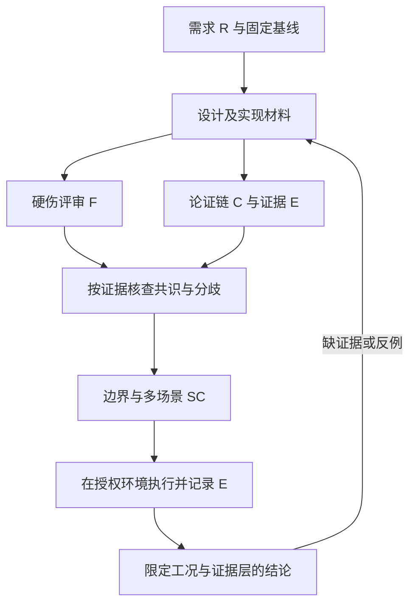

# 方案评审、论证链与多场景验证 Skills 接入

2026-09-22。交付范围为项目技能、模板、路由与使用验证；没有修改机器人运行逻辑，也没有将本次技能整理计为机器人验收。

## 1. 技能如何配合

| 项目 Skill | 解决的问题 | 具体输出 |
|---|---|---|
| [robot-design-review](../.agents/skills/robot-design-review/SKILL.md) | 方案值不值得采用、技术硬伤、风险和需求遗漏 | 选型取舍、发现 F、关闭判据；默认只读被评材料 |
| [robot-argument-audit](../.agents/skills/robot-argument-audit/SKILL.md) | 前提为何支持结论、隐含假设、事实与推断混写 | 主张 C、假设 A、证据 E、反例和成立范围 |
| [robot-scenario-boundary-validation](../.agents/skills/robot-scenario-boundary-validation/SKILL.md) | 哪些场景足以检验方案、边界/故障/恢复如何测 | 场景 SC、独立判据、阈值来源、结果与未覆盖项 |
| [robotics-validation-evidence](../.agents/skills/robotics-validation-evidence/SKILL.md)（更新） | 结果到底证明什么 | 实现、离线、隔离 ROS、仿真、真机的证据边界 |

入口仍为 [astribot-architecture-design](../.agents/skills/astribot-architecture-design/SKILL.md)。数据流和任务接收技能也增加了对应入口；既有 Nav2/MTC/世界模型/安全领域技能继续负责具体设计约束。

两个视角不是两个阵营，论证核查不会为方案辩护。评审一致不能代替事实；单方高严重度发现同样保留。若由同一评审者顺序完成，明确标注，不能宣称独立复审或把同源证据算两次。

## 2. Doubao 来源与改编边界

用户提供的能力说明是需求输入。本次另外定位并读取了 [公开归档仓库](https://github.com/ahang1598/doubao-workbuddy-qwenwork-skills) 中五个技能的入口。它是第三方镜像，不是已核实的官方发布渠道。

固定检索版本：`ee9ee7c7e7f24a57351863259be4f51b0db274a1`。GitHub API 的仓库 license 字段为空，检查根目录、doubao 与 skills 层未见许可证文件；这不证明每个文件都无许可，但不足以把整包视为已获复用授权。因此未安装或复制原版，仅依据用户需求和本项目证据独立编写以下适配。

| 用户提到的技能（镜像固定版本） | 本项目采用的思路 | 具体转换 |
|---|---|---|
| [academic-evaluator](https://github.com/ahang1598/doubao-workbuddy-qwenwork-skills/blob/ee9ee7c7e7f24a57351863259be4f51b0db274a1/doubao/skills/doubao-academic-evaluator/SKILL.md) | 诊断与改写分离、结论配证据 | 评审控制权、实时预算和闭环可行性；工程方案不以论文新颖性作默认门槛 |
| [critical-reading-companion](https://github.com/ahang1598/doubao-workbuddy-qwenwork-skills/blob/ee9ee7c7e7f24a57351863259be4f51b0db274a1/doubao/skills/doubao-critical-reading-companion/SKILL.md) | 还原主张、前提与证据关系 | 原版面向公共文本；本地版核查机器人设计/验收报告，增加时钟、epoch 和测试范围 |
| [product-analysis](https://github.com/ahang1598/doubao-workbuddy-qwenwork-skills/blob/ee9ee7c7e7f24a57351863259be4f51b0db274a1/doubao/skills/doubao-product-analysis/SKILL.md) | 选择与需求挂钩、说明取舍 | 按操作员任务、可恢复性、完成率与维护成本检查，不强制商业报告 |
| [industry-analysis](https://github.com/ahang1598/doubao-workbuddy-qwenwork-skills/blob/ee9ee7c7e7f24a57351863259be4f51b0db274a1/doubao/skills/doubao-industry-analysis/SKILL.md) | 一手证据与替代情景 | 原版偏产业基本面；工程适配只核查框架/硬件适用条件，不能据它证明行业标准设计 |
| [compliance-assessment-public](https://github.com/ahang1598/doubao-workbuddy-qwenwork-skills/blob/ee9ee7c7e7f24a57351863259be4f51b0db274a1/doubao/skills/doubao-compliance-assessment-public/SKILL.md) | 来源、适用范围与缺口可追溯 | 原版偏法律；本项目仅加安全论证与标准适用性检查，不将法律分析等同功能安全认证 |

原版中的飞书输出、外部专用工具、投资/论文结构不作为依赖；默认输出本地 Markdown，不向第三方上传项目资料。取得入口不代表运行或验证了原版所有子技能。

SSM/ISO 的本地适配见 [安全论证边界](../.agents/skills/robot-design-review/references/safety-case.md)。例如 [ISO 10218-1:2025 官方范围](https://www.iso.org/standard/73933.html)不能直接覆盖移动平台运动；须按使用场景拆分适用性。本次只核查公开范围/版本，没有取得完整标准条款，不宣称符合性。

## 3. 与当前实现对应的具体约束

以下是当次读取源码与既有报告得到的映射，报告中的实验没有在本轮重跑；当前工作区存在大量并行修改，源码、历史实验和运行安装不能互相替代。

| 方案/模块 | 本轮核对入口 | 技能要求检查的断点 |
|---|---|---|
| GraspNet 与已知 CAD 6D | [实现及记录](GRASP_POSE_SIMULATION_20260921.md)、[推理服务](../ws_robot/src/astribot_s1_manipulation_perception/src/manipulation_perception_server.cpp) | 真实推理已有实现；代码候选设 `collision_checked=false`、`collision_free=false`，仍需 IK/碰撞与执行事务；不能继续沿用旧“尚未实现”结论 |
| 7 个姿态场景 | 同上记录及其原始评分索引 | 历史记录为 2/7 放行、5/7 拒绝；拒绝合理性与产品工作域分别评价，不能说“七场景姿态全部成功” |
| 虚拟墙/禁区 | [手册](manuals/VIRTUAL_WALLS_AND_KEEP_OUT.md)、[zone server](../ws_robot/src/astribot_navigation_zones/src/zone_server.cpp) | 保存后清空 ACK 等待消费者；当前 token、身份与时效共同决定 ready；policy off 的保护能力范围单列 |
| 导航任务 | [C++ arbiter](../ws_robot/src/astribot_s1_task_arbiter_native/src/task_arbiter_node.cpp) | 已有原生仲裁入口；取消请求、后端终态与反馈停稳分别检查，不能按旧 Python 文件不存在认定模块缺失 |
| 相机/传感时序 | [硬同步方案](SENSOR_HARD_SYNC_DESIGN_20260922.md)与包内 C++ 核心 | 有同步证据检查，物理触发/曝光验收仍未实现或未验证；时间配对不修复传输积压 |
| C++ 迁移 | [阶段报告](CPP_MIGRATION_STAGE_REPORT_20260921.md) | 保留版本与暂停候选分开；均值、P95、最大延迟、语义保持和回退依据分别记录 |
| 固定姿态搬运 | [transport README](../ws_robot/src/astribot_s1_transport/README.md) | 运动学附着的仿真范围、保载/放置/退臂、任意阶段恢复限制，不外推摩擦或双臂动态搬运 |

后续按 [15 类项目场景](../.agents/skills/robot-scenario-boundary-validation/references/project-scenarios.md)选择受影响项，重点组合为：

- 携物/包络扩大 × 禁区切换/部分 ACK；
- 推理 × 遮挡/不可观测 × epoch 变化；
- 多相机 × GPU/DDS 负载 × 导航取消；
- 运输释放阶段 × 进程重启/迟到执行结果；
- C++ 重构 × 数值边界/取消竞争 × 尾延迟。

## 4. 一次只读示范：把已有边界转成闭环条目

以下是对已有材料的受限主张核查，不声称新发现了运行故障。E 为本轮可读材料，不是本轮新实验。

| R/C/F/SC 关联 | 可支持的主张 C 与证据 E | 外推风险 F | 下一项 SC 与关闭判据 |
|---|---|---|---|
| R-PERCEPTION / C-01 / F-01 / SC-INFERENCE | E-01：推理服务源码可产生绑定快照的候选，同时显式未碰撞检查 | 若据候选成功声称可执行抓取，会越过计划/场景/任务准入；这是条件性风险 | 候选→MTC 的错误 frame、旧快照、IK 无解、碰撞场景应无执行提交；正常候选完成全链后另验抓持 |
| R-ZONES / C-02 / F-02 / SC-ZONE | E-02：zone server 保存返回 SAVED_WAIT_APPLICATION，ready 依赖消费者 ACK | 不能把持久化回执当当前运动许可；手册已明确，不重复记作实现缺陷 | 保存后缺失/陈旧/冲突 ACK、地图换代，应保持未就绪；补齐当前消费者后才允许受控新任务 |
| R-TIMING / C-03 / F-03 / SC-SYNC×SC-LOAD | E-03：同步方案区分合成时序证据、物理触发与接收新鲜度 | 合成边沿或共同 stamp 不能证明曝光/实际负载链通过 | 先验影子监控的边界/失锁语义；实际设备侧带与曝光证据单独列待硬件，不以软件测试关闭 |

未运行上述 SC，状态均为 NOT_RUN；缺明确有效配置或硬件的依赖项为 BLOCKED。完整闭环需要将实验 E 关联回来，而不是把本表当验收结果。

## 5. 使用方式

可以直接提出以下请求：

1. “用 robot-design-review 和 robot-argument-audit 只读评审某方案，给出证据锚点、硬伤与分歧，不修改被评文档。”
2. “用 robot-scenario-boundary-validation 为该改动生成场景卡，覆盖正常、边界、故障、恢复和负载，先给计划，不启动仿真。”
3. “基于指定会话和原始记录，用 robotics-validation-evidence 判断每条场景支持哪些主张，保留失败和未测项。”

可复制模板：[评审记录](../.agents/skills/robot-design-review/assets/review-record.md)、[场景验收卡](../.agents/skills/robot-scenario-boundary-validation/assets/scenario-card.md)。普通小改动只加载相关技能，不强制每次运行完整评审流程。

## 6. 验证边界

本轮先用原有技能做只读基线试评，再验证新增技能的使用效果；记录见 [技能验证](evidence/review_skills_20260922/validation.md)，材料版本见 [输入快照](evidence/review_skills_20260922/source_snapshot.json)。
格式/引用校验和文本场景试评只支持“技能可发现、能按记录组织评审和场景设计”。它们不能证明 Gazebo、真机、安全标准或全部业务场景通过。
