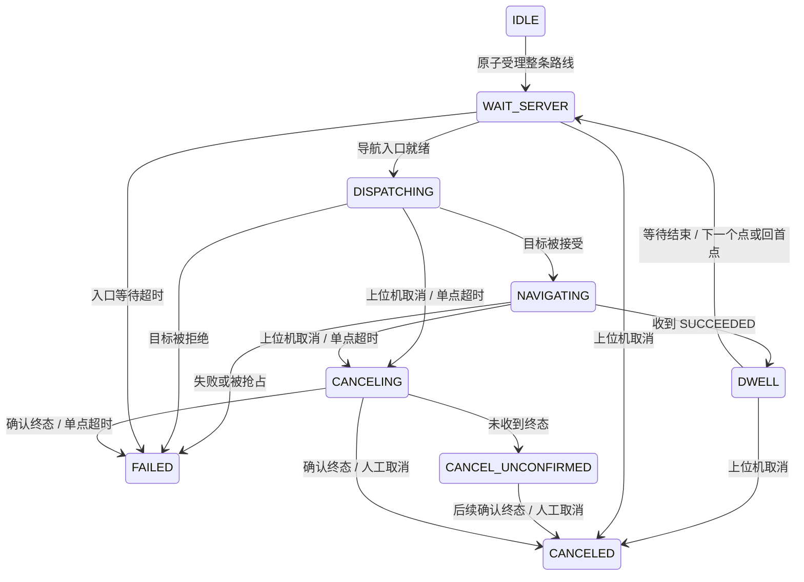

# RViz 多点循环导航

## 操作流程

1. 打开 `astribot_operator_station` 的 RViz，进入“循环路线”Panel。
2. 保持 RViz Fixed Frame 与路线坐标系一致（默认 `map`），点“地图连续选点”。在地图上按下、拖动朝向、松开，形成一个编号导航目标。重复操作增加多个点；该工具只添加草稿，不发导航任务。
3. 在列表编辑 X/Y/Yaw（界面角度为度），用上移/下移、删除、清空调整路线；也可添加坐标行。已有点时锁定坐标系，避免只改 frame 名称而误用旧坐标。可保存/加载 JSON 路线；文件角度为弧度。
4. 设置每点成功后的等待时间，勾选允许启动，点击“确认并开始循环”，核对确认框。至少两个点，最多 200 个；执行器启动但空闲不会移动机器人。
5. 后端按 `1 → 2 → … → N → 1` 一直循环。Panel 显示路线 ID、当前点、完成圈数和状态，运行期间锁定草稿编辑。每一圈表示已通过全部点的成功结果及最后一次等待，开始返回第一个点；不是规划器统计的里程圈数。
6. 点击“取消当前循环路线”，或由上位机调用取消服务。等待 `CANCELED`；取消受理、取消 ACK、导航终态和物理停稳不是同一件事。

编号箭头是目标位置和朝向，不是已规划且可通行的路径。路径规划、碰撞检查、精确到位、速度平滑、底盘安全门均沿用现有导航链。

## 模块与边界

- `astribot_operator_msgs`：上位机启动/取消的强类型服务，外部上位机可直接调用。
- `astribot_route_executor`：独立 C++ 节点，保存执行中的路线副本，唯一写入路线状态；单个导航 Action 终态后才能产生下一个目标。
- `astribot_operator_station/RoutePointTool`：C++ RViz PoseTool，连续选点并发布草稿点 `/operator/route_point`。
- `astribot_operator_station/LoopRoutePanel`：C++/Qt 草稿编辑、JSON 保存/加载、启动确认、状态查看和按 ID 取消；`/operator/route_preview` 显示编号与朝向。当前草稿选点/预览话题在 ROS 域内共享，建议只启用一个选点编辑窗口；多控制端同时启动由后端拒绝重叠任务。

执行器只向 `/route/navigate_to_pose` 发送 `NavigateToPose`，不直接发布速度、不绕过仲裁器。现有优先级保持 `operator 100 > route 50 > exploration 10`。被 operator 抢占后，本轮目标非成功终止，整条循环路线结束为 FAILED；不会自动重试并抢回控制权。导航普通失败同样停止整条路线，不跳过失败点、不无限重试。

关闭 RViz、取消勾选启动许可，都不会取消已经受理的路线。执行器在机器人端独立运行，符合“持续循环直到上位机取消”的正常流程；连接丢失时 GUI 禁止新启动，重连后从状态还原运行路线并可取消。故障、抢占、超时会提前停止循环。生产权限仍依赖部署鉴权，勾选框不是权限系统。

## 状态与取消



- 只取消执行器拥有的导航 goal handle，禁止 cancel_all。
- 在目标受理响应到达前取消，会保留取消意图；目标迟到受理后立即取消，绝不发下一点。
- 超时或取消 ACK 不释放任务所有权；没有终态时保持 CANCEL_UNCONFIRMED，拒绝新路线。迟到终态会正确解除占用。
- 当前路线还未结束时拒绝第二条启动请求。当前 request_id 重发同一内容只返回已有路线 ID 和状态，不重新开始；同 ID 不同内容拒绝。本进程已接受的旧 request_id 也不会重新执行；最多保留 10000 个 ID，达到上限后拒绝新请求，需在空闲时重启执行器。该记录不跨进程重启持久化，重启后需明确重新确认任务，不能盲目重放旧启动请求。
- 取消必须携带匹配的 route_id，旧界面不能误取消后续新路线。route_id 包含执行器本次启动标识。
- 执行器正常收到 SIGINT/SIGTERM 时尝试取消并等待最多 10 秒；不能确认则返回非零退出码，不声称停稳。强杀、进程崩溃和断电不保证取消，当前不持久化恢复动作所有权；不能把新进程 IDLE 当作机器人已停稳的证明。

## 上位机接口

| 名称 | 类型 | 输入 / 输出 |
| --- | --- | --- |
| `/loop_route_executor/start` | `astribot_operator_msgs/srv/StartLoopRoute` | request_id、expected_boot_id、PoseStamped[] waypoints、dwell_sec；返回 accepted、route_id、reason、boot_id、active、state |
| `/loop_route_executor/cancel` | `astribot_operator_msgs/srv/CancelLoopRoute` | route_id；返回 accepted、reason，完成结果看状态 |
| `/loop_route_executor/status` | transient-local `std_msgs/String` JSON | schema_version、boot_id、route_id、active、state、reason、index（0 起）、completed_cycles、waypoints、dwell_sec、outstanding_goal |

ROS 控制接口示例（ID 必须来自实际状态）：

启动前必须读取状态中的 boot_id，作为 expected_boot_id。执行器拒绝其他启动实例的请求，避免后端重启后重放旧任务。Panel 检测到实例变化会清除旧待确认请求并取消启动勾选；启动确认框打开期间发生重启、状态过期或已有任务运行，也会使本次确认失效。重复请求返回当前 active/state，已结束路线不会被界面重新显示为运行中。此服务接口有新增字段，外部客户端与执行器、Panel 必须同步重新编译。

```bash
ros2 service call /loop_route_executor/cancel astribot_operator_msgs/srv/CancelLoopRoute "{route_id: '<实际 route_id>'}"
```

默认每点任务期限 300 秒、等待导航入口 10 秒、取消确认期限 10 秒。使用 steady clock；仿真暂停也会消耗期限。路线点必须同一坐标系、有限平面坐标、归一化朝向；目标发送使用最新 TF，不携带选点时陈旧时间戳。地图更换后应结束旧路线并重新确认坐标，当前不实现跨地图路线事务。

## 启动与日志

导航 `navigation.launch.py` 随仲裁器启动空闲执行器；不要再启动第二份同名执行器。RViz 工作站只启动界面，直接沿用 `operator.launch.xml`。已有导航栈需要正常部署新包并在后续启动加载；本次开发未重启共享导航进程。

独立开发后端可使用 `ros2 launch astribot_route_executor route_executor.launch.xml use_sim_time:=true`，仅在导航入口已有且没有其他路线执行器时使用。代码不新增 Python 运行节点或任务循环脚本，旧耐久实验脚本保留原有用途。

日志沿用启动链的统一采集；状态中包含路线快照和进度。诊断白名单增加 `/loop_route_executor/status` 和 5 项执行参数，可回看路线顺序、停留时间、超时配置与取消过程。

## 验证

使用隔离构建目录 `/tmp/astribot-route-build`，未覆盖共享安装目录。C++ 假导航测试使用 localhost 独立域，验证顺序回环、请求幂等、旧 ID 取消拒绝、停留阶段取消、取消终态屏障、迟到受理、失败/拒绝停止和超时。Qt offscreen 测试覆盖选点消息、排序、启动确认、取消 ID、运行中禁止编辑、重建面板及插件加载，并输出实际面板截图。

独立 C++ 图形测试 `route_viewport_smoke` 在隔离 localhost DDS 域 225 中加载实际 RViz/Ogre、选点 Tool 和 Panel，通过鼠标按下/拖动/松开事件验证两个不同位置及朝向、连续选点和列表同步；没有调用启动服务。截图为 `/tmp/astribot_route_viewport_smoke.png`。该测试需可用 X/GL 显示，不作为无显示环境的默认 CTest。

本轮新增后端重启拒绝旧请求、终态幂等响应、旧响应隔离及确认期间重启的回归覆盖。结果为 11 个路线执行测试 + 1 个新面板测试 + 原有 8 个测试（20 个 gtest 用例；colcon 汇总另计 5 个 CTest 包装项）。此前的包与插件 XML、启动语法、RViz 配置、独立 launch 参数解析、65 项无重复诊断参数检查通过。面板截图：`/tmp/astribot_loop_route_panel.png`，来源为假服务驱动的实际 Qt Panel。

尚未完成完整 Nav2/Gazebo 循环行驶或真机路线验收。后端自动测试只驱动假导航服务，图形测试只编辑草稿，不发送底盘速度或生产导航目标。新包目前仅在隔离构建目录中验证，未覆盖共享安装目录。
