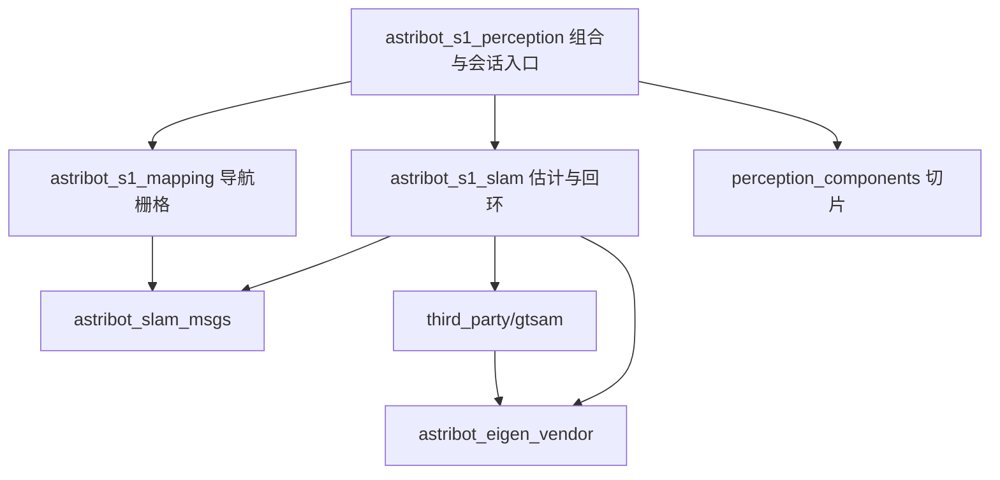

# SLAM 架构评审与接口分包决策

日期：2026-09-18。评审范围为统一 SLAM、Eigen 源码管理、包迁移和消息边界；不代表整仓库或真机验收。

## 决策

保留按领域分包。估计、导航栅格、感知组合启动和消息契约有不同的变化原因，应分别维护。减少数据链路靠删除重复转换/融合/自清转发实现，合并消息包不会减少运行时消息跳数。

| 接口包 | 当前接口数 | 直接消费者 | 保留原因 |
|---|---:|---|---|
| `astribot_navigation_msgs` | 11 msg、3 srv | 探索、路径跟踪、导航策略 | 导航任务、状态与执行约束 |
| `astribot_bridge_msgs` | 1 msg、2 srv | 路径跟踪、轨迹桥 | 底盘执行和桥接边界 |
| `astribot_slam_msgs` | 3 msg | SLAM、栅格、感知 | 关键帧与优化位姿事件 |

三个包之间没有消息类型依赖或依赖环。厂家 `astribot_msgs` 和 Livox 消息保留设备边界，不混入项目业务接口。包迁移已经将 `voxel_slam_msgs` 类型命名空间改为 `astribot_slam_msgs`，消费者必须一起重建；后续保持领域包名称稳定。旧 rosbag 类型不会自动改名。

## 职责和依赖

SLAM 算法包不依赖具体栅格实现；旧 launch 遗留的 mapping 运行依赖已删除。栅格只消费关键帧契约和必要观测。感知包负责选择设备参数与组合进程，当前 `slam_session` 属于这里的应用协调逻辑；今后只有出现多个独立地图管理客户端时，才考虑单独的地图会话服务。

Eigen 通过 imported target 和目标级 include 使用，禁止目录级注入。GTSAM 构建与 ROS vendor 安装使用同一份受校验源码；不把第三方源码当成 colcon ROS 包。部署快照携带 `src`、`third_party` 与构建脚本，目标机器自行编译。已编译的厂家/PCL/ROS 库仍需独立核对 ABI。

## 设计原则对应

“八大原则”并无统一的认证清单，这里按本项目使用的八项评估，不声称通过某种标准认证。

| 原则 | 本轮处理 | 仍需约束 |
|---|---|---|
| 单一职责 | 估计、栅格、接入组合分离 | `voxelslam.cpp` 内部仍过大 |
| 开闭原则 | 设备统一 PC2/IMU 输入，视觉预留接口 | 视觉记录不等于视觉融合实现 |
| 里氏替换 | 仿真/硬件遵守相同 frame、时间、状态契约 | 不同设备的时延、外参及协方差需实测 |
| 接口隔离 | 三个领域消息包互不依赖 | 不把所有状态合并成万能消息 |
| 依赖倒置 | 栅格通过 SLAM 消息消费结果 | 会话保存仍协调多个具体输出文件 |
| 最少知识 | 移除 SLAM 对栅格包的直接依赖 | 应用层集中管理生命周期与保存顺序 |
| 组合复用 | 启动组合、共享自滤几何、CMake target | 不复制设备专用中间节点 |
| 高内聚低耦合 | 数值库源码独立、消息按变化领域划分 | 不为减少包数扩大编译和发布耦合 |

## 已修正的问题

- Eigen 源码统一、来源与 SHA-256 锁定，去掉 GTSAM 内置副本；五个直接消费包的实际编译依赖已核对。
- 目标级 Eigen 配置替代目录级 include；SLAM 编译选项不再覆盖全局 CMake flags。
- Eigen CMake config 不再修改调用方 `PACKAGE_PREFIX_DIR`，避免破坏 MoveIt/OMPL 的可迁移依赖路径。
- SLAM/桥接接口包导出 `rosidl_default_runtime`；SLAM 消息注释统一为当前 `map` 语义，未改变字段类型或顺序。
- 去掉嵌套 SLAM 工作空间和旧专用启动入口，干净构建显式准备 Livox manifest 与项目数值依赖。

## 后续按独立阶段处理

1. **故障恢复的坐标连续性**：算法退化后的 `system_reset()` 会重置局部状态，现有注册状态和回环工作线程尚未形成带代次的恢复事务。不能把本轮正常建图/载图通过外推为退化重定位通过。下一阶段需明确故障停用、地图代次、重定位确认和重新授予导航权限，并以退化/时钟/输入中断场景验证。
2. **会话协议**：`KeyframePoseArray` 混合位姿更新和最终导出路径。未来拆分地图数据事件与保存请求/结果；长耗时保存采用 Action，带会话 UUID、版本、进度和结构化失败原因。当前 CLI 必须先结束导航/探索再保存；停稳检测不能代替任务互斥锁。
3. **坐标与重放契约**：当前 `session_id/keyframe_id` 依赖整栈启动生命周期。热重启或跨机器同步前，补齐 epoch、地图 revision、Header/frame、QoS 和幂等规则；避免把旧消息写入新地图。
4. **算法内部拆分**：先分离归档 IO、ROS 适配和生命周期，再处理估计与回环线程；每步保持固定路线数据回归，不在整理目录时重写估计核心。

本轮不修改这些协议字段或新增自动恢复状态机，避免把结构迁移与行为变更混为一次验收。正常链路验证、运行日志和未覆盖项见[统一 SLAM 参考](SLAM_INTEGRATION_REFERENCE_20260918.md)。

## 参考

- [ROS 2 Humble 接口定义](https://raw.githubusercontent.com/ros2/ros2_documentation/humble/source/Concepts/Basic/About-Interfaces.rst)：消息、服务与 Action 的边界。
- [CMake target_include_directories](https://cmake.org/cmake/help/latest/command/target_include_directories.html)：目标作用域与可迁移依赖。
- [Eigen 3.4.0 官方版本](https://gitlab.com/libeigen/eigen/-/releases/3.4.0)：源码锁定版本；具体归档与哈希见 vendor.lock.json。
