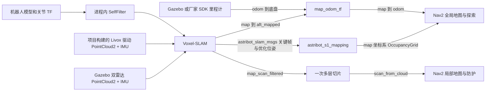

# 统一 SLAM 架构与操作参考

更新：2026-09-18。目标是仿真和真机共用 Voxel-SLAM、建图输出和会话格式，删除仿真 `slam_toolbox` 及旧机器中转链。真实验收范围见本文末尾；代码接线完成不代表真机验收。

## 数据和职责



- 驱动只输出传感器原始坐标，`xfer_format=0`。设备 JSON 外参必须全零，非零配置会被拒绝，避免驱动与算法重复变换。左右雷达外参来自项目 URDF 标定；仿真 IMU 与左雷达共址，真机使用实际 IMU—雷达标定。
- Voxel 内部完成双雷达同步、逐点时间解析、去畸变和激光惯性估计。不再经过 CustomMsg 转换、两路 Python 预处理和 Python 点云融合。
- `astribot_autonomy_core::perception_geometry` 的自滤几何由 Voxel 和切片复用。唯一默认参数在 `astribot_s1_perception_components/config/self_filter.yaml`；连杆 TF 缺失或陈旧时丢弃该帧，不能把机器人自身积累到地图。真机必须有真实关节状态。
- `astribot_s1_mapping`（节点 `nav_prob_grid_node`）同时拥有在线栅格和最终 PGM/YAML。当前机身内的栅格处理并入本节点，只有新鲜 TF 才清理完整落入机身的栅格；没有历史轨迹清除。最终导出等待所有关键帧到齐，不能把迟到的关键帧优化位姿丢掉。
- `/map` 使用 reliable、transient-local。`/scan_from_cloud` 只有一个切片发布者。旧 `/map_nav`、自清转发节点和第二次 pointcloud_to_laserscan 不再属于启动链。

## 坐标、时间及状态

唯一导航树为 `map → odom → astribot_torso_base → 各连杆/传感器`。Gazebo 或只读 `chassis_odom_node` 拥有连续里程计边；`map_odom_tf` 负责分解 SLAM 与里程计，保留回环修正。`map → aft_mapped` 是 SLAM 底盘位姿诊断分支，不能再连到 `astribot_torso_base`。算法点云、栅格与位姿直接使用 `map`，不再需要 `map → camera_init` 恒等别名。

`/slam/pose` 为雷达校正时刻的底盘 `PoseWithCovarianceStamped`，供 `arrival.source=slam_pose` 使用。协方差从估计器局部误差变换至底盘；不包含外参、地图和全局回环的不确定性，不能据此宣称真机绝对到位精度。20 Hz TF 可在雷达帧间做 IMU 外推，但保留源时间戳，超过 `General.max_pose_age_sec`（默认 0.5 s）停止输出。

`/slam/status` 为 transient-local 字符串状态：`INITIALIZING → TRACKING`（新建图），或 `INITIALIZING → LOCALIZING → TRACKING`（载图）。存图为 `FINALIZING → FINISHED`。状态快照不能替代实时健康检查；TF 和输入数据的新鲜度仍必须通过。加载历史文件不代表已定位：完成跨会话匹配及回环修正应用前，不发布可供导航使用的全局位姿和在线扫描。

视觉图像和外参接口仍在 Voxel 配置中预留；当前未实现视觉参与定位估计，不把图像记录接口描述成视觉融合。视觉/mark 到位接口保留原控制器契约。

## 建图、存图、载图

生产构建空间为 `ws_robot/install`；本轮隔离开发验证使用仓库根的 `install`。命令必须 source 实际完成构建的安装空间。

```bash
source /opt/ros/humble/setup.bash
source /home/yjh/WorkSpace/astribot_sdk_ros2/install/setup.bash

# 建图和导航，启动 RViz；目录必须尚不存在
python3 tools/sim_stack_supervisor.py --mode mapping --headless \
  --save-session /tmp/astribot_slam_sessions/site_a

# 自动探索选点（会产生仿真运动）
python3 tools/sim_stack_supervisor.py --mode explore --headless \
  --save-session /tmp/astribot_slam_sessions/site_b

# 先结束探索与导航并停稳，然后保存；这会结束当前 SLAM 会话
ros2 run astribot_s1_perception slam_session save --timeout 120
ros2 run astribot_s1_perception slam_session inspect /tmp/astribot_slam_sessions/site_a

# 正常停止原主管后，在同一仿真场景冷启动载图定位
python3 tools/sim_stack_supervisor.py --mode localize --headless \
  --map /tmp/astribot_slam_sessions/site_a --match-threshold 0.3
```

`save-session` 保存目录包含 `kf/*.pcd`、`alidarState.txt`、底盘/雷达轨迹、PGM/YAML 和完整性 manifest。名称禁止路径穿越和覆盖；检查 PGM 长度、轨迹行格式/四元数、关键帧索引和文件校验和。载图必须存在最终提交的 manifest，且版本、坐标系和会话信息一致。PGM/YAML 只是二维导航图，不能单独替代 Voxel 关键帧会话。当前统一导航入口一次加载一个已完成的会话，拒绝把未对齐的多个地图混成同一 `/map`。

`--mode baseline` 单独保留静态地图和仿真真值定位，使用 `slam_backend=static_map`，此时 Voxel 只提供当前点云，关闭其栅格发布及 map→odom 分解。它不是另一套 SLAM，也不是旧机器兼容模式。静态图必须与仿真场景/出生点一致。

静态基线的切片设置 `cloud_pose_frame=aft_mapped`：用 SLAM 自身位姿将世界点云还原到底盘，再输出 `astribot_torso_base` 扫描，由真值 TF 放入导航图。这要求两个底盘帧代表同一物理原点和轴向，避免将 SLAM 原点高度差或漂移当成障碍物偏移。默认建图、载图和真机仍使用导航底盘帧。基线中的 SLAM 世界点云仅用于这条局部投影链，不能直接当成静态导航图的全局障碍输入。

## 真机部署

`tools/robot/run_deployed.sh sensors|precision|explore` 使用当前 release 构建的驱动、Voxel、栅格、切片和只读 SDK 里程计。原外部 `/home/astribot/SLAM`、`/home/astribot/s1_tools`、外部驱动 launch、TF 差分里程计、自清转发和旧 `s1_hardware_bringup*.sh` 已从接入方案移除。厂家 SDK 与本体服务仍是硬件驱动所需依赖。

设备 IP/主机网卡地址在两个 MID360 JSON 中是现场配置项，不能视为已经实测确认。修改网络字段，保持外参零值；通过 `tools/robot/config/deployed_sensors.json` 选择配置和会话根目录。先运行 `sensors --dry-run`，核对只读链；真机验证按：唯一新鲜传感器 → SDK 里程计 → TF → 栅格和扫描 → 静止存图 → 受控短路线 → 重新定位。底盘运动授权与现有急停、防护流程保持在指令桥层。

数值库不通过外部工作空间查找。`astribot_eigen_vendor/vendor/eigen` 管理唯一一份 Eigen 3.4.0 源码；保留官方头文件和许可证，用 `vendor.lock.json` 的 SHA-256 验证来源及文件完整性。GTSAM 源码位于 `ws_robot/third_party/gtsam`，其内置 Eigen 副本已删除。`tools/robot/build_slam_dependencies.sh` 先将项目 Eigen 安装至 `ws_robot/deps/eigen`，再构建 GTSAM 至 `ws_robot/deps/gtsam`；colcon 的 Eigen 安装也来自同一份源码。两个安装前缀不是两套维护版本。

所有直接使用 Eigen 的项目源码目标显式依赖 `astribot_eigen_vendor`，通过 `Eigen3::Eigen` 与 `astribot_target_eigen(target)` 获得头文件；不使用目录级 include 注入或硬编码系统路径。GTSAM 的 `GTSAM_USE_SYSTEM_EIGEN=ON` 在这里表示使用项目提供的外部 Eigen，另固定 `GTSAM_BUILD_WITH_MARCH_NATIVE=OFF`。配置阶段校验 GTSAM/Eigen 版本，编译依赖文件可核对实际使用的头文件。更换 Eigen、工具链或目标 CPU 后需重建 GTSAM 和所有源码消费者。

预编译的 ROS、PCL、MoveIt 和厂家 SDK 不会因头文件纳入仓库而自动重建；仍须核对其版本、SIMD 和内存对齐 ABI。本机配套版本为 Eigen 3.4.0，不能把该结果外推至真机。Livox SDK2 仍需在目标架构安装；`build_robot.sh` 自动准备驱动 manifest、项目 Eigen 和 GTSAM，本轮没有部署到真机。

## 源码和接口边界

| 包/目录 | 职责 |
|---|---|
| `astribot_s1_slam` | 激光惯性估计、回环、关键帧和三维会话 |
| `astribot_s1_mapping` | 导航栅格、机身内栅格处理和二维地图导出 |
| `astribot_s1_perception` | 传感器接入、SLAM 组合启动、会话保存/校验入口 |
| `astribot_slam_msgs` | SLAM 关键帧和优化位姿契约 |
| `astribot_eigen_vendor` / `third_party/gtsam` | 统一数值依赖源码 |

消息包按领域保留：`astribot_navigation_msgs`、`astribot_bridge_msgs`、`astribot_slam_msgs` 互不依赖，不合并为全局接口包。SDK 和 Livox 消息保留厂商边界。原 `src/SLAM` 嵌套工作空间已移除；类型从 `voxel_slam_msgs` 改为 `astribot_slam_msgs` 后必须同步重建所有消费者，不保留旧类型适配器。话题、运行节点名和保存格式中的算法标识 `voxel_slam` 保持不变。详见[架构评审与决策](SLAM_ARCHITECTURE_REVIEW_20260918.md)。

## 验收记录与未完成项

迁移后的最终包布局、项目 Eigen/GTSAM 和最新建图/载图复测见[本轮最终验证](SLAM_SIMULATION_VALIDATION_20260918.md)。run15 建图 3/3，run16 冷启动载图及复测各 3/3；最大到点误差为 2.690 cm / 1.395°（SLAM 坐标下）。run16 首轮有 1 次采样缺口，复测未出现；瞬时时效告警根因尚未确认，不能宣称完整实时性验收通过。run16 另完成两个自主探索目标及驻留，再在候选校验阶段通过暂停服务冻结派发。

- 已完成：标准 PointCloud2/IMU 仿真输入、200 Hz IMU、约 10 Hz 双雷达及扫描、约 1 Hz 在线地图；Gazebo、RViz、七个 Nav2 节点 active。
- 历史本轮短距离直接运动探针：SLAM 对仿真里程计最大差 8.9 mm / 0.37°，仅代表该短探针，不是导航到位精度验收。
- `run8a` 首段规划发现自身占据；修复后 `run9` 同一三段路线 3/3 通过，最大 2.588 cm / 1.362°，无路线异常告警。地图保存包含 43 个关键帧与 2174 条扫描位姿。
- `run10` 冷启动加载该地图，跨会话匹配 score=1.0，ICP rmse≈0、最小特征值 32.13（仿真同场景）；完成匹配与优化后才放行位姿。相同三段路线 3/3 通过，最大 2.561 cm / 1.344°。
- `run10` 自主探索连续完成 2 个目标的导航、到点及驻留校验，然后通过暂停服务取消后续目标。它验证候选选择到导航反馈闭环，不等于整仓库探索完成。
- 已离线拒绝：路径穿越、覆盖既有会话、无会话定位、缺失会话、非法阈值、非有限外参、PGM 截断和文件校验和不一致。
- `run11` 静止建图只有 1 个关键帧、338 条扫描位姿，存图与 manifest 校验通过；修复了稀疏优化任务直接退出、未生成完整地图的问题。
- `run12` 静态地图/真值基线同组三段路线 3/3 通过，最大 1.193 mm / 0.039°，无路线异常告警。此模式采用既有 simulation_precision（2 mm / 0.1°），与普通 SLAM 模式精度配置不同，不能用两组到点误差比较定位算法优劣。
- 全仓库探索、完整历史跟踪路线、窄通道及真机运动回归尚未完成。三段短路线不能证明所有场景性能不低于原基线。

当前实测日志根目录：`/tmp/astribot_slam_unified/`。统一日志索引：`~/.ros/log/astribot/latest_sim/session.log`；该索引指向最近会话，状态以会话 `session.json` 为准。

## 机器人相机标定同步（2026-09-20）

从 `astribot@10.249.22.137` 只读取得 `/etc/config/sensor_calib.json`，并与
`/opt/astribot_ros/software/astribot_camera/config/sensor_calib.json` 做 SHA-256 核对，
两者均为 `40ffd44f5ab103b2b03f2877fa9f4c4bd4511de2bd72d17263456a0b7acc1cd3`。
文件包含 `head_rgbd`、`torso_rgbd`、左右腕部 RGB-D 以及头部双目相机的内参与外参。

本仓库新增：

- `ws_robot/src/astribot_s1_description/config/camera_calibration_robot.json`：机器人原始标定快照；
- `camera_head_rgbd.yaml`、`camera_torso_rgbd.yaml`、`camera_left_wrist_rgbd.yaml`、`camera_right_wrist_rgbd.yaml`、`camera_head_stereo_left.yaml`、`camera_head_stereo_right.yaml`：六路仿真相机 profile；`camera_rgbd_transport.yaml` 保留为头部 RGB-D 兼容入口。

仿真默认已加载六路实测相机；头部 RGB-D 的 profile 为 `1280×720`、
`fx=749.075, fy=748.902, cx=636.504, cy=358.606`，畸变为
`[0.0765807, -0.106598, -0.0000918542, 0.000439831, 0.0439563]`。
外参来源为机器人 `head` → `head_rgbd` 矩阵；同步到本项目时映射为
`astribot_head_link_2` → `head_rgbd_camera_optical_frame`，并扣除了 URDF 固定的
`camera_link` → `camera_optical_frame` 旋转。重构误差小于 `1.2e-8`。

当前 Gazebo 相机链路会实际消费六路相机各自的 mount、分辨率、FOV 和裁剪范围；profile 中保留完整
内参、畸变和原始矩阵作为校准来源。默认通过 `camera_calibration_postprocess` 使用 OpenCV Brown 模型对六路图像做重映射，并重发布真机 `K/D` 的 CameraInfo；Gazebo 原生 `<distortion>` 作为可选近似模式保留，不能与后处理同时开启，否则会重复畸变。
本次没有激活真机相机服务，也未调用运动接口；机器人运行时没有 CameraInfo 话题可读，
因此 live topic 采样状态为 `NO_CAMERA_INFO_OBSERVED`，文件标定是本次同步的权威来源。
