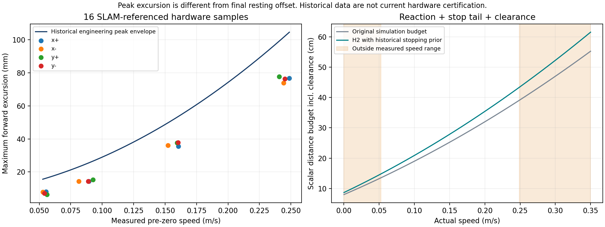

# 社会导航场景规控设计与验证

原策略与社会策略的统一决策、计时和 I0–I6 施工顺序见 [多场景决策规控整合方案](UNIFIED_SOCIAL_NAVIGATION_DECISION_CONTROL_DESIGN_20260919.md)；本文的 H2 基础场景与历史证据继续作为回归输入。

更新：2026-09-19。本文补充 HuNavSim + SFW 集成方案。H0/H1 的基线和场景入口已验收；以下新增行为须按阶段逐项验证。新功能默认关闭，仅在显式仿真配置中启用。真机不自动部署。

## 一、共同的控制契约

1. 任务仲裁器是唯一任务所有者；PolicyNode 是唯一行为仲裁入口；FinalProtection 是启用策略时的唯一最终速度出口。社会模块不发布 Twist，不新建并行控制器。
2. 碰撞、停车过程、传感器覆盖、手臂/载荷包络是硬条件；社会空间、对人的扰动、靠右偏好是软代价。任何软代价不能降低硬净空。
3. ThreePhase / MPPI / Arrival 保留固定目标模式。普通导航仍只因目标变化或路径碰撞风险触发规划。候选二次检查包括全包络、未知区、曲率/曲率变化、接回切线、目标朝向和停止空间。
4. 执行优先级：输入/执行故障与物理风险 → 通道通行约束 → 已承诺的队列/跟随/超越任务语义 → 让行/局部绕行/全局规划 → 原路继续。合并限制取更严格者，不能覆盖另一个组件的停车。
5. 先检查原路径在允许速度下是否可执行，再比较等待与候选。短暂横穿不主动重规划；持续占用且存在合法替代路线时才请求有限候选。等待时保留任务、路径和控制阶段，恢复时沿现有平滑链路加速。
6. 只用采集时间、去重后的人员轨迹；保留视觉深度、协方差、ID/epoch、遮挡状态接口。人体意图未知，不从 HuNav 隐藏目标、行为标签推断“人会让路”。仿真真值输入必须显式标注，真机入口拒绝。
7. 预测同时覆盖匀速和突然停下，加上观测龄期、速度误差与离散步进误差。交互预测仅评分，不能取代保守预测。当前状态、预测路径和真实停止过程分别检查。
8. 停车不能阻止人主动撞向机器人。若静止位置也将被占用，标记 STATIONARY_CONFLICT；只有已验证侧方等待区/退出路径才能机动，否则停车并报告 NO_SAFE_MANEUVER，不能声称碰撞风险消失。

## 二、场景决策表

| 场景 | 进入依据与优先动作 | 退出/异常 | 规划条件 | 阶段 |
|---|---|---|---|---|
| 无人、远离任务路径 | 原路原速；社会增量为零 | 新鲜空观测与无数据明确区分 | 原规则 | H2 |
| 单人横穿 | 预测时空冲突；先比较原速、减速、等待 | 连续清空 0.6 s 且停车过程安全后恢复 | 短暂横穿不换路 | H2 |
| 两人先后/交叉横穿 | 对全部人员取硬风险并集，不能只跟最近人 | 所有冲突解除后再确认清空；不在两人间抢行 | 阻塞持续才评价绕行 | H2 |
| 迎面会车，有侧向空间 | 提前减速；优先已知右侧通行/等待区 | 不因对方瞬时横移反复换边 | 侧方全段及停稳位置检查后提交 | H2 等待 / H4 侧绕 |
| 迎面不让行 | 不假设对方避让；检查停驻点未来是否仍安全 | 无合法机动报告 NO_SAFE_MANEUVER；不盲退 | 有后方覆盖与完整退出路径才退让 | H2 识别 / H4 机动 |
| 同向慢行 | 保持停止间距，先降速跟行 | 对方离开冲突区域则恢复 | 明确允许且全段可见才超越 | H2 降速 / H4 超越 |
| 人突然停下/折返 | 立即使用停止分支预测与独立制动检查 | 新轨迹稳定且清空确认后恢复 | 急变不立即反向换边 | H2 |
| 人站在目标点 | 在目标外保持净空，保留终点与朝向 | 人离开后精调；超时报告 GOAL_OCCUPIED | 禁止把终点偷偷改成旁边的空点 | H2 |
| 人从背后追近 | 仍评估后向相对接近；不突然倒车 | 无避让区则风险报告 | 已验证前进/侧移区才改变动作 | H2 / H4 |
| 正面跟随 | 锁定身份，沿目标历史轨迹落后一定弧长 | 目标停则保持距离；不是任务完成 | 参考显著移动才触发目标变化事件 | H3 |
| 跟随直角/掉头 | 保留轨迹拓扑，禁止直线切角 | 曲率不合法或方向突变则先停并对齐 | 小幅参考更新保持 FOLLOW，不反复 setPlan 重置 | H3 |
| 跟随遮挡/换 ID | 暂停更新移动参考，减速停稳；不得追最近的人 | 同一源 epoch/ID 确认恢复；超预算 TARGET_LOST | 重捕获需重新验证连接路径 | H3 |
| 静止队列/走停队列 | 明确队列区域、方向和前车，保持弧长间距 | 有序等待用队列预算；动作故障仍单独检测 | 队列小幅前移不全局规划 | H3 |
| 插入/离队/前车交换 | 停止使用旧前车引用，稳定重建顺序 | 不越过未授权前车，不靠距离猜队首 | 队列关系版本变化使候选失效 | H3 |
| 宽通道超越 | 先证明驶出、并行、接回及每阶段停车都可行 | PREPARE→PASS→REJOIN，锁边；新硬风险立即中止 | 同向差速足够、非队列/跟随任务、合流可见 | H4 |
| 超越中对向来人/合流被占 | 降速或停到已验证位置；不能突然换边 | 原承诺失效；无安全回退报告能力受限 | 新路径需重新完整验证 | H4 |
| 窄通道单向/排队 | 入口外对齐，按包络和预测准入 | 内部禁止原地大转向、并排超越 | 已对齐且安全不按宽度档位强制再停 | H5 |
| 窄通道对向占用 | 入口外有序等待；人员不服从机器人预约 | FIFO 租约不等于行人已让路；等待有界 | 只有已知等待区与后方覆盖才退出 | H5 |
| 手臂/载荷变化 | 包络版本握手，重新检查所有已选候选 | 未确认运输姿态禁止授予新运动 | 旧候选立即失效 | H5 |
| 延迟、丢失、时间回跳、重定位 | 旧快照/候选/承诺失效，保留明确失败原因 | 新鲜输入和定位重新确认后才放行 | 不用收到消息时间续期旧观测 | 各阶段 |
| 任务取消/人工接管 | 取消当前所有权与临时参考，执行既有停车交接 | 旧任务结果不能恢复运动 | 不创建新目标掩盖取消 | 各阶段 |

## 三、状态、计时与评分

导航让行状态：CRUISE → SOCIAL_SLOW → WAIT → CLEAR_CONFIRMATION → CRUISE。硬风险可从任意状态进入 WAIT，不受最短驻留限制。清空确认计时仅在持续安全时增长；不同人员交替冲突不能刷新阻塞 episode，目标姿态轻微抖动不能重置等待预算。静止位置有未来冲突单独报告。

H2 先实现原路径的速度候选：原上限、0.15 m/s、等待。候选不得比当前任务/包络允许速度快。候选评分包括舒适空间侵入和 SFW 启发的时间积分社会作用；先剔除硬冲突候选，再比较代价。没有相关人员时明确返回零社会限制，保持原选择。H2 的行为级评分不宣称已经实现 MPPI 每条轨迹的完整 SFW 求解。

当前 H2 评分为排斥作用幅值和舒适代价的时间积分，不使用焦耳单位，也不是上游 SFW 全部公式的逐行移植。H2 先使用各向同性空间；下一段的方向性个人空间和群组偏好属于后续评分器扩展，尚未启用。

个人空间按人员速度方向划分前后，静止/朝向低可信时使用各向同性偏好；同伴群组只有置信度充分时才施加不穿队偏好。身体净空始终独立。候选的预测速度不能小于已执行速度所需的停止包络。

初始仿真参数：2.8 s 时域、0.1 s 步长、0.3 s 观测超时、0.6 s 清空确认、1.0 s 状态驻留；人体半径来自消息，机器人几何/制动来自当前有效包络。期望个人空间、评分权重、等待/重捕获预算单独配置，不能写入原跟踪器参数。

### 后续阶段的执行状态与接口

**跟随**采用 `ACQUIRE → FOLLOW → TARGET_STOPPED / OCCLUDED → REACQUIRE / FAILED`。目标锁至少由任务 ID、感知源 epoch、人员 ID 组成；ID 变化不自动绑定最近人。沿人员已走过的轨迹按弧长回退生成参考，回退距离取舒适间距与机器人停止空间两者的较大值；对前车突然停下的分支不扣除一个假设的“前车也会向前滑行距离”。参考必须经过地图、完整包络与曲率检查。小幅参考更新只更新跟踪参考版本，保持已有 FOLLOW 状态；身份、拓扑或大方向变化才建立新执行上下文。任务取消与人员暂时停下不是同一事件。

**队列**复用移动参考控制，增加 `JOIN → QUEUED → ADVANCE → LEAVE` 和有版本的前驱关系。加入点位于队尾已知空闲区，先检查目标朝向与完整机身净空；队列被遮挡时保持前驱锁，不跳过未知成员。插入人员先触发停车，确认队列顺序后更新前驱；前驱离队需要显式区域/身份事件确认。排队等待使用任务级预算，局部碰撞与输入过期仍立即停车。队列模式禁用超越候选。

**绕行/超越**采用 `PREPARE → PASS → REJOIN → COMMITTED_PATH`。生成左右候选时先保留原路等待候选；每条路线都必须包含离开原路、并行、接回及全程可停位置，不能只验证绕过障碍的第一段。进入 PASS 后锁定通行侧，软代价波动不能换边；新硬冲突可撤销承诺，但只有验证过的退回段才允许后退。接回处要检查路径切线、曲率及曲率变化率，失败则平滑重建或拒绝，不能交给跟踪器靠原地旋转消化折角。局部候选均不可行且阻塞持续时，才沿现有碰撞事件申请有次数/时限的全局候选；不恢复周期重规划。

**窄通道**采用 `APPROACH → OUTSIDE_ALIGN → ADMIT → TRAVERSE → RELEASE`。入口外完成朝向与包络握手，通道内不做原地大转向，特别保留 0.85 m 通道不原地转向的要求。几何预算按实际包络、每侧至少 8 cm 及其余误差预算共同计算，不靠宽度分档替代扫掠检查；已对齐且全段安全时允许直接准入。行人不受机器人预约约束，对向人员出现仍按预测占用处理；退出只能使用后方覆盖有效、完整验证的路线，不能盲退。

接口按职责分为持久任务/目标锁、观测快照、速度约束、带版本的路线提案、执行结果五类。社会评分器不直接持有 Nav2 action client；路线提交仍归现有协调器，速度执行仍归现有控制与最终防护。视觉跟踪器只实现观测接口，不能通过提交导航目标绕过身份和任务仲裁。H3–H5 的这些状态目前属于设计，不是已开放能力。

## 四、验证设计

每个场景都有三份独立材料：确定性的行人/障碍配置；机器人目标与动作期望；指标和失败证据。场景真值仅供独立评测，感知链仍保留实际雷达碰撞检查。场景不得通过让人在机器人出发前走完来假装让行成功；必须记录路径时空冲突确实发生、策略输出、最终速度和真实运动。

### H2 必跑集

| ID | 剧本 | 必须观察到 | 反例/失败判据 |
|---|---|---|---|
| H2-00 | 无人同一路线，off/on 成对运行 | 无额外中途 WAIT，无额外重规划；到位和跟踪回归通过 | 靠静止或绕不开的目标制造零碰撞 |
| H2-01 | 左→右横穿，机器人直行 | 预测减速/等待；人离开后恢复并到点 | 抢行、反复规划、无限停留 |
| H2-02 | 右→左横穿 | 与 H2-01 对称；不偏向某个扫描侧 | 只左侧有效 |
| H2-03 | 两人反向/错时交叉 | 所有冲突解除才恢复；最小净空合格 | 第一人离开即冲向第二人 |
| H2-04 | 同向行人突然停车 | 留足停止距离；保持原目标和路径 | 利用对方继续前行假设漏检 |
| H2-05 | 迎面来人，正常社会反应 | 提前 WAIT/减速、无旋转摆动 | 静止点未来危险未报告 |
| H2-06 | 观测中断/旧时间戳重发/恢复 | 到期停车，重复包不续期，恢复有确认 | 无限沿预测追赶 |
| H2-07 | 目标附近静止人员，之后离开 | 不进入被占据终点；离开后按原精度到位 | 提前成功或自行改终点 |

H3：直线、L 形、U 形跟随；走停；遮挡；ID 交换；静止队列；插入/离队。H4：宽通道可超越、差速不足、合流被占、PASS 中对向出现、局部绕行接回、局部无解后有限全局候选。H5：0.85/1.0/1.2/1.8 m 宽度矩阵乘空载/扩展包络；通道双向/取消/重定位/时间回跳与至少 30 min 仿真驻留。

### 度量与放行

- 碰撞：独立 Gazebo 完整机身几何，不只看 Nav2 是否成功。报告最小保守净空与重叠步数；停驻点被外来非合作人员侵入单独报告，不作为“停车保证安全”的成功案例。
- 行为：WAIT/SLOW 原因、进入/恢复时间、同一 episode 状态切换、无故停车、换边、异常旋转、失效输入后的指令与实际停止。安全停车由制动模型预算判定，不能只看到零指令就算已停。
- 规划：初始目标、目标变化、碰撞事件、局部/全局候选次数、拒绝原因；短暂横穿必须不触发周期全局规划。
- 控制：FOLLOW 横向/航向 P95 与最大值、实际/指令速度差、加速度和 jerk；REFINE 单独统计。合理绕行同时报告相对生效路径误差和相对原路偏离。
- 到位：仿真真值档 2 mm / 0.1°；实机定位档 3 cm / 1.5°，不推导为外部物理精度。失败/取消不混入成功到位统计。
- 无人回归：同场景/同初态至少 3 对；横向 P95 增量 ≤ max(5 mm, 基线10%)，航向 P95 增量 ≤ max(1°, 基线10%)，实际 jerk P95 增量 ≤ max(0.1 m/s³, 基线15%)；所有成功点精度满足原阈值。阈值是仿真回归判据，非硬件保证。
- 跟踪总耗时不计入优劣评分；超时仅用来识别不可达/死锁，符合“可牺牲时间换精度和平滑”的约定。
- 每轮同时查看 Gazebo/RViz；对离体点和残留格，复用 H1 的真实点云/代价图对照方法，不以截图或膨胀色块单独断言安全。

各阶段保留失败记录；未通过时不启动后一阶段的运动能力。源码、场景、参数指纹、统一 session.log、控制/真值测量与判据一起归档。

## 五、突然停车距离：采用历史真机数据作为仿真参考

H2 使用 2026-09-15 的四档、四方向共 16 组 SLAM 位置测量，原始依据为 `runs/bridge_stopping_20260915_201114/summary_006_010_020_035/`。安全空间采用置零后的最大前冲 `B_peak`，不使用回退后的最终残余 `B_final`。0.35 m/s 是指令档位，实际测得仅约 0.241–0.249 m/s，最大前冲 73.94–77.67 mm；不能把它当作实际 0.35 m/s 的制动标定。

工程曲线为 `B_peak(v)=1.25*(0.085786*v+0.921174*v²)+0.006736` m。它覆盖这 16 个已测峰值，不是概率置信上界。H2 仿真把曲线拆为线性停车空间包络的等效延迟项 0.10723 s、等效线性减速度假设 0.43423 m/s² 和额外几何余量 6.736 mm；保留原前端反应预算 1.0 s，且不减小原安全预算。这里“减速度”是保守模型参数，不是识别出的机械制动性能。

标量距离预算为 `v*(T_front+T_linear_tail)+v²/(2*a_bound)+margin`，不含机器人自身半长、人员半径和人员未来运动。实际碰撞判定继续检查完整机身及人员时空包络，常速度停止扫掠比该标量预算更保守。最终防护位于速度平滑器之后，直接零指令检查不再重复叠加上游正常 S 曲线的减速距离；若将来改变停车出口/模式，需要重新建立对应模型。

| 实际速度 m/s | 原标量预算 cm | H2 历史数据参考预算 cm | 数据边界 |
|---:|---:|---:|---|
| 0.055 | 13.80 | 15.11 | 历史速度范围内 |
| 0.090 | 17.81 | 19.57 | 历史速度范围内 |
| 0.160 | 26.56 | 29.34 | 历史速度范围内 |
| 0.245 | 38.50 | 42.71 | 历史速度范围内 |
| 0.350 | 55.25 | 61.53 | 仿真分析模型延伸，未经真机覆盖 |

模型参数位于 `navigation_policy/config/measured_stop_reference_20260915.json`，保留来源散列、各方向样本、停车模式及限制；`h2_simulation.json` 继承普通仿真参数，只收紧停车安全模型。策略、包络协调器、最终防护加载同一份配置；普通 off/P2 入口不变。纯旋转仍使用原角向模型，线性数据不用于推算余转。诊断输出模型版本、当前实际速度、历史覆盖范围、预算和 `hardware_validated=false`。

同方向只有一次测量，低三档/高档间桥接版本曾变化；当前桥接、组合轴、带转弯停车、地面/载荷变化和正常平滑停止尚需重新采样。区间内也只表示可参考历史数据，不代表新链路已经认证。先做 16 样本覆盖与四方向制动扫掠反例，再重跑 H2 突然停车和无人对照；不部署到真机。

## 六、实现边界与架构原则

| 原则 | 具体约束 |
|---|---|
| 单一职责 | 观测校验、预测/评分、行为状态、候选验证、执行、独立评测各自独立 |
| 开闭原则 | 通过预测器/评分器和场景配置扩展，不修改核心跟踪行为来识别场景 |
| 里氏替换 | 所有预测器输出同一时标、坐标和不确定性契约；替换后不得把软预测充当安全许可 |
| 接口隔离 | 社会输入不暴露仿真人隐藏目标；策略只有约束/路线提案接口，没有速度写权限 |
| 依赖倒置 | 纯决策层依赖不可变快照与配置，ROS/TF/HuNav 是边缘适配器 |
| 最少知识 | 控制器只读当前有效约束和参考，不读取场景剧本或人的行为树 |
| 组合复用 | 在现有 PolicyNode 中组合，复用 RouteCoordinator、通道、精调和最终防护 |
| 共同变化边界 | 参数/消息/失败原因随所属模块演进，第三方固定版本独立安装，避免循环依赖 |

八条是本项目采用的架构检查表，并非宣称某个单一国际标准正式规定“八大原则”。

参考：原 [HuNav/SFW 集成方案](HUNAV_SFW_SOCIAL_NAVIGATION_PROPOSAL_20260919.md)、[H1 修复与验收](SOCIAL_SIM_SCENE_REPAIR_20260919.md)。
