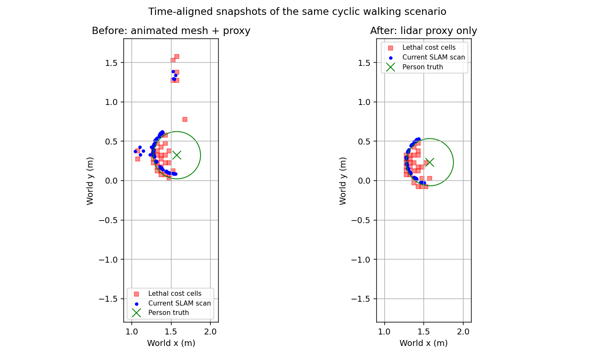
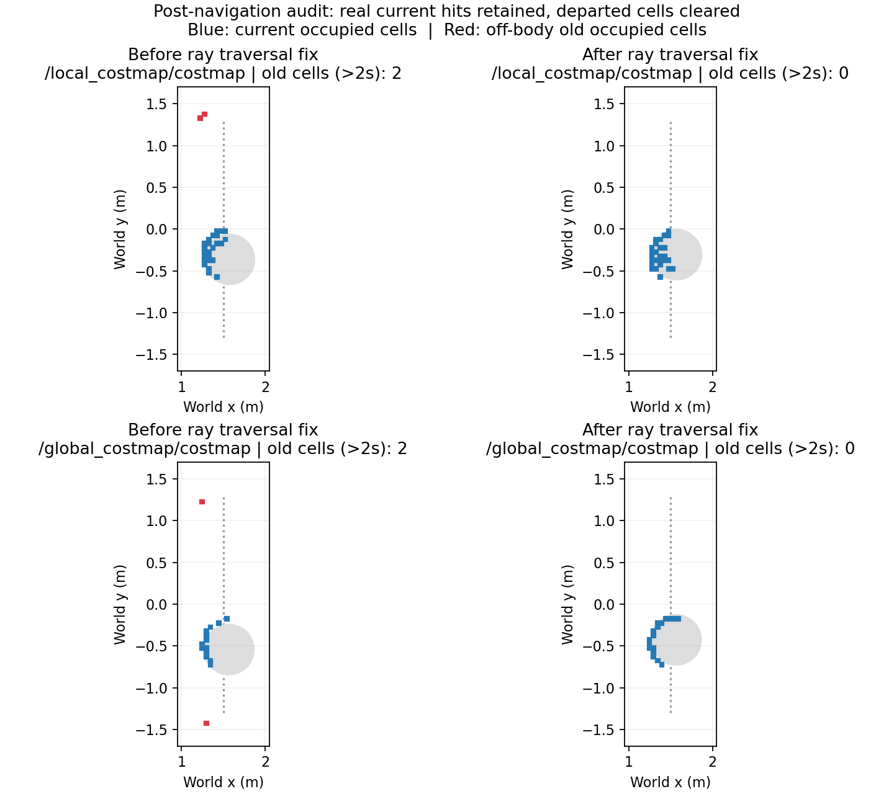

# 行人仿真显示与残留回波修复

本轮只运行本机 Gazebo，没有操作真机。保留原 ThreePhase、MPPI、Arrival 参数及碰撞保护。

## 已定位的问题

1. **悬空与旋转异常**：Actor 的基础位姿与绝对轨迹叠加，网格地面偏移未与资产对应；渲染航向以固定 1% 追赶目标，同时上游存在四元数分量当航向使用的问题。基础位姿归零，采用本地 `walk.dae` 的地面偏移 1.06178 m，以最短角差、2 rad/s 上限更新行人显示航向。该上限属于行人，不是机器人转速。直行时航向随速度方向，往返端点自然转身。
2. **人物被蓝柱包裹**：圆柱是行人的激光/碰撞代理，曾直接显示在 GUI。新增 GUI 插件只隐藏窗口里的代理；服务端物理几何保留。RGB/depth 看动画人物，GPU lidar 看同步移动的代理。
3. **SLAM 中行人残留**：同一时刻对照 Gazebo 真值、两路原始雷达、SLAM 当前帧和代价图，确认旧位置回波已经存在于原始雷达，并非只在 SLAM 栅格中积累。动画皮肤与代理同时参与 GPU lidar 渲染。仅让雷达检测代理后，原始回波和当前 SLAM 帧中的离体点消失；无需关闭碰撞检查、放大清除射线或定时清空地图。
4. **RViz 位置观感不一致**：此前穿透自检曾移动模型、多次复位时钟，不能在此会话上继续导航验收。已冷启动完整栈和 RViz；实测 Gazebo 与底盘 TF 位置一致。导航视图改用实际用于投影扫描的 `/livox/cloud_self_filtered`，单帧显示，避免静态真值基线中混看独立 SLAM 坐标下的原始点云。原始 `/map_scan_filtered` 仍保留。未证明曾存在持续的机器人 TF 分叉，不能将缓存影响当作已确认唯一根因。

## 原始回波修复后的静止对照

在相同往返场景中，按采集时刻变换坐标，Gazebo 真值关联误差不超过 80 ms；统计区域为 x=[1,2] m、y=[-1.7,1.7] m，点云高度 z=[0.2,1.6] m。只统计 lethal=100，排除膨胀层的 99。残留格还要求曾被行人覆盖、离开超过 2 s、距当前中心超过 0.55 m，且静态地图该处为空闲。

| 指标 | 修复前 | 修复后 |
|---|---:|---:|
| 左雷达距当前行人中心超过 0.55 m 的 ROI 点数，单帧最大 | 89 | 0 |
| 右雷达同项 | 55 | 0 |
| SLAM 当前帧同项 | 15 | 0 |
| 局部代价图超过 2 s 的残留格，单帧最大 | 7 | 0 |
| 全局代价图同项 | 9 | 0 |

修复后原始左右雷达各关联 225 帧，SLAM 当前帧 226 帧；独立扫描检查的 167 个有效关联帧均检测到行人代理。全局代价图仍有正常更新延迟，不能要求其每一时刻与高频真值完全一致。

当前 `/map` 是 `warehouse_baseline.yaml` 的静态地图；本轮没有验证动态建图栅格的长期清除。`/map_cmap` 是 SLAM 历史窗口点云，仍含窗口内历史行人位置，不能当作当前障碍物输入。实时导航使用当前扫描。本轮没有用行人真值去擦除 SLAM 地图或代价图。

## 验证边界与证据

- 暂停时仿真时间和行人帧计数停止；恢复后推进。相同初态两次复位的 1–12 s 行人位置序列最大差为 0。
- 全机器人 41 个碰撞几何均被独立观察器支持。正常场景未记录保守几何重叠；受控浅穿透自检在跳变 100 ms 后仍检测到负净空，最小 -0.111 m。该数值是保守几何下界，不是物理穿透深度。
- 早期深穿透测试未能在限时内取得足够后续物理样本，不能算通过。原始失败记录保留。穿透/时钟复位测试后必须冷启动完整栈及可视化，不能仅 `reset all` 后沿用 Nav2/RViz 缓存。
- 这些检查证明行人场景、观测和碰撞评测入口可用；不代表机器人社会性等待、跟随、队列、超越已经验收。

完整证据目录：`/home/yjh/WorkSpace/astribot_validation/social_navigation_20260919`。

源代码：Gazebo bringup 的 `src/social_scene.cpp`、`src/social_proxy_display.cpp`；社会导航包的 `scenario.py`；依赖修复脚本 `tools/setup_hunav_sim.sh`。只读场景复查工具为 `tools/social_navigation/validate_scene.py`。

当前受管会话：`h1_run9/session.json`；统一日志：`h1_run9/session.log`；最终导航复查：`h1_ray_navigation/results.jsonl`；运动中 TF/扫描对齐：`h1_ray_alignment/summary.json`。

原始回波修复后，run8 两目标导航 `(0.5,0,90°)`、`(0,0,0°)` 全部成功。仿真真值到位误差分别为 **0.332 mm / 0.0204°**、**0.740 mm / 0.0587°**，不能据此推导实机外部物理精度。150 s 记录中，2214 个时间对齐的底盘 TF/Gazebo 样本最大差为 0.0026 mm / 0.0014°；1109 个有效扫描关联均检测到行人，最小保守净空 0.361 m、重叠计数 0。38 个控制器及导航配置文件指纹与 H0 相同。

## 运动后代价图的第二次修复

run8 导航成功后，用户指出 RViz 仍有旧障碍物点。再次对照发现：实时原始雷达与 SLAM 当前帧均为 0 离体点，但局部、全局代价图各残留 2 个旧占据格。局部坐标约为 `(1.225,1.325)`、`(1.275,1.375)`；全局约为 `(1.295,-1.425)`、`(1.245,1.225)`。因此上一节静止检查中的 0 不能代表运动后也无残留。

修复针对代价图清除射线的栅格化：在原 ObstacleLayer 的观测缓冲和更新顺序上，补充有限射线的连续栅格遍历，覆盖整数射线遗漏的边缘格。只沿真实扫描投影射线清除，遵守最小/最大清除量程并保留端点命中格；本轮观测的障碍物仍由原逻辑标记。没有添加超时擦除、行人真值擦除或整图清空。新增实现只在社会场景仿真入口显式启用，普通导航默认保持原插件。

几何检查用独立的线段与矩形求交作对照，15,013 个用例通过，覆盖斜线、轴线、角点、越界裁剪、量程和非有限值。完整重新编译通过；运行中 controller/planner 加载新插件。

| 相同口径：行人离开超过 2 s 的旧占据格最大数 | run8 运动后 | run9 运动中 | run9 返回后 |
|---|---:|---:|---:|
| 局部代价图 | 2 | 0（124 帧） | 0（49 帧） |
| 全局代价图 | 2 | 0（50 帧） | 0（20 帧） |

运动中观察 100 s，返回后单独观察 40 s，均为墙钟时长；仿真时间由 `/clock` 决定。排除启动时无法取得对应时刻 TF 的样本，不用接收时间替代采集时间。返回后有效左右原始雷达各 300 帧，SLAM 当前帧 299 帧，离体点均为 0。当前行人占据格仍在：局部每帧 14–50 格、全局 12–23 格，因此不是通过丢弃人员观测获得零残留。

run9 重新完成 `(0.5,0,90°)` 与 `(0,0,0°)`，仿真真值到位误差分别为 **1.102 mm / 0.0436°** 和 **0.985 mm / 0.0785°**。150 s 场景记录中，1127 个有效扫描关联均检测到行人；2252 个 TF/Gazebo 样本最大差 0.0028 mm / 0.00141°，最小保守净空 0.368 m，无保守几何重叠。控制源码和导航配置的 38 个基线指纹仍一致。

新增代码：`astribot_s1_perception_components/src/observed_ray_obstacle_layer.cpp` 和 `include/astribot_s1_autonomy/observed_ray.hpp`。证据摘要：`docs/evidence/social_navigation_20260919/h1_costmap_residue_motion_summary.json`。外部验证目录保留原始帧、失败记录和几何检查程序。

## 双窗口截图检查

每次场景截图均同时获取并查看 Gazebo 与 RViz，检查人物与地面、代理显示、机器人模型与底座、当前点云与人物位置、旧占据格及膨胀区，并用同期话题数据复核。单帧截图不能证明清除时效；必须覆盖机器人移动和行人离开后的连续观测。

本轮运动中、返回后两组截图均已查看，记录在 `h1_dual_window_review.json`。最终截图为 `gazebo_ray_final.png`、`rviz_ray_final.png`。RViz Global Status 为 OK，Navigation 为 active、Feedback 为 reached。Localization 控件显示 inactive 是本静态真值基线未启用 AMCL，不能将该控件单独作为 TF/定位链路失效依据；本轮已独立测量 TF。

H1 在当前单人往返场景通过；H2–H5 机器人社会策略尚未实现或验收。动态建图栅格、其他场景和真机仍需各自验收。
