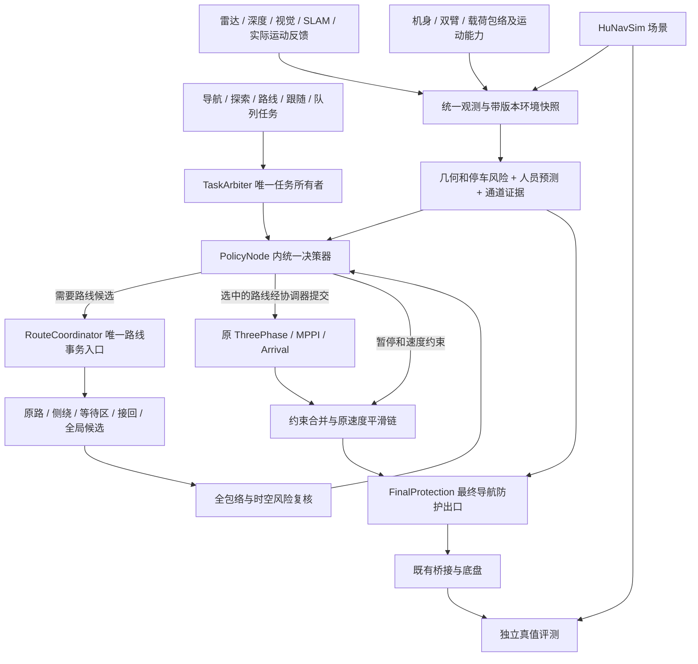

# 原导航与社会导航整合：多场景决策、规划和控制方案

详细施工接口、状态转换、18 个工作项和逐项多场景回归要求见 [详细落地与回归计划](UNIFIED_NAVIGATION_IMPLEMENTATION_PLAN_20260919.md)，可追踪用例见 [机器可读清单](plans/unified_navigation_rollout_20260919.json)。

日期：2026-09-19。状态：**整合设计，待分阶段施工和验收**。本文根据当前工作区源码、P2–P5 原策略、H2 固定 overlay 验证记录以及历史底盘停车试验制定；不代表全部功能已经实现、当前合并源码已经通过验证或真机已经启用。

## 1. 整合结论与边界

采用 **一个任务所有者、一个行为仲裁入口、一套候选验证与提交机制、一条最终速度输出链**。原导航提供全身几何、静动态风险、窄通道、事件规划与控制执行；社会导航提供人员身份、交互预测、个人空间以及跟随、队列、让行、超越的任务语义。两者共享事实和决策上下文，不分别向底盘发指令。

保留 ThreePhase / MPPI / ArrivalController / ArrivalGoalChecker 的核心特性、运动参数和固定终点精调方式。优先整合行为与路线层；MPPI 社会评分插件单列为后期可选优化，不能作为前期功能成立的前提。新增功能通过明确版本的策略配置启用，不能靠删除现有 H2/P2 兼容检查直接组合上线。

必须保持的约束：

- 无相关障碍或人员时，社会增量为零，原路径与正常运动参数保持基线；不为“更社交”持续压低巡航速度。
- 全局规划只由**新目标或当前路线碰撞风险事件**驱动。周期性观测、风险复核、地图刷新、等待超时本身不构成规划理由。
- 跟踪总时长不纳入质量评分；允许慢一些换取航向、横向误差、净空和加减速平顺性。输入时效、反应时间和故障期限仍需受控。
- 仿真真值定位精度目标沿用 2 mm / 0.1°，真机 SLAM 定位档沿用 3 cm / 1.5°，均要求停稳；到位成功不能掩盖中途跟踪退化。
- 避让、绕行不能悄悄改变固定目标的位置、朝向或精度；移动目标任务须显式指定。
- 按机身、双臂和载荷完整包络判断可通行。0.85 m 通道内不原地转向；每侧至少 8 cm 的净空要求与定位、跟踪误差共同校核。已经对齐且满足条件时允许直接进入。
- 保留当前桥接职责，不在本次整合中恢复已移除的桥接累计积分或新增第二套位置闭环。策略限制在导航层执行，底层设备急停及其固有行为维持原边界。

相关历史设计：[原动态避障与窄通道](DYNAMIC_AVOIDANCE_AND_NARROW_PASSAGE_DESIGN.md)、[HuNavSim + SFW 方案](HUNAV_SFW_SOCIAL_NAVIGATION_PROPOSAL_20260919.md)、[社会场景设计](SOCIAL_NAVIGATION_SCENARIO_DESIGN.md)。后续整合施工以本文的统一职责、事件、预算和准入规则为准；旧文档中的历史状态与结果保留。

## 2. 现有能力如何整合

P2–P5 是原导航阶段，H2–H5 是社会导航阶段，编号相近不代表能力等价。

| 能力 | 当前代码或证据 | 整合处理 |
|---|---|---|
| 原路径减速、等待、清空恢复 | P2 YieldPolicy；H2 又增加人员预测和速度候选评分 | 保留风险算法，合并状态、清空确认和阻塞预算 |
| 局部绕行、全局候选、停稳提交 | P3 RouteCoordinator 已有；当前按 LOCAL→GLOBAL→VALIDATE 顺序收集候选 | 保留生成和提交事务，改为由统一决策器按证据选择需要的候选类型 |
| 原窄通道、包络与起始退出 | P4/P5 及当前 fixed-envelope 相关代码；历史专项结果不能替代合并验收 | 复用几何与执行接口，补齐人机通行、承诺失效和退让决策 |
| 社会等待 | H2 只支持 P2，不替换路线；当前与 P3 各自提供 resolve_route 服务 | 路线服务仅由 RouteCoordinator 提供；SocialAdapter 回归观测、预测、评分职责 |
| 跟随、队列、主动侧绕、超越 | 主要为 H3–H5 设计，尚未开放 | 新增持久任务语义和行为模块，复用原跟踪与候选校验 |
| SFW 社会代价 | H2 已有行为级启发评分，不是完整 MPPI SFW critic | 先复用行为级评分；MPPI 内候选交互评分独立验收 |
| 真机视觉人员感知 | 已预留观测、深度、协方差等接口；不等于真机检测跟踪已交付 | 用统一观测接口接入，另做标定、时延、遮挡和身份稳定性验收 |

已知验证范围：固定 overlay 的 H2 基础矩阵及三对无人回归共 26/26 目标通过，最大到位误差 1.440 mm / 0.0881°。但迎面斜交去程 FOLLOW 横向 P95 14.89 cm、航向 P95 13.17° 仍是质量限制；共享工作区随后发生控制器、规划器和几何相关修改。**下一阶段的第一项必须是合并构建回归，不能沿用旧通过标志直接放行。** 证据见[施工记录](HUNAV_SFW_IMPLEMENTATION_20260919.md)与[阶段状态](evidence/social_navigation_20260919/implementation_status.json)。

## 3. 架构与唯一职责



| 所有者 | 负责 | 不承担 |
|---|---|---|
| TaskArbiter | 当前任务、抢占、取消完成与控制权交接 | 不根据某一帧人员位置反复发新导航任务 |
| 观测与融合层 | 源时间、坐标、去重、关联、速度和不确定度、覆盖区域 | 不把分类结果当作“无障碍”证明 |
| 统一决策器 | 场景识别、行为选择、唯一等待计时、通行承诺、约束合并 | 不直接发布 Twist，不自行控制 SDK |
| RouteCoordinator | 唯一 ResolveRoute 服务、规划请求、过期取消、验证、提交与确认 | 不再独立决定先等几秒、再局部、再全局的另一套策略 |
| ThreePhase / MPPI / Arrival | 执行参考路径、航向跟踪、起始对齐、接近和精调 | 不靠无限重试消化不可跟踪的折线或社会阻塞 |
| FinalProtection | 依据最新输入和实际运动检查最终指令及停车包络 | 不因舒适性或等待规划结果延后必要停车 |

逻辑模块优先采用进程内纯算法与接口组合，复用当前节点；不为每个状态新增 ROS 节点。规划异步运行，重计算与控制回调隔离。首轮集成沿用已验证频率；20 Hz 决策、20–50 Hz 最终防护可作为后续性能预算，必须用真实调度延迟验收。

## 4. 统一数据、预测和接口

### 4.1 环境事实

每份环境快照至少包含：源时间、接收时间、clock epoch、地图/定位/包络版本、机器人位姿和实际速度及其质量、原始障碍占据、人员轨迹、可观测空间、通道与等待区证据。重复时间戳不刷新观测有效期；坐标转换使用采集时刻 TF；定位跳变使旧轨迹连接、候选与许可失效。

视觉接口继续保留图像检测、深度单位、内外参版本、米制人体几何、速度及协方差、ID/源 epoch、遮挡和朝向可信度。仅有 2D 框且深度未知时，不输出虚假的米制净空。视觉与雷达关联后可以共享一个人的社会评分，但不能删除原始雷达硬障碍。未经关联的多个来源取风险并集；记录关联不确定性，避免同一人的社会代价被重复累加。

“有效空人员观测”和“没有消息”必须区分。社会模式依赖人员输入时，输入失效进入受控停车及有界等待；不能因断流自动改成无人模式。普通无社会感知配置可以独立运行原导航，但不能宣称具有跟随、排队或人员身份能力。

### 4.2 两类预测

- **硬风险预测**：覆盖匀速、当前位置停止，并进一步加入“未来任一预测步停下”、有限加速度/转向及观测误差的保守占据。短期必须覆盖本机完成停车所需时域；超出可靠感知或预测范围时，以可停空间约束速度。
- **软交互预测**：借鉴 SFW/SFM 评价候选运动对人的影响、前方个人空间和群组穿插偏好。对方合作、让路或保持原方向的预测只能影响评分，不能缩小硬风险集合。

当前 H2 的“匀速 + 当前位置停止”不是任意未来折返或停止的完整可达集；强化预测属于待实现项。过于宽泛的长期可达集可能使全场停车，因此硬预测重点覆盖停止时域，较远区域用于提前减速和软评分，始终明确模型假设。不能把人主动撞向静止机器人的场景写成可无条件避免碰撞。

### 4.3 拟整合的契约

以下是设计字段，不是声称当前消息已全部具备。优先扩展现有类型；新增字段需要消息版本和适配层。

| 契约 | 核心字段与要求 | 复用/新增落点 |
|---|---|---|
| DecisionContext | task/session、固定/移动任务模式、原目标、reference_path、active_path、执行相位、统一版本、阻塞 episode | ExecutionContext、contracts；移动模式扩展 |
| RiskEvidence | 原路阻塞段、最早冲突时刻、停止扫掠、静止位置风险、源龄期、覆盖、阻塞持续性及置信度 | PathRisk、risk、social adapter |
| BehaviorProposal | 继续/减速/等待/绕行/退让/超越；硬可行性、代价、原因、条件有效期 | 决策器内部不可变对象，不新增速度发布者 |
| RouteProposal | request ID、候选类型、完整路径、选边、接回点、沿途停止证据、版本和截止时间 | PlanCandidate 适配；RouteCoordinator 持有事务 |
| HoldContext | task、episode、reason、start、lease、clear evidence、暂停的进展计时类型 | 原 hold/resume 通道扩展，由统一决策器管理 |
| ManeuverCommitment | 行为、侧向选择、通道/前驱 ID、可中止位置、有效期、失效原因 | 新增进程内承诺模型，不能越过最终防护 |
| Follow/Queue task | 目标身份/源 epoch、历史轨迹、间距、队列区域和前驱版本、取消语义 | TaskArbiter 扩展持久任务；不是高频 NavigateToPose |

现有 ResolveRoute 请求为 allow_detour/session/reference_path/goal，响应 KEEP/COMMIT/BLOCKED；PlanCandidate 为 LOCAL/GLOBAL/VALIDATE。它们可保留为传输边界，但布尔 allow_detour 不足以表达队列禁超越、通道禁转向等条件，必须由带版本的任务上下文补齐；不能把这些含义塞进 reason 字符串。

## 5. 统一决策规则与计时

### 5.1 决策次序

每周期生成候选行为，先筛除硬不可行项，再按优先级选择。继续、减速、等待始终参加比较；有必要且能力已验收时才请求侧绕、退让、超越或全局路线。

1. 取消、人工交接、输入/定位/包络失效、迫近碰撞先处理，撤销旧候选；必要的零速不等待规划。
2. 检查原路当前速度、可达减速轨迹和停车全过程，得到可继续/可降速/必须停止的边界。候选速度低并不代表机器人已经减速。
3. 检查静止位置是否也会被人员占用。若停车后仍有风险，优先使用已经验证的机动；没有安全机动时停车并报告 NO_SAFE_MANEUVER，不能自行盲退。
4. 施加窄通道、包络及任务语义限制：跟随/队列默认不超越；狭窄段不原地转向；未知后方不倒退。
5. 对剩余候选比较：安全余量达到要求 → 当前承诺与路径稳定性 → 跟踪可执行性/平顺性 → 人员舒适性 → 任务进展。进展用于避免无限等待，不奖励更高速度；不用总耗时压倒质量。
6. 原路持续安全且没有强制任务事件时保持原路。只有软代价明确改善且越过滞回阈值，才调整非紧急行为；硬风险可立即打断最短驻留。

```text
snapshot = coherent_snapshot()
if task_canceled_or_context_invalid(snapshot): stop_and_retire()
risk = assess_current_path_and_real_stopping_motion(snapshot)
admissible = hard_filter([continue, slow, wait, valid_committed_maneuver], risk)
if risk.justifies_alternative and task_allows_alternative:
    asynchronously_request_needed_candidates_with_one_budget()
admissible += validate_fresh_candidates_against_same_context()
choice = choose_by_safety_semantics_stability_quality_comfort_progress(admissible)
publish_one_constraint_and_one_versioned_decision(choice)
route_coordinator.commit_only_if_takeover_contract_holds(choice)
final_protection.recheck_latest_input_and_final_command()
```

### 5.2 等待不能重复计时

统一状态：`CRUISE → SLOW → WAIT → CLEAR_CONFIRM → RESUME`；侧绕、跟随、队列、窄通道状态作为有层次的行为子状态，避免把所有组合平铺成一个巨大枚举。

- 清空窗口沿用 0.6 s 起点。雷达、人员、通道条件分别保存连续有效区间，在全部条件持续成立的共同区间达到要求时放行；禁止 P2 等 0.6 s 后 H2 再等 0.6 s。已证明的有效区间可重叠，实际重新出现冲突必须重新确认。
- 物理停稳与清空确认并行监测，恢复取两个条件都满足的时刻；不在每层重复等待停稳。停稳复用已验证的源时间去重与稳健运动估计，不能因 pose 单帧抖动无限重置。
- 普通社会阻塞默认以首次有效 HOLD 为起点，30 s 总 episode 截止时间覆盖等待、规划和复核；不会成为 8 s + 30 s + 30 s 串联等待。8 s 仅保留为判断持续动态阻塞的初始参考，不强制所有场景等满。
- 规划请求沿用 2 s 一次请求周期、每目标最多 5 次请求周期的起点；LOCAL/GLOBAL/VALIDATE 共享该周期截止时间，不各自续期。重试必须有新证据，并同时受 episode 和 per-goal 预算限制。
- 人员 ID 更换、短暂清空、BT 重 tick、同目标路径更新不能重置每目标预算。短暂清空后再次阻塞沿用同一 episode；仅持续清空且恢复有效路径进展才结束 episode。
- 队列前驱未前进、跟随对象正常停留属于任务语义等待，可使用独立较长预算或明确的“等待取消”模式；传感器失效、执行失败、规划预算仍单独有效，不能无限豁免。
- 合法 HOLD 只暂停控制器的运动无进展计时；不暂停感知时效、命令租约、任务取消、全局阻塞截止时间。进入 HOLD 不重新创建目标，不重置 Arrival。

时钟分工：观测与轨迹使用源时钟；仿真物理行为随仿真时间推进。请求服务截止、命令租约使用单调时钟。仿真暂停不应伪造成物理等待超时，但控制租约可以到期保持零速；时间回跳或 epoch 改变使旧上下文失效，恢复需要新快照和明确执行上下文，不能自动消费旧结果。

## 6. 多场景规控矩阵

下表是整合后的目标行为。除第 2 节注明的能力外，其余需要施工验收；“允许”均以能力开启及硬校验通过为前提。

| 场景 | 首选行为 | 何时换路/机动 | 恢复或失败边界 |
|---|---|---|---|
| 无人、无障碍，直线/转弯 | 原路径、原控制与速度参数 | 不因社会模块开启而规划 | 新障碍事件才介入 |
| 远处人员，与路线不相交 | 保持原路；仅监测 | 不绕行、不持续限速 | 风险变为相关时重新评估 |
| 单人短暂横穿 | 预测减速，必要时在冲突区外停 | 有明确持续封堵证据才生成替代路线 | 全部风险清空并确认后平滑恢复 |
| 多人交错横穿 | 风险并集，保持可停车空间 | 有稳定侧通道才绕行，不抢两人间小空隙 | 第一人离开不能释放第二人的限制 |
| 同向慢行，普通导航 | 保持停止距离，先跟行 | 宽度、视距、速度差和接回段均合格且任务允许时超越 | 无条件超越则继续跟行或有界等待 |
| 前人突然停下/折返 | 立即用保守分支检查制动 | 不因单帧方向变化左右换边 | 新观测稳定且安全后恢复 |
| 迎面、有足够侧向空间 | 提前减速；比较原地等待、侧方等待区和侧绕 | 验证全段净空后选边承诺，靠右仅为平局偏好 | 同一承诺期间不因软代价变化换边 |
| 迎面、对方不让行 | 检查静止位置风险 | 已验证侧方/后方退出路径可用才退让 | 无机动则停车并明确 NO_SAFE_MANEUVER |
| 人从后方追近 | 评估后向接近与停驻点 | 仅已验证的前行/侧移机动；不突然倒车 | 人主动撞近不作为可保证避免的情形 |
| 静态物堵住局部路线 | 停或减速到安全点，比较局部修补与全局备选 | 证实持续阻塞可直接请求合适类别，不必等“人离开” | 无路报告 NO_VALID_ROUTE/阻塞原因 |
| 整个通道长期封闭 | 入口外等候或改变全局路线 | 已有当前路径风险和拓扑阻断证据，可直接请求 GLOBAL | 无替代通路则有界失败，不无限重算 |
| 目标点被占用 | 目标外等待，保留原位置和朝向 | 终点附近禁止普通绕行替换目标；必要退出是独立动作 | 占用超时 GOAL_OCCUPIED；离开后恢复原精调 |
| 目标附近有人经过 | HOLD 原 Arrival 阶段，暂停合法运动进展计时 | 不用取消重发制造“恢复” | 重新检查位置/航向/停稳后完成 |
| 跟随：直线、走停 | 锁定目标，沿历史轨迹保持弧长间距 | 参考推进只作局部合法连接；明显拓扑变化才规划 | 人停下是 TARGET_STOPPED，不是任务成功 |
| 跟随：L/U 形转弯 | 沿轨迹转弯，提前降速，保留机头贴路径偏好 | 不直线切角；无法连续跟踪时停到可对齐位置 | 连接不安全则等待或失败 |
| 跟随遮挡、换 ID、目标离开 | 减速停稳，保留身份锁 | 同源 epoch/身份确认后重新校验连接 | 不追最近的人；超预算 TARGET_LOST |
| 静止队列、走停队列 | 按队列区域/方向和前驱保持距离 | 队尾加入点合法后进入；小幅推进不全局重算 | 不把正常排队记作卡死，不允许超越 |
| 插队、前驱离队、队列关系不明 | 停止使用旧前驱参考，确认新顺序 | 关系版本变化后废弃旧候选 | 无法确认则 QUEUE_RELATION_UNCERTAIN |
| 宽区域超越 | PREPARE→PASS→REJOIN；全过程可停 | 对向时空净空和接回点合法，承诺选边 | 新硬风险可中止；不能盲退或突然换边 |
| 超越中合流被占、对向来人 | 减速/停到已验证位置 | 只有再次验证的接回/退出路线才继续 | 无安全方案则明确能力受限 |
| 窄通道无人或同向通过 | 入口外对齐，完整包络准入，沿中心线稳定通过 | 已对齐可直接准入；内部不原地旋转、不超越 | 出口完整机身离开后解除通道约束 |
| 窄通道对向人/机器人 | 入口外等待；有明确退让区才退出 | 预约只约束参与协议的机器人，不假设行人遵守 | 无后方覆盖不盲退，长堵有界报告 |
| 人员群组/并排行走 | 不穿越可辨认群组，采用较宽软个人空间 | 只有组外连续通道才侧绕 | 群组低可信时退回个体硬风险并集 |
| 手臂动作、载荷/包络改变 | 按版本握手重新检查当前运动和路线 | 新包络不可通行则停止，撤销旧许可 | 未验证的收臂动作不能自动当作“可挤过去” |
| 探索前沿靠近未知区域 | 目标退入已知空闲区，检查目标 yaw 与全身净空 | 仅向已知自由走廊规划；风险信息反馈探索器 | 未知不当空闲；临时人堵不永久标记区域不可达 |
| SLAM/代价图不一致、疑似残留 | 区分源图、局部障碍与清除证据，保守处置实际风险 | 不以清图或移动目标掩盖根因 | 仅新鲜射线/占据维护契约支持清除，不整图擦除 |
| 感知断流、延迟、重定位、时钟跳变 | 撤销候选和许可，受控停车 | 恢复一致上下文后依原任务重新判断 | INPUT_UNAVAILABLE/LOCALIZATION_UNCERTAIN 等具体原因 |
| 取消、人工接管 | 取消所有待处理候选，按现有交接停车 | 旧执行器终止后才移交所有权 | 迟到规划结果不得恢复旧任务 |

## 7. 等待、绕行与重规划的联合选择

### 7.1 避免固定串行升级

| 证据 | 选择依据 | 规划动作 |
|---|---|---|
| 预计短暂横穿、停驻位置安全 | 等待扰动小、原路可恢复 | 不请求替代路线 |
| 冲突较远，减速后时空不相交 | 保留可停车余量继续 | 不因远处原速冲突强制停车 |
| 人员停留持续、侧通道完整可用 | 比较等待与局部绕行的质量、稳定性和舒适性 | 请求有限左右 LOCAL 候选 |
| 静态封堵或通道拓扑不可通 | 等待不能解决当前风险 | 直接允许 GLOBAL；不必先做无意义局部尝试 |
| 局部候选无解、阻塞仍存在且证据充分 | 保持安全等待，同时评价全局替代路线 | 受同一预算约束请求 GLOBAL |
| 原路再次安全 | 保留原路径优先，终止无必要候选请求 | 不为已经算出的新路强行换路 |
| 无新证据、仅服务超时或 timer tick | 不重复消耗资源与改变路线 | 保持当前状态或预算到期失败 |

每个规划批次显式列出所需种类，而非所有情况都依次 LOCAL→GLOBAL。首版允许顺序调用现有服务但共享截止时间；不为了“联合决策”强行并行启动两个重规划线程。

### 7.2 所有候选经过同一二次判别

1. 地图/定位/包络/任务/路径版本、源时效、目标身份和任务权限一致；未知区与地图外不作为可用绕行空间。
2. 检查完整机身、双臂/载荷的沿途连续扫掠、起步、转向、停车和最终目标朝向；高低障碍不能只靠底盘一层 scan 放行。
3. 候选速度剖面符合现有加减速、角速度、jerk 与制动能力。用**当前实测速度**开始预测，不能把低速候选直接当作瞬时低速。
4. 检查曲率、曲率变化率、接入/接回切线、航向连续性和终点精调可达性。平滑后必须重新做全路径碰撞检查；不能仅对原折线路径检查后换成越界样条。
5. 轻微曲率变化先调整速度剖面；几何曲率超限必须平滑重建或拒绝。降速不能修复不存在转弯空间的问题。
6. 侧绕/超越必须包含离开、并行、接回，以及每个执行位置的可停止条件；不能只找到绕过障碍前半段就放行。

候选状态为 `REQUESTED → GENERATED → VALIDATED → READY → COMMIT → ACK`。首次整合继续采用原停稳接管条件：实际线速度 ≤0.02 m/s、角速度 ≤0.03 rad/s、起点漂移 ≤0.04 m，并在提交前复核。0.6 m 终端保护区内保留原到位任务，不做常规绕行接管。后续若要无停顿接管须另行验收，不能作为本轮默认行为。

区分原任务目标、原参考路径、当前执行路径。临时侧绕是当前路径的修补，接回后保留目标与任务预算；跟随是持久移动参考任务。地图普通更新可以使候选需要重新校验，但不自动创建规划事件；版本不一致不能直接忽略。后续可引入经验证的相关区域版本以减少无关地图变化造成的候选饥饿。

## 8. 基于历史底盘数据的停车与跟行间距

数据来源为 [历史停车参数](../ws_robot/src/astribot_s1_navigation_policy/config/measured_stop_reference_20260915.json)：四方向、四档指令共 16 次试验，以 SLAM 源时间位姿度量。应使用下发零速后的**最大向前偏移**，不能用最终回弹后的位置误差替代停车空间。

| 指令线速度 | 实测线速度范围 | 零速后最大偏移范围 |
|---|---|---|
| 0.06 m/s | 0.0528–0.0561 m/s | 6.30–8.11 mm |
| 0.10 m/s | 0.0815–0.0928 m/s | 14.26–15.21 mm |
| 0.20 m/s | 0.1523–0.1605 m/s | 35.56–37.87 mm |
| 0.35 m/s | 0.2405–0.2488 m/s | 73.94–77.67 mm |

当前仿真参考曲线：

```text
B_peak(v) = 1.25 × (0.085786013 × v + 0.921174263 × v²) + 0.006736139   [m]
D_required = v_bound × T_front + B_peak(v_bound) + C_body_clearance + U_extra
```

`v_bound` 来自实际运动估计及误差上界；同时考虑反馈延迟期间仍可能执行的较大指令，不能因反馈偏小低估运动。`T_front` 是观测、估计、调度至零速命令的反应预算，当前仿真起点 1.0 s；曲线已包含零速后尾程。`C_body_clearance` 当前起点 0.08 m，`U_extra` 表示尚未被几何、输入协方差或曲线余量覆盖的额外不确定度。

按 `U_extra=0` 说明预算量级：v=0.245 m/s 时约 0.427 m；v=0.35 m/s 时约 0.615 m。它们是**从完整机身边界到静止障碍的纵向空间预算示例**，不是人与机器人中心距离；后者还需加入双方几何。0.35 m/s 实际速度超出历史实测范围，仅能作为仿真解析延伸。

当前 stop_reference.py 已把历史曲线转为等效尾程延迟 0.10723 s、线性减速度界约 0.43423 m/s²，并将 6.736 mm 加入净空。整合时二者选一种等价表达，不能再加一次 B_peak、尾程延迟或同一余量。建立“几何基础净空/观测误差/跟踪误差/停车尾程”的单一账目；安装 footprint 已膨胀时同样不能二次膨胀。

对动态人员使用时空占据与完整停止扫掠，而非只套标量距离。跟行不能扣除假定的“前人也会向前滑行距离”；先按对方立刻停止处理。平移叠加转动用全包络停止轨迹，纯旋转使用独立角速度/余转模型，不能由直线试验推导。

两种停车分别验证：

- 正常减速：提前制动，沿原平滑链限制加速度/jerk，其占用空间须由对应平滑停止模型覆盖；历史直接置零曲线不能自动代表这一过程。
- 迫近碰撞防护：最终防护优先输出必要停止命令，不为保持 jerk 指标拖延；验证从命令到真实最大偏移的空间，且不把软件零速等同于机械急停。

这些数据混有桥接版本差异，每档每方向只有一次，曲线不是统计置信上界，也不是当前真机认证参数。当前配置明确为 simulation-only / hardware_validated=false。后续真机需要在同一版本、地面、载荷及电量范围复测，补齐平滑停、斜向合成、转动和组合运动；按实际速度覆盖范围决定真机限值。

## 9. 跟随、队列、超越与窄通道的专项设计

### 9.1 跟随和队列

跟随状态为 `ACQUIRE → FOLLOW → TARGET_STOPPED / OCCLUDED → REACQUIRE / FAILED`。参考点沿目标历史轨迹按弧长后退，距离取舒适间距、完整几何与停止空间要求的较大者。历史轨迹不足时先建立经过验证的连接，不直接追当前位置。间距目标随速度平滑改变，硬安全需求可立即收紧。

近距离小幅参考更新保留 FOLLOW 的内部状态；拓扑、目标身份或大方向变化才建立新的参考接管过程。人的停走不能反复触发固定目标 Arrival；明确“结束跟随并停靠”才转入固定终点模式。目标重捕获检查源 epoch、身份可信度及连接路径，不能只选择距离最近的人。

队列复用移动参考，但新增 `JOIN → QUEUED → ADVANCE → LEAVE`、队列区域、行进方向及有版本的前驱关系。关系不明先停，队尾位置必须满足目标姿态净空。默认不插队、不超越、不穿过人员群组；队列正常静止期间仍检查后方风险及前驱身份。跟随和队列都使用现有任务仲裁，不另建输出速度的控制器。

### 9.2 局部侧绕与超越

侧绕可以绕静态障碍或持续占用的人；超越针对同向慢行者，额外要求相对运动、并行阶段及接回窗口。靠右作为可配置软偏好，只在硬净空、任务合法性和路线质量相近时使用，不能强制走更危险的一边。

超越状态为 `PREPARE → PASS → REJOIN → COMPLETE`。PREPARE 阶段确认可见范围和完整退出/接回路线；PASS 阶段锁定侧向承诺；REJOIN 检查被超越目标与机器人尾部都留足净空。失效时先选已验证的安全停止或退出动作，没有证据时不得自动反向。新硬风险可撤销承诺，软代价抖动不能。

### 9.3 窄通道

状态为 `APPROACH → OUTSIDE_ALIGN → ADMIT → TRAVERSE → RELEASE`。准入检查剩余通道、出口以及停车条件；允许已对齐的安全运动直接进入，不按“窄”标签额外制造停顿。

矩形近似仅用于解释：

```text
W_required = W_body × |cos(heading_error)| + L_body × |sin(heading_error)|
             + 2 × (0.08 + U_lateral)
```

正式判断使用实际多边形和连续扫掠。0.62 m 正方形、完全对齐且不计额外误差时，最低宽度是 0.78 m；0.85 m 通道只剩总计 7 cm、每侧 3.5 cm 的附加误差预算。该数值只是 legacy 几何说明，**不能代替实际双臂/载荷包络准入**。若横向、航向及感知误差超出剩余预算，应降低运动速度、入口重新对齐或拒绝，不削减 8 cm 要求。

通道内不原地转向、不并排超越；轻微朝向修正也要满足整个扫掠和侧向预算。入口居中/对齐是受限动作，不能反复横移找缝。许可有效期、包络版本或出口条件失效立即重新评估；完整机身出通道后才释放限制。

对向交会在入口等待区解决。机器人之间可使用公平预约，但只有参与同一协议才有意义；行人没有预约承诺。已进入后遇到行人，先检查停止位置，有后方覆盖和完整安全路线才允许退到最近等待区。原 StartManeuver 的起始倒退退出功能可复用执行部件，不能直接视为社会退让功能已经验收。

## 10. 探索、地图与到位的一致性

探索器继续负责前沿候选和任务进度，策略层负责候选执行期间的动态交通。前沿目标按最终朝向将完整包络退入已知空闲区，沿途碰撞检查保留；候选内退不能解决未知区域本身不可观察的问题。

失败按作用范围反馈：人员暂时占用只产生带有效期的临时阻塞；静态几何不可通行才可使对应候选在当前地图版本失效；输入故障暂停探索，不把整片区域写成不可达。一次绕行失败不能证明整张图已经探索完成。记录剩余前沿、拒绝理由、区域连通性和各原因计数。

人员的动态占据由观测有效性、射线清除与占据维护处理，不通过长期写入静态 SLAM 图实现让行。看到 Gazebo 已离开的人而 RViz 残留时，同时对齐检查时间、TF、原始点云、自滤后点云、局部/全局代价图及 SLAM 图；不能仅凭截图直接清空地图，也不能将全部残留都归因于社会算法。

固定目标的 FOLLOW、接近、REFINE、停稳分别记录。HOLD 恢复后继续原目标，复核位置和角度阈值以及停稳窗口；到位前被取消或阻塞终止应统计为失败/中止，不能计入成功精度。

原有低速直线打滑检测与补偿继续归跟踪/到位控制层；必须服从当前约束交集。合法 HOLD、人员占用、输入失效或通道不准入时，不把“没有位移”判成应提速的打滑。补偿不能越过速度上限、停止距离和终端误差约束，不能推广到原地旋转。恢复时使用当前实际运动状态，不能重放等待期间累积的修正量。指令—SLAM 响应偏差分别标明启动延迟、稳态增益、滑移嫌疑和定位估计质量，不能把所有低响应都归为地面打滑。

## 11. 关键参数与失败语义

### 11.1 参数沿用与新增

| 参数 | 本方案起点 | 属性与约束 |
|---|---|---|
| 正常运动参数 | 读取冻结后的原运动配置；当前社会仿真上限 0.35 m/s | 不用策略整合顺便调控制增益 |
| 到位档 | 仿真 2 mm / 0.1°；真机 SLAM 3 cm / 1.5° | 两种计量源分开，不能视为物理真值精度 |
| 预测时域/步长 | 2.8 s / 0.1 s | 沿用起点；连续扫掠或误差膨胀覆盖步间运动 |
| 观测超时 | 0.3 s | 依源时间；每个传感器有能力与覆盖契约 |
| 清空确认/最短慢行驻留 | 0.6 s / 1.0 s | 只有一个释放裁决，硬风险立即覆盖驻留 |
| 阻塞确认/持续动态参考 | 1.5 s / 8 s | 沿用起点，迫近风险不能等确认；8 s 非固定升级必经步骤 |
| 普通阻塞总期限 | 30 s | 等待、候选和复核共享，不重复累加 |
| 单次请求周期/每目标次数 | 2 s / 5 次 | 同周期包含 LOCAL/GLOBAL/VALIDATE，次数不随路径更新重置 |
| 局部绕行范围 | 接回前方 3 m、横向偏离 ≤1.2 m | 沿用仿真起点，同时受已知可观测空间约束 |
| 首版接管条件 | ≤0.02 m/s、≤0.03 rad/s、漂移≤0.04 m | 沿用停稳提交；运动中连续接管另验收 |
| 终端不换路区域 | 0.6 m | 不妨碍必要停车；独立退出动作需明确任务语义 |
| 窄通道运动上限 | 线速 0.15 m/s、角速 0.2 rad/s 起点 | 实际允许值取约束交集，角速非原地转向许可 |
| 几何基础净空 | 每侧至少 0.08 m | 和输入、跟踪、停车余量分账，禁止重复膨胀 |
| 历史停车参考 | 16 次 SLAM 峰值试验 | 仅仿真先验，当前真机需重新标定 |
| 跟随间距/目标重捕获/队列预算 | 新配置，先通过场景参数扫描确定 | 不宣称已经具有真机确认数值 |
| 人员容量 | 当前接口上限 64，已验场景最多两人交互 | 接口容量不是实时处理能力，需单独压测 |

### 11.2 失败不能全部折叠成“路径不可达”

下表是统一后的原因分类，其中部分为拟新增标准码。对外保持稳定分类，对内保留最初触发者、版本和证据。

| 分类 | 处理与上报 |
|---|---|
| INPUT_UNAVAILABLE / STALE_OBSERVATION | 停车，传感器恢复流程；不能继续消耗规划次数 |
| LOCALIZATION_UNCERTAIN / CLOCK_MISMATCH | 撤销旧候选、许可与移动参考，重新建立一致上下文 |
| GOAL_OCCUPIED | 固定目标被占，不自动改终点；区分可恢复等待与到期失败 |
| SOCIAL_BLOCKED_TIMEOUT / TEMPORARILY_BLOCKED | 动态阻塞超过预算，可在上层任务显式决定后续重试 |
| NO_VALID_ROUTE / PLANNING_BUDGET_EXHAUSTED | 当前有效证据下没有合法候选或预算已耗尽，保留各候选拒绝理由 |
| NO_SAFE_MANEUVER / STATIONARY_CONFLICT | 连停驻点也受威胁；停车并报告可用能力不足，不承诺零碰撞 |
| TARGET_LOST / QUEUE_RELATION_UNCERTAIN | 跟随/队列身份故障，不能偷偷改跟另一人 |
| ENVELOPE_CHANGED / CORRIDOR_NOT_ADMISSIBLE | 几何或通道许可失效，保留实际所需/可用净空 |
| EXECUTION_NO_PROGRESS / TRACKING_DEVIATION | 确有运动意图时的执行质量问题；不把合法等待算卡死 |
| CANCELED / PREEMPTED | 撤销本任务运动权限，迟到结果不得复活任务 |

速度限制按所有有效约束的交集计算，任一有效 HOLD 优先。过期约束按其来源契约处理，不能简单把“没收到限制”解释为允许全速；失效释放与传感器健康由唯一决策器裁决。最终防护在即时物理风险上拥有优先权。

## 12. 代码施工落点与设计原则

| 现有位置 | 施工方向 | 保留点 |
|---|---|---|
| policy_node.py / behavior.py | 提取统一决策上下文、仲裁和 episode 管理；合并原路与社会提案 | 原风险条件、合法 HOLD、单一 MotionConstraint 输出 |
| social_adapter.py / social_behavior.py | 取消其路线服务所有权；输出观测和候选评分 | 源时间检查、预测、故障原因与诊断 |
| route_coordinator.py / planning_session.py | 接收选定候选种类；统一 deadline、版本、复核及提交 | 有界请求、取消、停稳接管和过期拒绝 |
| execution_context.py / contracts.py / navigation msgs | 增加持久任务模式、承诺/前驱版本与结构化原因 | 原目标、map/localization/envelope/clock/path 版本 |
| corridor / fixed_corridor / envelope 模块 | 将几何准入与对人通行决策分离 | 同一包络来源、连续扫掠、不能缩小几何 |
| task_arbiter_node.py | 扩展跟随、队列任务，沿用取消交接 | 旧执行器终止后才释放任务所有权 |
| path_tracking / PlanCandidate / KeepSafePath | 统一候选二次判别、参考接管与风险事件 | ThreePhase/MPPI/Arrival 的现有控制表现 |
| social_navigation / perception 适配 | 候选交互评分、视觉/雷达身份融合 | 真值隔离、坐标/时效和原始几何风险 |
| navigation launch / supervisor | 以版本化策略 profile 表达兼容能力集合 | 现有 off/h2 入口保持可复现，不靠隐式开关启用 |

采用以下八项工程设计原则作为项目审查表，不把它们声称为某个标准统一规定的“八大原则”：

| 原则 | 在本方案中的具体约束 |
|---|---|
| 单一职责 | 感知供事实、策略作选择、规划出候选、控制执行；各有唯一所有者 |
| 开闭原则 | 新场景通过提案生成器/评分器扩展，避免在启动脚本散落场景判断 |
| 里氏替换 | 不同预测器/感知适配器遵守相同时间、误差和故障契约，不以“可替换”为名降低保证 |
| 接口隔离 | 视觉不需要知道 Nav2 action；评分器不持有 SDK 或 Twist 发布接口 |
| 依赖倒置 | 决策核心依赖快照、候选和执行结果抽象，ROS/HuNav/硬件均为适配层 |
| 最少知识 | 下游使用已验证上下文，不直接跨模块读可变缓存或猜测内部状态 |
| 组合优于继承 | 通过风险、任务语义、通道与社会评分组合，避免为每个场景派生一套控制器 |
| 共同变化隔离 | 参数、消息契约、场景夹具和执行器分别版本化；场景变化不牵连桥接闭环 |

## 13. 分阶段验收与观测

以下用 I0–I6 表示本次整合顺序，避免与历史 P/H 阶段混淆。每阶段通过仿真后才能开放下一阶段能力；失败时回到同一版本定位，不通过放宽精度或关闭硬检查“通过”。

| 阶段 | 范围 | 必跑仿真与通过条件 |
|---|---|---|
| I0 合并基线 | 冻结当前源码、配置、库、包络和地图，重做构建回归 | 原无人路线、H2 八类基础场景、fixed-envelope/窄通道专项；关闭共享源码未验收缺口 |
| I1 统一原路决策 | 单一服务、计时、上下文；仍只继续/减速/等待 | 3 对无人 A/B、双人交错、清空又阻塞、输入断流；没有重复等待、额外规划和控制退化 |
| I2 联合局部/全局决策 | 有限左右候选、必要时 GLOBAL、二次检查与提交 | 静态封堵、人长停、原路恢复、接回阻塞、规划超时/迟到、取消、map/pose/envelope 变化；验证事件和预算 |
| I3 跟随与队列 | 持久移动参考、目标/前驱锁、语义等待 | 直线/L/U/走停、遮挡与 ID 交换、入队/插队/离队；不切角、不跳人、不假到位 |
| I4 人机窄通道与退让 | 入口对齐、通行许可、等待区、覆盖约束退出 | 0.85/1.0/1.2/1.8 m × 包络/载荷、同向/对向、通道内取消；无原地大转向、无盲退 |
| I5 主动超越 | 选边锁定、PASS/REJOIN、承诺失效 | 可超越、差速不足、对向突入、合流被占、前人突然停；全段可停及失败边界可复现 |
| I6 综合与可选社会 critic | 多场景切换、探索；SFW MPPI 评分另作 A/B | 不少于 30 min 驻留、多人员/CPU 压测、故障注入；保留零社会增量基线与控制实时性 |

I0 不要求凭空消除全部旧质量缺陷，但必须给出合并版本的真实基线，单列未闭环问题。任何要在窄空间运行的候选必须满足本场景的误差预算，不能因“历史也有 14.89 cm 横向误差”降低准入要求。

### 指标定义与统计

- **安全**：独立真值的完整包络最小净空、重叠步数、制动开始时间/峰值偏移、停驻位置冲突、未经许可的倒退/转向。普通可行用例要求无重叠且满足配置净空；非合作不可避场景验证及时停车和 NO_SAFE_MANEUVER，单独统计，不伪装成成功通行。
- **跟踪**：FOLLOW 阶段到当前执行路径的投影横向误差、机头相对路径切线角误差，报告 P50/P95/最大值；主动绕行相对原路径的偏离单列为路线偏离，不能混作跟踪误差。
- **到位**：固定目标成功时最终位置欧氏误差、wrap 后航向误差及停稳质量；REFINE 与 FOLLOW 分开。失败/取消单列，不混入成功精度均值。
- **运动质量**：指令与 SLAM/仿真真值速度的时延和增益、同一源时间对齐后的残差、加速度/jerk、异常旋转/回退、换边次数。不得用平移时长更长作为退化指标。
- **策略质量**：各原因等待时间、首次可恢复到实际恢复的额外延迟、清空计时是否重复、规划触发原因/次数、候选拒绝原因、过期候选提交数（须为零）、任务活性和有界失败。
- **感知与地图**：人员真值与检测误差/时延、遮挡重捕获、关联误差、指定 ROI 的残留占据清除、Gazebo 与 RViz 同时刻截图；截图不能替代原始几何数据。

无障碍回归先沿用 H2 标准：横向 P95 不超过基线加 max(5 mm, 10%)，航向 P95 不超过基线加 max(1°, 10%)，实际 jerk P95 不超过基线加 max(0.1 m/s³, 15%)。这些是识别随机波动的验收容差，不是允许主动调差；至少三对交替 A/B，窄通道质量回归沿原复审要求做至少五组。动态场景须以相同夹具比较，不能拿无人直线结果替代人机交会结果。

生产诊断复用统一 spdlog：决策变化即时记录，稳定状态约 2 Hz；跟踪误差建议 5 Hz 降采样，停稳/到位/异常事件必记。控制与安全计算不因日志降采样降频。记录源序列和有效 dt；重复/非正 dt 样本不能用于速度、加速度或 jerk 差分。

每轮保存实际绝对 session.log、session.json、源码/安装库/配置哈希、场景种子、控制器相位和版本。高频原始数据仅在专用验证记录中按预算采集，避免全话题录包干扰时效；必须报告采集开销及丢样。过去录包负载现象不据此新增系统故障结论。

真机验收预留：视觉深度/外参/时延与覆盖、同版本各方向停车峰值、实际命令响应、负载与双臂包络、最小可跟踪曲率、通道横向与航向误差。完成仿真阶段不等于真机功能已经放行；按用户另行安排的场地和任务逐项验证。

## 14. 借鉴来源与实施顺序

HuNavSim 用于可复现的行人行为和评测，不作为机器人速度控制器；其官方实现包含 SFM 行人交互、群组和社会导航指标。[HuNavSim 固定版本说明](https://github.com/robotics-upo/hunav_sim/blob/35c2d81fc0e8166a3d124558fd718dd03e8a914c/README.md)

SFW 借鉴候选运动中的社会作用与交互评分。所核对源码把社会代价与路径、角度等代价合并，并不构成本项目完整全身停车安全证明；本项目仍保留独立硬几何和停止校验。[SFW 固定版本源码](https://github.com/robotics-upo/social_force_window_planner/blob/70aa4a090af00d1dac94d93ffbce48b59a2518be/src/sfw_planner.cpp)

扫地机/割草机部分沿用原方案的已知思想：局部可恢复避障、持续阻塞的事件重规划、专门通道行为与覆盖任务分离；不声称获得厂商内部算法，也不采用碰撞试探或贴边挤过来替代双臂机器人净空。

优先施工顺序：**合并基线 → 统一决策与计时 → 联合绕行/重规划 → 跟随与队列 → 人机窄通道 → 主动超越 → 可选 MPPI 社会评分及综合验收**。这条顺序先消除所有权、等待和路径提交冲突，再增加新行为，始终以已验证的跟踪和到位表现为约束。
