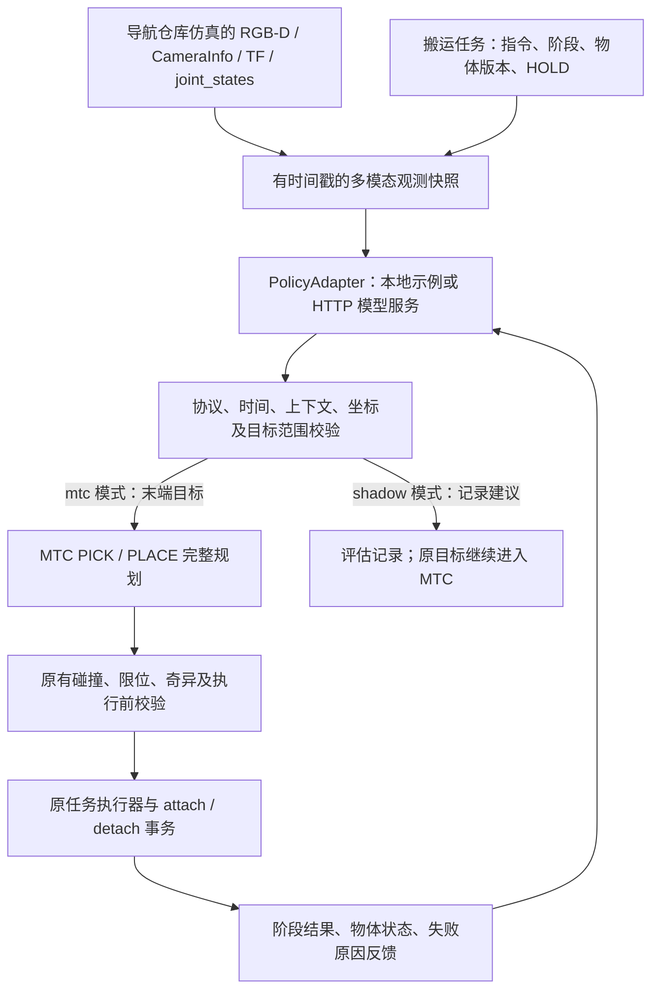

# 机械臂 VLA 通用接口与实施

按“通用接口与示例适配器”实施。VLA 接在现有搬运任务的 PICK_PLAN / PLACE_PLAN 入口，负责提出目标；MTC 负责生成完整可验证计划；任务事务层持有资源并调用原执行器。默认不配置 VLA 时保持原流程。

## 控制边界



VLA 不持有底盘、机械臂或夹爪控制权，不发布速度或轨迹，不修改抓取确认、附着、释放与保载事务。VLA 失败仍进入原 stop_and_hold；PLACE 推理失败时不会张爪。导航仲裁、包络握手、资源租约及 MTC 的逐段校验保持原职责。

当前执行范围为固定底盘下的左臂 PICK / PLACE。多摄像头接口可配置最多 4 路；双臂联合动作、移动中操作、力控制不在本版执行能力内。整个实现复用导航仿真，没有新增世界、地图、时钟或机器人实例。

## 已实现的接口

协议版本 `astribot.vla/1`，传输层是 HTTP POST JSON 或同进程 `PolicyAdapter.call(endpoint, packet)`。SDK 和示例只依赖 Python 标准库，不要求 ROS、GPU 或模型框架。不同模型依赖可以放在独立 Python 环境，机器人侧只加载轻量 HTTP 客户端。

| 端点 | 输入／输出及责任 |
|---|---|
| `/capabilities` | 返回 schema、policy_id、model_revision、normalization_id、robot_model、units、action_types。机器人型号须为 astribot_s1，执行模式要求 mtc_targets 能力 |
| `/reset` | 输入 episode_id，清除该 episode 的历史／缓存动作块；返回 `{ "schema": "astribot.vla/1", "ok": true }` |
| `/infer` | 输入完整观测和任务上下文，返回绑定同一请求身份的动作建议 |
| `/feedback` | 异步阶段结果：request_id、stage、status、reason、物体状态与版本、ROS 时间戳 |
| `/cancel` | 中断推理的尽力通知；无论远端是否响应，本地会话已关闭且迟到结果不会执行 |
| `/close` | 任务最终状态和物体状态；释放模型端 episode 资源的尽力通知 |

`capabilities/reset/infer` 有墙钟截止，默认 3 秒，配置上限 10 秒；没有自动重试。反馈使用有界队列，不阻塞机械臂停止或载荷保护；远端不可达时记录错误。远端服务应支持 cancel 与 infer 并发，并按 episode 隔离状态；示例服务是无状态的。客户端进程结束可能丢失未发送完的遥测，以本地账本和 VLA 文件为准，模型服务应自行为遗留 episode 设置回收期限。

服务宿主默认绑定 127.0.0.1。它是受控推理环境的适配宿主，不是带鉴权的公网模型网关；远端可通过受控网络或已有认证代理连接，客户端支持 HTTPS。响应上限 2 MiB、请求上限 32 MiB，不跟随重定向。

### 观测与请求

每次请求包含 `schema / episode_id / request_id / sequence / context_id`。会话内序号严格递增、请求 ID 仅消费一次；响应须原样回传五个身份字段。`context_id` 对任务阶段、物体版本、场景几何、附着物、标定来源和 HOLD epoch 求摘要。

| 数据 | 内容与约束 |
|---|---|
| instruction / operation | 自然语言任务，PICK 或 PLACE；只读探针使用 OBSERVE |
| cameras[id] | RGB 原始数据的 Base64、编码、宽高、行步长、端序、frame、拍摄时间；可选对齐深度及到米的比例 |
| camera_info | K / D / P、畸变模型、尺寸、frame、独立时间戳及内参摘要 |
| base_from_camera | 对应 RGB 拍摄时间的 TF，位置米、四元数 xyzw；不是假定的恒定外参 |
| joints / arm_joint_names | 带名字和明确顺序的实测关节位置；保留全身状态、单列左臂 7 关节顺序 |
| tcp | 在 base_frame 中的 TCP 位姿，查询到观测锚定时间 |
| object_observation / context.object | 最近一次任务视觉观测及自身时间戳、物体 ID、版本、WORLD/ATTACHED 等事务状态；PLACE 阶段不将旧物体观测伪装成新观测 |
| nominal_action | 任务原始 pre_target、target、exit_targets；作为算法可修改的局部参考和范围约束 |

观测初始龄期不超过 0.5 秒（沿用场景配置），允许相对 `/clock` 领先至多 10 ms。相机内参与 RGB 偏差 ≤100 ms，深度与 RGB ≤50 ms，多相机及关节时间跨度 ≤100 ms。TCP / 相机 TF 必须在指定时间可查询；图像编码、尺寸、数据长度和内参都需有效。当前深度输入要求与 RGB 对齐，不能把未注册深度直接配对。

推理完成后再读取新鲜观测并检查：任务／场景／附着／HOLD 不变，基座位移 ≤2 mm、旋转 ≤0.003 rad，关节变化 ≤0.01 rad，内参摘要不变，相机相对基座的位移 ≤2 mm、旋转 ≤0.003 rad。请求观测的 ROS 龄期和推理墙钟时间均不得超过 max_snapshot_age_s（默认 4 秒）。这些是当前静止工位的接入条件，不是真机精度声明。

### 动作输出

所有动作显式给出 `type / frame_id / group`；当前 group 必须 arm_left，frame 必须请求的 base_frame。单位固定为 m / rad / s，四元数 xyzw，夹爪采用目标开口宽度米，不自动猜测模型 0/1 的开合含义。

| type | 结构 | 当前执行能力 |
|---|---|---|
| mtc_targets | pre_target、target、exit_targets，每个位姿为 position[3]、quaternion[4] | 可在 mtc 模式交给 MTC；每个目标相对任务参考默认最多偏移 15 mm / 0.1 rad，配置硬上限 20 mm / 0.2 rad；不允许改变退路候选数量或添加夹爪命令 |
| ee_delta_chunk | samples，每项 time_s、position_delta_m[3]、rotation_vector_rad[3]、gripper_width_m | 只允许 shadow 评估；增量定义为相邻步在请求 base_frame 中的平移与左乘旋转向量；不消费到执行器 |
| joint_position_chunk | joint_names 和 samples，每项 time_s、positions_rad[7]、gripper_width_m | 只允许 shadow 评估；必须与观测给出的关节顺序一致；不消费到执行器 |

动作块最多 32 步，时间严格递增且总时长 ≤2 秒；末端每步增量 ≤20 mm / 0.2 rad；夹爪宽度范围为 0–0.1 m，仅为线协议检查。关节块的有限数值检查不是机器人关节限位、碰撞或动力学验证，故不开放执行。真正执行的关节限位、碰撞、奇异和时间参数化校验仍由现有 MTC 路径承担。

`shadow` 表示建议不替换任务目标，但推理仍处于阶段请求链中，失败会停止当前任务。需要完全不影响机器人任务的算法试验，使用独立只读 `vla_probe`。

本版每个 PICK / PLACE 各推理一次，随后执行完整 MTC 序列。反馈可用于算法评估和跨阶段状态更新；这不等于已实现 20/50 Hz 的视觉闭环动作块控制。后续开放动作块执行需要单独的机器人动作映射、全块轨迹验证、执行时反馈和安全中断设计，不能直接把张量传给控制器。

## 模型适配责任

不同 VLA 的动作空间、反归一化和训练机器人并不统一。例如 OpenVLA 官方调用需要 `unnorm_key`，OpenPI 客户端返回 `infer(observation)["actions"]` 动作块。适配器负责把本接口输入转换到具体模型的视觉、状态和语言格式，再依据所用 checkpoint 的动作定义转换回显式单位／坐标／夹爪语义，提供可追溯的 normalization_id。不能仅因动作向量长度相同就复用。

核对的上游接口：[OpenVLA 官方项目](https://github.com/openvla/openvla)、[OpenPI 官方远程推理接口](https://github.com/Physical-Intelligence/openpi/blob/main/docs/remote_inference.md)、[OpenPI 动作块客户端](https://github.com/Physical-Intelligence/openpi/blob/main/packages/openpi-client/src/openpi_client/action_chunk_broker.py)。本轮没有下载模型、连接这些原生服务或验证模型效果。

代码入口：

- `vla_contract.py`：协议和执行准入校验。
- `vla_policy.py`：PolicyAdapter、ReferencePolicy、HTTP 客户端和会话生命周期。
- `vla_ros.py`：观测快照、上下文绑定、MTC 目标接口和结果反馈。
- `vla_server.py`：可加载 `module:factory` 的推理宿主。
- `vla_examples.py`：5 mm 目标偏移、两步末端增量块两个可运行示例。
- `vla_probe.py`：只订阅传感器和 TF、调用策略；不创建机器人命令 publisher/service/action。
- `vla_replay.py`：把已记录观测发送到其他策略做离线对比；强制 shadow，不导入 ROS。

示例均为确定性的接口夹具，不是训练过的 VLA；ReferencePolicy 原样返回 nominal_action，不根据图像产生语义推理。

## 使用

以下命令在仓库根目录执行。已验证的构建覆盖层位于 `/tmp/codex_transport_install`，只包含同一导航仿真的包覆盖，不是新仿真环境。常规部署时可把包构建进已有 ws_robot/install；两个环境中的源码版本应一致。

```bash
source /opt/ros/humble/setup.bash
source /tmp/codex_transport_install/setup.bash

# 独立推理服务，默认是返回参考目标的夹具。
ros2 run astribot_s1_transport vla_policy_server --port 8771
```

另一个终端加载同一 ROS 环境，并与当前导航会话的 DDS 配置一致：

```bash
# 只读观测 + HTTP 推理。不会移动机器人，也不会重建环境。
ros2 run astribot_s1_transport vla_probe \
  --config ws_robot/src/astribot_s1_transport/config/vla_http_shadow.json \
  --output /tmp/vla_probe_run1
```

替换模型服务工厂可运行两个示例之一：

```bash
ros2 run astribot_s1_transport vla_policy_server --port 8771 \
  --factory astribot_s1_transport.vla_examples:DeltaChunkPolicy
```

自己的适配器实现 `call(endpoint, packet)`，再将 factory 改为自己的 `module:factory`。只读探针也可用 `vla_reference.json`，直接调用本地参考适配器；探针始终强制 shadow。

使用同一帧记录比较另一个策略，无需运行仿真：

```bash
ros2 run astribot_s1_transport vla_replay \
  --config ws_robot/src/astribot_s1_transport/config/vla_http_shadow.json \
  --request runs/vla_interface_20260919/live_reference/vla/0001_request.json \
  --output /tmp/vla_replay_run1
```

重放生成新的 episode/request 身份并标注来源；保留原始传感器时间戳，不将历史数据当作实时数据。示例 HTTP 服务需要另行启动。

在**空闲、由本任务持有的导航搬运仿真**中，按 transport README 启动技能及支持节点后，启用参考目标经 MTC 执行：

```bash
ros2 run astribot_s1_transport transport_task \
  --scenario ws_robot/src/astribot_s1_transport/config/warehouse_transfer.json \
  --vla-config ws_robot/src/astribot_s1_transport/config/vla_reference.json \
  --instruction '将取货台上的橙色箱体搬到目标工位' \
  --output /tmp/vla_transport_run1
```

HTTP 执行时在独立配置副本中设置 adapter=http、endpoint 和 mode=mtc；capabilities 必须声明 mtc_targets。省略 --vla-config 则使用原 MTC 流程。PLACED 恢复使用原 --resume-placed 入口，不带 VLA 配置，避免恢复阶段重新推理或重复不可逆动作。

每次任务的 output/vla 保存 session、原始观测请求、响应、decision、feedback 和通知错误；身份 ID 连接到任务 events.jsonl 和 /transport/status。图像是记录时收到的原始数据，可由适配器按步长／端序重建。这里只提供审计与离线重放输入，不提供旧响应直接驱动机器人入口。

## 验证边界

本轮验证结果和命令输出保存在 `runs/vla_interface_20260919`。包含协议／HTTP／ROS 消息集成测试，以及复用正在运行的导航仓库的只读传感器探针。该会话属于另一组导航验证，未重启、清理、改变姿态或发送搬运命令。

| 验证 | 本轮证据 |
|---|---|
| 本地参考策略 + 实时仿真传感器 | live_reference/summary.json：640×480 RGB、对齐深度、CameraInfo、拍摄时间 TF、26 关节；仅观察和推理 |
| HTTP 动作块示例 + 已记录仿真观测 | replay_http_delta/summary.json：独立 HTTP 宿主返回 ee_delta_chunk，协议校验通过；未执行动作 |
| 第二次实时 HTTP 探针 | live_http_delta/summary.json：相机未就绪超时；原 h0_run1 会话已于本机 07:11:07 收到 SIGINT/SIGTERM，session.json 为 stopped，另一导航测试启动了新会话。此失败不能用于推断模型接口或旧仿真持续卡死 |
| 完整接口回归 | unit_tests.log：55 项全部通过，无跳过。覆盖协议、ROS 消息集成、HTTP、目标偏移、影子隔离、取消、迟到响应、场景和标定变化、失败保载 |
| 构建与安装入口 | build.log：astribot_s1_transport 构建通过；transport_task、vla_probe、vla_replay 的已安装 CLI 帮助检查通过 |

临时 HTTP 示例服务验证后已退出。没有修改或停止其他导航会话。

先前 MTC 完整搬运成功记录见 `MTC_NAVIGATION_SIMULATION_20260919.md`。它不用于替代本次 VLA 集成的完整运动验收。本轮不宣称已完成“新接口 + 完整抓取搬运放置”动态回归，也不宣称模型性能、真实夹持力或真机相机标定已验证。
