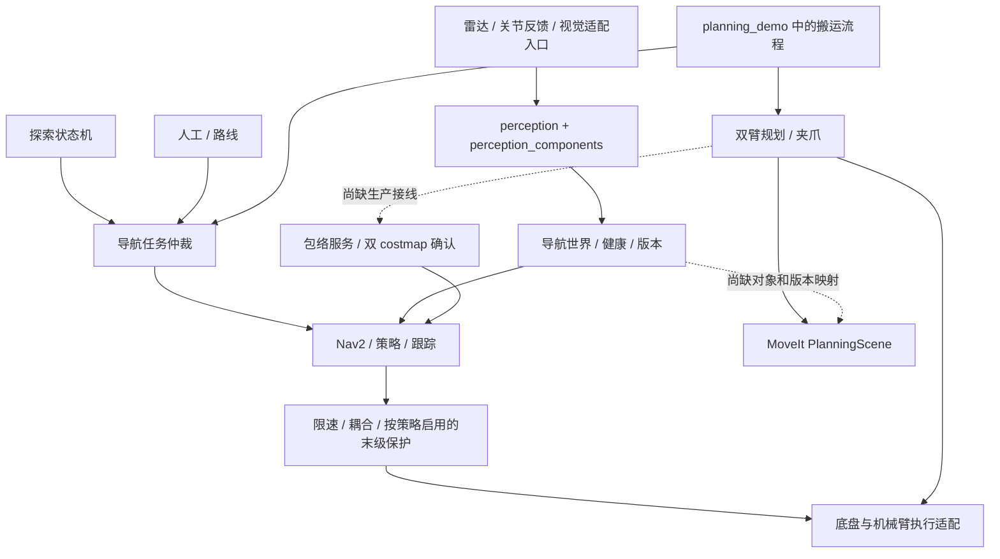
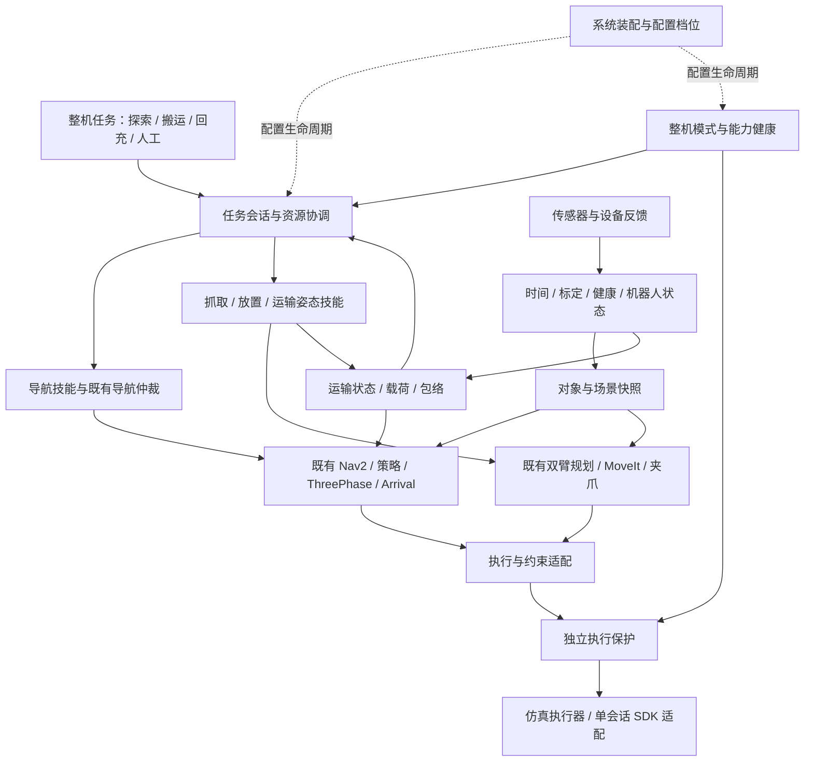

# 轮式双臂机器人整体架构审查与演进方案

日期：2026-09-17。范围：当前工作区的 19 个 ROS 包、系统启动/部署脚本，以及可见的 SDK 适配边界。工作区存在未提交改动；不把 Git 基点当作完整版本。本文是源码架构审查和设计建议，不是整机功能或安全认证，也未验证厂家二进制内部能力。

## 1. 判断

现有“感知—探索—导航策略—跟踪—执行适配”分层基本合理，双臂规划也已有可复用实现。下一步应优先补齐**整机任务、资源所有权、运输状态和世界模型之间的闭环**，再整理包边界；不宜为了目录整齐重新实现控制器或把所有模块合成一个自主包。

本次解析了 19 份直接子目录 `package.xml`：17 个自有包、2 个第三方包，声明的内部依赖图没有环。但发现清单之外的反向 launch 依赖，故“清单无环”不等于实际装配无环。大型文件行数只用于定位审查入口，不以行数直接判定设计错误。

### 已有能力，不能重复列为缺失

| 能力 | 当前实现 | 尚需区分的边界 |
|---|---|---|
| 导航任务仲裁 | `TaskArbiter`，人工/路线/探索优先级及取消终态屏障 | 仅仲裁导航 Action，不拥有左右臂、躯干、夹爪 |
| 世界版本和传感器健康 | 执行上下文、地图/定位/包络/时钟版本、健康与覆盖检查 | 导航世界接口尚未成为操作场景的共享数据边界 |
| 多传感器扩展 | Adapter 工厂、视觉 JSON、已分割点云框、CameraInfo 接口 | 接口可用不等于实体相机、标记定位、抓取检测已接通 |
| 包络管理 | `RobotEnvelope`、停车提交、两张 costmap 足迹确认 | 源码中未找到双臂生产流程调用 `SetRobotEnvelope` 的客户端 |
| 双臂操作 | 单臂/闭链规划、碰撞/奇异检查、夹爪、轨迹优化、搬运示例 | 搬运流程集中在 demo；不等于有通用整机任务执行器 |
| 运行和设备保护 | 仿真主管、真机启动/停车、SDK 写入准入、偏差/时效保护 | 尚不能据此认定有统一的整机模式、能力降级和故障恢复管理 |
| 底盘与机械臂耦合 | 姿态限速、动态限速、包络接口 | 限速不等于联合轨迹规划、力控或完整抗倾覆控制 |

旧 `astribot_s1_autonomy` 已删除；新包中的同名 C++ namespace/include 是保留的接口名称，不代表旧包仍存在。前一轮[七项修复](ARCHITECTURE_FIXES_20260914.md)已经落入源码，本文讨论的是后续边界和闭环，不重复要求重做这些修复。

## 2. 当前结构及关键断点

源码依据：

- [导航仲裁](../ws_robot/src/astribot_s1_navigation_policy/astribot_s1_navigation_policy/task_arbiter_node.py:31)只创建 `NavigateToPose` / `NavigateThroughPoses` 入口。
- [搬运示例](../ws_robot/src/astribot_s1_manipulation/src/planning_demo_node.cpp:730)自行调用规划和导航 Action；同文件包含抓取、附着物、运输姿态、导航和放置流程。
- [包络服务](../ws_robot/src/astribot_s1_navigation_policy/astribot_s1_navigation_policy/envelope_node.py:75)已提供变更握手；本次在 `ws_robot/src` 和 `tools` 中检索，调用方接线尚未发现。
- [导航 launch](../ws_robot/src/astribot_s1_navigation/launch/navigation.launch.py:346)仅在策略非 `off` 时启动包络协调、策略和 `FinalProtection`。`off` 仍有 Nav2 碰撞检查和设备保护；不能描述为“没有安全保护”，也不能承诺其已具备载荷包络联动。

## 3. 需要补齐的逻辑模块

以下是逻辑模块，不要求逐项新建 ROS 包或进程。优先级表示新增整机功能前的建设顺序，不表示已通过动态实验确认当前发生故障。

| 优先级 | 模块 | 当前基础与缺口 | 建议接口及职责 |
|---|---|---|---|
| 最高 | 整机任务执行与资源协调 | 已有导航仲裁和搬运示例；缺少统一持有底盘、双臂、躯干、夹爪的任务上下文 | `ExecuteTask` Action、任务/步骤 ID、资源集合、取消终态、暂停点、恢复条件；保留导航仲裁作为下层执行端 |
| 最高 | 运输姿态与载荷管理 | 包络服务已存在，缺少从关节/碰撞模型/实际抓取状态生成并持续验证运输状态的生产链 | `RobotConfigurationSnapshot`、`TransportReadiness`、包络版本；协调抓取确认、载荷附着、姿态切换、双 costmap 确认 |
| 最高 | 整机模式与能力健康 | 启动检查、传感器健康、桥接保护分散存在；缺少统一的可执行能力和恢复规则 | `IDLE/NAVIGATING/MANIPULATING/TRANSPORTING/FAULT`，能力状态、原因和租约；停止后的重启不自动恢复旧动作 |
| 高 | 操作场景与物体生命周期 | 已有导航障碍融合和 MoveIt PlanningScene，搬运物体由示例创建/附着；缺少共享对象身份和观测版本 | `ObjectHypothesis`、`TrackedObject`、`AttachmentState`、scene revision；给导航生成保守投影，给操作提供三维碰撞场景 |
| 高 | 操作技能与末端执行验证 | 有轨迹、闭链和夹爪能力；缺少独立的抓取/放置/运输技能 Action、抓持成功证据和恢复步骤 | `Pick/Place/MoveToTransportPose`，取消/失败分类、接触或夹持反馈；先复用现有能力，不重写规划器 |
| 高 | 标定和定位质量管理 | TF、CameraInfo、标定 epoch、位姿新鲜度均有基础；缺少统一标定资产及定位质量到整机能力的映射 | 标定版本、外参有效范围、重定位事件、协方差/匹配质量、允许的任务集合；TF 可查不直接等同于定位可信 |
| 中 | 整机诊断与事件追踪 | 已有 spdlog、导航状态和指标；缺少贯穿导航、抓取、载荷与 SDK 的同一任务关联链 | 结构化事件、任务/步骤/动作/包络/配置 ID、故障原因、恢复建议；日志仍供人读，状态协议供机器消费 |
| 按业务需要 | 电源、回充与长期值守 | 当前审查未找到可确认的项目级电池状态适配、回充技能和低电量任务策略；厂家是否提供需另核对 | 电量/充电/温度/故障适配、回充 Action、任务预算；先读取 SDK/设备状态，再设计策略 |
| 后期 | 力控与全身协同运动 | 闭链规划和 SDK `use_wbc` 参数已存在，默认桥接不启用 WBC；缺少可验收的整机同步执行契约 | 双臂共同时间线、任一臂异常时协同停止、负载/稳定性约束；边走边操作、阻抗控制按真实硬件能力单独立项 |

对当前“先停稳再操作”的任务，全身联合优化并非首个必须项。先完成分阶段搬运、真实运输就绪确认和资源互斥，才能为后续同时移动与操作提供可靠基础。

### 3.1 一个必须闭合的运输事务

建议流程：

1. 任务层申请所需资源，取消旧执行并等待终态；确认底盘停稳。
2. 提交能够包住计划姿态变化和载荷的保守包络，`transport_ready=false`。
3. 完成抓持、附着关系和运输姿态；用实际反馈确认，不能用“命令已发送”代替。
4. 提交实际运输包络；两张 costmap、策略和保护使用同一版本，确认就绪后才导航。
5. 导航结束并停稳，再进行放置/解除附着；确认载荷已释放后缩小包络。
6. 任一步失败保留安全姿态和资源所有权，明确结束或等待人工；不能自动假定物体已经放下。

该事务复用现有包络握手。新增的是双臂任务调用方、有效证据和整体状态机，而不是第二个包络服务。

### 3.2 双臂执行还需要明确的契约

[真机臂桥接](../ws_robot/src/astribot_trajectory_bridge/astribot_trajectory_bridge/arm_traj_bridge_node.py:89)对多个臂组共享 `_goal_lock`，接收时检查锁、执行时持有锁。[默认配置](../ws_robot/src/astribot_trajectory_bridge/config/arm_bridge.yaml:4)提供左右臂分组。这是本节点的串行保护，不是双臂轨迹同步器，也不是底盘和机械臂的整机资源管理。

因此，已有闭链规划成功不能推导为真机双臂闭链同步执行已支持。需要单独确定联合目标接口、共同起始时间、采样推进、取消屏障和一臂失败时另一臂的保持行为；不应简单删除锁来“开启并行”。本次只确认代码边界，未做真机并发故障实验。

搬运示例的 [runNavigation](../ws_robot/src/astribot_s1_manipulation/src/planning_demo_node.cpp:809)在超时时发送异步取消后返回，不等待旧导航终态。正式任务服务应复用现有导航仲裁的取消屏障，并把“取消请求已发出”和“执行已经停止”分成两种状态。

[DualArmPlanner 的执行后等待](../ws_robot/src/astribot_s1_manipulation/src/dual_arm_planner.cpp:1045)调用 `waitUntilSettled()` 后返回成功，而该等待函数返回 `void`，不能把超时状态传给调用者。因此后续正式技能还需分开“轨迹执行器报告成功”和“实测停稳已确认”，不能直接用现有成功返回值授予底盘运输许可。

## 4. 哪些应整合，哪些应拆分

| 当前位置 | 建议 | 原因与保留边界 |
|---|---|---|
| `navigation` 内的整栈 launch、`perception` 内的 Gazebo 装配、`tools/robot` 编排 | **整合系统装配职责**到一个明确的 bringup 层 | 感知和导航能力不应反向拥有整个机器人。保留仿真/真机执行适配器、不同停止语义；不强行共用一个大脚本 |
| `planning_demo_node.cpp`（约 1900 行） | **拆分业务流程与能力**：技能/任务执行、场景适配、演示入口 | 算法留在 `manipulation`；示例只提交任务或显示结果，不再承担生产搬运状态机 |
| `manipulation` 与 `moveit_config` | **移出跨包启动入口，消除隐式反向依赖** | 最小改法是把依赖两者的 `planning_demo.launch.py` 迁到 bringup；配置依赖插件可保留，无需立即拆 OMPL 插件包 |
| `navigation_policy` | **先包内拆层**：domain / application / ROS adapters | 已有纯领域算法可保留；把世界读取、候选规划、TF/Clock 作为小接口组合注入，减少 Node 继承和内部字段穿透 |
| `path_tracking` | **先拆构建目标和内部目录**：控制器、规划器适配、BT、平滑器 | 当前同时装有 Arrival/ThreePhase、ExactGoalPlanner、BT 和 jerk smoother；保留插件 ID、参数和控制特性，独立发布确有需要时再拆 ROS 包 |
| 两处机械臂限速、包络与稳定性计算 | **整合输入模型和约束解释**，暂保留现有执行链 | `arm_speed_limiter_node` 发 SpeedLimit，dynamics 节点缩放末级速度，目的和作用位置不同，不能直接当重复代码删除。先影子计算对照，再决定替代 |
| `exploration` 协调器（约 2380 行） | **包内拆成会话状态、异步搜索、Nav Action 适配、状态发布** | 已修复异步搜索/取消，不再把旧锁阻塞问题重复列为未修。用组合拆职责，保持候选、预算及状态转换行为 |
| `perception` 与 `perception_components` | **保留两个包，统一接口与装配归属** | 高频 C++ 组件与 Python 编排分开合理；不能仅因都叫感知而合并。定位/地图若需独立发布，再抽专门包 |
| `trajectory_bridge` | **保留单 SDK 会话，包内维持设备适配/纯核心分层** | 已有 `SessionPort` 和单会话容器是正确基础。拆独立 SDK 进程会改变控制权和时序，不能作为目录整理动作 |
| `navigation_msgs`、`bridge_msgs` | **按领域保留，逐步抽跨域整机契约** | 不把导航路径、底层设备协议、业务任务塞进同一万能消息包；新增任务/机器人状态接口有两个真实消费者后再独立成包 |
| `autonomy_core`、`description`、`logging` | **维持独立** | 分别承担纯算法、模型资产、横切基础设施；不要重新合成已退役的自主包 |

### 已确认的隐式依赖

`moveit_config/package.xml` 声明依赖 `manipulation` 的规划插件；反向的 [planning_demo.launch.py](../ws_robot/src/astribot_s1_manipulation/launch/planning_demo.launch.py:119)直接读取 `moveit_config` 的 SRDF/参数，232 行又包含其 launch，但 `manipulation/package.xml` 没有这条依赖。

这解释了为什么清单扫描无环而按包独立安装仍可能缺运行资源。不要仅补上反向依赖形成显式环；应把组合入口上移。若以后插件需要独立发布，再抽 `planning_plugins`，不是当前的必要前提。

### 不宜合并的部分

- 全局/局部规划和跟踪控制器：计算周期、失败语义、替换方式不同。
- 决策与独立末级保护：共享几何定义和接口，但保留独立输入校验与停止路径，避免一个失效同时破坏两层。
- 仿真执行器和真机 SDK 适配：可以同一业务接口，不能假设时延、刹停和错误码完全等价。
- 导航二维地图与操作三维场景：共享对象/时间/坐标来源，保留各自空间表示和更新频率。

## 5. 目标结构

图中每个框是职责，消息箭头不是建议每层都新增一次速度转发。高频控制链保持短；场景搜索、任务编排、记录器与执行保护分离调度。也不要求将 Nav2 和 MoveIt 的世界存入一个有全局锁的大对象。

优先考虑的新增物理边界只有：系统装配 `astribot_s1_bringup`、正式任务执行 `astribot_s1_task_execution`；其余先在归属包内用库和小接口组织。整机状态、技能、诊断等达到独立依赖/部署需求后再拆包。

## 6. 接口和设计原则如何落地

日常所说的“八大原则”不是统一的 ISO 认证条款。这里使用 SOLID 五项，加上最少知识、组合优先、高内聚低耦合，作为具体审查准则。

| 原则 | 在本项目的具体动作 |
|---|---|
| 单一职责 | task 执行步骤，planner 生成候选，controller 输出速度，bridge 适配设备；把 demo 业务与算法分离 |
| 开闭原则 | 沿用传感器 Adapter 和 Nav2/MoveIt 插件；新增视觉、标记、任务技能通过注册和配置接入 |
| 里氏替换 | 实时/回放世界、仿真/真机执行端遵循相同任务终态和取消语义；差异显式声明能力，不能伪造成功 |
| 接口隔离 | 分开 `WorldReader`、`RobotStateReader`、`CandidatePlanner`、`MotionExecutor`、`HealthReader`；避免传整个 ROS Node |
| 依赖倒置 | 任务/策略依赖端口，由 bringup 注入 ROS、SDK、回放实现；不让算法导入启动脚本 |
| 最少知识 | `RouteCoordinator` 不再层层读取 `node.last_world/last_robot/tf/profile`，只接收所需快照和服务 |
| 组合优先 | 将 `PolicyNode(PolicyObserver)` 的观察与决策拆成协作对象。Arrival/ThreePhase 暂保留现有继承，等价证据充分后再讨论变化 |
| 高内聚低耦合 | 模型资产、配置、任务、规划、设备协议分别归属；共享消息不依赖实现，不创建万能 common 包 |

建议统一的跨域任务信封包含 `task_id/step_id/execution_id/resource_set/config_revision/world_version/deadline/cancel_state/reason`；不是把所有字段强塞进每条高频消息。取消 ACK、终态、实测停稳分别记录。Topic 用于观测和状态，Action 用于可取消长任务，Service 用于有界查询和配置提交。

业务失败需区分被抢占、用户取消、暂时阻塞、定位失效、抓取未确认、运输姿态未就绪、终点位置/朝向不可达等。暂时受阻不等于永久不可达；也不能通过换任务 ID 无限重置失败预算。

## 7. 保持现有效果的施工顺序

本轮[仿真回归](AUTONOMY_SIMULATION_REGRESSION_20260917.md)补充了一个具体的优先排查项：Nav2 就绪后，探索连续否决每轮全部 8 个采样候选，自动恢复耗尽，目标派发数为 0。它说明候选生成与完整足迹/观测位姿验证需要共同的可行性契约和实图回放；分别存在搜索器、验证器和状态机，并不保证组合后有可用目标。先定位该组合问题，再实施后续结构迁移，避免把已有功能缺陷混入重构对照。暂不把它定性为安全冗余过大或删包引入的故障。

| 阶段 | 内容 | 放行证据 |
|---|---|---|
| R0 | 固定源码/参数/地图/实体模型；建立模块与运行依赖清单 | 包依赖、实际参数、构建清单；仿真短/长路线分别记录；统计比较需要重复对照 |
| R1 | 只整理装配和内部职责；移动组合 launch；收敛公共状态读取 | 旧/新入口展开后节点、参数、话题、插件、控制输出一致；无隐式资源依赖 |
| R2 | 任务会话、整机资源、模式及取消契约 | 导航/双臂争用、迟到结果、取消超时、节点重启；旧任务不能继续驱动新任务 |
| R3 | 接通双臂运输姿态—载荷—包络—导航事务 | 抓取失败、姿态未到位、载荷扩大、足迹未确认均不能进入运输；恢复默认姿态后不增加常态停车 |
| R4 | 语义对象、三维场景和定位/标定质量接口 | 对象移动/抓取/释放一致性、定位跳变、标定换版、传感器缺失；旧世界证据失效 |
| R5 | 正式操作技能、长期值守及可选全身协同 | 同时覆盖移动和操作指标；每种真机能力独立验收 |

不得同时修改目录、状态机、控制律和控制参数。优先采用当前实现适配新端口的方式；新约束先影子计算，记录它会如何影响既有路线，再决定启用。独立保护不因“去重复”删除，也不以泛化健康判断无条件叠加停车。

导航回归保留 ≤3 cm / 1.5° 用户要求；真值精度档继续 2 mm / 0.1°。同时记录横向/航向、速度波动、加减速、jerk、异常旋转、误停和重规划原因。时间仅作为预算，不参与质量排名。双臂另加末端/闭链误差、抓持保持、场景净空、同步和停止反馈；不能用导航到点成功替代双臂验收。

按既有要求，临时脚本和单元测试不重新堆入产品仓库。外部验证工程应可版本化复现，并由发布记录关联输入、源码摘要、原始数据和判定规则；删除仓库内测试文件不能等同于取消回归约束。

## 8. 规范依据与适用范围

- [ISO/IEC/IEEE 42010:2022](https://www.iso.org/standard/74393.html)规范架构描述的结构和概念关系，不指定 ROS 包数量或设计模式。本项目应维护功能、依赖、运行控制权、部署、数据/坐标和故障恢复等视图，以及决策理由；本文不声明符合性认证。
- [ROS 2 Managed Nodes](https://design.ros2.org/articles/node_lifecycle.html)提供标准生命周期接口。优先应用到需要可控启停/配置的节点，不要求一次性改造所有节点，也不能用 `active` 代替数据/能力健康。
- [REP-105](https://reps.openrobotics.org/rep-0105/)区分 map 与 odom 的坐标语义。定位跳变、局部连续反馈和操作目标需有明确转换/版本契约，不能单靠恒等 TF 假设贯穿所有模式。
- [MoveIt Planning Scene Monitor](https://moveit.picknik.ai/humble/doc/concepts/planning_scene_monitor.html)已有机器人状态和场景监测基础；扩展应复用其场景机制，增加跨域对象/载荷一致性，避免再造完整操作碰撞世界。
- [REP-2004](https://reps.openrobotics.org/rep-2004/)把版本、API/ABI、依赖、验证和文档纳入质量声明。建议建立项目自己的质量声明与证据索引，不在缺少证据时直接标称某个质量等级。

本次架构建议没有改变 ThreePhase、Arrival、MPPI/RPP 的算法或参数，也未启用真机双臂、WBC、视觉抓取或新的安全策略。仿真运动证据单列在回归记录中，不能用于放行本页尚未实现的模块。
