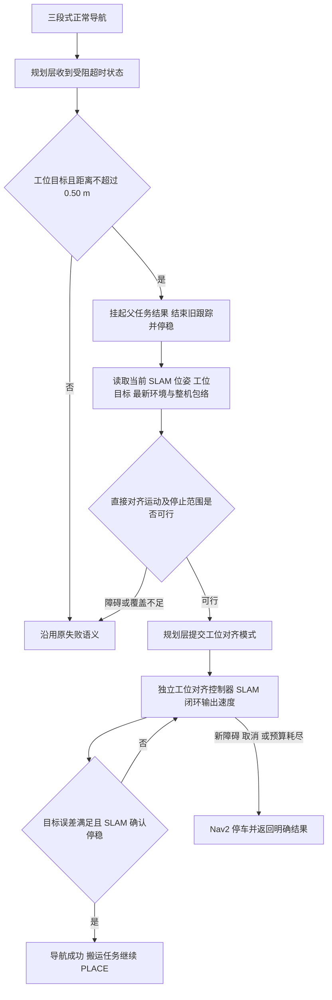

# 工位近场对齐方案：规划决策、感知判定、SLAM 位姿闭环

状态：用户已确认，最小实现已施工。当前实现与分层验收结果见 [实施记录](WORKSTATION_ALIGNMENT_IMPLEMENTATION_20260928.md)。本文保留原设计依据；不能将构建、隔离测试或静止配准视为完整搬运仿真通过。

## 1. 最新需求与职责

导航在距离工位目标底盘位姿不超过 0.50 m 时，出现 `TEMPORARILY_BLOCKED: obstruction deadline`，由规划层判断是否转入工位对齐。感知提供实际占用和已观测自由空间；规划层结合整机分层包络确认可以从当前实际位置直接到达原目标；独立工位对齐控制器以 `/slam/pose` 为反馈生成底盘速度。

三段式跟踪在交接时结束。工位对齐不继承它的路径进度、起始对齐、拐点状态、终段捕获半径或旧路径偏差。普通搜索、MPPI 和三段式跟踪算法不在本次修改范围。

采用现有 Nav2 controller_server 的单一控制通道，新增独立 C++ 控制器实现，不继承 ThreePhaseController/ArrivalController；可复用已有纯数学限幅、制动和 SLAM 停稳窗口。规划评估逻辑放入现有导航 C++ 包，BT 负责调用和交接，不另建常驻业务服务器。

## 2. 施工前的代码和证据

- `astribot_s1_navigation_policy/.../route_coordinator.py::advance`：受阻时间达到 `episode_timeout_s` 后锁存 failure，持续输出 HOLD；当前仿真配置为 30 s。
- `astribot_s1_path_tracking/include/.../route_commit.hpp`：收到 BLOCKED 即抛出 BT 异常，因此当前导航会先失败，没有工位对齐交接机会。
- 现有 ArrivalController 在 policy HOLD/零速度限制时提前返回；普通捕获半径 0.30 m，且依赖旧路径终段判定；精调 safeCommand 仍采用二维碰撞。
- 当前规划配置在目标附近 0.60 m 内限制绕行接管。它与 0.30 m 捕获条件之间存在交接空档的可能，但不能据此断言真实障碍不存在。
- front67 记录：脱困后真实当前位置已用于重新规划，普通跟踪最后记录距目标约 0.318 m，之后受阻超时，未进入 PLACE。该距离符合新入口的距离条件，尚不证明感知可达条件成立。
- 公共 LayeredCollisionSnapshot 已支持分层包络与占用检查，但目前要求 `gazebo_collision_geometry` 数据源。仿真几何结果不能标为真实 RGB-D 感知通过。

对应过程证据：`docs/DEPARTURE_ACTUAL_START_20260928.md`。

## 3. 完整流程



重要顺序：在受阻超时转成父导航终态之前接管。先把它作为可评估事件交给规划层；若评估未通过，再返回原受阻失败及补充原因。不能先让父任务失败、释放运输资源，再另起对齐任务。

单个工位目标最多进入一次对齐阶段。进入后不因距离在 0.50 m 附近波动而来回切换；失败时本次任务结束，不自动循环“普通跟踪—对齐”。沿用父任务总预算，对齐预算取现有精调预算与父任务剩余预算的较小者。

## 4. 触发和控制权交接

全部满足才产生候选：

1. 当前请求来自搬运工位导航入口，目标仍是同一个工位底盘操作位姿。
2. 原因为类型化的 OBSTRUCTION_DEADLINE，不匹配日志字符串；输入缺失、定位缺失、取消不转换成“受阻可对齐”。
3. 当前底盘到目标底盘位置的平面距离 <= 0.50 m。该条件不代表航向或机械臂一定可达。
4. 父任务仍有效且有剩余执行预算。

交接顺序：BT 请求结束旧 FollowPath → 等待旧子 Action 终态 → Nav2 零速度且 SLAM 窗口停稳 → 重新读取实际位置 → 完成近场评估 → 规划层提交 STATION_ALIGN → 启动独立工位对齐控制器。

父 NavigateToPose、搬运任务、原目标和附着载荷保持同一身份。旧路径的阻塞状态、HOLD 与零限速必须按该路径退出而退役，不能继续拦截新模式；独立的取消、禁行、实际障碍和任务停止仍有效。不能全局清空 HOLD 或清空代价图。

所有允许、停车、限速在 Nav2/规划/控制器内完成。没有新增底盘末级保护，没有另一个向底盘发布速度的节点。

## 5. 感知与规划如何判定可达

感知层提供“哪里占用、哪里明确观测为空闲、哪里未覆盖”。规划层负责将这些信息与机器人运动和包络相交，输出“当前直接对齐动作可执行”。相机看到了操作台、点云点数为零、底盘中心连线空闲，都不等价于整机可以到达。

评估范围：当前位置、目标位置、对齐控制律预计产生的整个平移与旋转扫掠，以及减速停车范围。须用独立对齐控制器同一套控制计算做预测，不能只检查直线位置插值；也不要求无关的大范围地图全部已知。

使用统一高度配置与当前姿态/附着载荷包络，当前配置为：

| 高度/m | 层 |
|---|---|
| 0.05–0.25 | 低矮障碍 |
| 0.25–0.68 | 主导航 |
| 0.68–1.18 | 躯干 |
| 1.18–1.63 | 头部 |
| 1.63–2.30 | 上伸机械臂/载荷 |

读取 `height_slices.yaml` 的统一 profile，不另写一套常量。每个实际占用高度的机器人凸包与对应地图相交，净空沿用包络既有余量，不能重复膨胀，也不能为通过而缩小。几何超出已建图高度时不声称全身已覆盖。

典型结论：

- 二维投影阻塞，但同一障碍有完整高度观测，实际各层均可通过：可进入对齐。
- 桌面、桌腿与手臂/载荷扫掠相交：不可进入。
- 目标空闲，中间被桌腿挡住，或旋转扫掠碰撞：不可直接对齐；这不等于所有绕行路径都不存在。
- 只有二维障碍且没有能解释其高度的证据：保留障碍约束，不能直接丢弃。
- 必经区域遮挡、未知或地图外：返回覆盖不足，不把未知改为空闲。
- 操作台是目标物，但其实体仍参与碰撞，不能用“目标工位”标签屏蔽整张桌子。

模式执行中使用最新环境更新剩余短时运动及停车范围。新障碍使它不可行时，由 Nav2 内部停止本次对齐。这是上层运动生成职责，不是重新引入底盘末级过滤器。

首版只支持已有直接对齐控制律能够安全到达的工位；不增加近场绕桌搜索、倒车搜索或多候选动作优化。

## 6. SLAM 坐标与数据契约

独立控制器当前位姿只来自 `/slam/pose`。先在定位适配边界明确该位姿代表的机器人参考点，统一为底盘参考帧。目标底盘位姿、环境地图与 SLAM 位姿必须有真实一致的坐标关系，不能只检查 frame_id 字符串相同。

如果工位目标在导航地图 M，SLAM 在局部地图 S，则定位/地图模块提供已有、明确的 T_M_S：

`T_S_base_goal = inverse(T_M_S) * T_M_base_goal`

控制误差在 S 中计算；碰撞评估使用同一变换将机器人放进地图 M。该变换不能从“希望已经到位”反推，不在控制器里写死补偿量，也不回退到里程计位姿。

施工前的问题：static_map 世界地图与独立 Voxel-SLAM 的局部原点不同，搬运模块直接使用 SLAM 坐标与导航目标比较。本次在 SLAM 源头加入实测 `General.initial_chassis_pose`，令初始化状态、点云与位姿处于相同地图坐标；禁止同时使用该初值与 previous_map。静止仿真输入配准已验证，运动与最终 NAV→PLACE 的统一口径仍需闭环验收。初值来自实测底盘位姿，不能直接把 spawn 指令的高度当实测高度。

时间语义：接收边界采用最新源时间戳的有效样本，较旧消息不覆盖当前状态；需要配对时按既定最近时间匹配。新增链路不增加基于当前时刻的传感器过期拒绝。传感器时间只用于排序/配对，任务执行预算使用单调时钟。缺少实际空间覆盖是感知结论，不能混称时间戳过期。

本次只需要以下数据，复用现有消息与任务上下文：

| 内容 | 所有者 |
|---|---|
| 父任务/会话、工位目标、目标坐标系 | 搬运任务/BT |
| 类型化受阻原因、当前模式 | 规划策略 |
| 当前底盘 SLAM 位姿、地图坐标变换 | 定位/地图 |
| 分层占用、自由空间覆盖、地图版本 | 感知/地图 |
| 分层整机几何、载荷与几何版本 | 几何/物体账本 |
| 对齐可行结论、所用目标与几何/地图版本 | 规划层 |
| 实际误差、对齐状态、SLAM 停稳结果 | 工位对齐执行器 |

任务身份和版本复用现有接口，不额外增加整套多方 ACK。地图更新使规划重新评估剩余动作；手臂/载荷几何改变时停止当前固定姿态对齐，本轮不支持边改变上肢姿态边进站。

## 7. 独立对齐控制器

逻辑状态只有 ALIGNING、SETTLING、SUCCEEDED/FAILED/CANCELED。没有三段式跟踪的起始航向对齐、路径拐点、路径投影和沿程进度。

每个控制周期使用当前 SLAM 位姿 `(x,y,yaw)` 和工位目标 `(xg,yg,yawg)`：

```text
dx = xg - x; dy = yg - y
ex =  cos(yaw) * dx + sin(yaw) * dy
ey = -sin(yaw) * dx + cos(yaw) * dy
e_yaw = wrap(yawg - yaw)

(vx, vy) = 限速、加速度/加加速度约束、制动处理后的 kp_xy * (ex, ey)
wz       = 限速、制动处理后的 kp_yaw * e_yaw
```

全向底盘可以同时纠正纵向、横向和航向误差，不强制转正后再沿旧路径跟踪。预测评估与实际执行调用同一控制数学核心，覆盖实际的耦合运动。

先沿用当前共享运动配置：20 Hz 控制频率、0.06 m/s 平移上限、0.15 rad/s 角速度上限、kp_xy=0.5、kp_yaw=0.8。这些是现有配置基线，不代表独立对齐控制器已经验收。共享精调预算为 135 s（受父任务剩余预算约束）；配置来源以实际启动合并结果为准，不能误用基础 YAML 中未合并的 45 s。

沿用现有制动/停稳处理，避免最小速度使机器人跨越容差后反复震荡。停稳只用 SLAM 窗口的有符号净位移和环绕角度差，不做误差绝对值积分，不恢复已删除的脱困路径偏离检查。

仿真到位门槛保持当前 2 mm / 0.1° 及既有停稳要求；这些是仿真控制验收值，不代表真实地图或硬件达到该精度。`idle_position_hold=true`、`idle_position_kp=3.0` 不变。

## 8. 最小代码落点

| 落点 | 变更 |
|---|---|
| `astribot_navigation_msgs/srv/ResolveRoute.srv` 与策略生产端 | 增加类型化受阻原因和必要的工位对齐阶段交接，消除本分支先失败后补救的问题；现有 Python 生产端仅做必要接口配合 |
| 现有导航 C++ 包中的规划评估函数与 BT 节点 | 判断 0.50 m/工位上下文，读取感知与几何，评估直接动作，提交或拒绝 STATION_ALIGN |
| 搬运工位导航 BT | 显式结束旧 FollowPath，再调用独立工位对齐插件；保持同一父目标。使用 Nav2 已有 BT 入口选择，不扩展 NavigateToPose 协议 |
| `astribot_s1_path_tracking` | 独立 `WorkstationAlignmentController`，直接实现 Nav2 Controller 接口；使用 `/slam/pose`，不继承三段式控制器 |
| `astribot_s1_robot_geometry` | 复用分层碰撞核心，对本次对齐动作做全段及短时停车扫掠评估 |
| 定位适配及 `fixed_station_navigation.cpp` | 统一 SLAM/工位/地图坐标和最终到位结果口径 |

Nav2 的 FollowPath 接口可以继续作为 controller_server 调用协议，选择独立的 WorkstationAlign 控制器。独立控制器从工位目标闭环求速度，不使用旧路径作为跟踪参考。评估中的采样轨迹用于验证运动空间，不成为新的三段式跟踪路径。

规划层提交新模式后，策略只退出该旧路径的失败锁存和约束；近场障碍评估结果仍决定是否允许运动。普通搜索、MPPI 和三段式跟踪的既有二维逻辑保持原状，分层碰撞只用于这个独立工位对齐阶段。

## 9. 实施顺序和验收

每步开始先检查输入、状态归属、输出、失败出口及验收条件。按顺序执行，不并行修改同一控制链。

1. 冻结目标与坐标契约：核对实际 `/slam/pose`、工位目标和分层地图坐标；统一最终到位判定。静止和已知位移数据验证，不能用手工偏置伪造通过。
2. 实现规划交接：类型化超时事件、0.50 m 候选、旧跟踪退出、评估提交；先做 C++/BT 隔离测试，确认父任务不提前失败、没有两个运动执行者。
3. 实现独立 SLAM 对齐与分层评估：共享纯控制数学/停稳工具，保持独立状态和目标完成条件；不修改普通三段式算法。
4. 当前仿真工位回归：从 front67 受阻附近验证对齐，再跑 PICK→运输→受阻切换→对齐→PLACE 并录屏。记录实际数据来源，真实传感器链路未通过时单独标注。

本次仅做以下必要边界，不扩展通用导航矩阵：

| 场景 | 验收条件 |
|---|---|
| 0.49 / 0.50 / 0.51 m，受阻超时 | 前两者可进入评估；后者维持原处理；输入故障不能被当成受阻 |
| 二维投影受阻、对应分层可通行 | 规划提交模式，旧 HOLD 不阻塞新模式，实际闭环到位 |
| 桌腿、桌面或载荷扫掠真实相交 | 明确拒绝，不以减小包络、忽略目标桌子或放宽碰撞门槛通过 |
| 必经区域遮挡/未知 | 返回覆盖不足，不把空点云当安全通道 |
| 横向偏差及航向偏差 | 由独立 SLAM 对齐消除；旋转扫掠不安全时拒绝 |
| 对齐期间新障碍/取消 | Nav2 停止，父任务结果明确，不进入 PLACE |
| SLAM 小幅正反抖动 | 按净变化判停，不积累成虚假运动；控制和到位检查坐标一致 |
| 完整正对工位搬运 | 同一目标完成抓取、运输、对齐、放置，日志/位姿/视频对应一致 |

输出证据包含：父任务 ID、模式切换原因、切换前后实际 SLAM 位姿、工位目标、地图与包络版本、控制器 ID、最小检查净空、终点 XY/yaw 误差、停稳窗口、失败原因和视频。构建/隔离测试/仿真几何/传感器仿真验收分别记录。

## 10. 参考和范围

Nav2 Docking 的“导航接近—目标定位—近场反馈控制—完成确认”职责划分可借鉴；本项目完成条件是工位位姿与停稳，不是碰撞接触或充电。当前使用 SLAM 位姿和既有工位目标，不声称实现了视觉工位跟踪，也不引入完整 Docking Server：

https://docs.nav2.org/jazzy/tutorials/general_tutorials/using_docking/

本轮不涉及 VLA、真机验收、新检测模型、全局分层搜索、MPPI 重构或近场复杂脱困。真实 RGB-D/LiDAR 自由空间覆盖需在已有感知链路提供相应证据后验收，不能用当前 Gazebo 几何图替代该结论。
