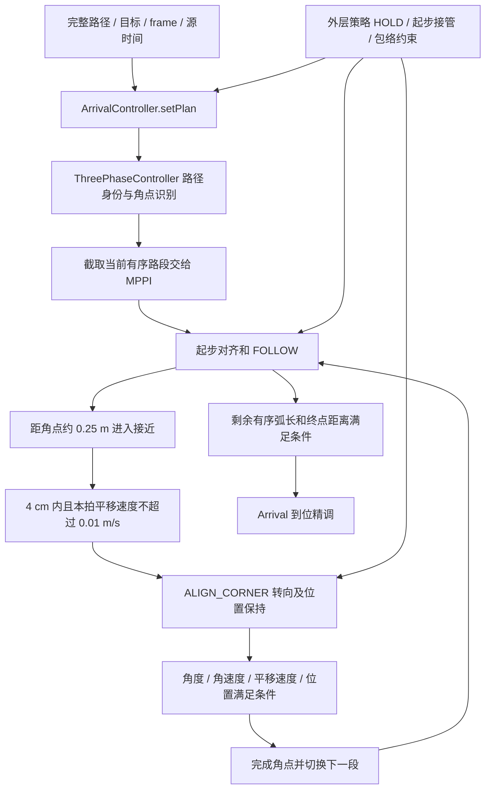

# C 阶段设计复盘：标准角点跟踪及策略交互

日期：2026-09-22。范围：工作 C1–C4；以 C91 冻结候选 v13 为准。

**结论：分段跟踪、角点停稳、转向、继续跟踪的总体方向可以保留，但当前不能验收 C 阶段。主要问题在任务身份、跨层状态所有权及不支持场景的处理契约，继续单纯调速度无法解决这些问题。**

本次只阅读源码、既有证据，并运行无 ROS 初始化、无节点、无通信的 C++ 对象级探针。没有启动 ROS/Gazebo/RViz、没有连接真机、没有修改运行代码或运动参数。C91 的暂停状态和后续阶段准入状态保持不变。

## 1. 版本与证据范围

- 计划：[工作 C 的目标与验收条目](/home/yjh/WorkSpace/astribot_sdk_ros2/docs/superpowers/plans/2026-09-21-unified-navigation-remaining-work.md:214)。
- 六个相关源码/头文件与 v13 快照逐字节一致；动态库实算 SHA256 与快照一致：`4bd3d241c16b9995db1c171ecb1adb1d628d71e5c40a66fcadf9e103f7e1b263`。
- [本次版本核对](/home/yjh/WorkSpace/astribot_validation/c_design_review_20260922/review_source_audit.json)。这是相关文件核对，不代表整个脏工作区全部等同冻结版本。
- [离线复现原始输出](/home/yjh/WorkSpace/astribot_validation/c_design_review_20260922/probe.log)、[探针源码](/home/yjh/WorkSpace/astribot_validation/c_design_review_20260922/review_probe.cpp)、[编译和链接记录](/home/yjh/WorkSpace/astribot_validation/c_design_review_20260922/commands.json)。
- 探针链接冻结 v13 控制库，使用现有测试访问器设置状态，以假内层控制器代替 MPPI；证明函数行为和状态转换，不证明真实调度频率、运动结果或闭环安全。

## 2. 现有设计实际如何工作



当前候选处理约 35°–157.6° 的航向变化，两侧检测窗口至少 0.25 m。它不是覆盖所有折角和掉头的通用执行器。4 cm 是中间角点捕获半径，既不是终点精度，也不是所有时刻的位置误差上界。

实际“原地转向”包含小幅位置保持：约 1 cm 内不纠正平移；超出后可叠加最高约 0.04 m/s 的平移修正；偏离超过 4 cm 时暂停角速度、回到约 2 cm 内再继续；超过 15 cm 恢复范围报错。这有助于抵消旋转带来的漂移，但验收必须同时检查平移修正的扫掠和旋转漂移，不能只检查角速度。

实现位置：[角点位置保持](/home/yjh/WorkSpace/astribot_sdk_ros2/ws_robot/src/astribot_s1_path_tracking/src/three_phase_controller.cpp:773)。

## 3. 已确认的逻辑问题

### C-R1 / P1：以控制间隔推断新任务，会绕过旧路径校验

`setPlan()` 用两次控制调用间隔是否超过 `new_attempt_gap`（默认 0.5 s）判断是否新尝试；旧路径源时间校验只在“继续当前尝试”分支中执行。

离线复现：当前已接收 stamp=100、正在第二个角点转向，控制间隔设为 1 s 后收到相同几何的 stamp=99 路径，结果为：

```text
stale_after_gap rejected=0 accepted_stamp=99 cursor=0 phase=ALIGN_START
stale_without_gap rejected=1 retained_stamp=100 phase=ALIGN_CORNER
```

因此，调度停顿与新任务被混用；前者可以清空角点进度并接受旧路径。反方向风险也存在：很快取消并重发相同目标/路线时，间隔不足 0.5 s 不能可靠证明仍是同一任务。本次没有进行真实 action 取消重发，后者属于需补验证的推论。

Arrival 另有硬编码的 0.5 s 重置判据，而基类门槛可配置，进一步形成两套任务重置规则。

**建议：** 由执行所有者明确提供任务代次，路径另带单调修订号和时钟代次；区分新任务、等价刷新和替换路径。时间间隔只作诊断/超时，不能授予旧结果提交权限。取消应使旧代次失效；同任务的旧路径应在任何控制间隔下拒绝。不能简单取消“新任务允许重新开始”的能力，否则同目标再次执行会受影响。

位置：[路径连续性与时间戳分支](/home/yjh/WorkSpace/astribot_sdk_ros2/ws_robot/src/astribot_s1_path_tracking/src/three_phase_controller.cpp:492)、[Arrival 重置](/home/yjh/WorkSpace/astribot_sdk_ros2/ws_robot/src/astribot_s1_path_tracking/src/arrival_controller.cpp:296)。

### C-R2 / P1：P3/P4/P5 的接管覆盖角点保留状态

基类对几何等价的新时间戳路径会保留当前角点。但 Arrival 的 `path != tracking_path_` 比较包含时间戳；同路径换时间戳也会被认作策略接管，随后强制进入 `ALIGN_START`。

同一组离线输入，只有策略接管开关不同：

```text
base_equivalent_refresh phase=ALIGN_CORNER cursor=1
policy_equivalent_refresh phase=ALIGN_START cursor=1
```

后者仍保留活动角点与游标，却改成起步对齐。起步朝向来自整条路径的起点，并不一定是当前角点出射方向。之后 `maybeStartCorner()` 对已有活动角点直接返回，也不会自动修复这个不一致状态。

这证明了状态冲突；实际会产生多大转向、是否最终超时，本次没有闭环测量。`policy_takeover_` 在 P3/P4/P5 开启，故 off/P2 下的路径刷新通过不能覆盖此问题。

**建议：** 一次路径更新只提交一个明确结果，例如等价刷新、接受替换、拒绝；Arrival 消费该结果，不能再独立根据整个 ROS 消息是否相等推断接管。等价刷新保持角点相位、进度和计时；替换路径统一完成停稳、重定位当前路段和接管。为活动角点与相位定义不变量，避免多个层分别写相位。

位置：[接管条件](/home/yjh/WorkSpace/astribot_sdk_ros2/ws_robot/src/astribot_s1_path_tracking/src/arrival_controller.cpp:287)、[强制起步对齐](/home/yjh/WorkSpace/astribot_sdk_ros2/ws_robot/src/astribot_s1_path_tracking/include/astribot_s1_path_tracking/three_phase_controller.hpp:68)。

### C-R3 / P1：短首段的起步朝向会越过已识别角点

内层路线已截断到当前角点，但起步朝向仍使用完整路径上默认 0.5 m 的前瞻，可能落到角点之后。

离线输入 `(0,0) → (0.3,0) → (0.3,1)`：识别出一个标准角点，真实入射方向为 0°，起步朝向却是 73.3008°。沿首段和出射段增加 0.1 m 采样点后仍为 33.6901°，所以不能仅靠路径加密解决。

这与“先沿当前直线走到转角点，再转向”的语义冲突。它是原有整路前瞻与新增分段角点策略的接口不兼容，并不要求重写原曲线跟踪算法。

**建议：** 已接受标准角点的当前段，其起步朝向使用当前有序路段/入射方向，前瞻不能跨过该角点。未识别为标准角点的连续曲线继续使用原逻辑。显式覆盖短首段、左右转、重规划后从角点附近重新出发。

位置：[整路计算起步朝向](/home/yjh/WorkSpace/astribot_sdk_ros2/ws_robot/src/astribot_s1_path_tracking/src/three_phase_controller.cpp:551)、[前瞻实现](/home/yjh/WorkSpace/astribot_sdk_ros2/ws_robot/src/astribot_s1_path_tracking/src/align_math.cpp:41)。

### C-R4 / P2：不支持的密集角点没有明确处置结果

离线输入 `(0,0) → (1,0) → (1,0.2) → (2,0.2)`，两个相距 20 cm 的 90° 折角，检测返回 0 个角点。两侧 0.25 m 窗口跨过相邻折角，方向变化被平均；其他密集候选还可能被合并为一个。

20 cm 本来就不满足当前独立角点的长度假设，因此不应直接要求执行两个原地转向。问题是结果和“确实没有标准角点的平滑曲线”一样，外层无法区分正常跟踪与不支持的几何结构。

类似地，近终点角点会交给 Arrival；这已有日志，但路径接口没有表达“此角点必须经过并完成转向”的强制语义。近 180° 的拒绝也有相邻段长度条件，不能当成任意短段掉头都已被覆盖。

**建议：** 检测返回带原因的结果：正常曲线、可执行角点、密集/短段不足、需独立掉头、终端接管。对明确必经点保留语义，空间不足时请求重规划或明确拒绝；不要为了多识别角点简单降低窗口和角度阈值，以免平滑弧线重新误停车。

位置：[窗口与合并](/home/yjh/WorkSpace/astribot_sdk_ros2/ws_robot/src/astribot_s1_path_tracking/src/align_math.cpp:109)、[近终点跳过](/home/yjh/WorkSpace/astribot_sdk_ros2/ws_robot/src/astribot_s1_path_tracking/src/three_phase_controller.cpp:662)。

## 4. 已确认判据缺口，但尚不能认定造成了实车故障

### C-R5 / P2：单拍速度门槛不等于持续停稳证据

接近角点时，只要本拍线速度不超过 0.01 m/s 就切换转向；转向完成也是本拍角度、角速度、线速度和位置同时满足即切换。没有角点专属的、基于持续新源帧的停稳确认窗口。

离线输入距角点为零，线速度为零、角速度为 0.2 rad/s，调用一次即进入 `ALIGN_CORNER`。这证明入口只要求本拍平移慢，并不证明实际机器人已误判或发生危险。对于 SLAM 差分抖动、重复帧和瞬时零速度，该判据缺少证据稳定性。

计划中的“接近/停稳/旋转/恢复”四阶段，代码只有两个显式角点相位；停稳和恢复由测试脚本再按条件推断，故障注入必须核实实际命中状态，不能只看用例名称。

**建议：** 复用现有到位停稳观测能力，统一源时间、独立新帧、低速及位移稳定判据，明确定义角点停稳/恢复子状态。一个停稳证据窗口可跨调用保留，避免多层重置和重复等待；时长参数需结合定位源验证，不在本次直接新增阈值。

位置：[转向入口](/home/yjh/WorkSpace/astribot_sdk_ros2/ws_robot/src/astribot_s1_path_tracking/src/three_phase_controller.cpp:705)、[转向完成](/home/yjh/WorkSpace/astribot_sdk_ros2/ws_robot/src/astribot_s1_path_tracking/src/three_phase_controller.cpp:1100)。

另外两项设计承诺需要补齐，而非直接认定已经出故障：

- **停车空间：** C 计划要求按当前停车空间提前减速，角点切入目前仍以固定 0.25 m 为主。内层 MPPI 的分段终点和外层限速也会参与减速，因此不能仅凭这个常量判断一定会冲过角点。后续要把实测速度、延迟和既有底盘制动数据形成一致的停车距离预算，并验证首次更新路径过近、低附着和较高接近速度。1 s 匀速扫掠不是制动距离模型。
- **完整外形：** 当前角点扫掠检查的是 costmap 提供的 footprint。只有它确实反映当前机身、双臂和载荷时，才能宣称完整外形覆盖。legacy/fixed_v2 的包络来源、失效及变更行为需要分别验证；本次不将“调用了 footprint 扫掠”提升为“双臂全部姿态已验收”。

## 5. 现有证据能说明什么

以下全部为既有 C91 仿真记录，本次没有新跑仿真：

| 项目 | v13 记录 | 能支持的结论 |
|---|---|---|
| 正常场景 | 14 个 PASS | 覆盖部分直线/弧线/连续角点/闭环/原地目标等功能；不是 14 次标准角度重复对照 |
| 终点误差 | 上述成功样本最大约 1.789 mm / 0.0882° | Gazebo 真值相对、成功样本的终端结果；不能证明沿途无退化或真机精度 |
| C1 正负 45/90/135°、开/关、各三次 | 2/36 | 当前完整 A/B 未完成；v12 的历史样本不能直接并入 |
| 定位跳变 | 四阶段 FAULT_STOP_OBSERVED | 冻结版本对这些注入的拒绝和停止证据 |
| 取消 | 只有接近阶段 CANCEL_PASS | 其余三阶段仍需最终版本覆盖 |
| 行人横穿 | 四场夹具无效、两场未验收 | 控制器曾 HOLD/恢复不代表整个横穿场景通过 |
| 启动失败 | 3 个 INFRA_FAILURE | 无有效控制样本，不记为控制算法失败或通过 |

依据：[v13 汇总](/home/yjh/WorkSpace/astribot_validation/unified_navigation_resume_20260921_01/C91/v13_summary.json)、[C1 矩阵](/home/yjh/WorkSpace/astribot_validation/unified_navigation_resume_20260921_01/C91/v13_matrix_review.json)。

**验证设计还需修正三点：**

1. 行人参考路线有净空，不代表社会力作用后的实际轨迹也有净空。两个新场景的实际圆盘净空保守下界不足，不能验收；这个下界也不等于已证明实体网格碰撞。先修正场景夹具，再统计控制结果。
2. Direct FollowPath 缺少完整任务上下文；当前横穿证据不能验收任务级等待预算、取消失效屏障或规划服务所有权。HOLD 的控制暂停计时和上层等待预算应各有一个明确所有者，保持恢复时的路径与包络核验。
3. 开启角点后，转角样本从 FOLLOW 被移到 CORNER/ALIGN。直接比较两种模式的 FOLLOW 总体 P95 会比较不同的空间区间。应保留分相位指标，同时对齐相同直线/曲线区间，并单列完整转角过程、角点误差、漂移、停稳及恢复平滑性。自交位置的航向/横向投影需要有序路段身份；低频日志的最大值只能写采样最大值。

路线完成时间仍不评分；只用于超时诊断和用户规定的任务时间预算。

## 6. 已有修复应保留

- Arrival 接管改为尊重当前有序路段及剩余弧长，避免靠近最终坐标就提前结束闭环路线。
- 定位跳变判据不再让同一次跳变造成的差分速度尖峰无限扩大自身容忍范围。
- 零长度多点路径保留原地朝向调整与当前位置到位能力。
- 长段上的配置外近 180° 转向明确拒绝，不擅自扩大现有控制能力。

这些改动已有对应代码与历史离线/仿真证据；本次发现的跨层交互漏洞不否定其局部作用，但说明此前局部通过不足以关闭 C。

## 7. 建议的修复顺序与多场景确认

不整体改写 MPPI，不在修复状态问题时混入到位提速，不改变现有正常直线/圆弧路径的基线参数。新增运行逻辑继续使用 C++。

| 顺序 | 落地内容 | 必须确认的边界与异常 |
|---|---|---|
| 1 | 统一任务代次、路径修订和相位所有权，修复 C-R1/R2 | 相同/不同目标；0.1/0.49/0.5/0.51/1 s 间隔；旧/同/新源时间；取消后重发；off/P2/P3/P4/P5；HOLD 中刷新；转向中等价刷新、真替换；时钟代次变化 |
| 2 | 当前路段朝向与角点检测结果契约，修复 C-R3/R4 | 首段 0.24/0.25/0.30/0.50 m；稀疏/加密/重复点；左右 45/90/135°；20/25/30 cm 双角；短斜接；平滑弧线；近 180°；近终点与必经点；自交且位置相同方向不同 |
| 3 | 统一停稳子状态、停车距离依据、位置保持和包络语义 | 重复帧、瞬时零速、差分噪声；转向中漂移；HOLD 后被推移；包络/定位失效；剩余停车空间不足；恢复时不重复计时、不扩大速度保护边界 |
| 4 | 修复场景夹具与评估口径，冻结最终候选 | 行人实际轨迹和静态场景合法；取消/旧结果/包络失效真实命中四个阶段；相同空间区间比较；控制器级和任务级证据分开 |
| 5 | 在用户允许恢复仿真后补齐 C1→C2→C3→C4 | C1 完整 36 次及质量对照；C2 正常与拒绝分开；C3 多故障组合按有限预算处理；C4 数值、完整外形和 Gazebo/RViz 双视图一致 |

每项先通过离线正反例，再在允许的隔离仿真中验证。下一轮若产生新控制库，关联的新旧结果分别保存，不把历史候选样本无条件并入新候选。四阶段验证齐备后才更新 C 的验收状态；D、I0.2、I1–I6 和真机仍按原任务链顺序开放。

本次交付为复盘与证据，修复建议尚未实施；当前仍为 **C 未通过、仿真未启动**。
