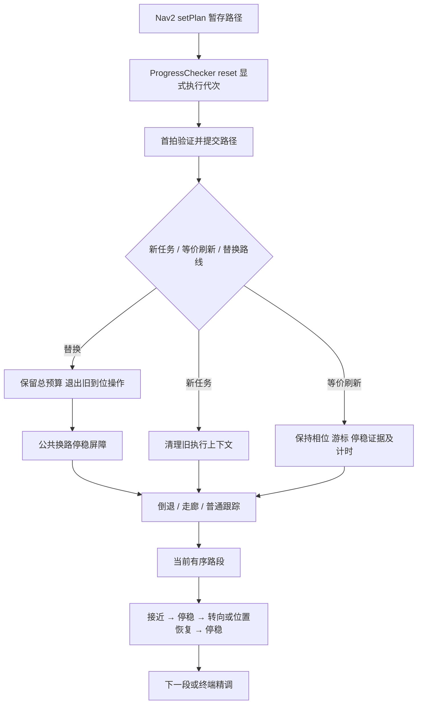

# C92：C 阶段复盘修复与离线验证

日期：2026-09-22。**本轮离线修复已写回源码；C 阶段仍未验收，Gazebo/RViz 和真机均未启动。**

用户要求先离线处理。采用独立源码、构建和安装目录，与 C91/v13 的仿真记录分开；未修改共享 `ws_robot/install`。源码回写前逐文件比对本轮基线哈希，21 个变更文件均无并行改动冲突；未清理其他工作区修改。

## 修复结果

| 复盘项 | 本轮实现 | 离线确认与剩余边界 |
|---|---|---|
| C-R1：停顿被误认新任务 | 由同一 controller_server 的 PolicyProgressChecker 提供执行代次；路径暂存到首个控制周期再提交。独立保存已接受路径源时间高水位 | 覆盖 0.1/0.49/0.5/0.51/1 s 停顿、缓存路径重发、旧路径及 `100→0→99`；角点关闭时有执行代次也不再用停顿推断身份。真实 action 调度尚未运行 |
| C-R2：外层接管覆盖角点状态 | 基类统一返回新任务、等价刷新、替换路径结果；Arrival 消费该结果。等价刷新保持相位/游标/计时，换路线退出旧精调并先停稳 | 覆盖活动角点、单点目标、到位状态、替换预算、走廊居中/对齐、HOLD 后复用窗口。倒退入口的公共屏障经源码复核；无在线反向服务交互证据 |
| C-R3：起步朝向跨过角点 | 起步朝向仅使用当前有序路段；连续曲线保留原逻辑 | 覆盖首段 0.25/0.30/0.49/0.50/0.51 m、左右转及已有曲线/重复点用例 |
| C-R4：不支持几何静默放行 | 区分短首段、密集反向双角、配置外掉头、终端接管；前三者明确拒绝，不当成普通曲线 | 覆盖 0.24 m 短首段、20/24.9/25/25.1/30 cm 双角边界及已有短斜接/回环。Path 没有必经点字段，必经任务仍须显式航点分解 |
| C-R5：单拍零速当停稳 | 复用 ArrivalSettling：零指令持续期＋不断更新的位姿源帧＋速度与漂移约束；转向前后都确认；记录明确子状态 | 重复、同戳异值、乱序、断流、未来帧、时钟回退、持续漂移、±π 跨越、HOLD 恢复均有离线检查。真实定位数据的时间语义仍需集成核验 |
| 停车空间 | Arrival 的角点入口取原距离与“实测速度对应制动距离＋捕获半径”的较大值，接近段复用原制动模型 | 检查恒时、reference_stop、position_hold 的适用边界；硬件残余位移曲线超出标定域会拒绝，不外推。未证明所有真实速度/附着工况可停车 |

独立审查发现的三项具体问题均已修复：策略运动绕过换路线停稳屏障、零时间戳清空旧路径拒绝依据、单点路径刷新重置到位状态。最后补充的角点关闭模式身份检查也完成了失败复现及修复。

修改入口：[路径及执行身份](/home/yjh/WorkSpace/astribot_sdk_ros2/ws_robot/src/astribot_s1_path_tracking/src/three_phase_controller.cpp:485)、[策略公共停稳屏障](/home/yjh/WorkSpace/astribot_sdk_ros2/ws_robot/src/astribot_s1_path_tracking/src/arrival_controller.cpp:586)、[几何分类](/home/yjh/WorkSpace/astribot_sdk_ros2/ws_robot/src/astribot_s1_path_tracking/src/align_math.cpp:66)、[模块说明](/home/yjh/WorkSpace/astribot_sdk_ros2/ws_robot/src/astribot_s1_path_tracking/README.md)。

## 数据与状态流



租约失效与 HOLD 处理仍先于运动。公共换路屏障只有一个状态所有者，不会在 Arrival 和基类重复等待。拒绝的暂存路径继续保持拒绝，失败容忍重试不能悄悄恢复旧路线。

Nav2 Humble 的已核对源码顺序是：任务开始先 `setPlannerPath`，再复位 progress checker；路径抢占也会复位 goal checker，所以不能用 goal checker 的代次标识新任务。该实现依赖此调用契约，实际安装版本的 action 集成仍待验证。[Nav2 官方 controller_server.cpp](https://raw.githubusercontent.com/ros-navigation/navigation2/humble/nav2_controller/src/controller_server.cpp)

**未改运动数值参数。** MPPI/RPP 配置唯一变化为 `progress_checker.plugin`：由 PoseProgressChecker 改为本项目 PolicyProgressChecker，用于上述代次接线。速度、增益、终点阈值、原旋转惯性参数和内层控制器保持原值。[配置结构差异](/home/yjh/WorkSpace/astribot_validation/unified_navigation_resume_20260921_01/C92_offline/configuration_diff.json)

## 验证结果及证据等级

证据目录：`/home/yjh/WorkSpace/astribot_validation/unified_navigation_resume_20260921_01/C92_offline`。

| 证据 | 结果 | 能说明什么 |
|---|---:|---|
| 隔离 Release 构建及 CTest | 12/12 | C++ 对象、几何、策略辅助、插件构造/动态链接通过；没有创建 ROS 节点或激活插件 |
| 控制契约检查 | 69/69 | 输入与状态边界；不是 69 次 Gazebo 跑机 |
| 停稳窗口 | 6 组 | 新源帧与异常时间边界；属于上述 CTest |
| 接近段简化运动回放 | 48/48 | 4 个朝向 × 4 种延迟（0/0.10/0.20/0.35 s）× 3 个初速（0/0.10/0.20 m/s） |
| 离线 A/B 评估工具 | 8/8 | 帧/时钟冲突、重复、相同空间区间、自交身份及无共同区间的处理 |
| 新横穿路线 | 参考路线静态预检 | 动态 HuNav 行为、实际人机距离、网格与高度、完整外形、双视图仍为 NOT_RUN |
| 新候选闭环仿真及真机 | NOT_RUN | 不借用 C91 历史结果给本候选验收 |

48 组回放使用假内层速度输出、20 Hz 控制、10 Hz 位姿、0.25 m/s² 简化加减速，不含 MPPI、旋转动力学、碰撞地图或真机响应。转向入口的最大角点误差为 **0.0379531 m**，入口模型速度为零；满足的是已有 **4 cm 中间角点捕获半径**，不是终点 3 cm 或毫米级到位精度证明。最长模型用时 6 s 仅作诊断，不计质量分。

本轮实际加载库：`C92_offline/install/lib/libastribot_s1_path_tracking.so`，SHA256：
`e2dd510bf447bce4d890da53b27f85b00a942d075cc5a8d605a6f7890c82732a`。

原始文件：[最终测试](/home/yjh/WorkSpace/astribot_validation/unified_navigation_resume_20260921_01/C92_offline/final_ctest.log)、[全部测试输出](/home/yjh/WorkSpace/astribot_validation/unified_navigation_resume_20260921_01/C92_offline/build/Testing/Temporary/LastTest.log)、[运动回放](/home/yjh/WorkSpace/astribot_validation/unified_navigation_resume_20260921_01/C92_offline/build/corner_plant.csv)、[审查](/home/yjh/WorkSpace/astribot_validation/unified_navigation_resume_20260921_01/C92_offline/review.md)、[文件与证据哈希](/home/yjh/WorkSpace/astribot_validation/unified_navigation_resume_20260921_01/C92_offline/final_evidence_manifest.json)、[源码回写清单](/home/yjh/WorkSpace/astribot_validation/unified_navigation_resume_20260921_01/C92_offline/copy_back_manifest.json)。

保留 RED 日志用于追踪修复。最初一轮误用旧动态库产生的崩溃日志明确标为 `task1_red_invalid_library_path.log`，不作为缺陷复现或验收证据；后续显式指定库搜索路径并核对实际加载位置。

## 横穿场景和质量评估准备

新场景：[corner_crossing_c92.yaml](/home/yjh/WorkSpace/astribot_sdk_ros2/tools/social_navigation/cases/corner_crossing_c92.yaml)。行人参考路线从 `(0.4, 1.2)` 到 `(1.8, -1.0)`，半径、速度、社会力参数不变。对冻结静态地图逐点预检，扣除行人半径及一个栅格对角线后，参考路线采样净空下界由旧场景约 **0.129 m** 提高到 **0.579 m**。这改善了参考夹具的静态余量，不保证社会力作用后的实际轨迹合法。

[离线工具](/home/yjh/WorkSpace/astribot_sdk_ros2/tools/social_navigation/corner_offline_evidence.py) 有两个入口，均不导入 ROS，不启动节点：

```bash
python3 tools/social_navigation/corner_offline_evidence.py \
  --output /tmp/corner_fixture.json fixture \
  --map /path/to/warehouse_baseline.yaml \
  --scenario tools/social_navigation/cases/corner_crossing_c92.yaml

python3 tools/social_navigation/corner_offline_evidence.py \
  --output /tmp/corner_ab.json compare \
  --reference /path/to/off_episode --candidate /path/to/on_episode
```

A/B 输入目录包含 `path.json`（`frame`、`points`）及 `motion.csv`（`t,x,y,yaw,frame,phase`；yaw 单位 rad）。自交/重复路线另需 `leg_index`，表示去掉零长度和同向共线冗余点后有序路段索引。若原始记录无可靠索引，不补造索引。

最多 2 Hz 采样，以相同有向路段和 0.1 m 空间区间匹配；各段两端排除 0.15 m，避免角点附近相位切换混入普通区间。每个共同区间先取中位数再等权统计，**不先用 FOLLOW 过滤**，因此不会把开/关角点两种模式的不同空间片段直接混比。报告共同区间覆盖率和原始相位样本数；缺帧关系、时间倒退、同戳异值或缺少自交路段身份返回无效证据，不给性能通过结论。完整转向过程仍须另行统计。

## 恢复仿真后仍需完成

1. 先核对新库、PolicyProgressChecker 接线和真实 action 生命周期；验证同目标快速取消重发、同任务重规划、旧响应、时钟代次变化。当前 in-process 代次不替代跨任务请求令牌协议。
2. 记录 `CORNER_STATE` 的真实子状态再注入故障；将接近、转前停稳、转向、位置恢复、转后停稳分别命中。旧脚本以 FOLLOW 推断恢复的方式不能继续当验收依据。
3. 新横穿夹具先验证实际行人全程静态净空、实际人机间距、落地高度和 Gazebo/RViz 一致性；未通过即标 INVALID_FIXTURE，不统计为控制通过。Direct FollowPath 仅用于控制器 HOLD/恢复，任务等待预算和服务所有权必须走完整任务链。
4. C1 正负 45/90/135°，角点开/关各 3 次（36 次），再补直线/圆弧、短段、连续角点、自交、近终点与独立掉头拒绝。基于同空间区间比较横向/航向误差，单列完整转角漂移、停稳、恢复和加减速连续性。
5. 复测 legacy/fixed_v2 包络、过期/变更、HOLD 中被推移、定位跳变与剩余停车空间不足。硬件制动曲线当前实测速度上界 0.249 m/s，超域需补测或明确运行限制，不能宣称已覆盖更高真实速度。

当前为 **离线修复通过、闭环仿真暂停、C/I0.1 未通过**。D、I0.2、I1–I6 和真机验证均未开放。
