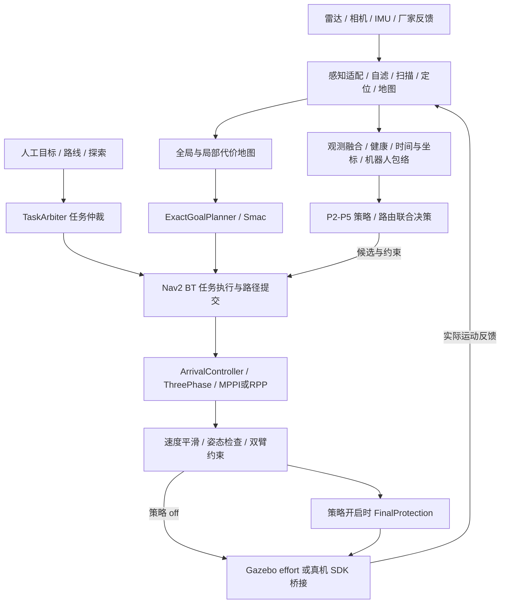

# 架构设计参考手册

2026-09-18：SLAM 接入已改为仿真/真机共用 Voxel-SLAM；接口、命令与逐项验收状态见[统一 SLAM 参考](../SLAM_INTEGRATION_REFERENCE_20260918.md)。旧中转链已删除；真机尚未实测。

版本范围与验收边界见[手册首页](README.md)。本文主体为 2026-09-18 的架构记录；2026-09-22 本次只更新源码索引、包数表述和已迁移的仲裁入口，没有重新验收所有参数、接线及功能。定位最新实现先查[项目源码入口索引](../../.agents/skills/astribot-architecture-design/references/project-map.md)，再核对实际源码、launch 和安装产物；不能把下文历史“当前”表述当作本轮实时验证。

整机层面的缺口、整合/拆分建议及分阶段实施方案见[轮式双臂整体架构审查](../WHOLE_ROBOT_ARCHITECTURE_REVIEW_20260917.md)。该方案是后续设计，不能当作当前已实现能力。

## 1. 总体结构与控制权



核心原则：探索负责选目标，仲裁器负责目标所有权，规划负责路径，跟踪器负责速度，末级保护负责最终运动许可，执行适配负责与设备交互。感知、视觉适配器、候选规划器不能绕过这些层直接写 `/cmd_vel`。

此处仲裁器的范围是**导航任务**。当前没有统一持有底盘、双臂、躯干和夹爪的整机任务层；搬运示例也不能替代这样的资源协调。MoveIt 闭链规划、导航到位和 SDK 桥接分别可用，不等于真机同步双臂搬运或边走边操作已经验收。

## 2. 仓库与模块职责

包清单随原生模块迁移和领域扩展变化，以 `ws_robot/src` 中的 `package.xml` 及实际构建选择为准，不使用固定包数判断能力。`build/install/log` 是构建产物；`tools` 是编排、部署和诊断入口；根目录 SDK 原生库与 ROS 工作区分开管理。下表为领域职责概览，不是完整包清单。

| 模块 | 负责 | 交互与边界 |
|---|---|---|
| `astribot_s1_description`、根目录 `astribot_config` | 模型、连杆与设备配置 | TF、关节名和实体外形的共同依据 |
| `astribot_s1_perception` | 感知组合启动、地图来源和定位接线 | 具体运行节点按源码索引与 launch 核对；不派发导航目标 |
| `astribot_s1_perception_components` | C++ 自滤、切片扫描、Livox 转换 | 高频数据处理与 ROS 组件 |
| `astribot_autonomy_core` | 前沿搜索、几何和足迹等纯算法 | 不依赖 ROS 节点生命周期 |
| `astribot_s1_exploration` | 前沿候选、目标验证、探索状态机 | 通过探索 Action 入口请求导航，不直接控底盘 |
| `astribot_navigation_msgs` | 任务、路径风险、约束、健康、包络、起步动作契约 | 跨模块接口；修改需重建依赖包 |
| `astribot_s1_navigation_policy` | 观测融合、让行、路由联合决策、窄通道、末级保护 | 领域算法与 ROS 适配分离 |
| `astribot_s1_task_arbiter_native`、`astribot_s1_navigation_policy_native` | 原生导航仲裁及策略/保护实现入口 | 核对所用 launch 与安装产物；目录存在不代表整栈验收 |
| `astribot_s1_navigation` | Nav2 launch、参数、BT、速度链接线 | 选择实现并配置，不复制控制律 |
| `astribot_s1_path_tracking` | 精确终点规划、ThreePhase、到位精调、检查器、平滑器 | 运动控制与控制侧不可执行异常 |
| `astribot_s1_dynamics_coupling` | 双臂姿态/运动引起的底盘约束 | 接入既有速度链，不能产生第二个运动主控 |
| `astribot_s1_manipulation`、`astribot_s1_moveit_config` | 双臂任务和 MoveIt 配置 | 与导航通过包络和任务边界协作 |
| `astribot_trajectory_bridge`、`astribot_bridge_msgs` | SDK 适配、状态反馈、轨迹与底盘执行 | 保留使能、时效、偏差及停车保护 |
| `astribot_s1_gazebo_bringup`、`astribot_s1_chassis_effort_drive` | 仿真场景与底盘动力学执行 | 替换真机执行层，不替代真实执行器标定 |
| `astribot_logging` | 统一日志、会话捕获、目录索引 | 运行链共同基础设施 |
| `livox_ros_driver2`、仓库场景包 | 第三方依赖 | 真机跳过编译部分包不等于包已弃用 |

探索主流程为候选生成→验证→导航→到位/驻留→下一候选，异常进入暂停/失败处理。当前增加了候选终点足迹检查与回退候选参数；它只提高目标选择质量，不能代替 Nav2 路径及执行碰撞检查，也不能从源码存在推导真机探索已通过新回归。

`manipulation` 当前还包含导航/抓放/附着物/搬运示例。其 `planning_demo.launch.py` 读取 `moveit_config`，后者又依赖 `manipulation` 插件，形成包清单未完整表达的运行时双向依赖。建议将该组合入口上移到系统 bringup，算法与配置继续分开；该迁移尚未实施。

旧包退役（2026-09-17）：`astribot_s1_autonomy` 已删除，组合 `autonomy_bringup.launch.py` 和 RViz 配置迁入 `astribot_s1_exploration`，配置直接读取实际归属包。4 个旧 launch 转发、4 个可执行别名及旧包组件索引不再提供。新包内的 `astribot_s1_autonomy::` 类名、include 路径和组件类 ID 保持，算法和参数未随包退役改动。外部旧命令须按[迁移说明](../AUTONOMY_PACKAGE_RETIREMENT_20260917.md)切换；退役验证与运动性能验收分开记录。

## 3. 任务与路径的唯一所有权

| 来源 | 对外 Action | 仲裁优先级 |
|---|---|---:|
| 人工 | `/navigate_to_pose`、`/navigate_through_poses` | 100 |
| 路线集成接口 | `/route/navigate_to_pose`、`/route/navigate_through_poses` | 50 |
| 探索 | `/exploration/navigate_to_pose`、`/exploration/navigate_through_poses` | 10 |
| Nav2 执行后端 | `/navigation_executor/navigate_to_pose` 等 | 仲裁器后端，业务方不直接调用 |

优先级与目标切换的源码入口已迁为 [C++ task_arbiter_node.cpp](../../ws_robot/src/astribot_s1_task_arbiter_native/src/task_arbiter_node.cpp)；使用时另核对 launch 和实际安装目标。新所有权需要经过旧执行取消/交接；租约、任务标识、路径版本、地图/包络版本用于使过期请求失效。

**现有测试工具的实际行为**：`run_waypoint_route.py` 和真机精度脚本使用人工 `/navigate_to_pose` 入口，不是表中的 50 级路线接口。不要与 RViz 或探索同时派发目标。

`/plan` 可包含规划候选，不能一概当作正在执行的路径。策略使用控制器发布的 `/path_tracking/active_path` 及任务上下文绑定执行证据；候选通过校验后仍须交回 BT 提交。

## 4. 事件重规划、让行和绕行

当前单目标 BT 为 `PolicyExecution → KeepSafePath / ComputePathToPose → FollowPath`，没有定时 `RateController` 强制周期重规划。检查周期仍会运行，但**检查路径不等于重新生成路径**。

目标变化、原路径无效/碰撞风险及相应策略事件触发路径处理。控制器输入失效仍会停车，不受“禁止定时重规划”影响。

| 阶段 | 当前接入内容 | 操作边界 |
|---|---|---|
| `off` | 原跟踪、任务仲裁、BT 安全路径保留/事件检查 | 仿真和真机日常基线 |
| `p2` | 观测融合、风险、限速、让行与 FinalProtection | 不引入 P3 动态路由联合请求 |
| `p3` | P2 + 原路径/局部绕行/全局候选联合复核、起步恢复 | 默认仿真 profile，真机不能只改阶段开关 |
| `p4` | P3 + 人工通道标注 | 必须提供合法 `corridor_file` |
| `p5` | P4 相关策略 + 地图自动通道候选 | 自动候选仍需准入；不是无条件放行 |

联合决策考虑实测运动的停车扫掠、未来冲突位置、观测新鲜度、让行预算、局部重接条件和全局候选。远处路径占据不应直接等价为当前碰撞；只有证据绑定当前路径且剩余制动空间足够，才允许谨慎接近。

候选几何服务的 `geometry_valid` 不是执行许可。候选还需检查起始转向、足迹/动态预测、曲率和路径衔接、目标/地图/包络版本及证据时效。已有安全原路径及可验证的低速原路径应优先保留；曲率异常候选不得直接覆盖执行路径。具体门槛见 [ExactGoalPlanner](../../ws_robot/src/astribot_s1_path_tracking/src/exact_goal_planner.cpp)、[候选安全](../../ws_robot/src/astribot_s1_navigation_policy/astribot_s1_navigation_policy/candidate_safety.py) 和 [RouteCoordinator](../../ws_robot/src/astribot_s1_navigation_policy/astribot_s1_navigation_policy/route_coordinator.py)。

窄通道重建仍存在未验收项，不能把这些原则当成所有场景已完全满足的证明。

## 5. 跟踪、到位与执行链

`ArrivalController` 继承恢复保留的 `ThreePhaseController`。捕获区外复用起始对齐、MPPI/RPP 跟踪和接近段控制；捕获区内执行 XY/yaw 精调、制动与停稳确认。独立 ThreePhase 插件仍存在，不能宣称已经整体替换或废弃。

典型速度流：

```text
controller_server / behavior_server
  → /cmd_vel_nav_body_raw
  → velocity_smoother（精度档采用 jerk_velocity_smoother）
  → /cmd_vel_nav_body
  → cmd_vel_body_to_world_node（坐标转换开关与姿态检查）
  → /cmd_vel_pre_arm_coupling（启用双臂耦合时）
  → /cmd_vel_policy_input → FinalProtection → /cmd_vel（策略开启）
  → /cmd_vel（策略 off）
  → 仿真 effort / 真机 chassis bridge
```

节点名称不证明坐标转换已启用，须读取 `enable_body_to_world`；真机入口使用机身速度。真机桥接不再重复实现导航位置闭环或二次速度/加速度整形，SDK 偏差、超时、定位/扫描有效性及使能保护仍保留。绕开上游平滑器直接写速度会绕开相应运动约束。

到位必须同时满足平面欧氏误差、最短角度误差、有效新鲜位姿、可执行足迹和连续停稳证据。位置达标不锁存，漂移后重新处理。两种精度档使用源时间推进的位姿窗口检查停稳；不能以单帧零速度代替。

| 配置 | standard | simulation_precision | hardware |
|---|---|---|---|
| XY / yaw 容差 | 3 cm / 1.5° | 2 mm / 0.1° | 3 cm / 1.5° |
| 公共 `arrival_motion.yaml` | 不加载 | 加载 | 加载 |
| 当前微调预算 | 基础 YAML 45 s | 公共覆盖 135 s | 公共覆盖 135 s |
| 精度定位条件 | 按实际 TF/来源 | 必须 `use_sim_time=true`；用于真值基线 | 实际定位，不是地面真值 |
| 低速响应功能 | 默认 off | 默认 off | monitor |

公共精调速度为 0.008～0.06 m/s、0.02～0.15 rad/s；这些是有运动请求时的下限/上限，HOLD、停稳及完成仍输出零。公共正常平移加速度/jerk 为 0.25 m/s² / 0.5 m/s³，角加速度/jerk 为 0.6 rad/s² / 1.2 rad/s³；停车约束另行生效。真机终端制动另有执行器响应和余移模型，不宜用仿真值覆盖。

## 6. 感知、地图与多传感器扩展

| 数据 | 仿真基线 | 当前真机入口 |
|---|---|---|
| 地图 | `/map`，固定地图 | `astribot_s1_slam` → `astribot_s1_mapping` → `/map` |
| 扫描 | `/scan_from_cloud` | `/scan_from_cloud` |
| 定位/里程计 | 真值链及 `/odom` | Voxel 全局 TF；只读厂家 SDK `/odom` |
| 基座 | `astribot_torso_base` | `astribot_torso_base` |
| 时间 | ROS `/clock` | ROS 实际时钟；接收时效另检查 |

全局代价地图含 static、obstacle、inflation；局部是 6×6 m rolling map，仅 obstacle+inflation。当前更新频率分别 1 Hz / 5 Hz，控制器 20 Hz。两图扫描 `expected_update_rate=0.3` 的单位是**秒**，用于观测缓冲时效，不是雷达频率设置，也不是承诺 0.3 s 内机械停车。

全局膨胀层保留。实体足迹、膨胀代价、观测不确定性、预测扫掠及安全间距属于不同模型，不能为了通行把多处安全参数一起减小。源配置见 [MPPI](../../ws_robot/src/astribot_s1_navigation/config/nav2_params_mppi.yaml) / [RPP](../../ws_robot/src/astribot_s1_navigation/config/nav2_params_rpp.yaml)。

统一入口使用 `/map`、transient-local 地图订阅和 `/scan_from_cloud`。SLAM 与栅格直接使用 `map` 坐标系，`map_odom_tf` 独占 map→odom；当前机身栅格处理已并入 `astribot_s1_mapping`，不再转发 `/map_nav` 或清除历史轨迹。

建图/载图仿真和真机使用相同 SLAM 后端；静态地图/真值链仅作为仿真基线。源码按估计、导航栅格、感知组合与数值依赖分包。消息保留导航、桥接、SLAM 三个领域，详见[SLAM 架构评审](../SLAM_ARCHITECTURE_REVIEW_20260918.md)。

扩展新传感器时遵守三类接口：

1. **避障观测**：`observation_sources` 选择适配器，归一化为包含采集时间、frame、来源/标定版本、几何、方差及 provenance 的契约。视觉 JSON 入口 `/navigation_policy/vision_observations`，详细 schema 见[策略包说明](../../ws_robot/src/astribot_s1_navigation_policy/README.md)。图像框没有深度时保留未知风险，不伪造距离；同源证据不能重复融合为独立证据。
2. **到位定位**：`arrival.source=nav2_pose|slam_pose|vision|mark`。`slam_pose` 接收 `PoseWithCovarianceStamped`，vision/mark 接收 `PoseStamped`；默认分别为 `/slam/pose`、`/arrival/vision/pose`、`/arrival/mark/pose`。输入表示基座在 header.frame_id 中的位姿，必须有采集时间、有效四元数和 TF。外参、识别置信度和标记坐标求解由上游负责；不自动切换来源。
3. **任务/执行约束**：通过 `astribot_navigation_msgs`、Action 和服务交互，携带任务/版本/租约；不能由新模块另外发布控制速度。包络变化先更新版本，再重新评估缓存路径和许可。

视觉接口已有代码不代表实体相机已标定接入。真机策略仍需验证 profile 注入和传感器时效参数；当前 `navigation.launch.py` 默认给策略加载仿真 profile，不能在真机直接把 off 改成 p3。

包络服务已支持停车提交与两张 costmap 足迹确认，但本次源码审查未找到双臂生产流程调用 `SetRobotEnvelope` 的客户端。导航包络与 MoveIt 附着物尚未形成自动一致性事务；`off` 入口也不启动包络协调器。当前固定运输姿态假设不能外推到任意伸臂或携物通行。

## 7. 时间、异常与运行可观测性

仿真策略以 ROS 物理时间衡量源龄期、租约及恢复过程，另用墙钟监视 `/clock` 停滞；正常暂停撤销运动授权，时钟回退使旧时间线失效。真机同时关注源时间和墙钟接收时间。不能以增大超时掩盖坐标错误、重复时间戳或处理堵塞。

| 异常类别 | 代表原因 | 处理归属 |
|---|---|---|
| 输入/坐标 | `POSE_STALE`、`TF_UNAVAILABLE`、`INPUT_UNAVAILABLE` | 输入恢复前不发有效运动许可 |
| 当前执行不安全 | `REFINEMENT_BLOCKED`、即时碰撞风险 | 跟踪/末级保护停车；不宣称全局永久不可达 |
| 运动/误差无改善 | `NO_MOTION_PROGRESS`、`REFINEMENT_NO_PROGRESS` | 跟踪失败、预算不因同目标重规划无限续期 |
| 超时 | `REFINEMENT_TIMEOUT`、`GOAL_TIMEOUT` | 到位/任务结束失败 |
| 起步航向恢复失败 | `START_HEADING_UNREACHABLE` | P3 起步许可与安全退出链 |
| 终点窄通道航向受限 | 设计中的 `GOAL_HEADING_UNREACHABLE` | 尚无完整实现/验收，不作为已存在异常承诺 |

Humble 当前导航 Action result 不提供项目需要的完整原因字段，排障需关联 Action 状态、任务/策略状态与 `PATH_TRACKING/...` 日志；不能假设调用者已收到异常文本。

统一 `session.log`、`TRACKING_METRICS`、`ARRIVAL_METRICS`、`ARRIVAL_REACHED`、`SLIP_METRICS` 与任务状态承担观测职责。指标与日志不能反向成为第二套控制器。具体公式见[指标手册](../PATH_TRACKING_METRICS.md)。

## 8. 窄通道能力边界

0.62 m 方形机身的几何旋转外接直径约 0.877 m，尚未计定位、障碍不确定性及净空；约 0.95 m 的经验转向空间不是所有场景的安全证明。

85 cm 设计目标保留两侧各 8 cm 净空后，仅余每侧 3.5 cm，用于横向误差、航向增宽和观测误差的**联合**预算。到位容差 3 cm / 1.5° 不等于全程允许同时达到两项上限。

当前 P3 起步恢复可请求完整转向许可；转向不可行时尝试经验证的 x− 退出，停稳并重新验证后恢复原转向。后向覆盖、地图未知、扫掠、偏离限制及预算均需满足。

以下仍按[窄通道重建设计](../NARROW_PASSAGE_REBUILD_20260914.md)作为待开发/待验收内容管理：85 cm 完整进出；1.00/1.10 m 外部对齐阈值与滞回；短斜入口/接近段完整回归；起点及终点统一禁止通道内原地旋转；任务级终点航向不可达原因传播。已有局部或较宽通道通过记录不能替代这些验收。

## 9. 扩展设计原则与仍需改善处

以下八项是本项目评审采用的设计原则口径，不宣称存在唯一的“八大原则”标准。

| 原则 | 当前落点 | 后续改动约束 |
|---|---|---|
| 单一职责 | 感知、探索、规划、跟踪、执行分层 | 不向桥接复制导航反馈控制 |
| 开闭原则 | Nav2 插件、观测/到位来源适配 | 新来源扩展适配器，保留基线控制行为 |
| 里氏替换 | MPPI/RPP 内层控制接口 | 切换须保留生命周期、限速及失败契约；效果另回归 |
| 接口隔离 | 观测、规划候选、执行约束独立 | 几何候选服务不能隐含控制权限 |
| 依赖倒置 | 领域 contracts/ports 与 ROS 适配分开 | 纯算法不依赖设备 SDK 或 ROS 图 |
| 最少知识 | 仲裁与 BT 统一提交 | 业务模块不直连另一模块内部状态 |
| 组合复用 | 策略与控制器组合、执行适配替换 | 保留现有 ThreePhase 继承兼容；新策略优先组合 |
| 关注点分离 | 运动控制、健康、日志、启动独立 | 诊断不能改变控制时序或成为运动授权 |

优先改善项：配置与真实入口默认值统一并生成参数快照；地图/坐标/QoS 契约参数化；把剩余 JSON 状态逐步迁移为版本化强类型接口；将失败原因绑定任务传到上层；消除窄通道跨层余量重复计算；隔离运行版本与开发构建目录。这些是架构建议，本次手册整理未实施相应控制改动。

## 10. 修改后必须保存的验收信息

至少记录源码/安装文件哈希、地图和起始位姿、策略阶段、定位来源、全部有效参数、Action 结果、到位后漂移及全过程指标。仿真→真机分层验收；真机补齐包络/负载、制动、时延、传感器覆盖及急停现场条件。

跟踪时长只用于超时与实验预算，不参与性能排名。横向误差、路径航向误差、速度波动、加减速/jerk、异常旋转、误停、净空及最终精度分别报告；不能用“全部到点”掩盖过程退化。

## 11. 关键源码索引

| 内容 | 源码入口 |
|---|---|
| 仿真编排与参数选择 | [sim_stack_supervisor.py](../../tools/sim_stack_supervisor.py) |
| 导航接线、参数重写与精度档合并 | [navigation.launch.py](../../ws_robot/src/astribot_s1_navigation/launch/navigation.launch.py) |
| 三阶段控制和到位精调 | [three_phase_controller.cpp](../../ws_robot/src/astribot_s1_path_tracking/src/three_phase_controller.cpp)、[arrival_controller.cpp](../../ws_robot/src/astribot_s1_path_tracking/src/arrival_controller.cpp) |
| 公共运动、仿真与真机覆盖 | [arrival_motion.yaml](../../ws_robot/src/astribot_s1_navigation/config/arrival_motion.yaml)、[仿真档](../../ws_robot/src/astribot_s1_navigation/config/arrival_precision_sim.yaml)、[真机档](../../ws_robot/src/astribot_s1_navigation/config/arrival_precision_hardware.yaml) |
| 观测、领域契约与 profile | [observer_node.py](../../ws_robot/src/astribot_s1_navigation_policy/astribot_s1_navigation_policy/observer_node.py)、[contracts.py](../../ws_robot/src/astribot_s1_navigation_policy/astribot_s1_navigation_policy/contracts.py)、[profile.py](../../ws_robot/src/astribot_s1_navigation_policy/astribot_s1_navigation_policy/profile.py) |
| 真机启动与传感器版本归属 | [hardware_exploration.py](../../tools/robot/hardware_exploration.py)、[hardware_sensors.py](../../tools/robot/hardware_sensors.py) |
| 概率栅格/机身区域处理 | [nav_prob_grid_node.cpp](../../ws_robot/src/astribot_s1_mapping/src/nav_prob_grid_node.cpp)；旧独立 `grid_self_clear_node.py` 已移除，实际参数与接线按所用 launch 核对 |
| SDK 底盘执行边界 | [chassis_bridge_core.py](../../ws_robot/src/astribot_trajectory_bridge/astribot_trajectory_bridge/chassis_bridge_core.py) |
