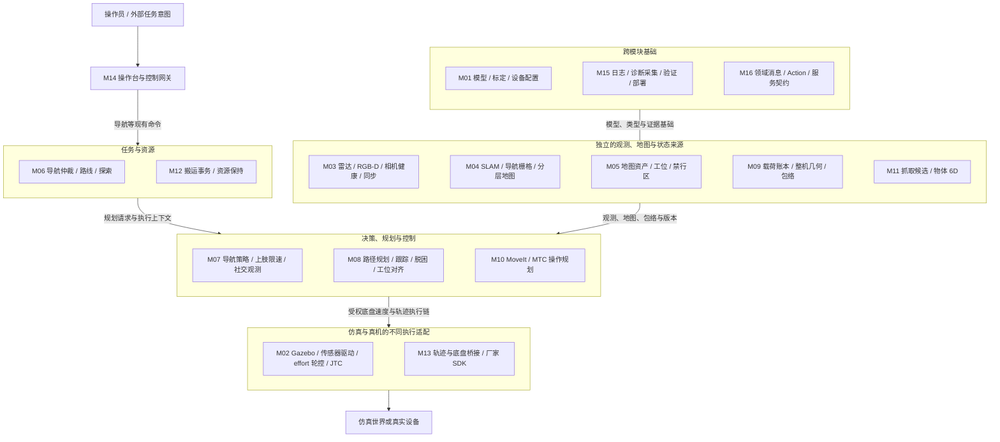
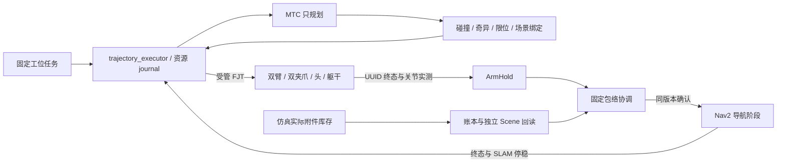
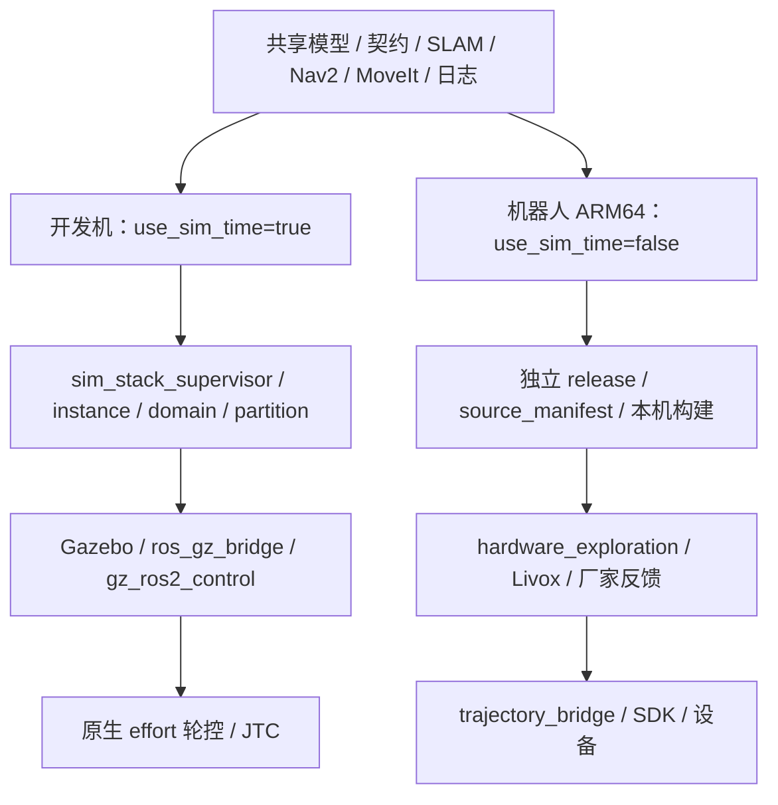

# AstriBot 总体架构

核对日期：2026-09-29；源码基点 `2c5354c3fe2d4df46103684182c1ab852a1cf64e`，分支 `chassis-effort-drive`。范围为当前检出仓库，不包括其他 worktree 未合入的能力。运行产物可能来自私有 overlay，HEAD 不能单独证明已经部署。

阅读入口：[模块细化](MODULE_ARCHITECTURE.md) · [完整包索引](PACKAGE_INDEX.md) · [仿真操作](SIMULATION_OPERATIONS.md) · [真机操作](HARDWARE_OPERATIONS.md)。

## 1. 状态口径

| 标记 | 含义 |
|---|---|
| 已实现 | 当前源码存在实现及接口；不自动表示默认启用或已验收 |
| 部分实现 | 子功能或限定场景已实现，目标闭环仍缺接线或功能 |
| 未实现 | 当前源码未发现对应生产实现；接口、设计或测试夹具可能存在 |
| 待验收 | 实现存在，指定场景缺少通过证据；与未实现不同 |
| 历史验证 | 只适用于记录对应的版本、输入、参数及场景，本轮未重跑 |

本次整理不启动/停止 ROS、Gazebo 或真机，不产生新的运动验收。简单启动参数转发修复与文档检查结果见[核验记录](DOCUMENTATION_AUDIT_20260929.md)。

## 2. 总架构图

[打开可缩放的总览 SVG](ARCHITECTURE_OVERVIEW.svg)；下方保留可编辑 Mermaid 源图。

总图按职责分组，组间箭头表示主要运行流向；精确接口和控制权见第 3、4 节。M 编号与模块细化一一对应，分组不是新增的统一服务，也不表示全部组件默认启用。

总图省略测量反馈回路，具体生产者/消费者见模块图。M14 的原生完整搬运入口尚未接通；M12 当前由专用客户端调用。MTC 返回计划，执行仍由任务层拥有。

当前没有一个统一的“世界模型服务器”。SLAM、二维 costmap、分层占据、MoveIt PlanningScene、附件账本各有所有者，通过 frame、时间、对象 ID 和版本关联。覆盖全部直接 SDK/控制器入口的强制资源仲裁也尚未实现。

## 3. 实际控制链与控制权

### 底盘

依据：[导航 launch](../../ws_robot/src/astribot_s1_navigation/launch/navigation.launch.py)、[仲裁器](../../ws_robot/src/astribot_s1_task_arbiter_native/src/task_arbiter_node.cpp)、[约束节点](../../ws_robot/src/astribot_s1_navigation_policy_native/src/navigation_constraint_node.cpp)。

- TaskArbiter 只仲裁导航 Action，不是整机所有关节的资源服务器。
- 上肢/载荷的限速、停车和不可执行判断前置到导航规划及控制约束。双臂耦合节点发布上游限速，不发布底盘速度。旧手册中的独立 `FinalProtection → /cmd_vel` 末级链不再适用；同名 core 文件仍存在不代表该节点部署。
- 普通 BT 为 PolicyExecution → 起点准入/必要脱困 → 包络准入 → 保留安全路径或重新规划 → FollowPath；工位专用树另有受阻恢复和独立对齐。
- `/plan` 可能是候选，`/path_tracking/active_path` 才关联当前执行路径。任务层不自行发布底盘速度。
- `/odom` 保留正常导航控制职责；运动、漂移和停稳监测要求只用 `/slam/pose`。尚未迁移的工具见第 8 节。

### 操作与搬运

`hold_executor` 与 `trajectory_executor` 由同一 [hold_executor.cpp](../../ws_robot/src/astribot_s1_transport_native/src/hold_executor.cpp) 按不同编译定义生成。fixed_v2 使用原生执行器，MoveIt 只规划；legacy 保留 Python 搬运编排与 MoveIt 执行。合作式资源锁、租约和控制器检查不等于 DDS 身份鉴权或真机执行端 epoch 栅栏。

## 4. 数据与坐标契约

| 接口 | 生产者 → 消费者 | 关键语义 |
|---|---|---|
| `/slam/pose` | Voxel → 停稳/搬运/工位控制 | PoseWithCovarianceStamped，map 下底盘；固定包络使用 SensorDataQoS 接收；同名 frame 不证明原点一致 |
| `/odom` | 仿真/SDK → Nav2 | 正常控制输入；不能代替 SLAM 停稳证据 |
| `/map` | mapping 或静态地图提供者 → costmap/探索 | OccupancyGrid；一个活动来源，静态图采用持久订阅 |
| `/height_maps/snapshot` | 档案切片或 Gazebo 切片 → 分层检查 | HeightSliceMaps；源、层配置、地图版本必须一致，两种生产者不能同时占用同一接口 |
| `/scan_from_cloud` | 点云切片 → 策略/costmap | LaserScan；策略启用时 costmap 读取 `/navigation_policy/costmap_scan` |
| `/payload/attachment_observation` → `attachment_state` | 库存 → 账本 → 几何/执行器 | 完整库存、source/clock/ledger epoch、原始有效期；无消息不等于 EMPTY |
| `/navigation/geometry_state`、`arm_hold` | 几何、资源执行器 → 包络 | RobotGeometryState、ArmHoldStatus；关节、附件、控制器、资源及时间共同约束 |
| `/navigation/envelope_v2`、`envelope_applied` | 包络协调器 ↔ 消费者 | 发布队列 10，ACK 订阅队列 20；版本、时效、撤销均参与判断 |
| `/navigation_policy/constraint` | 约束节点 → BT/控制器 | MotionConstraint，队列 10；不等同于速度命令 |
| 导航 Action | 人工/路线/探索 → 仲裁 → Nav2 | `/navigate_to_pose`、`/route/navigate_to_pose`、`/exploration/navigate_to_pose`；取消须等终态 |
| `/transport/plan_manipulation` | 任务 ↔ MTC | PlanManipulation，仅生成有序阶段 |
| `/transport/fixed_station_transfer` | 场景客户端 ↔ 原生执行器 | FixedStationTransfer；工位、对象、目标、退出候选与预算；目前限定仿真 |
| `/perception/compute_grasps`、`estimate_object_pose` | 调用者 ↔ 感知 | 抓取候选与物体姿态是两类 Action；不授予执行权 |

完整类型见 [M16](MODULE_ARCHITECTURE.md#m16)。上表只记录已核对的主要契约，现场仍须核对各端 QoS、采集时间、接收龄期、频率与实际安装版本。

当前 [FixedEnvelopeCore](../../ws_robot/src/astribot_s1_navigation_policy_native/src/fixed_envelope_core.cpp)要求 **五方 ACK**：global_costmap、local_costmap、planner、controller、policy。附件自滤确认在几何证据链内；历史“六方 ACK”不能不加版本说明地沿用。

导航基座为 `astribot_torso_base`。MoveIt 操作在基座场景快照规划；固定工位 Action 的 `gazebo_world` 是物理仿真约定，不是 MoveIt 的 base-fixed `world`。重定位、换图、附件或场景变化后，依赖计划需要重新绑定或复核。

## 5. 部署视图

这是运行部署关系，不是源码依赖方向。源码通常为 adapter → core/contracts，组合 launch 负责装配。真机不复制 x86 构建产物；相机外参、载荷、制动与执行时延分别验收。domain/partition 隔离不保证 GPU/CPU 性能独占。

## 6. 故障与取消责任

| 情况 | 处理所有者 | 完成证据 |
|---|---|---|
| 导航抢占 | TaskArbiter 取消旧后端并等终态 | 旧执行终态与新所有权，cancel ACK 不等于交接 |
| 起点受阻 | recovery 限次短段退出、停稳后重查实际起点 | READY 后规划原目标；无进展/预算耗尽明确失败 |
| 工位受阻 | 专用 BT 按原因、距离与空间决定对齐或恢复 | 同 session 模式提交、旧动作终态、SLAM 停稳 |
| 操作跟踪超差 | execution_guard 锁存，父任务取消子动作 | 各 UUID 终态、实测与保载处置 |
| 附件或 Scene 不一致 | 账本/执行事务拒绝推进 | 库存、Scene、版本一致；不能删账本重试 |
| 保持、租约、ACK 失效 | 撤销旧许可 | 新动作/新授权独立成立，迟到正向消息不复活旧事务 |
| 进程退出 | 所属主管回收子进程 | 进程退出、资源释放、实际停稳分别记录 |

非导航 PICK/PLACE 不再以 SLAM 位移/转角取消任务；不得恢复该门禁或世界刚性固定。初始准入、导航与结束/取消交接的停稳保留。仿真轮控保持 `idle_position_hold=true`、`idle_position_kp=3.0`。

## 7. 证据总览与整机缺口

| 能力 | 当前结论 |
|---|---|
| 导航、SLAM、探索 | 已实现，有[历史 SLAM 仿真](../SLAM_SIMULATION_VALIDATION_20260918.md)；不代表当前默认命令已回归 |
| 固定工位完整搬运 | scene96 记录 `TRANSFER_COMPLETE`、资源释放，进入 PLACE 时 1.854 cm / 0.0315°，最终 SLAM 停稳窗口 0.693 s；[验收说明](../evidence/mainline_20260929/PLACE_ACCEPTANCE.md)及原始 acceptance.json 已核对 |
| scene96 边界 | 临时 3 cm / 0.1°、3.5 倍轨迹时间缩放、特定箱体工位；严格 2 mm 未验收，未证明偶发续约问题根治、耐久性、接触力学或真机 |
| 工位对齐/脱困 | 已实现；[工位记录](../WORKSTATION_ALIGNMENT_IMPLEMENTATION_20260928.md)、[脱困记录](../DEPARTURE_ACTUAL_START_20260928.md)保留此前失败，不能被单轮成功覆盖 |
| GraspNet / CAD 6D | 有算法、服务和隔离验证；模型输出不等于模型驱动抓放闭环已验收 |
| FoundationPose | 有设计、资产/容器准备和 P0 夹具，尚未完成生产服务接入与连续跟踪闭环 |
| 插装/力控、真机载荷闭环、边走边操作、自动回充 | 未发现当前生产闭环；装配 profile、电池显示或规划接口不能代替实现 |
| 全系统强制资源隔离 | 部分实现于 UI 租约、导航仲裁、搬运资源层；未覆盖所有直接控制入口 |

## 8. 当前操作阻塞

1. `navigation.launch.py` 拒绝 `navigation_policy_stage=off + enable_arm_chassis_coupling=true`；仿真主管默认及真机主管仍产生这一组合。直接改真机为 p3 也不可行：launch 选用 simulation.json，真机仅有未验收的 hardware.template.json。不能通过关闭上肢保护或把模板标记为已验收“修好”启动。仿真手册采用显式 p3；真机运动列为待修复。
2. baseline 的 static_map 若同时启动 SLAM，必须提供实测 `initial_chassis_pose`。原默认命令缺少此输入；不能拿 spawn 指令代替实测配准，也不能停用 SLAM 来宣称停稳监测可用。
3. `robot_task_control.py` 仍按 `/odom` pose/twist 判停；`navigation_precision_check.py` 和 `run_waypoint_route.py` 仍包含 TF/odom 测量路径。其结果不能支持新的 SLAM 监测验收。readiness 检查正常控制 odom 不属于此冲突。
4. UI 臂执行返回 `ARM.EXECUTION_ADAPTER_UNAVAILABLE`；`transport_session` 仍调用旧 Python transport_task，不能当作原生 fixed_v2 完整搬运入口。成功主线依赖专用运行器、真实场景和私有安装清单。

以上为源码确认的边界，本轮未线上复现。已修正统一仿真 launch 遗漏的参数转发；这些能力/部署缺口不属于简单参数拼写错误，保留原安全拒绝。
