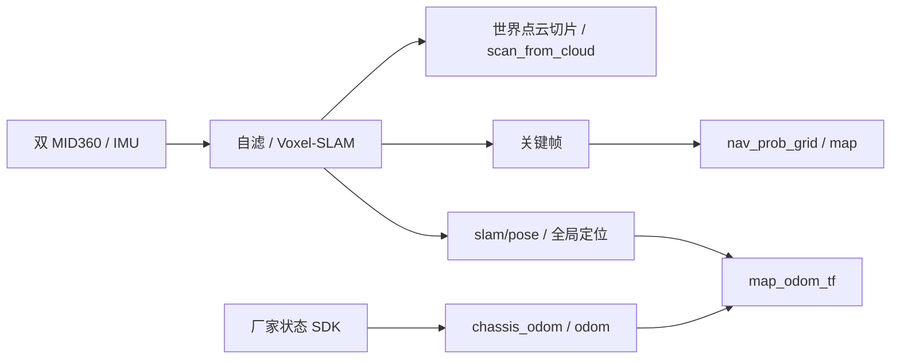

# 真机部署与操作手册

核对日期：2026-09-29；本轮未连接机器人、未部署、未打开 SDK 控制会话、未发送运动。地址和路径为源码默认值，现场必须确认。架构和能力范围见[总架构](ARCHITECTURE_REFERENCE.md)、[模块细化](MODULE_ARCHITECTURE.md)。

## 1. 当前放行状态

**当前源码的真机导航/探索不能按旧手册直接启动。** 已确认两个实际缺口：

1. `hardware_exploration.py` 和 `run_deployed.sh navigation` 传 `navigation_policy_stage:=off` 与 `enable_arm_chassis_coupling:=true`，navigation launch 明确拒绝。改成 p3 也不成立：当前 launch 使用仿真策略 profile，仓库仅有未验收 hardware.template.json。需要完成真机策略接线及证据，不能关闭上肢保护或伪造 hardware_validated 来消除错误。
2. `robot_task_control.py` 的 feedback_stopped 仍消费 `/odom` pose/twist，未符合项目只用 `/slam/pose` 的停稳要求；它还向多个速度入口发零命令，并按当前 DDS 环境调用固定服务/Action。`--session` 只约束进程选择，不自动核验所有 ROS 端点归属。

本手册给出可复核的完整操作流程。部署和只读检查可准备；涉及运动的步骤须先关闭上述缺口并验证。`navigation_precision_check.py` 及两点/历史测试入口也不能仅凭旧输出作为当前 SLAM 监测验收。

## 2. 运行位置及命令副作用

| 项目 | 源码默认值 |
|---|---|
| 开发机 | `/home/yjh/WorkSpace/astribot_sdk_ros2` |
| SSH 目标 | `astribot@10.249.22.137` |
| 机器人版本目录 | `/home/astribot/astribot_projects/releases/<版本>` |
| 当前链接 | `/home/astribot/astribot_projects/current` |
| 厂家 ARM64 SDK | `/home/astribot/Downloads/astribot_sdk_aarch64` |
| DDS profile | `/opt/astribot_ros/robot_system_ctrl/fastdds_udp.xml` |
| 运行网络 | ROS_DOMAIN_ID=25、ROS_LOCALHOST_ONLY=0、rmw_fastrtps_cpp |

| 入口 | 实际副作用 |
|---|---|
| `run_deployed.sh --help` | 仅帮助 |
| `precision/explore/sensors --dry-run` | 仅打印计划，不创建 ROS 节点或 SDK 会话 |
| `check` | ROS 订阅/TF/图检查，不使能、不发速度 |
| `sensors` | 会停止识别到的旧导航/感知，再启动传感器/SLAM；不是只读或补节点 |
| `precision` | 重启链路，通过检查后使能底盘，等待人工目标；当前有阻塞 |
| `explore` | 重启、使能并自动派目标；当前有阻塞 |
| 无参数 / `start` / `restart` | 等同 precision，不能当作只读查看 |
| `navigation` / `bridge` | 专用组件调试入口，不与完整主管重复启动 |
| `rviz` | 打开界面，界面中提交目标可导致运动 |
| `stop` / stop_robot_tasks | 会取消任务、发零、请求停用并关进程；当前停稳证据不合新契约 |

`current` 只影响后续启动，不改变已运行进程；机器人运行库必须为 ARM64，不能复制开发机 x86 build/install。

## 3. 部署新版本

开发机在现场确认目标主机后，使用唯一版本目录：

```bash
cd /home/yjh/WorkSpace/astribot_sdk_ros2
bash tools/robot/deploy_project.sh --help
ROBOT=astribot@10.249.22.137 bash tools/robot/deploy_project.sh "manual_$(date +%Y%m%d_%H%M%S)"
```

实际部署命令会 SSH、同步当前源码（包括未提交改动）、校验 SHA256、在新 release 构建；不切换 current、不启动运动。不上传本机 runs/build/install；厂家原生库链接到机器人已有 SDK。保留 `deployment/source_manifest.json`、`deployment/build.log`，检查构建退出码及实际依赖，不以“上传完成”代替构建通过。

机器人手动重建只能在**非运行 release** 的干净终端执行其 build_robot.sh；不要先 source 厂家环境。该脚本重建 GTSAM/Livox，跳过仿真世界包；MTC/视觉等可选依赖是否齐备仍需实际构建证明。`--clean` 会删除该 release 的产物，不作为日常步骤。

停止旧任务并实际停车之后再切换版本。下面只用于已完成该前置条件的机器人终端：

```bash
OLD_RELEASE="$(readlink -f /home/astribot/astribot_projects/current)"
NEW_RELEASE=/home/astribot/astribot_projects/releases/实际构建成功的版本名
test -f "$NEW_RELEASE/deployment/source_manifest.json"
test -f "$NEW_RELEASE/ws_robot/install/setup.bash"
ln -sfn "$NEW_RELEASE" /home/astribot/astribot_projects/current
```

NEW_RELEASE 必须替换为真实路径；保存 OLD_RELEASE 以便回滚。当前旧停止器的结论不能单独满足“已停稳”前置，见第 8 节。

## 4. 加载环境与只读检查

在机器人 ARM64 终端：

```bash
cd /home/astribot/astribot_projects/current
source tools/robot/env_deployed.sh
readlink -f /home/astribot/astribot_projects/current
ros2 pkg prefix astribot_s1_navigation
ros2 pkg prefix astribot_s1_path_tracking
ros2 pkg prefix astribot_trajectory_bridge
ros2 pkg prefix astribot_s1_slam
bash tools/robot/run_deployed.sh check
```

包前缀须与所选 release/明确 overlay 一致。不要加载开发机根 env.sh。现有进程可能仍为旧版本，须结合 session.json、命令行、启动身份和已加载库核对。

readiness 检查扫描、odom、地图、TF 和冲突列表，**不发送运动，但也不证明停车**：正常控制 odom 仍需检查；底盘停稳则必须另外检查 `/slam/pose`。没有运行感知时 readiness 失败是正常结果，不应制造默认数据。

```bash
ros2 topic info /slam/pose --verbose
ros2 topic info /scan_from_cloud --verbose
ros2 topic info /map --verbose
```

话题信息只检查端点；实际就绪还需收到新鲜、推进的有效样本，确认 `/slam/pose` 为 map 下底盘、原点与地图一致。当前没有在上述只读工具中补齐全套 SLAM 停稳验收，本轮也不虚报其完成。

## 5. 感知、建图与地图保存

开发机或机器人均可预览：

```bash
bash tools/robot/run_deployed.sh sensors --dry-run
```

确认旧会话归属、旧任务已停车以及 SLAM 重启影响后，才可在机器人启动：

```bash
bash tools/robot/run_deployed.sh sensors
```

该入口会调用旧任务清理，不在共享、不明确归属的 ROS 图直接使用。新链为：



厂家模型/关节状态存在时复用，不以零姿态模拟缺失数据。Livox IP/外参、SDK 路径和地图配置分别核对；CameraInfo 只是内参，不能当作外参标定。

保存配置在 [deployed_sensors.json](../../tools/robot/config/deployed_sensors.json) 的 save_path/map_name/previous_map。启动前选择新地图名；保存时保留 SLAM 活动，先停止任务并实测停稳，再执行：

```bash
ros2 run astribot_s1_perception slam_session save --timeout 120
ros2 run astribot_s1_perception slam_session inspect /实际完整Voxel会话目录
```

重定位使用完整 Voxel 会话，不能只给 PGM/YAML。切图和 SLAM 重启后，旧导航坐标、测试原点和工位必须重新核对；不跨会话复用。

## 6. 导航与探索：阻塞关闭后的流程

当前只运行计划预览，不以 dry-run 成功宣称可启动：

```bash
bash tools/robot/run_deployed.sh precision --dry-run
bash tools/robot/run_deployed.sh explore --dry-run
```

运动放行前须取得：修复后的有效真机策略接线、正常输入/坐标、唯一命令写入者、符合 SLAM 口径的停稳工具、已评估上肢/载荷姿态、现场范围与独立急停。不能用仿真 profile 或直接关闭限速替代。

放行后的预期操作顺序：

1. 在所属前台运行 `bash tools/robot/run_deployed.sh precision`；主管依次停车旧任务、雷达数据检查、模型/反馈、SLAM/地图/扫描、输入检查、导航和初始停用桥接、生命周期确认、使能。
2. 另一个机器人图形终端运行 `bash tools/robot/run_deployed.sh rviz`。无图形 SSH 中 RViz 失败不等于导航失败。
3. 在已观测空旷区发约 0.3–0.5 m 同向单目标；等待终态并确认 SLAM 停稳，再做返回、横向、转向。
4. 通过这些限定场景后，才考虑自主探索。`bash tools/robot/run_deployed.sh explore` 会重启 SLAM 并自动行走，不能与人工路线同时运行。
5. 探索暂停可调用 `/exploration_coordinator_node/pause`，恢复调用 `/resume`，均为 std_srvs/Trigger。成功响应不等于停稳；保存完成需看 mapping_session/manifest。

本节是修复后的操作流程，当前源码不满足运动放行。没有在文档任务中擅自使能机器人。

## 7. 精度、操作臂与载荷边界

| 项目 | 当前配置/实现 | 不得外推的结论 |
|---|---|---|
| hardware 到位参数 | 3 cm / 1.5°，arrival_motion 公共精调预算 135 s | 参数不是当前真机精度验收 |
| 仿真精度档 | 2 mm / 0.1° | 不能拿来覆盖硬件标定 |
| scene96 主线 | 临时 3 cm / 0.1° | 不是严格 2 mm 或真机搬运通过 |
| 原生 fixed_v2 搬运 | simulation_commissioning 强制仿真 | 不能用 use_sim_time 伪造方式在真机启动 |
| GraspNet/物体 6D | 提案与观测服务 | 不是直接 TCP 命令或物理抓牢证据 |
| 双臂闭链规划 | 规划算法存在 | 不证明真机共持同步、接触/力控 |
| SlipMonitor/LinearSlip | 已删除 | 旧 slip.mode 参数和自动补偿说明失效 |

readiness 使用 odom 检查正常控制输入是合理职责；历史 navigation_precision_check 仍以 map TF 测量，不能替代新的 SLAM 运动/漂移/停稳验收。正式测量须绑定同一 SLAM 会话和地图原点，独立地面真值另记；SLAM 相对误差不等于真实绝对精度。

当前不提供真实抓放/力控“一键命令”：硬件资源授权、物理附件库存、夹持/释放确认、标定与真实制动证据尚未齐备。保持 planning-only 可以检查规划，但仍需避免创建第二个控制写入者。

## 8. 取消、停稳与关机

正常顺序：由当前目标所有者取消任务 → 等待相关 Action 终态 → 保留反馈链检查 SLAM 停稳与实际状态 → 请求底盘停用 → 所属主管退出 → 核对资源及进程。紧急现场事件使用独立急停，不等待网络脚本。

旧停止入口可以只读列出候选进程：

```bash
bash tools/robot/stop_robot_tasks.sh --dry-run --session /已核对的绝对会话目录
```

这是进程选择预览，不验证 DDS 请求端点，也不证明机器人已静止。**当前不把不带 dry-run 的旧停止器列为已验收通用操作。** 所属主管的 Ctrl+C/STOP 退出路径也会使用既有清理逻辑，其 odom 判停返回 true 不能升级为 SLAM 合规证据。

在受控现场必须先解决真实运动和停止归属，保留可用 SLAM 与关节反馈，不盲目关掉传感器或强杀全部节点。若只能取得进程退出，记录“进程已退出、停稳/资源未确认”，不能记录任务安全完成。

新口径应接收递增源戳的 `/slam/pose`，以有符号 Δx/Δy 和最短角 Δyaw 的净偏差检查窗口；缺样本不算停稳。取消 ACK 不是终态、终态不是资源释放。非导航操作的位移取消门禁已取消，不得借修停止器重新引入。

## 9. 日志、诊断与回滚

默认硬件会话位于 `~/.ros/log/astribot/hardware/`，索引为 latest_hardware_precision/explore/sensors；以启动日志输出的实际绝对目录为准。只在确认索引属于所需会话后读取：

```bash
HW_SESSION="$(readlink -f "$HOME/.ros/log/astribot/latest_hardware_precision")"
cat "$HW_SESSION/session.json"
rg 'ERROR|INPUT_UNAVAILABLE|PATH_TRACKING|ARRIVAL_REACHED' "$HW_SESSION/session.log"
```

保留 lidar_check.json、input_check.json、来源/时间、参数、运行库身份、SDK 状态和部署 manifest。录包只选必要话题，结束封口后再分析 SQLite。

| 现象 | 处理入口 |
|---|---|
| 启动 off/arm 限速冲突 | 当前已知接线阻塞；不现场禁用保护绕过 |
| simulation_profile_requires_sim_time | 错用仿真 profile；不把真机时钟改为仿真 |
| SDK 控制权拒绝 | 确认原所有者释放，不能再启动第二桥 |
| 扫描无数据 | Livox→实际反馈/模型 TF→自滤→切片，不能只数节点 |
| map 或 SLAM 原点不一致 | 核对完整会话与 TF 所有者，不改 frame 名伪装修复 |
| 停止报告成功但缺 SLAM | 旧工具证据不足，不能放行新任务 |
| 参数改后无效 | 查实际 release、加载库、配置时机，不只看参数服务值 |

回滚先实际停车并完成所属任务收尾，再将 current 指向已保存旧 release，新终端重新加载环境，先只读检查再按已验收场景小范围复验。不要在运动中切链接/替库。厂家 SDK、网络、标定和地图不一定随应用回滚，必须单独登记。
