# 模块架构、功能状态与代码包

核对日期：2026-09-29。版本和证据口径见[总架构](ARCHITECTURE_REFERENCE.md)。16 个模块按职责划分，一个包可能服务多个模块；完整主归属见[包索引](PACKAGE_INDEX.md)。图中箭头表示运行时数据/调用方向；M16 另注明类型依赖。所有“已实现”均指源码，运行结论必须另有对应证据。

## M01 机器人模型、标定与配置

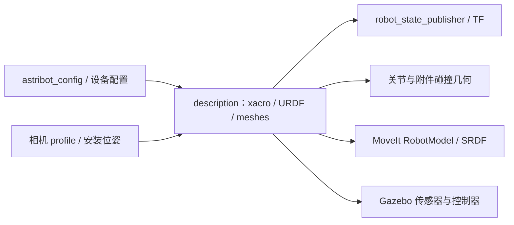

**代码包：** [astribot_s1_description](../../ws_robot/src/astribot_s1_description)、根 [astribot_config](../../astribot_config)；MoveIt 参数归 [moveit_config](../../ws_robot/src/astribot_s1_moveit_config/config)。主要入口为 [URDF](../../ws_robot/src/astribot_s1_description/urdf)与[共享六相机 preset](../../ws_robot/src/astribot_s1_description/config/simulation_navigation_full/launch_preset.yaml)。

**已实现：** 底盘、躯干、头部、双臂、夹爪的模型、碰撞体、mimic 和仿真传感器；导航/Gazebo/MoveIt 共用相机模型配置。preset 启用头/躯干 RGB-D、双腕 RGB-D 和双目，点云及深度障碍开启、后处理默认关闭。

**部分实现/待验收：** 仿真安装位姿有来源，不代表真机型号及内外参已标定；私有安装资产可能与源码不同。**未实现：** 全传感器在线标定生命周期及统一可信标定服务。

**边界与证据：** 模型、关节、标定版本不一致时不能沿用几何或计划；不能以零关节代替厂家反馈。参考[相机安装记录](../CAMERA_REFERENCE_MOUNTS_20260921.md)，本轮只核源。

## M02 仿真、传感器驱动与轮控

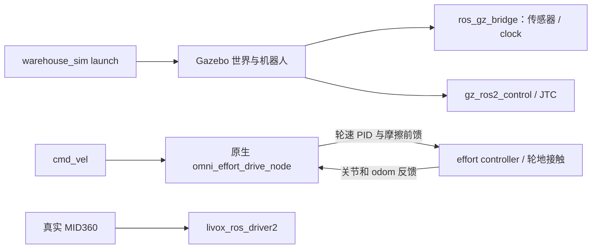

**代码包：** [gazebo_bringup](../../ws_robot/src/astribot_s1_gazebo_bringup)、[chassis_effort_drive](../../ws_robot/src/astribot_s1_chassis_effort_drive)、[chassis_effort_drive_native](../../ws_robot/src/astribot_s1_chassis_effort_drive_native)、[Livox](../../ws_robot/src/livox_ros_driver2)、[第三方仓库世界](../../ws_robot/src/aws-robomaker-small-warehouse-world)。

**主实现：** [warehouse_sim.launch.py](../../ws_robot/src/astribot_s1_gazebo_bringup/launch/warehouse_sim.launch.py)、[原生轮控](../../ws_robot/src/astribot_s1_chassis_effort_drive_native/src/omni_effort_drive_node.cpp)、[参数](../../ws_robot/src/astribot_s1_chassis_effort_drive/config/omni_effort_drive_params.yaml)。Python 包保留启动配置，持续轮控为 C++。

**已实现：** 传感器桥接、关节控制、四轮 effort 闭环、运动学附着/库存、碰撞高度切片、社交场景插件；底盘保持 true、kp=3.0。**部分实现：** contact_evidence 能记录接触，但成功搬运采用运动学附着。

**未实现/待验收：** 完整摩擦抓持、滑落、力控搬运及仿真到真实执行器标定。运动学附着没有证明夹持力和带载惯性。

**边界：** 一个世界只有所属主管管理；domain、partition、端口、目录分别隔离，不能混合真机与仿真来源。

## M03 雷达、RGB-D 与传感器时序

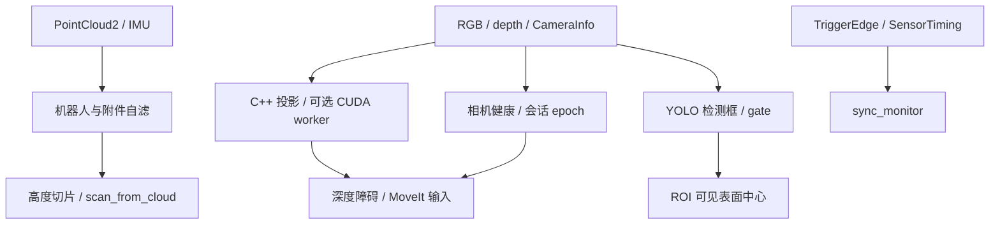

**代码包：** [perception](../../ws_robot/src/astribot_s1_perception)、[perception_components](../../ws_robot/src/astribot_s1_perception_components)、[perception_native](../../ws_robot/src/astribot_s1_perception_native)、[sensor_sync](../../ws_robot/src/astribot_sensor_sync)；纯自滤/切片数学复用 autonomy_core。

**主实现：** [pointcloud_slice_scan_node.cpp](../../ws_robot/src/astribot_s1_perception_components/src/pointcloud_slice_scan_node.cpp)、[rgbd_pointcloud_node.cpp](../../ws_robot/src/astribot_s1_perception_components/src/rgbd_pointcloud_node.cpp)、[sync_monitor.cpp](../../ws_robot/src/astribot_sensor_sync/src/sync_monitor.cpp)。

**已实现：** 带时间/TF 的自滤切片、RGB-D 投影、worker 管理、相机健康、检测门控、腕相机会话；同步元数据检查；native 提供 map/odom 分解和域间只读地图转发。

**部分实现：** YOLO 是检测框，ROI 中心不是完整物体 6D；软件配对不是物理曝光同步；开关启用不证明六路达到持续速率与时效。**未实现：** 触发板硬件后端、真实相机 timing sidecar 全链、通用实例身份跟踪。

**失效与证据：** 过期/重复帧、错误 frame、TF 缺失、worker 故障、epoch 变化应使结果不可用；覆盖不足不是无障碍。见[同步说明](../../ws_robot/src/astribot_sensor_sync/README.md)。

## M04 定位、SLAM 与导航地图

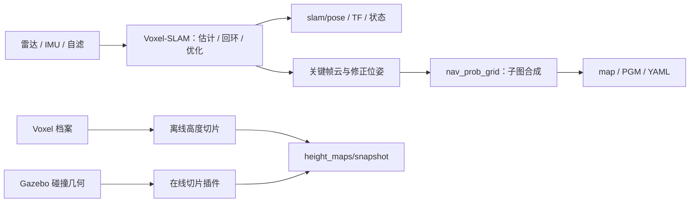

**代码包：** [slam](../../ws_robot/src/astribot_s1_slam)、[mapping](../../ws_robot/src/astribot_s1_mapping)；依赖 slam_msgs、Eigen/GTSAM，组合启动归 perception。

**主实现：** [voxelslam.cpp](../../ws_robot/src/astribot_s1_slam/src/voxelslam.cpp)、[highrate_odom.hpp](../../ws_robot/src/astribot_s1_slam/src/highrate_odom.hpp)、[nav_prob_grid_node.cpp](../../ws_robot/src/astribot_s1_mapping/src/nav_prob_grid_node.cpp)、[档案切片](../../ws_robot/src/astribot_s1_mapping/src/height_slice_map_node.cpp)、[Gazebo 切片](../../ws_robot/src/astribot_s1_gazebo_bringup/src/height_slice_map.cpp)。两种高度快照生产者互斥选择。

**已实现：** 共享 Voxel 后端、关键帧子图/回环修正、静止扫描补图、会话保存加载、初始底盘位姿配准、高度层输出。**部分实现：** recovery 分层源限定 `gazebo_collision_geometry`，不是真机相机/LiDAR 自由空间覆盖。

**未验收：** 当前真机 SLAM/重定位闭环、动态绝对精度、所有地图切换场景。参考[SLAM 仿真](../SLAM_SIMULATION_VALIDATION_20260918.md)、[高度层证据](../evidence/height_layers_20260925/README.md)，均按原记录范围解释。

**边界：** static_map 与 Voxel 必须实测原点配准；载图不叠加 initial_chassis_pose；map→odom 单一所有者，不能多发 TF 掩盖冲突。

## M05 地图资产、工位、业务场景与禁行区

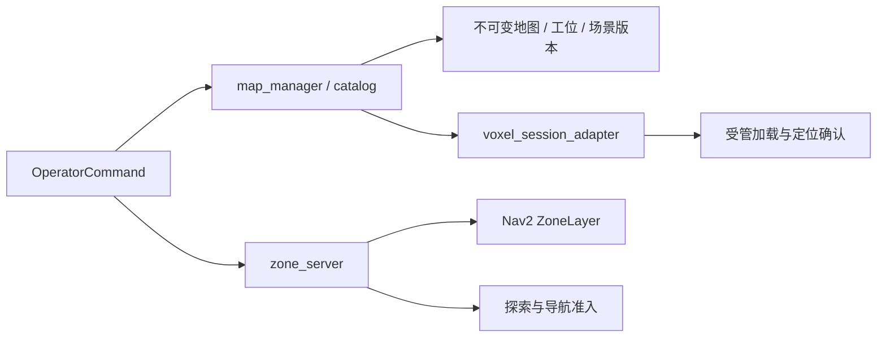

**代码包：** [map_manager](../../ws_robot/src/astribot_map_manager)、[navigation_zones](../../ws_robot/src/astribot_navigation_zones)。主实现：[map_manager.cpp](../../ws_robot/src/astribot_map_manager/src/map_manager.cpp)、[voxel_session_adapter.cpp](../../ws_robot/src/astribot_map_manager/src/voxel_session_adapter.cpp)、[zone_server.cpp](../../ws_robot/src/astribot_navigation_zones/src/zone_server.cpp)。

**已实现：** 地图归档/不可变版本、工位、业务场景设备标记、受管 Voxel 加载、虚拟墙/禁区存储与消费者应用检查。**部分实现：** 换层是人工事务；默认 `/tmp` 不代表持久部署。

**未实现：** 自动乘梯、设备开门/上下料及跨楼层业务闭环。UI 的设备轮廓不是执行接口。

**边界：** 保存、应用、当前版本可导航分开判断，不能仅看保存成功。操作见[虚拟墙](VIRTUAL_WALLS_AND_KEEP_OUT.md)、[业务场景](RVIZ_BUSINESS_SCENES.md)、[Voxel 适配器](../P2_VOXEL_SESSION_ADAPTER_20260919.md)。

## M06 导航任务、路线与探索

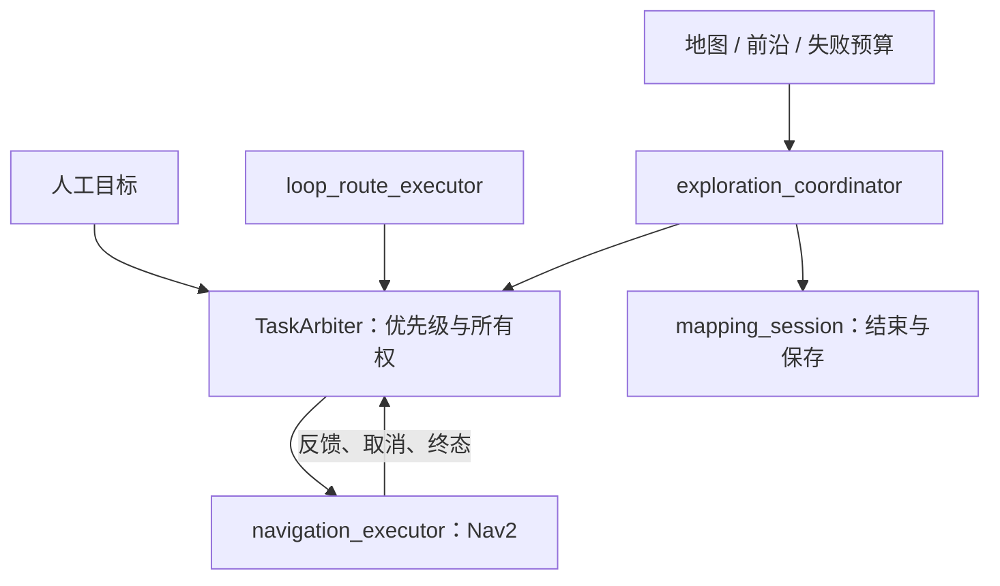

**代码包：** [task_arbiter_native](../../ws_robot/src/astribot_s1_task_arbiter_native)、[route_executor](../../ws_robot/src/astribot_route_executor)、[exploration](../../ws_robot/src/astribot_s1_exploration)、[autonomy_core](../../ws_robot/src/astribot_autonomy_core)。

**主实现：** [仲裁](../../ws_robot/src/astribot_s1_task_arbiter_native/src/task_arbiter_node.cpp)、[路线](../../ws_robot/src/astribot_route_executor/src/loop_route_executor.cpp)、[探索](../../ws_robot/src/astribot_s1_exploration/src/exploration_coordinator_node.cpp)、[建图会话](../../ws_robot/src/astribot_s1_exploration/src/mapping_session_node.cpp)。

**已实现：** 人工/路线/探索优先级 100/50/10；后端取消/终态交接；逐点循环、前沿选择、足迹/路径检查、失败预算、暂停/恢复、结束保存。**部分实现：** UI 租约与导航调度没有统一成任意整机业务队列。

**未实现：** 自动充电、低电量回充闭环、所有任务的崩溃后自动续作。电池显示不能证明回充实现。

**边界：** 旧目标未终态不交接；路线失败不自动跳点；暂停不等于停稳，取消存图完成不等于可恢复原探索。旧路线测试器走人工入口。见[交互说明](../NAVIGATION_ROUTE_EXPLORATION_INTERACTION.md)。

## M07 观测融合、导航策略与上肢限速

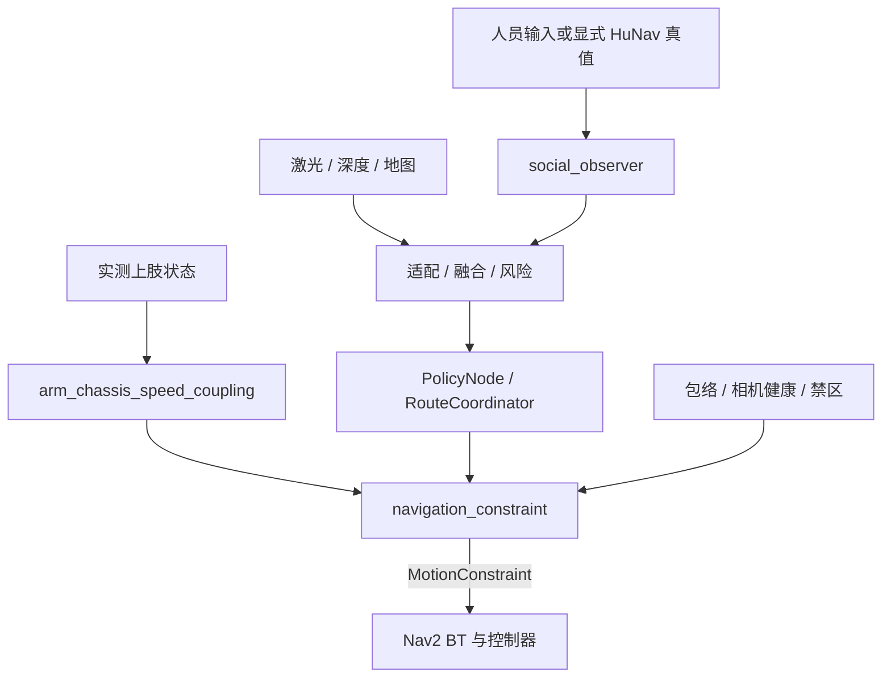

**代码包：** [navigation_policy](../../ws_robot/src/astribot_s1_navigation_policy)、[navigation_policy_native](../../ws_robot/src/astribot_s1_navigation_policy_native)、[social_navigation](../../ws_robot/src/astribot_s1_social_navigation)、[dynamics_coupling](../../ws_robot/src/astribot_s1_dynamics_coupling)。

**主实现：** [policy_node.py](../../ws_robot/src/astribot_s1_navigation_policy/astribot_s1_navigation_policy/policy_node.py)、[route_coordinator.py](../../ws_robot/src/astribot_s1_navigation_policy/astribot_s1_navigation_policy/route_coordinator.py)、[navigation_constraint_node.cpp](../../ws_robot/src/astribot_s1_navigation_policy_native/src/navigation_constraint_node.cpp)。Python 策略仍是现行路径，native 包不代表全部迁移完毕。

**已实现：** 观测时效/融合、路径风险、让行/候选复核、停车限速、P2–P5 分支、人工/自动通道候选、上肢上游限速、社交观测转换及 H2 限定策略。**部分实现：** 真实人员视觉跟踪链未形成生产闭环；HuNav 真值必须显式仿真选择。

**未实现/待验收：** 已验收的硬件策略 profile、真实人群跟随/排队/超越、全部窄通道/非 home 带载矩阵。当前 launch 选择 simulation.json。

**边界：** unknown/stale 不是空闲，几何候选不等于执行许可；版本变化须拒绝或复核。该链不直接接管末级速度。见[上肢边界](../NAVIGATION_UPPER_BODY_BOUNDARY_20260924.md)。

## M08 路径规划、跟踪、起点恢复与工位对齐

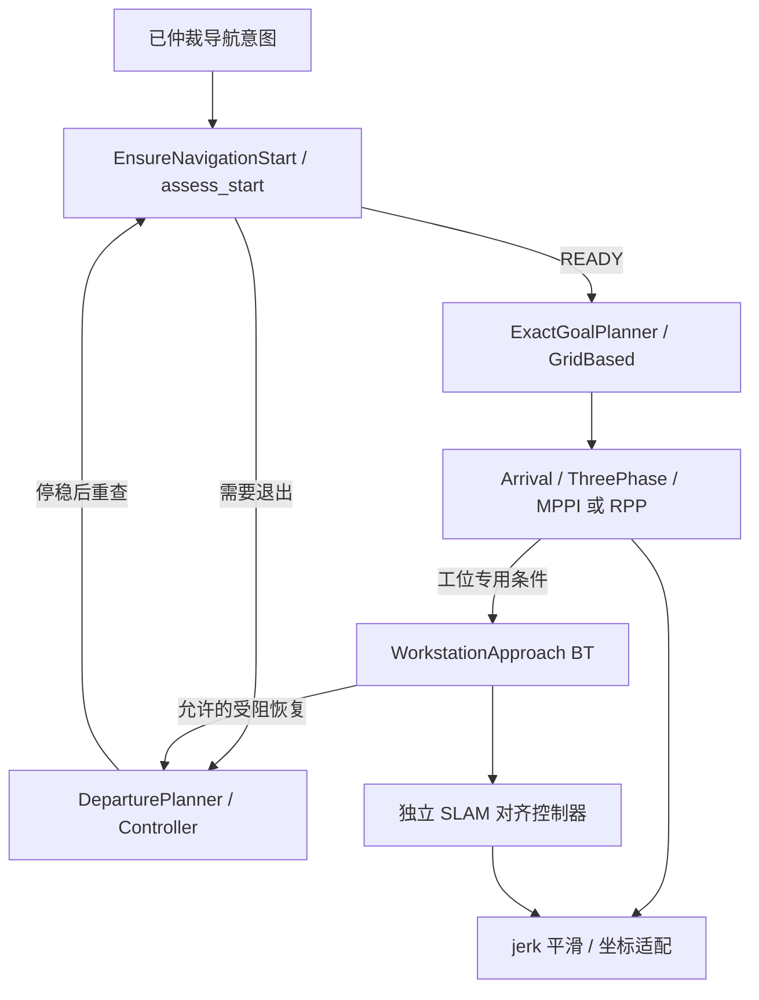

**代码包：** [navigation](../../ws_robot/src/astribot_s1_navigation)、[path_tracking](../../ws_robot/src/astribot_s1_path_tracking)、[navigation_recovery](../../ws_robot/src/astribot_s1_navigation_recovery)；基础 Nav2 server、MPPI/RPP 为外部依赖。

**主实现：** [exact_goal_planner.cpp](../../ws_robot/src/astribot_s1_path_tracking/src/exact_goal_planner.cpp)、[arrival_controller.cpp](../../ws_robot/src/astribot_s1_path_tracking/src/arrival_controller.cpp)、[workstation_alignment_controller.cpp](../../ws_robot/src/astribot_s1_path_tracking/src/workstation_alignment_controller.cpp)、[工位 BT](../../ws_robot/src/astribot_s1_navigation/behavior_trees/navigate_to_workstation.xml)、[恢复源码](../../ws_robot/src/astribot_s1_navigation_recovery/src)。

**已实现：** 精确终点、事件重规划、路径质量/碰撞检查、跟踪/精调、jerk 平滑、有限起点脱困、工位受阻交接与独立对齐。

**限定行为：** 脱困规划前检查，短段执行中不重复整套包络/ACK/分层准入；停稳后刷新实际位置和环境。默认单段至多 0.2 m、最高 0.05 m/s，预算 10 段/120 s，不是任意动态障碍安全保证。

**部分实现/未验收：** 分层读取与局部扫掠存在，不是通用三维全局规划。当前检出未发现 `WholeBodyCollisionCritic` 生产实现，不计其他 worktree 的研发成果。严格 2 mm 完整带载主线、全部通道/载荷矩阵及真机工位对齐仍待验收。SlipMonitor/LinearSlip 已删除，旧 slip.mode 参数不再适用。

**证据：** [工位](../WORKSTATION_ALIGNMENT_IMPLEMENTATION_20260928.md)、[脱困](../DEPARTURE_ACTUAL_START_20260928.md)、[scene96](../evidence/mainline_20260929/PLACE_ACCEPTANCE.md)各自限定范围，早期失败仍保留。

## M09 附件账本、整机几何与固定包络

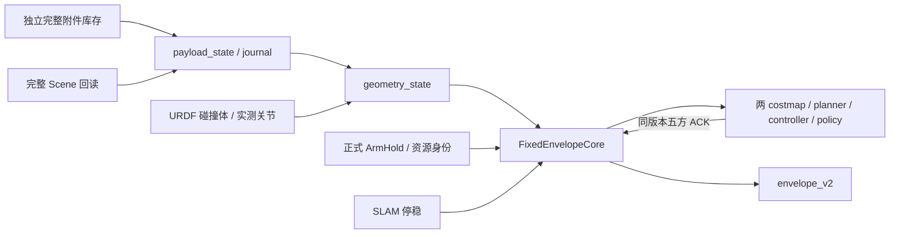

**代码包：** [payload_state](../../ws_robot/src/astribot_s1_payload_state)、[robot_geometry](../../ws_robot/src/astribot_s1_robot_geometry)；协调器位于 navigation_policy_native。

**主实现：** [payload_state_node.cpp](../../ws_robot/src/astribot_s1_payload_state/src/payload_state_node.cpp)、[geometry_state_node.cpp](../../ws_robot/src/astribot_s1_robot_geometry/src/geometry_state_node.cpp)、[fixed_envelope_core.cpp](../../ws_robot/src/astribot_s1_navigation_policy_native/src/fixed_envelope_core.cpp)。

**已实现：** UNKNOWN/TRANSITION/EMPTY/ATTACHED 证据、持久日志、独立 Scene 核对、分层保守包络、质量准入、五方 ACK、双时间期限与撤销。

**部分实现：** 仿真库存有实际来源，真机执行反馈适配待接；附件使用限定 primitive 清单，不是任意 mesh 或双臂共同受力模型。

**未实现：** 真机夹持力/滑落/重量权威确认；执行端统一 epoch 保护。ReserveArmMotion 明确拒绝为 `RESERVED_ARM_MOTION_NOT_ENABLED`，不支持导航中任意上肢动作。

**边界：** 没有库存不是 EMPTY，Scene 空数组不是物理空载，迟到消息不能恢复撤销。ledger 默认不自动启用，须真实 session/source/journal，不能造空载。历史[库存验证](../PAYLOAD_KINEMATIC_ACCEPTANCE_20260923.md)与 scene96 均限于运动学仿真；旧“六方 ACK”不能当作当前代码数量。

## M10 双臂规划、MTC 技能与执行守卫

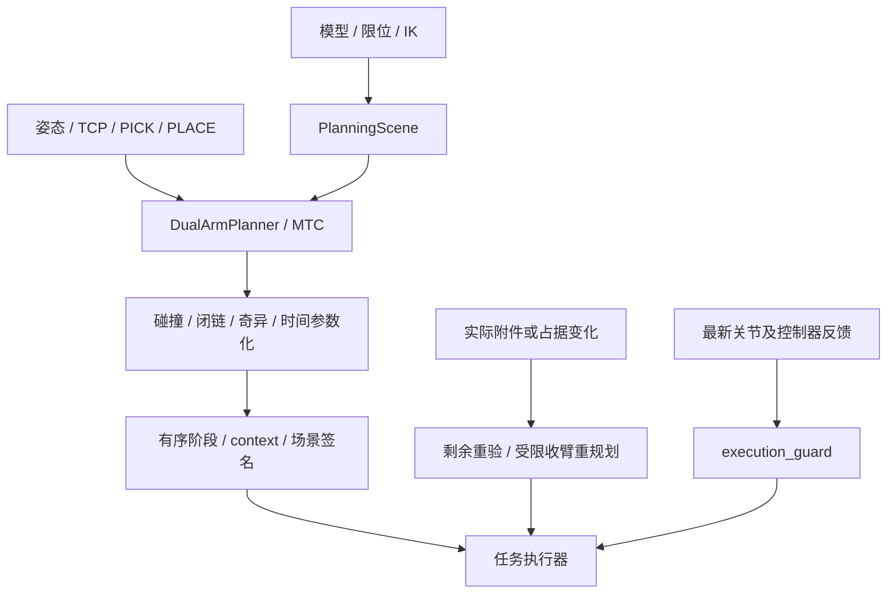

**代码包：** [manipulation](../../ws_robot/src/astribot_s1_manipulation)、[moveit_config](../../ws_robot/src/astribot_s1_moveit_config)、[transport_mtc](../../ws_robot/src/astribot_s1_transport_mtc)。

**主实现：** [dual_arm_planner.cpp](../../ws_robot/src/astribot_s1_manipulation/src/dual_arm_planner.cpp)、[mtc_planner.cpp](../../ws_robot/src/astribot_s1_transport_mtc/src/mtc_planner.cpp)、[payload_transition.cpp](../../ws_robot/src/astribot_s1_transport_mtc/src/payload_transition.cpp)、[execution_guard.cpp](../../ws_robot/src/astribot_s1_transport_mtc/src/execution_guard.cpp)。

**已实现：** OMPL 扩展、双臂 leader-follower 闭链/IK、奇异/碰撞检查、时间优化、具名姿态及夹爪规划、完整 PICK/PLACE 计划、场景签名、剩余轨迹重验。

**受限实现：** 实际 ATTACH 后，首次 PICK 未执行 TRANSPORT_POSTURE 的指定碰撞分支才允许一次重规划，不是任意阶段动态恢复。守卫只检查跟踪并锁存，由父任务取消/保载；非导航不监测 SLAM 偏移。

**未实现/未验收：** 力/阻抗操作闭环、真机双臂共持、任意动态场景连续安全重规划。MTC 默认速度/加速度缩放 0.1、规划余量 0.1 rad，不修改设备真实限位。fixed_v2 设置 `allow_trajectory_execution=false`，使 MoveIt 仅规划。详见[MTC 说明](../../ws_robot/src/astribot_s1_transport_mtc/README.md)。

## M11 抓取候选与已知物体 6D

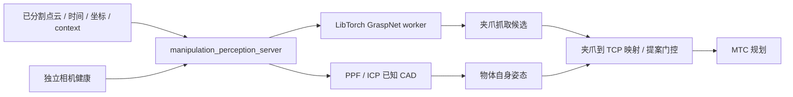

**代码包：** [manipulation_perception](../../ws_robot/src/astribot_s1_manipulation_perception)、[graspnet_runtime](../../ws_robot/src/astribot_graspnet_runtime)、[object_pose_core](../../ws_robot/src/astribot_object_pose_core)。

**主实现：** [服务](../../ws_robot/src/astribot_s1_manipulation_perception/src/manipulation_perception_server.cpp)、[worker](../../ws_robot/src/astribot_graspnet_runtime/src/graspnet_worker.cpp)、[配准](../../ws_robot/src/astribot_object_pose_core/src/registration.cpp)、[提案客户端](../../ws_robot/src/astribot_s1_manipulation_perception/src/pick_planning_client.cpp)。

**已实现：** 真实模型 C++ worker、取消/超时/资产哈希、已知 CAD 配准与歧义拒绝、双实例及受限箱体提案映射。**部分实现：** 依赖预分割点云、登记模型与上下文；score 不是成功概率，候选尚未通过执行碰撞检查。普通构建未设置 GRASPNET_TORCH_ROOT 时不会生成实际 worker。

**未实现：** FoundationPose 生产 Action 接入、通用实例分割/身份/连续跟踪；已有 [P0 工具](../../tools/vision/foundationpose/README.md)仅为准备和隔离验证入口。**待验收：** 新六相机下模型到完整抓放、真机 6D 精度。

**证据与边界：** [服务说明](../../ws_robot/src/astribot_s1_manipulation_perception/README.md)、[PICK_PLANNING](../../ws_robot/src/astribot_s1_manipulation_perception/PICK_PLANNING.md)区分提案与执行；ROI 可见中心、物体坐标姿态、夹爪抓取姿态不可互换。

## M12 搬运事务、资源保持与 VLA 边界

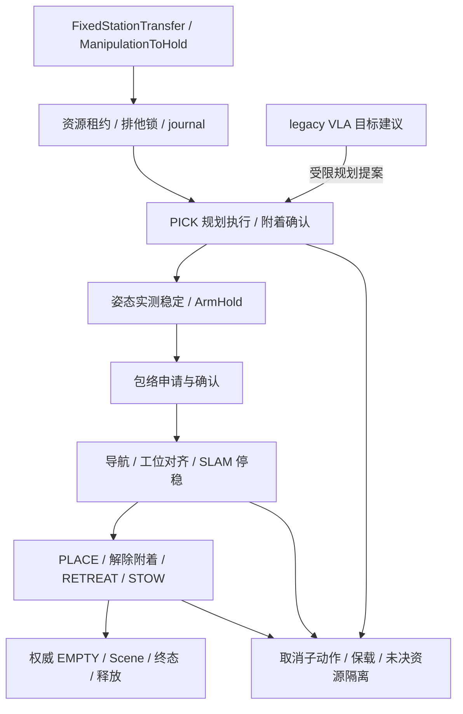

**代码包：** [transport_native](../../ws_robot/src/astribot_s1_transport_native)、[transport](../../ws_robot/src/astribot_s1_transport)。

**主实现：** [hold_executor.cpp](../../ws_robot/src/astribot_s1_transport_native/src/hold_executor.cpp)、[fixed_station_navigation.cpp](../../ws_robot/src/astribot_s1_transport_native/src/fixed_station_navigation.cpp)、[resource_authority.cpp](../../ws_robot/src/astribot_s1_transport_native/src/resource_authority.cpp)、[legacy core.py](../../ws_robot/src/astribot_s1_transport/astribot_s1_transport/core.py)。

**已实现：** HoldResources、PlanToHold、ManipulationToHold、FixedStationTransfer；22 关节/6 控制器合作式所有权、续约、子 UUID/轨迹摘要、实际附件后的计划交接、完整固定工位事务、取消保载与未决 journal。

**部分实现：** 仅仿真 commissioning，须 use_sim_time 与 simulation_commissioning 同为 true。HoldResources 只保持当前姿态；legacy fixed_v2 明确拒绝，不能靠参数切换获得原生能力。VLA 有 legacy 协议、HTTP/示例策略及受限末端目标；增量/动作块为影子评估，不拥有导航、夹爪、附着或资源。

**未实现/未验收：** 通用任意阶段自动续作、真机正式资源执行适配、原生完整搬运 UI/API 收敛、VLA 实模型闭环。未决 journal 不能通过删除或换目录绕过。

**证据：** [scene96](../evidence/mainline_20260929/PLACE_ACCEPTANCE.md)证明特定运动学仿真通过，采用临时 3 cm 到站门槛；严格 2 mm、重复稳定性、动态多载荷、接触及真机仍不成立。

## M13 真机 SDK 与执行桥接

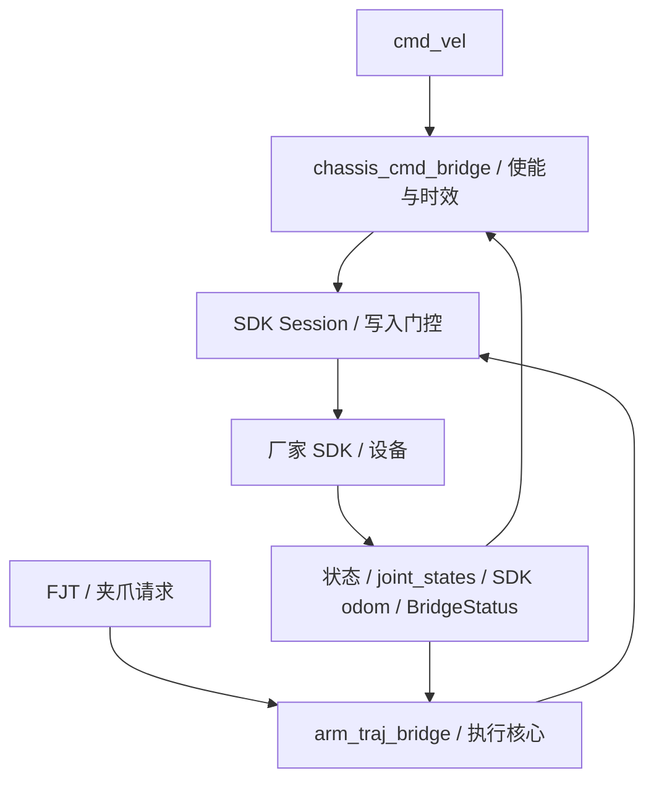

**代码包：** [trajectory_bridge](../../ws_robot/src/astribot_trajectory_bridge)、[trajectory_bridge_native](../../ws_robot/src/astribot_trajectory_bridge_native)；根 [astribot_sdk](../../astribot_sdk)及 [astribot_msgs](../../astribot_msgs)为厂家接口层。

**主实现：** [bridge_container.py](../../ws_robot/src/astribot_trajectory_bridge/astribot_trajectory_bridge/bridge_container.py)、[sdk_session.py](../../ws_robot/src/astribot_trajectory_bridge/astribot_trajectory_bridge/sdk_session.py)、[write_gate.py](../../ws_robot/src/astribot_trajectory_bridge/astribot_trajectory_bridge/write_gate.py)、[native 核心](../../ws_robot/src/astribot_trajectory_bridge_native/src)。

**已实现：** 状态/关节映射、轨迹 Action、底盘命令、夹爪接口、控制权/使能/时效保护，部分臂/夹爪/底盘核心复用 C++ 绑定；ROS 包装仍含 Python。

**部分实现：** precision 桥接配置以底盘为目标，不自动启用全部臂/夹爪服务；本地锁不保证全图双臂同步。**未实现/待验收：** fixed_v2 真机资源与载荷反馈、执行端 epoch 拒旧命令、真实共持及全系统停止上界。

**边界：** SDK 控制权拒绝必须处理原所有者，不能叠加桥接；停止服务返回、Action 终态与设备停稳不同。真机启动和旧停止器阻塞见[真机手册](HARDWARE_OPERATIONS.md)。

## M14 操作台、控制网关与离线回放

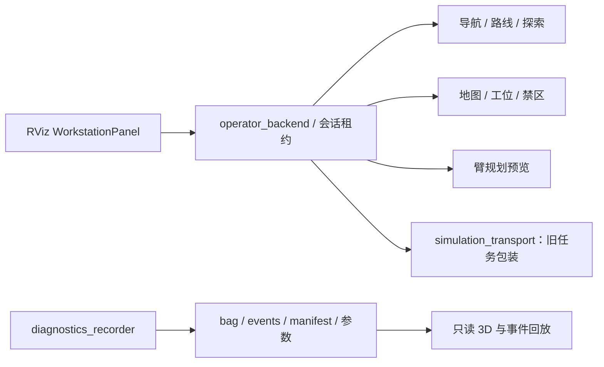

**代码包：** [operator_backend](../../ws_robot/src/astribot_operator_backend)、[operator_station](../../ws_robot/src/astribot_operator_station)。主实现：[operator_backend.cpp](../../ws_robot/src/astribot_operator_backend/src/operator_backend.cpp)、[arm_preview.hpp](../../ws_robot/src/astribot_operator_backend/include/astribot_operator_backend/arm_preview.hpp)、[workstation_panel.cpp](../../ws_robot/src/astribot_operator_station/src/workstation_panel.cpp)、[replay_viewer.cpp](../../ws_robot/src/astribot_operator_station/src/replay_viewer.cpp)。

**已实现：** Qt/RViz 界面、会话租约、导航/路线/探索、地图/业务场景/禁区操作、臂规划预览、诊断录制与只读回放。

**部分实现：** 租约只保护经网关的入口，不是全图 DDS 鉴权；参数为 observed/event_only，不是每个控制周期精确生效记录。

**未实现：** 通用臂执行适配（`ARM.EXECUTION_ADAPTER_UNAVAILABLE`）、原生 FixedStationTransfer 产品入口、设备动作闭环。transport_session 仍调用旧 Python transport_task，其 fixed_v2 不能自动切成原生路径。

**边界：** fake 后端隔离在 `/operator_fake/*`，生产默认真实导航；离线回放无控制发布口。见[P0/P1 说明](../P0_P1_COMPLETE_IMPLEMENTATION_20260919.md)。

## M15 日志、验证、构建与部署

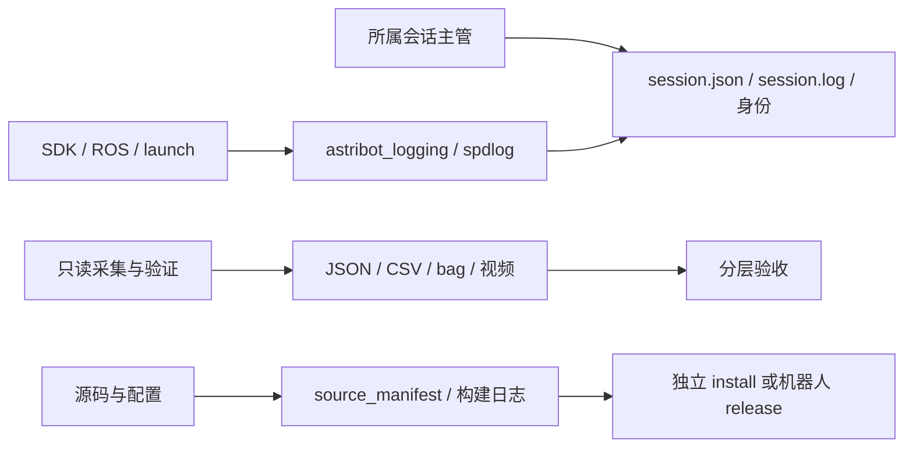

**代码包：** [logging](../../ws_robot/src/astribot_logging)、[sim_validation](../../ws_robot/src/astribot_sim_validation)、[eigen_vendor](../../ws_robot/src/astribot_eigen_vendor)；[tools](../../tools)、[ws_robot/third_party](../../ws_robot/third_party)、根 [third_party](../../third_party)为工具和依赖。

**主入口：** [supervisor](../../tools/sim_stack_supervisor.py)、[isolation](../../tools/sim_isolation.py)、[deploy_project.sh](../../tools/robot/deploy_project.sh)、[build_robot.sh](../../tools/robot/build_robot.sh)、[recorder.cpp](../../ws_robot/src/astribot_operator_station/src/recorder.cpp)。

**已实现：** 统一日志/轮转、会话索引、构建部署清单、隔离实例与性能锁、有界探针、选定话题/参数采集及视频核验。

**部分实现：** 消息数量不是无丢包证明；env.sh 不保证完整恢复 overlay；latest_* 不是活动性证据。sim_validation 的旧任务包装不代表原生执行后端。

**未实现/待验收：** 全套场景自动回归门禁、完整总配额淘汰/故障前缓存、Orin 整栈资源预算。不得读取在写 bag 的 SQLite；封包后查返回码、metadata 和关键话题。进程清理只针对所属会话，不推荐全机匹配的 clean_sim_stack.sh。见[日志说明](../LOGGING.md)。

## M16 领域接口

本图箭头表示类型依赖，区别于前面的运行时图。

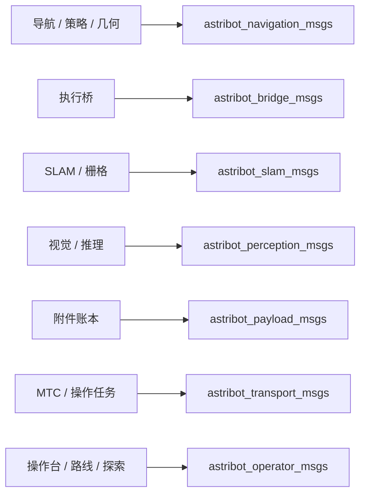

| 包 | 已实现的代表契约 | 未实现/使用边界 |
|---|---|---|
| [navigation_msgs](../../ws_robot/src/astribot_navigation_msgs) | RobotEnvelope、NavigationEnvelopeV2、ArmHoldStatus、MotionConstraint、ResolveRoute、AssessNavigationStart | 类型存在不表示所有运动模式启用 |
| [bridge_msgs](../../ws_robot/src/astribot_bridge_msgs) | BridgeStatus、DispatchWaypoints、SetGripper | 服务是否开放依赖桥接配置 |
| [slam_msgs](../../ws_robot/src/astribot_slam_msgs) | KeyframeSubmap、KeyframePoseArray、HeightSliceMaps | 关键帧云与位姿修正分开传输 |
| [perception_msgs](../../ws_robot/src/astribot_perception_msgs) | CameraHealth、ProjectionHealth、ComputeGrasps、EstimateObjectPose | 观测和候选不等于控制命令 |
| [payload_msgs](../../ws_robot/src/astribot_payload_msgs) | AttachmentObservation、AttachmentState | 真机物理来源仍待接 |
| [transport_msgs](../../ws_robot/src/astribot_transport_msgs) | PlanManipulation、PlanSkill、RevalidatePayloadTransition、ExecutionGuardStatus | 规划与执行分离 |
| [operator_msgs](../../ws_robot/src/astribot_operator_msgs) | OperatorCommand、ExplorationCommand、StartLoopRoute、CancelLoopRoute | 部分 payload 仍是 JSON，不是全链强类型完成 |

transport_native 自带资源/固定工位 Action，sensor_sync 自带 timing 消息，根 astribot_msgs 为厂家域。ABI 变化须重建双方，包能 import 不证明生成代码兼容。

**尚未实现：** 全链统一上下文/数据字典、所有接口的兼容版本策略、通用 WorldSnapshot 或全系统 ResourceGrant ROS 服务。现有局部 epoch/context/lease/hash 以真实消费者为准，不能因同名就假定全系统一致事务。
