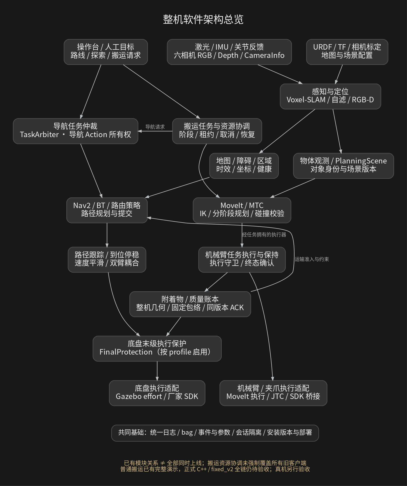

# Astribot 轮式双臂机器人：软件架构与阶段工作汇报

**汇报区间：2026 年 9 月 18 日 17:00—2026-09-24T14:08:49+08:00（北京时间）。**

## 1. 汇报结论

这一阶段的主要进展，是把建图、导航、相机、双臂规划和操作台逐步连接为有任务归属、有版本确认、有故障记录的移动操作系统，并推进关键运行模块 C++ 化。

- **已有完整场景成果：**统一 Voxel-SLAM 建图/存图/载图短路线回归；普通仓库抓取—搬运—放置演示；限定条件下的返回并转向 90° 回归。
- **已有模块与局部链路成果：**七类运行模块 C++ 迁移及分层验证、六相机参考安装、RGB-D 处理进程恢复、载荷账本/固定包络事务、地图与操作台接入。
- **仍未完成整体验收：**正式 C++ / fixed_v2 / 模型感知驱动的完整抓放运输链。9 月 24 日 world91 通过的是首段机械臂执行、保持、六方同版本确认、取消和资源释放。
- **真机状态：**本期材料不能支持真机整链、相机物理外参、接触抓取、带载动力学或 Jenkins 全流程验收通过。

报告按“设计 / 源码实现 / 离线与隔离验证 / 仿真场景 / 真机验收”区分证据。本文不重新运行测试；同一模块在不同日期、不同安装版本下的结果不自动合并。工作区存在大量未提交修改，HEAD 不能代表所有运行产物。

## 2. 当前架构设计

[查看三张可缩放架构图](architecture/index.html)；提供 PNG、SVG 和可编辑 DOT。图中的实线表示已有实现或接口关系，虚线标记待贯通或待验收。

### 2.1 六个协作层

| 层次 | 当前职责与代表模块 | 关键边界 |
|---|---|---|
| 操作与业务入口 | C++/Qt RViz 操作台、导航目标、路线/探索、地图工位、搬运任务、诊断录制 | 通过 Action/服务提交；界面状态不等于实际执行成功 |
| 任务与资源 | 原生导航仲裁器、搬运协调/执行器、任务租约、取消/保持、恢复日志 | 导航仲裁与整机资源协调分工；搬运租约未强制覆盖所有旧客户端 |
| 规划与世界状态 | Nav2/BT、RouteCoordinator、MTC/MoveIt、PlanningScene、物体账本、质量与固定包络 | 规划候选不直接执行；物体、场景、包络、任务版本必须一致 |
| 感知与定位 | 激光/IMU、Voxel-SLAM、导航栅格、自滤/扫描、六相机、RGB-D、抓取候选/6D 服务 | 原始健康与处理健康分离；目标可见、有深度、可抓取是不同条件 |
| 控制与保护 | Arrival/ThreePhase、平滑、坐标转换、双臂耦合、FinalProtection、机械臂执行守卫 | 保持唯一命令出口；源过期、版本失配、跟踪越界须撤销许可 |
| 仿真与硬件适配 | Gazebo、ros2_control/JTC、effort 底盘、厂家 SDK/轨迹桥接、URDF/标定配置 | 仿真与真机共享上层契约，设备适配和验收分开 |

横向基础设施包括：统一 spdlog/session.log、rosbag/事件/参数证据、会话所有权、ROS 域与 Gazebo partition/端口隔离、独立安装版本、部署脚本和配置哈希。

### 2.2 三条核心数据与控制链

**导航链：**传感器 → 定位/地图/障碍 → 任务仲裁 → Nav2 规划与路径提交 → 跟踪/平滑/双臂约束 → 按 profile 启用的 FinalProtection → 仿真或 SDK 执行。策略 off 和启用策略的接线不同，不能仅凭源码存在认定保护已启用。

**操作链：**RGB-D 与采集时刻 TF → 目标/物体姿态或抓取候选 → MTC 分阶段规划 → 任务拥有的执行与保持 → 附着状态/质量账本 → 实测整机包络 → 消费者同版本确认 → 导航 → 放置与独立结果确认。普通演示已有完整记录；正式原生链仍在整合。

**证据链：**会话/任务/执行 ID + 源时间/接收时间 + 地图/标定/包络版本 → 日志、事件、参数、bag → 场景结果与失败现场。日志与回放负责解释行为，不拥有运动权限。

### 2.3 架构演进与尚存缺口

当前系统正从分别可运行的导航和机械臂模块，向带有载荷、保持和版本事务的整机任务演进。旧架构手册中的“没有资源协调”“没有包络调用客户端”等历史描述已不能直接代表最新源码；但新模块存在，也不表示已统一替换所有入口。

主要缺口是：正式全阶段执行与失败收尾、感知模型结果到实际 MTC 执行的贯通、持续物体身份、真实载荷下的通道转向/覆盖、操作台完整离线时间对齐，以及真机与部署验收。

## 3. 本期工作时间线

| 时间 | 主要工作 | 成果与验证边界 |
|---|---|---|
| 9/18 17:00 后 | 统一 SLAM 包布局、依赖和建图/载图回归 | run15 于北京时间 19:45 启动，run16 于 19:49 启动，确属本期；三组短路线各 3/3，最大全程各组到点误差不超过 2.690 cm / 1.395°；基于 SLAM 位姿，不是物理真值 |
| 9/19 | 非 home 搬运、仿真实例隔离、深度障碍补充、操作台及地图事务扩展 | 隔离串扰检查、限定搬运场景及停止试验有记录；操作台有 C++/Qt/ROS 隔离测试，不能据此称完整现场 UI 通过 |
| 9/20 | 地图选择/导入/加载接入、工作树集中归档、部署方案整理 | 地图目录校验、不可变版本、适配器 READY 门控已接线；共享 SLAM 所有权限制下未执行该轮真实切图。一次集中提交不能代表所有工作发生于当日 |
| 9/21 | C++ 迁移比较、六相机参考安装、视觉抓取/姿态规划 | 六路仿真图像与 TF、24 个 MoveIt 自碰撞状态通过；相机为 provisional_reference，未物理标定 |
| 9/22 | RGB-D 分段时延、独占验证、连续性版本和 CUDA 进程恢复；载荷/区域/回放扩展 | 存在 1800 s 限定负载通过，也保留过期失败；GPU 处理与原始相机健康分离；完整运动并发矩阵未完成 |
| 9/23 | 普通仓库完整搬运成功、return90 时序修复、载荷质量与保持事务、FoundationPose/装配准备 | 普通场景成功；R6 往返到位通过；FoundationPose 尚无最终 GPU 推理验收；装配资产/静态验证不等于装配执行 |
| 9/24 至快照 | 原生 MTC 首段执行与取消释放、坐标/时间/感知探针修正、退役版本归档 | world91 首段链通过；完整六阶段链仍暂缓，部分后续场景未运行；未将失败与隔离资源清理伪装成成功 |

## 4. 典型工作一：C++ 运行模块迁移

完成分项实现与验证的七类模块：运动适配、整机几何状态、包络与扫描、末级保护、双臂底盘耦合、导航仲裁、定位/地图中继。策略 observer 与硬件桥接另有候选/夹具证据，不能统称生产替换完成。

| 对照项目 | 指标与试验条件 | Python ms | C++ ms |
|---|---|---:|---:|
| fixed_v2 包络 | 服务往返 P95 | 2.499 | 0.296 |
| 空载几何 | 采样→发布 P95 | 34.297 | 7.272 |
| 偏置载荷几何 | 采样→发布 P95 | 39.139 | 20.105 |
| 双臂底盘耦合 | 输出 P95 | 0.715 | 0.357 |
| 导航仲裁 | fakeNav2 提交→终态 P95 | 24.886 | 6.245 |
| 1024² 地图中继 | P50 | 65.959 | 1.973 |
| 策略 observer | 64 目标 tick P95 | 3.963 | 0.573 |

数据来自迁移汇报中成对比较。各行测量对象不同，禁止相加或推导整机加速倍数。长尾并非全部改善：耦合最大值 3.784→3.933 ms，小地图最大值 6.161→10.436 ms。23 个旧参考模块退出生产安装不等于全部 Python/pybind 已移除。

## 5. 典型工作二：搬运从演示到正式主链

**普通兼容链：**取货准备 → 定位/规划 → 抓取附着 → 收臂/包络 → 导航 → 放置/退臂 → 独立确认，已有完整成功记录。9/23 task08 约 147.68 s；另一个视频场景 task01 约 160.431 s，独立 Gazebo 放置误差约 0.116 mm。它们是不同场景记录，不混为同一试验。

**正式原生链 world91：**PREGRASP 首段 → Hold → 六方同版本 ACK → 取消 → 资源释放，已完成限定场景验证。738 个轨迹点、计划时长 11.658845208 s；采样最大跟踪误差 0.0322653 rad，低于既有 0.05 rad 门槛。保留 515 帧实际视频记录；10 fps 回放时长不等于墙钟执行时间。原始 typed ArmHoldStatus 未归档，保持证据为现场门控及 Action/协调器/日志的关联证据。

**未闭环部分：**零起步到 READY 的准备、全六阶段执行、迟到载荷观测后继续执行、最终 Hold/释放和部分 UNKNOWN/延迟场景。最新完整链记录仍出现未继续发送 JTC、未完成载荷确认及 quarantine；world91 不能消除 world90 的隔离现场。

普通演示采用运动学附着，尚未验证夹持力、摩擦、滑落或真实载荷惯性。模型推理服务的 GraspNet 20/20、已知 CAD 6D 10/10 成功，不等于这些输出已经驱动成功的普通搬运演示。

## 6. 典型工作三：相机从“有图像”到“可依赖的数据”

六相机包括头 RGB-D、头双目左右、腹部 RGB-D 和双腕 RGB-D。统一参考安装影响 URDF、Gazebo 原生 frame、TF、MoveIt 与版本；原始标定文件保持独立。参考安装验证包括 24/24 自碰撞状态、壳体/父体外障碍探针以及六路实际图像；任意运动、载荷遮挡、双目深度与真机外参仍需另验。

RGB-D 数据链改为短回调、有界配对和待处理槽、独立 CPU/CUDA 处理。CameraHealth 反映原始流，ProjectionHealth 反映处理后端；GPU worker 故障不再直接等价于整个 ROS 接收节点阻塞。旧进程未确认退出时禁止启动替代者；恢复依赖新版本和故障后采集的新帧。

| 场景 | 观察结果 | 适用边界 |
|---|---|---|
| SC-LOAD-02 | 四路出现 STALE，最大原始深度间隔约 378 ms | 失败保留；探针并发仅有时间相关性 |
| SC-LOAD-03 | 1800 s，RTF 0.989854，889 次 CUDA 请求成功，无 >250 ms 原始深度间隔 | SLAM+静止 Nav2+重复推理；不是持续运动 |
| SC-CAMERA-RECOVERY-05 | 单次暂停约 400.718 ms；恢复后四路新 epoch；恢复观测 60.38–109.58 ms | 与上一行不同安装；不能移签压力结果 |
| CUDA 进程恢复后续 | 1800 s 仓库采集，四次腕部故障识别 50–241 ms、恢复 310–601 ms | 实际 worker 注入；未制造 GPU 驱动硬挂死 |
| 导航处理健康门控 | 360 s，三次处理断流，显式窗口外无额外保护撤销 | 静止、无运动目标，不证明停车距离 |

本阶段重点是定位长尾、限制资源竞争、显式暴露处理故障和阻止旧数据恢复授权；没有证据支持“全部时延问题已解决”。

## 7. 其他工作与工程化状态

| 工作线 | 已有成果 | 当前保留项 |
|---|---|---|
| SLAM/地图/探索 | 统一后端、会话保存与完整性、地图导入与切换事务、探索短流程 | 任意位置重定位、退化恢复、整仓长时探索、真实切图与硬件验收 |
| 导航/通道 | 固定整机包络、转弯扫掠、到位停稳与新鲜扫描修复 | 实际非 home/偏置载荷的短门洞、L 转、不可达退出等整链矩阵 |
| return90 | R6 去程 0.341 mm / 0.0421°，返程 1.164 mm / 0.0293°，各 0.7 s/36 个停稳样本 | 限定仿真真值场景；不是 SLAM 或真机绝对精度 |
| 操作台/回放 | 目标/取消、录制/事件/参数，地图与工位接入，只读历史地图/路径/TF | 已知事件定位、时间回退、游标状态等缺陷；真实 RViz 全交互/布局仍有 NOT_RUN |
| 日志/会话隔离 | spdlog、session.log、任务事件、域/partition/端口/锁/专属目录 | latest 索引不是存活证明；通信隔离不等于 CPU/GPU 性能独占 |
| 部署/Jenkins | 已有真机独立 release 同步编译脚本和部署启动入口 | 当前检索未见 Jenkinsfile；两阶段 CI 一键部署仍按待落地方案，不宣称完成 |
| FoundationPose/装配 | 依赖/模型/数据与静态几何准备 | TensorRT 版本差异及最终引擎/GPU 验证；装配接触/力控/闭环待验收 |
| 验证治理 | 单问题一小时限时、保留失败/恢复入口、独立安装、版本归档 | 证据不足不得转为通过；不能清除未释放资源账本后重试 |

两阶段部署边界继续保持：①真机基础依赖安装与环境验证；②项目构建打包、独立版本部署、显式选择版本及启动。第二阶段才涉及项目上线；不得把基础环境通过视为项目验收。

## 8. 下一阶段优先级与验收出口

1. **先闭合正式原生执行链。**补齐 READY 准备、PICK/PLACE 全阶段、迟到观测与失败原因传播；用真实 Action 终态、载荷确认、最终保持和资源释放证明完成。
2. **接通模型感知到执行。**把同帧 RGB-D/TF、对象身份、6D/抓取候选接入 MTC；验证不可见、旧帧、遮挡、不可达和取消。
3. **再扩展多场景。**非 home/偏载通道、转向扫掠、动态相机覆盖、多物体与质量变化；每个场景使用一致安装和场景身份。
4. **补工程交付。**修复离线回放对齐，落实 Jenkins 两阶段流水线，在干净目标环境重复部署；之后另行开展物理外参与真机验收。

## 9. 证据与统计口径

本报告是已有源码、日志及验证材料的汇总，非新的运行验收。采用最新主线调度修正旧手册状态；历史失败和不同安装版本分别保留。提交数量不作为完成度，测试数有重叠不汇总成“总通过数”，不计算缺少分母的项目完成百分比。

- 9/18 起点由 run15/run16 原始 session.log 的 UTC 时间转换确认。
- 当前分支提交清单见 [commits.tsv](commits.tsv)；来源哈希、快照时间与工作区状态见 [evidence_index.json](evidence_index.json)。
- 快照 HEAD：`e19aafde0fad0bbc0dc1a8a7f8ed415300de972d`。来源读取和哈希记录为顺序操作，不是对多人工作区的原子冻结。

### 主要来源

- [docs/MAINLINE_DISPATCH_20260924.md](/home/yjh/WorkSpace/astribot_sdk_ros2/docs/MAINLINE_DISPATCH_20260924.md)
- [docs/MAINLINE_AND_EXTENSION_REVIEW_20260924.md](/home/yjh/WorkSpace/astribot_sdk_ros2/docs/MAINLINE_AND_EXTENSION_REVIEW_20260924.md)
- [docs/CPP_MIGRATION_COMPLETED_WORK_BRIEF_20260924.md](/home/yjh/WorkSpace/astribot_sdk_ros2/docs/CPP_MIGRATION_COMPLETED_WORK_BRIEF_20260924.md)
- [docs/SLAM_SIMULATION_VALIDATION_20260918.md](/home/yjh/WorkSpace/astribot_sdk_ros2/docs/SLAM_SIMULATION_VALIDATION_20260918.md)
- [docs/NONHOME_ISOLATED_VALIDATION_20260919.md](/home/yjh/WorkSpace/astribot_sdk_ros2/docs/NONHOME_ISOLATED_VALIDATION_20260919.md)
- [docs/OPERATOR_STATION_P0_P1_IMPLEMENTATION_20260919.md](/home/yjh/WorkSpace/astribot_sdk_ros2/docs/OPERATOR_STATION_P0_P1_IMPLEMENTATION_20260919.md)
- [docs/MAP_SELECTION_LOAD_INTEGRATION_20260920.md](/home/yjh/WorkSpace/astribot_sdk_ros2/docs/MAP_SELECTION_LOAD_INTEGRATION_20260920.md)
- [docs/CAMERA_REFERENCE_MOUNTS_20260921.md](/home/yjh/WorkSpace/astribot_sdk_ros2/docs/CAMERA_REFERENCE_MOUNTS_20260921.md)
- [docs/RGBD_EXCLUSIVE_REGRESSION_20260922.md](/home/yjh/WorkSpace/astribot_sdk_ros2/docs/RGBD_EXCLUSIVE_REGRESSION_20260922.md)
- [docs/RGBD_CUDA_PROCESS_RECOVERY_20260922.md](/home/yjh/WorkSpace/astribot_sdk_ros2/docs/RGBD_CUDA_PROCESS_RECOVERY_20260922.md)
- [docs/DEFERRED_ISSUES_20260923.md](/home/yjh/WorkSpace/astribot_sdk_ros2/docs/DEFERRED_ISSUES_20260923.md)
- [docs/manuals/OFFLINE_REPLAY_OPERATION_VALIDATION_20260923.md](/home/yjh/WorkSpace/astribot_sdk_ros2/docs/manuals/OFFLINE_REPLAY_OPERATION_VALIDATION_20260923.md)
- [docs/manuals/ARCHITECTURE_REFERENCE.md](/home/yjh/WorkSpace/astribot_sdk_ros2/docs/manuals/ARCHITECTURE_REFERENCE.md)
- [ws_robot/src/astribot_s1_transport/README.md](/home/yjh/WorkSpace/astribot_sdk_ros2/ws_robot/src/astribot_s1_transport/README.md)
- [ws_robot/src/astribot_s1_transport_mtc/README.md](/home/yjh/WorkSpace/astribot_sdk_ros2/ws_robot/src/astribot_s1_transport_mtc/README.md)
- [docs/LOGGING.md](/home/yjh/WorkSpace/astribot_sdk_ros2/docs/LOGGING.md)
- [tools/robot/deploy_project.sh](/home/yjh/WorkSpace/astribot_sdk_ros2/tools/robot/deploy_project.sh)
