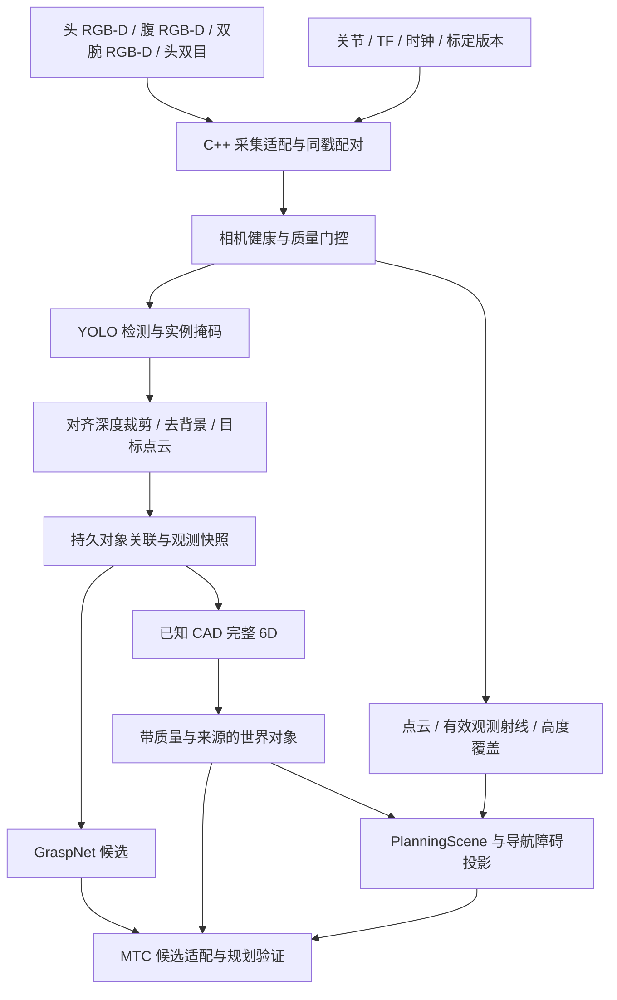

# 相机、感知、搬运与导航剩余工作实施计划

> **For agentic workers:** 按独立验收任务逐项执行，使用 `superpowers:executing-plans`；本文件是规划，不是已施工或已验收声明。

**Goal:** 在同一导航仓库仿真中，形成来源可信、场景一致、可取消且有多场景证据的感知与非 home 搬运导航链路。

**Architecture:** 复用现有 C++ 感知、GraspNet、已知 CAD 姿态、公共几何、MTC 与导航保护。新增工作集中在数据连接、持久对象身份、上下文同步和验收缺口；不新建控制器或第二套业务仿真环境。

**Tech Stack:** 当前仓库 ROS 2 Humble、Gazebo、Nav2、MoveIt/MTC、C++ OpenCV DNN/LibTorch、PPF/ICP。Python 主要负责启动、构建、采集、分析和回归编排。

**Spec:** 用户本次“整理尚未完成工作、详细落地方案、数据流、边界及多场景确认”的要求，以及下列已核实的仓库记录。本轮只新增计划文档，不改机器人运行逻辑、不启动运动。

## 1. 当前基线与未完成项的准确含义

以本次读取的源码和记录为准；没有重新运行导航或推理实验。共享工作树可能继续变化，开工前应重新冻结文件哈希。历史测试数字不表示当前所有组合已重验。

| 模块 | 已完成基础 | 当前剩余工作 |
|---|---|---|
| 六相机参考安装 | 参考 YAML、TF/原生 frame、MoveIt 同源配置；29 项描述测试，24 组静态碰撞状态；六路实际渲染 | 运动视角、并发负载、腕部健康与点云按需接入、重新标定后的参数替换 |
| 双 RGB-D 新鲜度 | 共享内存容量和完整同戳配对修复；旧推理负载 60 s 记录、新安装静态 20 s 记录 | 新安装 + MPPI/SLAM/推理同时运行的持续预算与故障恢复；不能继续笼统写成“双源从未解决” |
| YOLO | C++ 检测、门控和位置观测；真实 YOLOv5n 图像推理及合成深度 ROS 链测试 | 业务类别适配、实例掩码、真实仿真目标点云和持久身份；普通检测框不是实例分割 |
| GraspNet | 真实 C++ LibTorch worker；旧 clear 输入 20/20 请求成功 | 真实检测输入、完整场景碰撞/IK/可达性、MTC 候选选择；候选仍明确 `collision_checked=false` |
| 完整物体 6D | 已知 CAD 的 C++ PPF/ICP 服务；旧 clear/far 有真实传感器证据 | 新外参重采、多视角、目标种类、遮挡与对称性验证；旧七场景仅 2/7 接受，5/7 拒绝 |
| 物体账本 | 搬运示例已有 WORLD/ATTACHED/PLACED 等事务状态 | 多物体、跨相机持久身份、观测与附着状态分离、PlanningScene/导航版本联动 |
| MTC/READY_RIGHT | 分阶段规划、执行守卫和取消边界；新模型 ready_right 静态无自碰撞 | 历史规划无解需用真实起点、规划场景和约束重现；目标无碰撞不等于路径有解 |
| 非 home 几何与通道 | 公共几何、固定姿态、消费者 ACK、通道规则、离线矩阵与部分历史闭环 | 新相机壳/支架纳入导航几何、带载三维通道、停止预算、完整候选规划器闭环 |
| 多负载 | 空载/0.2 kg/1.2 kg 偏置载荷/释放版本的包络事务回归 | 接触与惯性、滑移、实际带载动态回归；旧运动学附着不证明负载动力学 |
| C++ 迁移 | 多个几何、感知、守卫、仲裁和适配模块已迁移 | 搬运事务/ROS 后端、策略运行入口及其他依赖闭包；不因文件存在或核心原生就宣布迁移完成 |
| 关联统一导航 | I0 有部分单次及配对证据 | 状态文件仍为 NOT_PASSED；重复次数、标准角点、停止矩阵及 legacy/fixed 配置交接未全部结束 |

主要证据入口（相对仓库根目录）：

- `docs/CAMERA_REFERENCE_MOUNTS_20260921.md`、`docs/evidence/camera_reference_20260921/implementation_status.json`。
- `docs/GRASP_POSE_SIMULATION_20260921.md`、`docs/evidence/grasp_pose_sim_20260921/implementation_status.json`。
- `docs/VISION_CPP_CONTINUATION_20260921.md`：其中“GraspNet/完整 6D 未实现”已被后续实现取代，保留其历史验证范围。
- `docs/NONHOME_CPP_REPAIR_20260919.md`、`docs/NONHOME_FOLLOWUP_20260919.md`。
- `docs/evidence/unified_navigation_20260919/implementation_status.json`。
- `docs/PYTHON_CPP_REMAINING_20260921.md`、`docs/CPP_POLICY_MIGRATION_NEXT_20260921.md`：属于关联迁移主线快照，开工前与其负责人交接。

## 2. 全局约束

1. 统一采用导航仓库资产与入口；隔离的是 domain、partition、端口、进程、安装和证据目录，不复制新的业务世界。
2. 运行时优先 C++。复用现有核心，Python 启动/验证脚本可以保留。
3. 相机外参仍是 `provisional_reference`。仿真验证不能赋予真机标定有效性。
4. VLA 真模型和真机验收暂缓。完整动态抓取—搬运—放置列为后置里程碑，不因本次整理自动恢复其执行；固定姿态带载导航、感知、规划和事务故障验证可独立进行。
5. 首批仍采用“停稳操作、固定机械臂姿态导航”。不开放边走边动臂、双臂闭链协同或力控。
6. 不以放宽碰撞、输入时效、保持租约或到位门槛换成功率。阈值变更必须有独立误差预算和复审。
7. 原始失败、旧模型与旧安装证据保留；新外参下的样本重新编号，不混算旧成功率。
8. 本轮不接管其他任务的仿真或覆盖其安装。部署时记录源码哈希、真实加载库、参数和启动依赖。

## 3. 数据流与控制权

### 感知数据流



`GraspNet` 的输出是夹爪抓取位姿候选；`EstimateObjectPose` 的输出是物体坐标系位姿，两者不互相替代。未知 CAD、对称性或单平面不可观测时不能伪造完整物体朝向。

### 任务控制流

```text
任务请求 → 整机资源准入 → 停稳/HOLD → 获取一致快照
  → READY/预抓取路径诊断 → MTC 分段规划
  → 碰撞、IK、限位、奇异点、时间和退路验证
  → 执行适配与最终保护 → 实测确认 → 账本提交
  → 重新计算实际载荷包络 → 所有消费者确认同一 epoch
  → 导航仲裁 → 路径/控制/最终保护 → 到站停稳
  → 新快照 → 放置与释放确认 → 退臂 → 完成
```

| 所有者 | 可做 | 不可做 |
|---|---|---|
| 感知服务 | 输出观测、置信质量、位姿和抓取建议 | 发速度/关节命令，直接提交 ATTACHED |
| 世界对象模块 | 管理观测身份、质量和版本，提供一致快照 | 把视觉丢失当成物体被抓走，替代执行确认 |
| 搬运事务层 | 资源租约、取消屏障、阶段与对象状态提交 | 绕过导航仲裁、控制器或最终保护 |
| MTC/MoveIt | 规划候选、规划场景假设、路径验证 | 用规划 attach/detach 当作物理附着/释放完成 |
| 导航仲裁 | 唯一导航任务所有权 | 被当作已有的全局双臂任务总线 |
| 执行适配/保护 | 有界命令、停止、关节/底盘实际反馈 | 旧动作未终止时接受冲突执行 |
| 记录与评分 | 保存过程、独立真值、错误与指标 | 以仿真真值直接填感知结果或执行许可 |

### 接口契约

现有 `ComputeGrasps` / `EstimateObjectPose` Action 继续复用；下面未在现有消息中出现的字段属于待设计的扩展，不声称已经实现。

| 接口段 | 类型与数据 | 时间/队列 | 失效处理 |
|---|---|---|---|
| 相机→预处理 | 有界 SensorData QoS Topic；Image/CameraInfo/PointCloud2 | 保留采集时间、接收时间、frame、源 epoch；丢旧帧，记录丢弃数 | 缺流、编码/内参漂移、时钟回退时撤销快照 |
| 健康→准入 | reliable、有界状态 Topic | 每源独立期限；导航头/腹保留现有门槛，腕部按角色定义，不机械套用 8 Hz | 缺失不视为健康；诊断只报告，由任务决定 HOLD/降级 |
| 掩码→目标点云 | 同一 image identity、mask、ROI、目标假设 | 必须绑定同次采集；深度对齐方式明确 | 框内背景不可自动视为物体；无效深度不能补自由空间 |
| 快照→推理 | 可取消 Action；对象点云、task/object/camera/model ID、版本、期限 | 推理队列有上限；计算后再次验期 | 超时/取消/版本变更无有效候选输出，迟到结果丢弃 |
| 世界→规划 | 版本化 snapshot + 明确提交服务/事件 | scene/object/attachment/envelope/calibration/map/localization/clock 组成上下文 | 任一相关版本变化重新验证或重规划 |
| 规划→执行 | 既有轨迹 Action | 执行前核验实际起点和计划年龄 | cancel accepted、action terminal、实测停稳分别记录 |
| 包络→导航 | 既有 SetRobotEnvelope/ACK | 停稳提交，消费者身份和同 epoch 确认 | 少一个必要 ACK 或保持失效都不得通行 |

建议新增领域快照元数据：`request_id/execution_id/clock_epoch/object_revision/attachment_revision/geometry_hash/context_hash`。使用强类型字段，诊断字符串另存；不建立一个由所有线程争用的无界“全局世界锁”。

## 4. 工作包及详细落地

### W0：冻结基线、纠正文档与启动上下文（首先执行）

**现有入口：** 六相机参考配置、`warehouse_sim.launch.py`、`move_group.launch.py`、`tools/vision/*` 和各阶段 evidence。

- [ ] 新建本阶段源码/模型/消息 ABI/安装库/参数哈希清单；按关联任务交接确认当前可用仿真实例。
- [ ] 建立状态索引，区分“已实现”“历史通过”“当前组合未验收”“明确失败”“暂缓”；只追加新状态，不抹除旧失败。
- [ ] 核对所有推理启动 frame、相机 ID、标定 revision。当前 `manipulation_perception/config/inference.yaml` 默认 `camera_head_rgbd_optical_frame` 与新模型 `head_rgbd_camera_optical_frame` 名称不同，虽默认零版本会拒绝执行，仍需统一正式入口。
- [ ] 用同一源生成 URDF、MoveIt 语义和导航几何；检查相机壳/支架已进入机器人凸包及分层包络。
- [ ] 冷启动、进程退出、孤儿 Gazebo、时钟重置和错误 overlay 分别验证，记录真实日志绝对路径。

**交付/放行：** 一份可重建 manifest；不依赖 `/tmp` 隐藏模型；新旧消息消费者一致；配置出错应在准入前明确失败。

### W1：六相机角色与持续质量闭环

**修改范围：** `astribot_s1_perception_components/src/{camera_health_node,rgbd_pointcloud_node,camera_calibration_postprocess_node}.cpp`、对应 YAML/launch；`astribot_perception_msgs` 必要的契约扩展。

相机分工：头 RGB-D 负责全局目标发现与上部障碍；腹 RGB-D 负责近场/中低位补盲；双腕负责抓前精看、抓后/放后确认。头双目当前只有左右图像流，深度需要独立校正与匹配验收，首批不把它当成已验证 RGB-D。腕相机必须使用拍摄时刻关节 TF，不能用收到图像时的最新 TF。

- [ ] 为各角色定义必需流、有效深度比例、关键 ROI 可见性、盲区及健康状态。
- [ ] 双腕按需接入 C++ 配对、健康、点云，采用任务激活策略控制资源；避免所有网络以最高分辨率常开。
- [ ] 分别测量采集、桥接、配对、变换、推理各阶段 P50/P95/P99、最大值、超时数和队列峰值。
- [ ] 比较相机单独、相机+SLAM、相机+MPPI、相机+推理、全并发；建议每档至少 10 分钟，压力档 30 分钟，属于待执行预算。
- [ ] 注入单流丢失、乱序、时钟停滞/回退、TF 缺失、相机重启、GPU 忙；检查恢复后必须重建 epoch，不能复用旧检测。

**放行：** 正常档持续满足既有有效期；故障档按预期撤销能力且可恢复。不能仅用平均 FPS 或“话题有发布”通过。新参考安装的 20 秒静态结果只作为起点。

### W2：YOLO/掩码→真实目标点云

**复用：** `yolo_detector_node.cpp`、`detection_gate_node.cpp`、`rgbd_object_pose_node.cpp`。拟新增独立 C++ mask 后处理与 object-cloud 核心，文件建议置于相同组件包，名称在拆分设计时冻结。

- [ ] 先用手工标注的仿真数据验证掩码到点云几何，再接真实模型；不让模型误检与投影 bug 混在一起。
- [ ] 明确首批业务目标类别和模型标签映射。COCO 检测模型的样例成功不能证明仓库任意箱体可识别。
- [ ] 比较两条独立基线：检测框 + 深度连通/平面分离；真正实例分割输出 + 深度投影。二者按真实名称记账，不能把框掩码写成实例分割完成。
- [ ] 验证 letterbox 逆变换、裁剪边界、畸变/对齐深度、孔洞、米/毫米单位、16UC1/32FC1、薄物体和多个接触目标。
- [ ] 产出包含 image identity、mask provenance、点数、前景质量、frame、对象假设及有效期的目标点云。

**放行：** 首批限定目标可在 Gazebo 图像上被真实模型识别；点云不混入台面和相邻物体达到预先固定质量标准。低质量明确拒绝；没有目标/类别未知时不生成虚假对象。模型选择、许可证和导出兼容性在锁定具体权重后单独审查。

### W3：已知 CAD 6D 与多视角恢复

**复用：** `astribot_object_pose_core`、`astribot_s1_manipulation_perception`、`tools/vision/sim_pose_evaluate.py`。

- [ ] 按新外参重新采集 clear/far/near/tilted/yawed/occluded/close 七场景，保留旧数据作历史对照。
- [ ] 用独立真值和几何可见性先定义每个场景应接受还是应拒绝；不得根据算法失败后再把案例改成“预期拒绝”。
- [ ] 分析每个拒绝由分割、深度盲区、视角法向不足、初值/配准、模型差异或时效哪一段导致。
- [ ] 首批采用“单相机产生候选、另一相机独立验证/补充”的方案。只有时间、标定、对象静止性和身份都满足时才做多视角融合，不直接拼接所有点云。
- [ ] 加入静止目标的下一观察视角请求。观察动作由任务层申请资源、经规划执行后重采；感知模块只提出视角建议。
- [ ] 对对称物体记录可观测自由度/等价姿态；未知模型或单平面不输出伪完整 6D。

**验收基准：** 对已定义可观测的已知 CAD，沿用已有 20 mm/10° 作为第一阶段比较门槛，不代表精密抓取已足够。按对象、距离、遮挡、姿态分别统计成功率、误差和错误接受。抓取所需更严精度由夹爪/目标净空预算决定。

**关键边界：** 当前推理约 1–2 秒级历史耗时，不适合假定移动目标静止。结果有效 5 秒也不是运动授权；应重观测或以物体运动界限拒绝过期候选，不能简单延长输入有效期。

### W4：持久对象与权威场景上下文

**修改范围：** 现有搬运 `core.py/payload_sync.py/ros_backend.py` 的接口契约、`astribot_perception_msgs`、推理服务 `manipulation_perception_server.cpp`；新增能力核心用 C++，避免继续把融合逻辑堆入 Python。

- [ ] 在示例账本基础上补持久对象 ID、模型 ID、观测假设、对象版本、附着版本，解决同类相邻物体及跨相机切换。
- [ ] 将观测状态与物理事务分开：`OBSERVED/LOST/AMBIGUOUS` 不自动改变 `WORLD/ATTACHED/PLACED`。
- [ ] 接入唯一 PlanningScene/包络权威源。当前服务将 scene/envelope 作为启动固定参数校验，正式任务必须支持受控上下文更新或绑定一次性快照，不能让调用者任意声明版本 1。
- [ ] 推理开始、结果发布、规划提交、轨迹执行前四次验证上下文；结果迟到或对象被其他任务改变时丢弃。
- [ ] 用短事务分别提交 MoveIt、对象账本和导航包络；提交不全时进入可诊断不一致状态，保持停止，重新查询确认后恢复。

**放行：** 对象 A/B 交叉、遮挡重现、相机重启、附着中断、版本跳变、重复事件、取消和重启均不发生身份偷换或错误附着。2D costmap 与 3D PlanningScene 共享身份/版本，不要求共用同一内部存储。

### W5：READY_RIGHT 诊断与 GraspNet→MTC

**入口：** `astribot_s1_manipulation/src/transport_skill_planner.cpp`、`astribot_s1_transport_mtc/src/{mtc_planner,execution_guard}.cpp`、现有抓取候选门控及两种推理 Action。

- [ ] 冻结原规划失败的完整起点、关节、URDF/SRDF、附着物、规划组、场景、约束、插件和预算；先确认新参考模型是否仍复现。
- [ ] 分别输出：起点有效性、目标有效性、路径中碰撞对、IK、关节限位/余量、奇异点、时间参数化和规划预算。禁止只返回 `no solution`。
- [ ] 先无物体测试纯姿态过渡，再加工位，再加载荷；用阶段化收臂/抬肘候选解决路径问题。不能直接关闭碰撞对或扩大关节界限。
- [ ] 将 GraspNet 候选映射到当前 TCP/夹爪轴和开口宽度；依次校验工作空间、完整夹爪碰撞、IK、预抓取—接近—抬升—退出路径。
- [ ] MTC 做候选排序和失败回退；所有硬约束通过后才比较分数。释放前必须存在可行退臂路径。

**多场景：** 左/右臂、不同真实起点、台面/墙面邻近、开口边界、对象倾斜、不可达目标、路径窄缝、起点漂移、取消与版本变化。

**放行：** 每次失败有结构化原因；目标状态有效与完整路径有效分开报告。至少先达到规划级闭环，不能用静态 24 态替代 READY_RIGHT 轨迹或抓取执行通过。

### W6：体素有效高度、观测覆盖与碰撞几何一致性

**本轮新增确认的问题：** `nav2_params_mppi.yaml` 和 `nav2_params_rpp.yaml` 当前包含 `z_voxels: 32`；本机 `/opt/ros/humble/include/nav2_voxel_grid/voxel_grid.hpp` 明确限制最多 16 层，现有 launch 测试反而断言 32。源码配置与安装库契约冲突已确认；运行中是否钳制、警告及实际有效层数尚需专门探针，不能沿用旧“32 层生效”结论。

- [ ] 先建立 C++ 实际 VoxelGrid/插件高度边界探针，验证高度范围内每层障碍标记与清除；测试应检查行为而非只检查 YAML 值。
- [ ] 在最多 16 层约束下按实际机器人/载荷高度选 `origin_z/z_resolution`。例如覆盖 2.4 m 需至少 0.15 m 层高，这是设计候选，不是直接替换后的验收参数。
- [ ] 若层分辨率不能可靠保留所需薄横杆，采用已存在的分层/观测射线表达或独立 3D 碰撞输入，而不是删掉高处障碍或把未知区清空。
- [ ] 将相机壳/支架、真实关节与偏置载荷纳入公共几何；确认导航、局部/全局地图、规划、控制和最终保护用同一模型与 epoch。
- [ ] 测试 RGB-D 稀疏、遮挡、单源丢失、视锥盲区、障碍高度上下边界、斜杆/低矮物、动态人和载荷自遮挡。

**放行：** 不以 VoxelGrid 发布条数作为覆盖证明；明确每个可通行方向所需高度区间是否被有效观察。盲区/缺失数据触发 HOLD 或有证据的降级模式；已有 lidar-only 模式不能自动覆盖臂展高度风险。

### W7：非 home 导航、多负载与规划器对照

**入口：** `astribot_s1_robot_geometry`、现有 corridor 策略与 C++ 迁移候选、导航 MPPI/RPP profile、规划器 wrapper、`tools/sim/verify_3d_coverage_matrix.py`、`verify_multi_load_dynamic.py`。

- [ ] 先固定一套基线控制链，验证新几何与三维输入，之后再比较规划器，避免同时改变几何、规划和控制无法归因。
- [ ] 载荷分别使用空载、0.2 kg、1.2 kg 偏置和释放后空载；每组独立记录尺寸、质心、惯性是否真实施加，不能只记录质量字段。
- [ ] 通道按实际包络宽度+两侧余量定义相对宽度档，并覆盖历史 0.85/1.10/1.30 m 夹具；不能把某个固定宽度当作所有载荷的可通行标准。
- [ ] 比较现有规划器、Hybrid、Omni Lattice：使用相同地图、填充凸包、未知处理、误差预算和路线见证；保存方向、倒车、路径航向及控制器实际跟踪。
- [ ] 验证 MPPI 运动时心跳/回调阻塞、控制延迟、停止距离及恢复；已有 lidar-only 单次运动不能代替 RGB-D/Voxel/推理并发验收。

**决策规则：** 已对齐且完整扫掠安全→直接通过；入口未对齐且有足够空间→入口调整；通道内→禁原地转向；终点要求反向但通道内无转向空间→拒绝或规划到出口外调整；版本/保持/覆盖失效→停止；动态障碍→在可证明停止距离内等待或重规划。任何后备规划器必须独立合格，不能因主规划失败自动接管。

**放行：** 正向用例满足安全净空与既有到位标准，负向用例给出确定拒绝原因；规划成功、实际穿越、终点停稳、严格到位分开统计。原有严格到位场景继续使用 2 mm/0.1°，不把格网端点容差当成该指标。

### W8：完整动态搬运与真实接触模型（后置，暂不自动执行）

现有搬运示例使用运动学附着；质量传给接口但不等于 Gazebo 刚体惯性和夹爪接触已经验证。

- [ ] 先把“事务/几何闭环”与“接触/动力学闭环”拆成两个验收配置，明确标签，禁止混算。
- [ ] 恢复执行范围后，先完成新视觉和 MTC 的单次抓取/放置；再接两站运输与多负载。
- [ ] 物理档引入惯性、摩擦、接触、夹持与滑落检测；避免运动学同步和物理求解同时拥有物体位姿。
- [ ] 注入抓空、滑落、单臂执行失败、松爪未释放、物体粘连、释放后退臂失败、取消和进程重启。

**放行：** 单独证明接触抓牢、附着提交、保持、运输、支撑后释放和退臂完成。缺少实际抓持证据时停在不确定状态，不能用关节到位自动推断抓牢。真机的力控与安全验收仍不包含在此仿真里程碑中。

### W9：C++ 迁移、部署与长时间运行（贯穿各阶段）

- [ ] 与迁移主线共用盘查清单：`transport_task` 核心、`RosBackend`、RGB-D 模板观测、source inbox 与 payload 同步逐块迁移。
- [ ] 保留纯核心状态转换、假后端差分、隔离 ROS、同场景动态四层证据；只在对应调用闭包完成后退役旧入口。
- [ ] 策略 C++ 候选的 JSON 大整数/特殊字符串等边界先与原实现对齐，再处理 P2/P3/P4/P5/H2 状态机与入口切换；不复制另一份候选工程。
- [ ] 模型和依赖移出易丢失临时目录，记录权重、类别、归一化、导出、ABI和许可证；检测到不匹配直接失败。
- [ ] 隔离构建稳定后做至少 3 次冷启动和建议 2 小时仿真耐久测试，观察内存/显存趋势、队列、租约、重连、上下文泄漏与日志轮转。

长期业务中的电池、回充、全系统资源抢占和人工恢复仍为独立设计/验收项。可以先建接口和仿真故障夹具，不能在无硬件协议时声称已完成部署。

## 5. 多场景验收矩阵

以下是待实施矩阵。每格在运行前固定预期、门槛、输入哈希及随机种子；建议主要格至少 3 次独立重复。不能把一次成功、历史回放或安全拒绝填成全流程成功。

| 编号 | 变化维度 | 必须验证的结果 |
|---|---|---|
| C01 | 六相机单独/并发，静止/机械臂变化 | 采集时间 TF 正确；数据不过期；自遮挡随姿态可诊断 |
| C02 | 丢 RGB/深度/Info、乱序、源重启 | 完整组配对；旧数据不能续健康；epoch 更新 |
| C03 | 时钟冻结/回退、TF 断链、标定跳版 | 缓存失效，进行中的推理/计划不可继续提交 |
| V01 | 单目标、多同类目标、相邻接触、无目标 | 分割纯度、身份不交换、空场不输出可执行对象 |
| V02 | near/far/tilt/yaw/遮挡/背光纹理 | 在预定义可观测域达到精度；不可观测明确拒绝 |
| V03 | 对称 CAD、未知 CAD、单平面、错误模型 | 不伪造完整朝向或跨模型匹配 |
| V04 | 多视角时间差、目标移动、相机切换 | 不拼接不一致点云；正确重采/降级 |
| P01 | READY_RIGHT 多起点、工位/载荷增量 | 区分起点、目标、路径与执行失败；可复现原因 |
| P02 | 候选接近/抓取/抬升/退出、释放后退路 | 全段约束；规划 attach 不提交真实状态 |
| G01 | box/cylinder/sphere/mesh、偏置载荷 | 公共几何无欠包络；实际消费者 epoch 一致 |
| G02 | 低矮物、高横杆、斜杆、薄障碍、高度边界 | 实际体素层数/分层覆盖有效，未知不能清空 |
| N01 | 宽度阈值两侧、斜入口、内/外终点、反向航向 | 直接通过/入口调整/拒绝规则正确，通道内无原地转向 |
| N02 | 动态横穿、堵塞、目标占据、感知稀疏 | 安全停止或有界重规划，失败原因向任务透传 |
| N03 | MPPI/RPP及规划器配对、计算压力 | 相同安全标准；心跳、延迟、跟踪和停车指标分开 |
| T01 | 包络缺 ACK、hold 过期、取消/迟到结果 | 不放行，不交叠控制，不自动重放旧任务 |
| T02 | 附着/释放提交中断、进程重启 | 账本、MoveIt、Gazebo 不确定状态可查询与恢复 |
| D01 | 多质量/偏置、抓空/滑落/接触失败 | 后置物理档确认力学事实；运动学档不冒充通过 |

统一证据至少记录：`session/task/execution/step ID`、软件/模型哈希、采集/接收时间、frame、源/时钟/标定/场景/包络版本、规划器/控制器、阶段、预期与实际结果、失败码、重试次数、日志与原始数据路径。

指标需分开：可观测场景的接受率、接受结果中的错误率、不可观测的正确拒绝率；FOLLOW 与终端精调；成功目标与失败/取消目标；采样最小净空与有保守误差界的连续净空。零次碰撞样本不等于所有连续时刻的形式化证明。

## 6. 顺序、交接与阶段放行

| 阶段 | 工作包 | 放行条件 | 后续可开启 |
|---|---|---|---|
| A 基础纠偏 | W0 + W6 体素契约 | 配置/二进制/版本一致；真实高度范围可验证 | 相机和三维覆盖负载验证 |
| B 感知稳定 | W1 + W2 | 真实模型→可靠目标点云，持续负载与故障门控通过 | 新外参姿态回归 |
| C 物体与上下文 | W3 + W4 | 多视角/身份/场景版本明确，旧结果不会混入新任务 | GraspNet/MTC 候选规划 |
| D 规划与导航 | W5 + W6 + W7 | READY 规划原因明确；固定姿态带载通道、覆盖、停止与延迟矩阵通过 | 固定姿态运输能力分级发布 |
| E 动态抓放 | W8 | 仅在恢复该验收范围后执行；运动学与物理档分别通过 | 完整仿真搬运发布 |
| F 收口 | W9及各包部署 | C++ 调用闭包、冷启动、模型与 ABI、耐久与恢复证据完整 | 真机阶段单独评审 |

W9 的模块迁移随各工作包进行，但不在一次 A/B 试验中同时更换语言实现和行为算法。W7 与关联导航 I0 主线共享参数和验收口径，不重复改控制器。

关联 I0 交接清单：新 arrival_progress 候选的空场 A/B 重复；取消与四方向/四速度停止矩阵；legacy/fixed_v2 分别合法配置；L/U/锐角/钝角/重规划及末端角点边界；source_hold_budget_v2 的真实暂停人/目标占据场景。该主线当前状态仍 NOT_PASSED，不能用本任务相机修复替它放行，也不应在其未验收时默认开启 I1–I6。

每个工作包按“冻结反例→最小修改→核心/契约验证→隔离真实链路→多场景重复→证据与复核”交付。没有可信的总工期依据，因此按门槛推进，不把上述测试窗口误写成人力工期承诺。

## 7. 暂缓清单与第一批建议

暂缓：VLA 真模型效果、真机驱动/完整标定/抓放验收、边走边动臂、双臂协同力控、真实回充。接口与离线契约可继续维护，暂缓不等于已完成。

第一批建议只做三个可独立审查的交付：

1. **基线与参数纠偏：** 处理 Voxel 32/16 冲突、统一新光学 frame/版本和加载模型清单，给出实际高度探针证据。
2. **新相机下的感知重采：** 固定七场景重新采集，区分视角问题、分割问题与配准问题；补双腕角色健康。
3. **READY_RIGHT 规划级诊断：** 原失败起点复现、逐段碰撞/约束报告；不启动完整抓放、不放宽安全门。

这三项结束后，以真实失败分布确定 W2/W3/W5 的下一批实现，避免再次围绕已经被新安装修复的旧遮挡症状反复调算法。

## 2026-09-22 补充：W1-S 传感器硬同步接口

用户新增要求：审计各传感器时间戳；增加硬同步触发方案，同时预留雷达、IMU。
此项不改变 W1 的现有新鲜度/质量放行条件，也不解除真机暂缓约束。

- [x] 源码审计：共享 `/clock` 与同机30ms软件配对不构成全传感器曝光同步；当前无物理锁定证据。
- [x] 分离相机曝光触发、雷达/IMU原生时钟同步；形成设备能力表要求、数据流、边界、故障与验收矩阵。
- [x] C++有界同步元数据检查、强类型ROS接口、HardwareTriggerPort抽象接口、可选启动和禁用的板卡配置模板。
- [x] 20项C++核心测试 + 19项ROS合成消息/私有时钟检查；不作为真实曝光证据。
- [ ] 设备型号确定后实现板卡/相机厂商适配和真实设备时间映射、边沿/帧计数关联。
- [ ] 将同帧同步状态接入健康/WorldSnapshot，完成Gazebo实际触发传感器与设备回放验证；当前仅独立检查节点，未启用运动门控。
- [ ] 真机恢复后另行验收物理曝光、线路延迟、锁定/失锁、跨频率、投射器干扰与多负载。

详情：`docs/SENSOR_HARD_SYNC_DESIGN_20260922.md`；本轮证据：`docs/evidence/task_chain_20260922_resume/sensor_sync_verification.json`。
