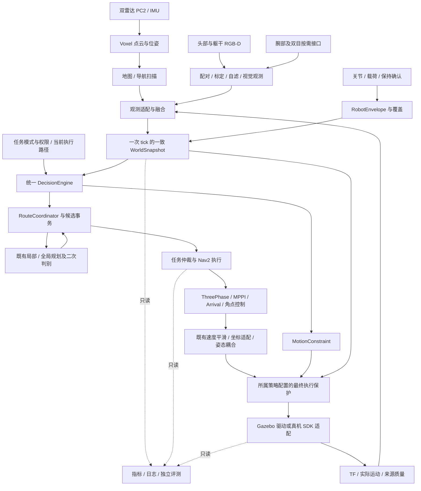

# 统一导航主线：未完成工作、数据流与分阶段落地计划

> **For agentic workers:** 使用 `superpowers:executing-plans` 按本文件逐项实施；用复选框记录任务完成状态。本文是规划与现状核对，不是运行验收结果。沿用已经授权的“每项仿真通过后再进入下一项”，不自动部署真机。

**Goal:** 在保持现有跟踪、到位和运动平顺性的基础上，完成标准角点跟踪，以及让行、等待、绕行、重规划、跟随、队列、窄通道、超越和探索的统一决策闭环。

**Architecture:** 感知提供带来源与版本的事实，统一决策器产生行为和规划意图，路线协调器拥有候选提交事务，任务仲裁器拥有导航 Action。现有 ThreePhase/MPPI/Arrival 执行运动，执行保护和设备适配保持各自职责；社会评分不直接发布速度。

**Tech Stack:** 当前仓库 ROS 2 Humble、Nav2、Gazebo、Voxel-SLAM、C++ 运行时与 Python 启动/验证工具；借鉴 HuNavSim 场景及 SFW 社会评分，不替换现有底盘控制器。

**Spec:** [已确认整合设计](../../UNIFIED_SOCIAL_NAVIGATION_DECISION_CONTROL_DESIGN_20260919.md)、[原详细施工计划](../../UNIFIED_NAVIGATION_IMPLEMENTATION_PLAN_20260919.md)、[原 18 项/50 类用例目录](../../plans/unified_navigation_rollout_20260919.json)，以及后续标准角点跟踪要求。

核对日期：2026-09-21。Git 基点 `a7026bcd`，分支 `chassis-effort-drive`，工作区有大量并行未提交改动；基点不能完整代表本文件核对的源码。本文只新增规划资料，没有修改运行代码、启动仿真或操作真机。本次中断前的排查也是只读，扫描启动问题尚未修复。

## 1. 范围与状态基线

本文件负责本任务的统一导航主线，关联相机、原生运行时、几何及搬运接口。独立视觉抓取、完整搬运、业务 UI 等由各自计划负责，不能因本次整理就重复实现或宣称已验收。

当前阶段记录为 **I0.1 / NOT_PASSED**，I0.2、I1–I6 尚未开放。部分 I0.2 所需构建和试验已先行准备，但不能据此跳过 I0.1。

状态口径：

- **已有实现**：代码或配置存在，未必装入当前运行版本。
- **已有局部证据**：离线、隔离节点或历史特定 overlay 通过；限定到该版本和场景。
- **待闭环验收**：还缺整栈、多场景、重复、数据或视觉证据。
- **待实施**：新增能力尚无完整实现和验收，可能已有可复用基础。

| 工作 | 已有基础与最新有效记录 | 尚未完成的准确内容 |
|---|---|---|
| I0.1 证据与夹具 | 已有隔离启动、回放负例、冷启动编排、取消与停车工具 | 同一候选版本的重复、原始数据与双视图证据未齐；状态文件混有历史字段，需要逐证据归并 |
| H2 无人 A/B | 最新原基线 3 对比较 `passed=true`；一次测量中断另有重试记录 | 不能替代新 `arrival_progress`、角点候选或当前迁移版本的 A/B |
| H2 目标占用 | 3 次功能复测通过；首轮有 681 个无效测量样本 | Gazebo/RViz 视觉证据待补；首轮不能作为无测量告警证据 |
| R01 取消 | 运动中 3/3、已停稳等待中 3/3 功能通过 | 一对 Gazebo 黑屏，视觉不完整；当前合并版本取消屏障仍需重验 |
| R03 停车 | 四方向×四档首轮 16/16；只证明指定零指令边界 | 重复未齐，脉冲未保证稳态；正常平滑停车全过程预测仍未完成 |
| S01 航向/路线 | 起步 ±90° 的直线首批与部分目标通过 | 连续 L/U、90° 终点、180° 边界的完整重复和当前候选质量对照 |
| 原 P4/P5 | fixed_v2 P4/P5 有首轮通行、到位及净空证据 | 重复和质量配对不足；legacy 曾出现规划/准入不一致和入口超时，不能借用 fixed_v2 结果 |
| 标准角点 | 检测与 `CORNER_APPROACH → ALIGN_CORNER → FOLLOW` 已实现；历史 5/5 CTest | 尚无进入角点相位并完成全路线的有效闭环；重规划、末端角点、动态中断未验收 |
| 相机与扫描启动 | 相机资源安装修复已有构建/xacro 证据；另一个相机任务已有局部传输/参考安装证据 | 当前导航传感器组合与已加载版本尚待闭环；固定图入口会关闭点云生产者，见第 4 节 |
| I0.2 合并基线 | 历史独立 27 包构建及多个候选已存在 | 当前源码、C++ 新入口、相机、配置与依赖的一致构建和分配置基线未完成 |
| I1 统一决策与计时 | 原策略、SocialAdapter、PlanningSession、仲裁器已有基础 | 统一快照、唯一服务实现、统一 HOLD/episode、执行输出切换尚待整合 |
| I2 停车预测与联合路线选择 | 历史停车参考、原 LOCAL/GLOBAL/VALIDATE 和候选验证存在 | 正常平滑停预测、未来停车分支、联合选择、完整提交 ACK 与角点接管未形成新版本闭环 |
| I3 跟随/队列 | 观测轨迹与导航任务基础 | 持久移动任务、身份锁、弧长参考、前驱关系、语义等待待实施 |
| I4 人机窄通道/退让 | 原通道、包络、保持确认及部分退出机制 | 人机通行许可、等待区、后方覆盖、非合作交会与恢复待整合 |
| I5 超越 | 局部候选与路线约束基础 | 全程可停的选边承诺、超越、尾部接回、中断恢复待实施 |
| I6 感知/探索/综合 | 多传感器接口、探索与地图组件已有实现 | 身份融合、多行为探索、持续运行、可选社会 critic 的累计验收未完成 |
| 真机 | 有历史底盘及导航试验 | 当前统一策略及停车模型未真机验收；所有仿真阶段通过后再安排 |

已核对的结果入口：

- [主线状态](../../evidence/unified_navigation_20260919/implementation_status.json)、[逐次进度](../../evidence/unified_navigation_20260919/I0_PROGRESS.md)。
- `/home/yjh/WorkSpace/astribot_validation/unified_navigation_isolated_20260919/I0.1/empty_ab_baseline_20260920/empty_comparison.json`。
- `/home/yjh/WorkSpace/astribot_validation/unified_navigation_isolated_20260919/I0.1/h2_goal_occupied_recheck_summary_20260920.json`。
- `/home/yjh/WorkSpace/astribot_validation/unified_navigation_isolated_20260919/stop_matrix_first_round_complete.json`。
- `/home/yjh/WorkSpace/astribot_validation/unified_navigation_isolated_20260919/I0.1/isolated_display_cancel_1/summary.json`。

这些是读取已有文件所得，并非本次重新跑机结果。不按过期的 `active_regression` 字段推断会话仍在运行。

## 2. 全局约束与方案选择

1. 顺序为 **I0.1 → I0.2 → I1 → I2 → I3 → I4 → I5 → I6 → 真机**。标准角点作为 I0.1 的独立候选闭环，再纳入 I0.2 基线；其后 I2.3 验证新规划路径对角点协议的支持。
2. 保留 ThreePhase/MPPI/Arrival 核心、起始对齐、到位防震荡、制动与平滑参数。整理、原生迁移和行为调优分开提交与验证。
3. 仿真真值到位档 **2 mm / 0.1°**；真机 SLAM 档 **3 cm / 1.5°**。这是验收要求，不是当前系统已达到的物理精度声明。
4. 跟踪时长不纳入性能评分；允许用适当减速改善航向、横向和 jerk。异常持续时间、控制截止时间和死锁预算仍需限制。
5. 全局规划仅因新目标或当前路线相关碰撞/不可执行证据触发；周期检查风险不等于周期重规划。
6. 当前合法 off/H2/P4/P5 配置分别验证。H2 与原窄通道能力的组合不能靠删兼容检查实现。
7. 不增设平行速度写入者，不恢复用户已要求删除的桥接重复限速/积分保护，不因本次规划重做设备控制权设计。新检查放在已有所属模块，避免重复门控。
8. 用户于 2026-09-21 最新明确：**后续所有任务除脚本和启动项外均 C++ 优先**。控制、感知、风险、状态机及其运行节点优先复用/采用 C++；Python/Bash 可用于启动和验证、记录、回放、分析脚本。不为语言统一强制重写已有稳定模块；迁移须保持行为并单独验证。
9. 不把有效空观测与断流混淆，不缩小机身/载荷包络，不放宽原时效、碰撞或精度阈值换取通过。
10. 只操作本任务实例。隔离包含安装、进程、ROS domain、Gazebo partition、发现端口、日志与地图会话目录；实际环境从进程核对。
11. 用户于 2026-09-22 明确重新计时，将单项预算改为 1.5 小时（5400 秒）。按工作 A/B/C/D 及后续计划任务分别记录墙钟起止；重试、修复及回归计入同一项，不通过重启或拆分重置。用户本轮再次要求重计时：C 从 2026-09-22 13:41:42 +08:00 重新计时，15:11:42 截止；此前 C90 的 09:53:30–11:23:30 记录保留为历史；届时未完成则暂停任务链、回收本任务进程并保存卡点。此前一小时暂停记录保留为历史。
12. 原始失败与重试保留；先前用户明确归因于全话题录包负载的 SLAM 滞后不重新列为未解决算法缺陷。本轮只规定采集预算与开销记录。

方案比较：

| 方案 | 收益 | 代价/结论 |
|---|---|---|
| 在各旧状态机继续增加分支 | 初期改动少 | 重复等待、所有权与组合状态难收敛，不选为主线 |
| 保留执行器，统一事实、决策、路线事务 | 可逐项 A/B，兼容当前跟踪效果，容易定位退化 | 需要先完成契约与版本交接；**采用此方案** |
| 直接用 SFW 替换当前控制器 | 能快速试验另一控制框架 | 全向底盘、到位、窄通道与控制质量都要重验，不符合当前保留效果要求 |

## 3. 数据流、控制权与接口落点

### 3.1 事实、决策与反馈的数据流



此图表示目标整合结构，不代表 DecisionEngine、持久跟随或全部融合已经接通。当前 `static_map` 仿真使用固定地图和真值定位，但障碍点云仍依赖 Voxel 处理；该模式下 Voxel 不应争夺 `/map` 或导航定位 TF。

### 3.2 唯一控制所有者

| 对象 | 唯一所有者/职责 | 明确禁止 |
|---|---|---|
| 导航任务 | 当前 `astribot_s1_task_arbiter_native` 的仲裁入口 | 社会模块绕过任务仲裁直接发设备指令 |
| 决策状态、HOLD、阻塞 episode | 拟统一的 DecisionEngine/HoldContext | 人员、扫描、路线模块各自再等一遍相同窗口 |
| `/navigation_policy/resolve_route` | I1 收敛到一个路线入口；内部使用 RouteCoordinator | 同一组合配置启动两个服务执行端 |
| 路线事务 | RouteCoordinator/PlanningSession | 服务返回成功直接解释为执行器已采用 |
| 速度控制 | 既有控制器与平滑链 | SFW/跟随/探索直接发布 Twist |
| 最终设备速度 | 当前配置规定的末级输出链，部署清单逐级核对 | off 与 policy 模式同时连接两条 `/cmd_vel` 生产链 |
| 实际停稳事实 | 有效、去重的反馈与已有停稳判据 | 用取消 ACK 或零速指令替代实际停止 |
| 仿真人员真值 | 场景与独立评测；H2 研究模式必须显式标注 | 把隐藏目标/未来动作透露给生产风险算法 |

当前 SocialAdapter 仅在 `node.coordinator is None` 时创建 ResolveRoute，现有合法配置是互斥的。需要合并的是两份实现，不是已证实存在“双服务抢占”故障。

### 3.3 当前接口与拟扩展字段

| 接口 | 当前内容 | 计划补齐及失效规则 |
|---|---|---|
| 点云/图像/CameraInfo/TF | 标准 ROS 消息、frame、采样时间 | 保留源序列、标定/来源 epoch、接收时间、配对质量；源过期不能用心跳续期 |
| SocialAgentArray | 人员观测、身份和来源校验 | 视觉深度/遮挡/关联质量；有效空数组与断流不同 |
| WorldSnapshot / ExecutionContext | 障碍、轨迹、路径与版本基础 | 冻结 tick 输入；地图、定位、任务、包络、标定、时钟版本统一校验 |
| MotionConstraint | stamp/epoch/sequence/lease、HOLD、速度及通道标志 | 继续用于限制已有运动；新模式权限使用内部强类型上下文，不塞入 reason 文本 |
| ResolveRoute | allow_detour、session、reference_path、goal；KEEP/COMMIT/BLOCKED | 事务关联、幂等返回及实际采用确认；先内部适配，必需跨节点字段再版本化 |
| PlanCandidate | LOCAL/GLOBAL/VALIDATE、候选与接回参数、曲率/变化率 | 关联请求快照，拒绝迟到结果；离散角点与连续曲率采用不同可执行性检查 |
| Follow/Queue | 当前未确认有完整持久任务接口 | I3 新增一个受仲裁的持久任务入口，明确目标身份、权限、结束/取消语义 |

传感器使用兼容发布端的 SensorData QoS 和有界队列，优先丢旧保新；控制状态、任务版本和事务结果可靠且有界。采集时间用于运动/风险，单调时钟用于请求超时和设备失联；仿真暂停与回跳单独处理。旧版本结果只允许记录，不得覆盖新任务状态。

### 3.4 代码位置

以下路径以仓库根目录为起点；新增名称是拟定落点，执行前与同期原生迁移核对。

| 责任 | 当前可复用文件/包 | 拟新增或修改 |
|---|---|---|
| 启动所有权 | `tools/sim_stack_supervisor.py`；`astribot_s1_navigation/launch/nav2_full_bringup.launch.py`；`astribot_s1_perception/launch/perception_slam_bringup.launch.py` | 模式条件、资源安装与验证，保持现有入口 |
| 角点 | `astribot_s1_path_tracking/src/align_math.cpp`、`include/astribot_s1_path_tracking/align_math.hpp`、`src/three_phase_controller.cpp`、`test/corner_turn_test.cpp`（后三项同包） | 接管、停稳、版本、中断与扫掠边界；不另写控制器 |
| 策略核心 | `astribot_s1_navigation_policy` 的 `policy_node.py/social_adapter.py/social_behavior.py/route_coordinator.py/planning_session.py`；`astribot_s1_navigation_policy_native` 的 risk/health/fusion 核心 | 在 native 包增加 `decision_contracts.hpp`、`decision_engine.*`、`hold_context.*`，入口逐项切换 |
| 停车预测 | `stop_reference.py`、`measured_stop_reference_20260915.json`、`jerk_velocity_smoother.cpp` | native `stopping_prediction.*`，只预测，平滑器提供状态快照 |
| 跟随与队列 | `astribot_s1_task_arbiter_native`、当前路径跟踪器 | native `follow_reference.*`、`queue_model.*`，导航消息包中的持久任务契约 |
| 通道与超越 | `corridor.py/fixed_corridor.py/corridor_adapter.py`、native fixed-envelope 与公共几何 | native `passage_behavior.*`、`maneuver_commitment.*` |
| 视觉与探索 | `astribot_s1_perception_components`、`astribot_perception_msgs`、`astribot_s1_exploration` | 观测适配、身份融合、探索目标事件处理；复用另一个感知任务成果 |
| 验证 | `tools/social_navigation/`、`tools/run_waypoint_route.py` | 角点夹具、事务/身份事件、指标定义与发布汇总；不获得生产控制权 |

## 4. I0.1：先关闭当前阻塞，补齐可复用证据

### 工作 A：版本、安装与证据归并

**问题：** 当前源码已出现新的 C++ 驱动、仲裁、几何和感知入口，共享安装不能被假定同步；旧角点 overlay 引用的 `/tmp/astribot_corner_nav_build_20260920b/install` 已不存在。

**落地：** 使用持久化隔离源码快照和 build/install，记录源码/配置/URDF/地图/库哈希及依赖。旧 overlay 留作历史基线；不从不可复现的 `/tmp` 路径继续启动。按 `(源码、库、参数、几何、场景、用例、重复编号)` 归并证据，避免按文件名相似合并。

- [ ] A1：盘点当前安装缺失入口与所有候选依赖；生成 `source_manifest.json`、`runtime_manifest.json`。
- [ ] A2：从固定快照构建；记录编译前后哈希，变化时本批作废并重建。
- [ ] A3：按用例收集已有 PASS/FAIL/基础设施失败，保留每轮原始路径；更新“待补证据表”，不改写旧结果。
- [ ] A4：检查汇总脚本的横向定义：当前 `report_regression.py` 的 `follow_lateral_p95_m` 取历史 `cross_track_m`，而 A/B 已使用法向 `lateral_error_m`。改为两个明确字段并复算端点越界用例，避免名称与实际统计不一致。

**确认：** 安装缺文件、旧 Python 入口、库 ABI/路径错配必须失败；同轮被引用两次只计一次；含成功目标的失败 episode 仍保持失败。仅整理文档不新建冗余机器人运行门控。

工作 A 验证记录：`/home/yjh/WorkSpace/astribot_validation/unified_navigation_resume_20260921_01/ledger.md`。当前候选的运行闭环仍归后续 B/C 验收。

### 工作 B：静态图仿真的点云/扫描启动契约

**已定位的代码链：**

```text
baseline → slam_backend=static_map, mode=mapping
  → full_bringup 的 mapping 默认 launch_slam=false
  → perception 的 voxel_sim 又要求 backend=voxel
  → Voxel 点云生产者未启动
  → sim_perception 仍等 /map_scan_filtered 或 /map_scan
  → /scan_from_cloud 无消息 → readiness 不通过
```

上次会话的 `/clock`、odom 和 TF 有数据，scan 计数为 0；日志为：
`/home/yjh/WorkSpace/astribot_validation/unified_navigation_isolated_20260919/I0.1/camera_install_probe_20260921/stack/session.log`。

**方案：** 显式区分“谁启动点云生产者”与“谁拥有地图/定位”。固定地图 baseline 启动已有点云处理链，但保持 `publish_grid=false`、`publish_map_odom=false`；受管建图仍由 mapping_runtime 拥有 SLAM。分离启动的 supervisor 若自己等待 SLAM 数据，必须显式声明启动归属，不能依赖另一个尚未启动的导航进程。

| 组合 | 点云生产者 | 地图/导航定位所有者 | 必验结果 |
|---|---|---|---|
| sim + static_map baseline | 仿真感知入口 | map provider + ground truth | scan 与深度点云有有效数据，无重复地图/TF |
| sim + voxel 受管建图 | mapping_runtime | 当前受管 Voxel 会话 | 未发起建图前明确 NOT_READY；发起后单一会话 |
| sim + voxel 显式独立启动 | 声明拥有 SLAM 的入口 | Voxel | 无受管重复实例，退出可完整回收 |
| hardware + voxel | 真机受管入口或明确外部所有者 | 真机定位/地图链 | 本阶段仅契约/离线验证，不启动硬件 |
| 外部传感器 + launch_slam=false | 外部声明的生产者 | 外部契约 | 数据缺失应定位为缺生产者，不能伪造就绪 |

- [x] B1：先对上述模式条件做正反例验证，再修改两层启动默认值/条件；不把 `launch_slam` 全部强制开启。
- [x] B2：在冷启动实例确认物理步进、clock 递增、TF 龄期、生命周期 active、实际接收频率及源龄期。
- [x] B3：覆盖相机开/关、legacy/fixed_v2、SLAM 启动失败、数据断流和进程退出；关闭相机时仅禁用对应深度输入，scan 检查保留。
- [x] B4：双 RGB-D 与扫描持续运行至少 60 s 的诊断窗口，并记录有界采集开销；该窗口仅证明就绪稳定，不授予导航通过。

**通过条件：** 同一问题修前 scan=0，修后有持续递增源帧且满足原有频率/龄期门槛；无双地图/TF 所有者。相机历史静态渲染结果不能替代本条整栈验证。

工作 B 验证记录：`/home/yjh/WorkSpace/astribot_validation/unified_navigation_resume_20260921_01/B/REPORT.md`。启动应答超时及恢复次数单列保留，不代表所有首次启动通过。

### 工作 C：标准角点闭环与多场景边界

**目标流程：** `FOLLOW → CORNER_APPROACH → 停稳 → ALIGN_CORNER → 旋转停稳 → FOLLOW`。只处理分段直线的显著折角；平滑弧线继续走原曲率跟踪。

当前候选约 35°–157.6° 的航向变化、两侧有效长度至少 0.25 m、提前 0.25 m 接近、捕获半径 4 cm、接近速度 0.02–0.08 m/s、阶段超时 15 s。数值是现存候选参数，**4 cm 是中间角点捕获半径，不是终点精度，也不是已验证误差**。报告同时给出转向角和几何内角，避免“锐角/钝角”语义相反。

**实现完善点：**

1. 基于弧长窗口识别折角，过滤重复点、短斜接与分辨率噪声；左右对称，检测结果带路径版本。
2. 角点前按当前停车空间提前减速；4 cm 区域内收到实际平移停稳证据才旋转，不能仅把线速度设零就算停止。
3. 旋转前验证完整机身、双臂与载荷扫掠。当前通道约束禁止旋转时，不强行执行角点，返回需要外部对齐/换路的原因。
4. 复用已有余转预测和角速度停稳逻辑；完成时记录位置漂移、出射方向偏差，满足条件后恢复原 FOLLOW。
5. 重规划保留角点进度必须同时考虑几何位置、入/出射方向、路径顺序与上下文；仅“最近角点”不足以识别自交、回头或相邻多个角点。
6. HOLD 中保留相位及有限预算语义；恢复前核对当前位置与路径。取消使角点任务结束，旧候选不得复活。
7. 当前终点保护会跳过剩余弧长过短的角点并交给 Arrival；将该情况明确记为终端处理，不能算角点旋转通过。若任务要求必经角点，则规划必须提供足够后段空间或明确拒绝。
8. 检测窗口不足、近 180° 掉头、多个密集角点、定位跳变跨过角点分别诊断。明确需经由的任务点不能仅因投影“已越过”就默认完成。

- [ ] C1：冻结关闭角点的对照，再运行右/左 45°、90°、135° 航向变化，每变体至少 3 次。
- [ ] C2：运行直线、圆弧、短斜接、重复点、连续两角、L/U、近 180°、角点近终点、同地自交与重规划；断言“应触发/不应触发”。
- [ ] C3：在接近、停稳、旋转、恢复四阶段分别注入横穿、取消、定位跳变、旧路径响应与包络失效。
- [ ] C4：采集角点相位、源时间、指令/实际速度、角点 miss、旋转漂移、扫掠净空与目标误差；同时检查 Gazebo/RViz。

**通过条件：** 每个应执行角点都有完整相位序列及实际停稳证据；无弧线误停车、无重复旋转、无未批准的大转向；终点满足原精度档，直线/圆弧不退化。检测单测通过不足以关闭此项。

2026-09-22 C94 离线续作：等待预算、静态行人循环路线覆盖、角点日志身份/复位与离线判据衔接已写回并通过离线回归。每项先行逻辑审查与完整证据见 [C94 报告](../../evidence/unified_navigation_resume_20260921/C94_OFFLINE_CONTINUATION_20260922.md)。C1–C4 闭环与视觉验收仍未完成；不启动仿真的要求继续有效，本项和后续阶段均未升级为通过。

### 工作 D：I0.1 缺口收尾

- [ ] R01：补黑屏用例的有效成对视图；在新候选上重验运动中/停稳 WAIT 中取消，各 3 次。
- [ ] R03：四方向×0.06/0.10/0.20/0.35 m/s 指令补到每变体 3 次；单列实际速度区间及是否已稳态，不把 1.6 s 脉冲作为稳态证明。
- [ ] S01：直线/L/U/终点 90°/起始 ±90°、180° 两侧扰动；按相位做质量对比，异常旋转单列。
- [ ] P4/P5：legacy 与 fixed_v2 分开；先复现 legacy 入口问题，再验证合法配置。窄通道质量每声明组合至少 5 对，初始净空不满足应正确拒绝。
- [ ] H2-07：补有效双视图及没有测量间隙的复测；历史第一轮保留功能证据但不混入严格质量样本。
- [ ] arrival_progress/source_hold_budget_v2：独立确认选用的候选与冻结参数；新候选重新做 3 对无人 A/B、目标占用及清空复阻塞，不沿用其他控制库成绩。
- [ ] 汇总 `required/executed/pass/fail/invalid/infra`、版本与未关闭项；仅全部必需项满足才将 I0.1 标为通过。

用户此前的 H2 五分钟排查约束用于避免无限重复单点实验：达到时间预算仍无定论时保存问题与证据，继续其他可独立进行的 I0 项。它不等于忽略真正阻塞当前版本验收的失败，也不要求重开已有新证据通过的历史问题。

## 5. I0.2：合并构建与分配置基线

**输入：** I0.1 工具、夹具和候选验收；当前选定的 C++ 迁移、相机与几何版本。

**输出：** 一个可重建 release candidate，明确 off/H2/legacy P4/P5/fixed_v2 P4/P5 的能力、入口、参数与库清单。

- [ ] 从当前快照构建依赖闭包，使用 `colcon build --base-paths ws_robot/src` 的显式源码范围，排除 runs 中重复包。
- [ ] 验证 ROS 包解析、实际进程加载库、节点 executable、服务所有者、地图/TF 唯一性，不能仅核对源码文件。
- [ ] 跑公共六类、H2 八类、C 系列角点、S01、R03 与 P4/P5 合法配置；影响控制链的新依赖逐项 A/B。
- [ ] 冻结完整控制器参数、机器人几何、相机 profile、地图和制动参考版本，生成 `I0.2/step_report.json`。

**失败处理：** 找到最小造成退化的依赖组合，退回所属工作项。原生节点隔离性能通过不代表当前 Gazebo 整栈通过。I0.2 完成前不开启 I1 行为切换。

## 6. I1：统一入口、等待和所有权

| 工作项 | 落地与数据流 | 必须覆盖的边界 | 完成证据 |
|---|---|---|---|
| I1.1 事实与唯一服务 | Snapshot → 各风险/社会提案 → DecisionInput；ResolveRoute 收敛到路线入口，社会适配只供事实 | 合法互斥旧配置、重复请求、无关人员、版本回退、迟到响应；P2 不因统一服务获得换路权限 | 新旧影子输出对照；同一服务一个执行端；影子发布速度/COMMIT 次数为零 |
| I1.2 统一等待 | HoldContext 保存 episode、各条件 clear_since、真实停稳、任务/故障预算 | 条件不同顺序成立、短暂复阻塞、ID 改变、路径刷新、仿真暂停/回跳、长期目标占用 | 清空取共同连续区间；不能累计串行等待或换 ID 重置总预算 |
| I1.3 执行切换 | DecisionResult 唯一发布 CONTINUE/SLOW/HOLD，继续使用旧控制器 | REFINE/角点/窄通道中 HOLD，恢复与取消竞争，低速打滑补偿被 HOLD 覆盖 | 公共六类+原路场景通过；正常无人无额外 HOLD/规划，原有精度和质量保持 |

计时定义：所有必要条件均连续为真时，`clear_since = max(clear_since_i)`。普通阻塞 episode 起点不因换人、换路径或子请求而重置；有效恢复进展后才结束。仿真物理计时用源时间，服务请求截止用单调时钟，硬件反馈同时校核接收时效。

原计划仿真起点：清空 0.6 s、普通 episode 30 s、请求周期 2 s、每目标最多 5 次。它们不是新真机参数，开工前核对选定 profile；不通过延长预算掩盖死锁。取消 ACK、Action 终态、实际停稳和资源释放分别记录。

- [ ] I1.1 完成影子正反例与公共集后收敛入口。
- [ ] I1.2 完成不同清空顺序/暂停/回跳与 REFINE 中断试验。
- [ ] I1.3 切换执行，完成 3 对无人 A/B 和全部上述边界；保留一键退回本阶段前 profile 的路径。

## 7. I2：停车空间、联合决策与路线提交

### I2.1 停车预测

数据流：`实际速度及不确定度 + 下游指令 + 平滑器 v/a 状态 + 延迟 + 几何 → 可实现停止轨迹 → 连续机身扫掠 → 原速/减速/等待是否可行`。

历史四方向 16 样本的实际速度范围约 0.05275–0.24875 m/s；对应指令为 0.06/0.10/0.20/0.35 m/s。零速边沿后的峰值参考为：

```text
B_peak(v) = 1.25 × (0.085786013 × v + 0.921174263 × v²) + 0.006736139  [m]
```

它是单次各方向的经验候选，`hardware_validated=false`，包含桥接版本差异，不是统计置信上界。不能把 0.35 m/s 指令当作历史测得的 0.35 m/s 实际速度。

正常平滑停车另建模型：从平滑器真实初态推演零目标轨迹，再用执行响应模型积分实际运动，并把反馈误差纳入上界。**收到上游零速后仍可能继续加速**；早期仿真已出现约 0.52 m 完整余移，不能只套约 0.25 m 的末端尾程预算。前端延迟若已经在轨迹内积分，不再重复加 `v×delay`；历史尾程若已由执行模型覆盖，不再叠加 B_peak。

对人员预测保留匀速与立即停车，并增加预测域内多个未来停止时刻及有界加速度/转向分支。硬风险取并集，合作让路只用于软评分；预测时域至少覆盖本机停止全过程。缺平滑器状态时使用明确保守上界并限制可行运动，不能默认加速度为零。

- [ ] 对“加速中置零/稳态置零/减速中再置零”分别预测和实跑。
- [ ] 四方向、历史覆盖内外实际速度、反馈延迟、约束突然收紧；斜向/纯旋转/复合运动单独验证，不由直线数据外推认证。
- [ ] 比较预测扫掠与实际最大偏移、转动外缘净空；任何实际运动越界都判该模型失败。
- [ ] 验证最终防护直接零速和正常平滑停车两种模式，不将软件零速称为机械急停。

### I2.2 等待、绕行、全局重规划联合选择

每个 tick 顺序为：取消/故障 → 原路与停止风险 → 任务/通道权限 → 可行候选 → 稳定性/平顺性评分。请求异步进行，保护输出不等待规划。

| 当前事实 | 选择规则 | 不允许 |
|---|---|---|
| 短时横穿，等待位置安全 | SLOW 或 WAIT，通常不规划 | 每个人经过都全局重算 |
| 持续占路，已知侧向可达 | 比较 WAIT 与有限 LOCAL 候选 | 固定等 8 s 后无条件升级 |
| 整条通道堵塞，存在另一连通路径 | 可直接 GLOBAL | 强制先完成无意义 LOCAL |
| 原路在候选提交前恢复 | 退休无必要候选，恢复原路 | 为使用已算结果而强制换路 |
| 目标被占用 | 目标外等待或 GOAL_OCCUPIED | 自动偏移终点/改 yaw/放宽到位 |
| 地图刷新但路径仍安全 | 更新风险事实，规划次数不变 | timer/map 消息本身触发重规划 |

- [ ] 以当前路径风险证据关联 request_id；一个请求周期只计一次预算。
- [ ] 验证多源重复风险事件不重复计次；原路清空、候选迟到、服务超时、无替代路均有界终结。
- [ ] 同一安全性条件下优先保持路线和选边，成本轻微变化不触发左右摆动。

### I2.3 二次判别、角点计划与提交确认

候选状态为 `REQUESTED → GENERATED → VALIDATED → READY → COMMIT_SENT → ACKNOWLEDGED`，取消、超时、版本失效进入 `RETIRED`。服务成功只证明响应，不代表 ACK。

二次判别顺序：frame/时间/版本 → 有限完整路径 → 静态连续扫掠 → 动态时空风险与可停空间 → 形状/曲率 → 接回与最终目标 → 当前起点漂移 → 提交与执行器确认。

连续曲率路径限制曲率、变化率和所需横向加速度；不能为降曲率生成穿墙样条。离散折角采用分段轨迹+显式停车转向点，先验证驻停/旋转空间；不把其数学上的曲率突变一律平滑掉。转角点不可安全驻停时拒绝该候选或换路，不在窄通道里强转。

- [ ] 注入锯齿、短斜接、切角样条、不同采样密度、超大转角及末端姿态冲突。
- [ ] READY 后改变定位/map/envelope，或取消与 COMMIT 交错；所有旧上下文提交数必须为零。
- [ ] 路径 commit 幂等；执行器实际路径身份确认前不释放约束。
- [ ] 接回段突然被占用时重新评估全段，不因绕过眼前障碍就宣称候选有效。

## 8. I3：持久跟随与队列

### I3.1 跟随

拟在当前仲裁器上增加一个持久任务接口，名称可为 `FollowAgent.action`，以消息包版本交接为准。输入包含目标 ID、source epoch、间距策略、参考 frame、丢失预算、取消/结束条件；输出身份状态、轨迹版本、弧长间距、等待原因。选定这一入口后不再并开另一套绕过仲裁的服务。

数据流：`有效人员轨迹 → 身份锁 → 历史路径弧长回退 → 可行连接/角点标签 → 受仲裁的移动参考 → 现有控制器`。参考小幅前移不高频创建 NavigateToPose；拓扑突变或大方向变化要重新接管。无全局拓扑变化的移动参考更新不能伪装成周期全局重规划。

状态：`ACQUIRE → FOLLOW → TARGET_STOPPED/OCCLUDED → REACQUIRE/FOLLOW/FAILED`。历史路径不足时等待或生成经过验证的连接，不跨 L/U 内侧切角；人物停下不等于任务完成。ID 重用、源重启、交叉换位时不得追最近的人。跟行距离同时满足几何和自身停止预算，不扣除假想的前人滑行距离。

- [ ] 直线、L/U、标准折角、圆弧、走停、急停/折返、短遮挡/超预算丢失、相似人员交叉。
- [ ] 验证正常结束、取消、任务抢占与目标重捕获；错误换人次数为零，移动任务不得误报固定到位成功。

### I3.2 队列

数据流：`队列区域/方向 + 人员拓扑 → predecessor_revision → 队尾准入 → 跟随参考`。状态为 JOIN/QUEUED/ADVANCE/LEAVE；前驱离开、插入、源失效时先更新关系版本再生成参考。关系不确定进入 HOLD 并报告 `QUEUE_RELATION_UNCERTAIN`。

队列的正常等待使用任务语义预算，不按普通 30 s 障碍 episode 错判死锁；输入过期、许可失效和任务取消仍即时处理。队列默认禁止超越。

- [ ] 入队净空不足、长停后推进、前驱离队、插队、队列折弯、双队列靠近、取消离队。
- [ ] 不跳过前驱，不切入两人之间；队尾目标的几何验证和任务结束语义有独立证据。

## 9. I4：窄通道、人机交会与安全退让

### I4.1 几何准入

准入取交集：`完整机身/双臂/载荷扫掠 ∧ 两侧误差/净空预算 ∧ 航向可控 ∧ 覆盖有效 ∧ 出口/停车可行`。固定姿态、关节误差、相机壳/支架和偏置载荷使用同一几何版本。无证据不能自动缩小 footprint。

通过顺序：入口外对齐/必要居中 → 取得当前包络许可 → 沿通道约束运动 → 尾部完全离开后释放。窄通道内禁止会撞侧壁的大转角，不因只看机器人中心已出通道就释放。已对齐且准入成立时直接进入，避免反复居中。

- [ ] 宽度 0.85/1.0/1.2/1.8 m，空载/收臂/偏置载荷、航向/横向误差正负边界；不足净空的组合以正确拒绝为成功判据。
- [ ] 原 legacy/fixed_v2 分开回归，之后才能组合人员策略；通道质量至少 5 对 A/B。
- [ ] 在入口、通道内、出口阶段注入包络变更、保持租约失效、取消及点云超时；保载姿态不自动释放。

### I4.2 交会与退让

状态：`APPROACH → WAIT_OUTSIDE → COMMITTED_PASSAGE → EXITED`；发生对向冲突时，只在完整后退/侧退轨迹、覆盖与可停目标已验证后进入 YIELD_EXIT。通行许可仅约束参与协议的机器人，不能假定行人遵守预约。

后退必须有新鲜后向观测和沿途全身扫掠。后方盲区、没有等待区或可停位置时，不盲退；报告 `NO_SAFE_MANEUVER`。同向队列优先沿原方向缓行，窄通道不超越。

- [ ] 对向一人/多人、进入后突然来人、非合作继续逼近、出口被占、等待区被占、后向覆盖失效、前后同时有人。
- [ ] 持续检查静止位置未来风险；“已停车”不能被评测器自动判成“不会碰撞”。不可避场景单独记录实际接触和响应，不混入普通零碰撞统计。

## 10. I5：超越、接回与中断恢复

### I5.1 正常流程

`PREPARE → PASS → REJOIN → COMPLETE`。先验证任务允许、差速足够、双向视距、驶出/并行/接回全段净空以及每阶段可停位置，再授予选边承诺。侧向成本相近时可用固定偏好，承诺后不因软评分小波动换边。

接回要验证机器人尾部完全越过被超越对象及双方几何余量；不能按中心点先后判完成。队列、持久跟随默认不主动超越其目标；通道内禁止超越。

- [ ] 左/右单侧可用、双侧可用、差速不足、目标加速、前人停止、接回段静态阻塞。
- [ ] 验证保持跟行/正确拒绝与可超越场景；不以通行时间更短覆盖横向/航向/平顺性退化。

### I5.2 中断

对向突然出现、前人横移、合流区被占、感知失效、包络变化或取消会撤销承诺。撤销后进入已验证的停车/接回/退出策略；回原路径同样要重新校验，不直接倒车。

- [ ] PREPARE/PASS/REJOIN 各阶段分别注入每类异常，并测试异常叠加取消。
- [ ] 旧路线/身份/选边承诺在任务终止后不得复活；无可行恢复时保持可解释失败，不无限重规划。

## 11. I6：感知融合、探索、持续运行与可选评分

### I6.1 多源观测与身份

复用已实现视觉健康、检测和米制观测接口；头部/躯干负责导航补盲，腕部按任务提供操作感知，头部双目接入必须有深度/标定与质量证据。模型挂载不等于算法使用。

融合流程：按采集时刻 TF 变换 → 米制几何与协方差 → 源/epoch/序列去旧 → 有约束关联 → track 更新 → 硬占据与软身份分开输出。关联成功可避免同一人的社会代价重复，但不删除雷达硬障碍；未关联数据取风险并集。2D 框无深度不能产出虚假米制自由空间。

- [ ] 双源同人、不同人交叉、缺深度/黑图、外参偏差、旧帧/未来帧、重复 stamp、源重启、遮挡与恢复、多人容量上限。
- [ ] 静态相机记录与新外参只在其版本有效；新导航/SLAM/推理组合做持续预算和故障恢复。
- [ ] 健康心跳与新鲜观测分离；合法空帧证明当前未见人员，断流不能释放 HOLD。

### I6.2 探索与地图维护

数据流：`地图与版本 → 前沿 → 向已知空闲区内退的目标 → 目标朝向的完整包络检查 → 沿途规划/碰撞检查 → 仲裁执行 → 更新前沿可达性`。

暂时人员阻塞进入可恢复等待，不把区域永久拉黑；确定永久阻塞依据路径/拓扑证据，有有限重试与冷却；地图版本变化时重新评估历史拒绝。人员从前沿离开后恢复探索，不无限重复选同一失败点。探索完成必须区分覆盖完成、无可达前沿、地图/输入不可用及全部暂时阻塞。

地图清除按有效观测射线进行。区分 SLAM 历史点云、导航占据栅格、local/global costmap 各层；不凭 RViz 像素删图、不按超时擦掉真实静态障碍。截图同时采 Gazebo/RViz，异常 ROI 保留原始点云与地图快照。

- [ ] 前沿靠未知边缘、目标足迹侵入未知、走廊末端、临时人群封堵、永久封门、旧目标恢复、人员残留与真实静态柱子共存。
- [ ] 记录目标派发间隔的分解：到位调整、实际停稳、清空确认、地图等待、候选筛选；避免把全部停顿归因到控制器。

### I6.3 可选 SFW 社会 critic

仅对已满足硬几何、停止空间和任务权限的轨迹评分。无人/无相关人员时社会增量必须为零；不能通过软评分抵消硬碰撞。按同夹具做启用/关闭 A/B，记录采样耗时、控制截止、横向/航向/jerk 和交互空间收益。无明确收益或实时性变差则保持关闭，核心版本可在此项明确禁用时发布。

### I6.4 累计回归与驻留

- [ ] 全已启用能力累计回归；普通每变体至少 3 次，无人 3 对、窄通道 5 对。
- [ ] 采用至少 30 min 仿真物理时间的综合驻留，另报墙钟与 RTF；本文件将旧“30 min”明确为物理时间。
- [ ] 场景连续切换、多人员/感知负载、有限 CPU 负载、时钟暂停/回跳、输入丢失、取消、地图与包络版本变化。
- [ ] 检查内存/队列是否有界、迟到事务是否清理、停止任务是否复活、日志与录制是否扰动控制。
- [ ] 输出发布能力表：默认开、可选关、拒绝条件、未覆盖风险及回退版本；不能把规划中功能列入已支持。

## 12. 多场景确认矩阵与公共回归

每项先离线/接口边界，再独立闭环，最后公共六类 **H2-00 无人、H2-01 横穿、H2-03 双人交错、H2-06 断流/旧帧、H2-07 目标占用、R01 取消**。公共夹具须运行于合法兼容配置，未开放能力不能强行启用。

原目录的 H2-00～07、S01～28、R01～14 保留 ID。新增角点/事务变体挂在对应工作项下，不把旧 50 类目录误称为已有 50 个可运行夹具。

| 组 | 典型正例 | 反例/边界 | 独立确认 |
|---|---|---|---|
| 起步/跟踪 | 直线、返程、±90° 起始、目标 90° | ±π 极小扰动、短路径、起点偏移 | 当前路径法向误差、机头切线误差、ALIGN_START 漂移 |
| 角点 | 左右 45/90/135°、连续 L | 圆弧、短斜接、近终点、自交、重规划 | 完整相位、停稳、位置漂移、旋转全身扫掠 |
| 人员横穿 | 左/右、远/近、两人交错 | 第二人未离开、突然停止/折返 | 独立人员轨迹与实际风险发生，不能只看策略自报 |
| 等待恢复 | 清空后恢复原路 | 清空再阻塞、静止位置将被占、REFINE 中断 | 条件共同有效区间、合法运动意图、实际解除时间 |
| 停车 | 四方向四档、稳态停止 | 加速中零速、反馈低估、延迟、转动 | 原始零/下游零/实际峰值三个时间边界及全身扫掠 |
| 局部/全局 | 小障碍侧绕、整通道换路 | 原路恢复、无路、接回堵、目标占用 | 规划证据与请求 ID、总预算、保持原目标 |
| 提交事务 | 一次提交并采用 | 取消/版本改变/超时与 ACK 竞争 | 旧提交数 0、命令所有者唯一 |
| 跟随 | 走停、直线/L/U | 遮挡、ID 重用、两人交叉 | 身份正确、弧长间距、不能假到位 |
| 队列 | 入队、停等、前移、离队 | 插入/前驱离开/关系不明 | 前驱版本与顺序，禁止越队 |
| 通道 | 合法净空、入口外对齐 | 宽度/载荷/航向联合边界、保持失效 | 全机身净空、许可、尾部离开、无盲退 |
| 超越 | 左/右完整超越和接回 | 差速不足、对向突入、合流被占 | 全段可停、选边稳定、尾部接回 |
| 感知 | 双源一致及单源允许降级 | 重复/旧帧、深度缺失、外参/时钟错误 | 源时间/质量/关联，不用心跳替代观测 |
| 探索 | 前沿内退、逐区覆盖 | 临时封堵、永久封门、动态残留 | 目标/路径/朝向净空、地图 ROI、任务完成原因 |
| 累计运行 | 多场景顺序切换 | 感知负载+取消+包络变化 | 无残余任务、内存有界、性能与数据完整度 |

强制组合测试：停止距离×输入延迟；通道宽度×实际包络×航向误差；角点旋转×动态横穿；取消×COMMIT/ACK；身份重捕获×地图/时钟 epoch；终点占用×低速补偿。其余采用边界值+成对组合，避免无必要的全笛卡尔积。

## 13. 指标、通过条件与数据记录

### 13.1 质量指标

| 指标 | 定义与分组 | 判据 |
|---|---|---|
| 终点 XY | 成功固定目标的 `hypot(x-xg,y-yg)` | 仿真 ≤0.002 m；真机 SLAM ≤0.03 m |
| 终点 yaw | `abs(wrap(yaw-yawg))` | 仿真 ≤0.1°；真机 SLAM ≤1.5° |
| 法向横向误差 | FOLLOW、当前有效执行路径最近段的法向分量 | P50/P95/max；A/B 噪声容差为基线 + max(5 mm,10%) |
| 历史 cross_track | 最近有限线段距离，端点处含纵向残差 | 保留另列，不冒充纯横向误差 |
| 路径航向误差 | FOLLOW 机头相对当前路径切线 | P95 对照容差基线 + max(1°,10%)；ALIGN/CORNER 单列 |
| 平顺性 | 去重实际反馈计算加速度/jerk，指令单列 | 实际 jerk P95 容差基线 + max(0.1 m/s³,15%) |
| 速度响应 | 同源时间保留原轴，另估时延与对齐后增益/残差 | 不凭未对齐单帧比例推断打滑；不能填零补缺失 |
| 净空/碰撞 | 完整几何真值与相邻采样间保守连续扫掠 | 普通可行场景零重叠、满足场景净空；不可避接触单列 |
| 恢复等待 | 所有释放条件成立且有合法意图到实际解除 HOLD | 原设计目标不超过 3 个冻结控制周期；不含 0.6 s 规定确认窗 |
| 策略事务 | 触发次数、原因、候选拒绝、迟到提交 | 无定时重规划、旧上下文提交数 0、取消后复活数 0 |
| 角点质量 | 捕获点误差、停稳位置、余转、旋转漂移 | 对照候选声明阈值；不能用终点成功覆盖角点失败 |

这些 A/B 容差只用于识别随机波动，不能作为主动调差额度。按每目标/每相位配对，不让总体均值掩盖某个返程退化。主动绕行相对原路线的偏离另列，跟踪误差基准是实际采用的新路径。

生产稳定诊断约 2 Hz，跟踪日志约 5 Hz；实验沿用源时戳最多 20 Hz 的位姿统计口径，原始 odom 以唯一源时间用于导数。控制、保护和风险计算不因日志降采样而降频。相同 stamp、不正 dt、未知 phase、定位跳变与测量间隙需标记并报告覆盖比例，不静默剔除获得更好指标。

### 13.2 发布证据与负例

```text
<独立证据目录>/
  source_manifest.json / runtime_manifest.json / build.log
  <工作项>/<case>/<variant>/<repeat>/
    case.json / events.jsonl / observations.jsonl
    stack/session.json / stack/session.log
    navigation/samples.csv / navigation/results.jsonl
    metrics.json / assertions.json
    paired_gazebo_rviz_review.json / images/
  <工作项>/step_report.json
  release_matrix.json
```

工作项通过必须同时满足：依赖已通过、版本一致、必需变体与次数齐全、关键事件确实发生、预期终态正确、指标通过、视觉/原始数据一致、所属会话可完整退出。缺夹具记 INVALID_FIXTURE，渲染/链路故障记 INFRA_FAILURE，算法不满足记 FAIL，未运行记 NOT_RUN。正确拒绝/取消可为该异常用例 PASS，但不能计入到位成功率。

离屏功能试验可使用已验证 NVIDIA EGL 方式，控制/物理参数保持相同；另补 GUI 成对视图。截图黑屏、旧画面、行人穿柱/悬空、机器人颠倒/模型错位、残留占据都要复核原始几何与消息，不能只挑正常的一张。

### 13.3 五项重点交叉审查

1. **启动所有权的交叉**：受管 mapping 与 static baseline 的条件不同，不能修复一种后启动两份另一种。
2. **离散角点的路径语义**：几何位置相近不代表同一已完成角点，必经点与可跳过路径采样点要区分。
3. **低反馈速度的停车误判**：平滑器可能仍输出更大速度/正加速度，模型不能只看低反馈。
4. **取消与异步提交交错**：取消 ACK 不等于 Action 已终止；过期结果不得激活下一条路线。
5. **合法静止与任务完成混淆**：队列/跟随停等、终点占用、SLAM 抖动、传感器断流需不同状态和计时。

上述每项在 B/C/I2/I1/I3 的测试中分别有明确覆盖，不额外创建一套平行运行门控。

## 14. 与其他未完成工作的交接

| 相关主线 | 需要其交付的内容 | 本主线怎样确认 | 是否阻塞全部主线 |
|---|---|---|---|
| C++ 迁移 | 所选驱动/保护/仲裁/几何/策略入口的可构建版本、消息/参数兼容 | I0.2 真实加载库+公共回归 | 所选运行依赖必须闭合；不要求先迁完全仓 Python/厂家 SDK |
| 相机/视觉 | 当前 profile、配对/健康、米制观测、外参质量与 source epoch | B 的完整导航数据链，I6.1 的身份/负载试验 | 双 RGB-D 导航依赖需先满足；抓取网络不阻塞 I1–I5 |
| 非 Home 搬运/载荷 | 保守几何、实际保持确认、附件过滤、包络 epoch | I4 全机身准入和停车场景 | 带载宣称前必须闭环；动态抓取—放置不在本任务重复施工 |
| 地图/区域/业务 UI | 地图/区域版本与任务仲裁契约 | I6.2 验证边界变化、地图切换和前沿 | UI 功能本身不阻塞控制主线；有效区域约束必须遵守 |
| 真机响应历史问题 | 同版本指令/SLAM 实际响应、旋转余转与停止数据 | HW 阶段重新标定与导航对照 | 仿真阶段先参数化；不提前宣称硬件模型准确 |

关联资料：

- [相机、感知与搬运剩余工作](2026-09-21-remaining-work.md)。
- [C++ 运行时续建计划](2026-09-21-cpp-runtime-continuation.md)、[迁移边界与依赖](../../PYBIND_REMOVAL_20260921.md)。
- [相机参考安装](../../CAMERA_REFERENCE_MOUNTS_20260921.md)、[视觉后续](../../VISION_CPP_CONTINUATION_20260921.md)。
- [导航区域计划](2026-09-21-navigation-zones.md)。

历史“指令约 0.32–0.33 m/s、SLAM 实测约 0.22–0.23 m/s”保留为硬件响应观察项；此前用户要求暂缓的航向表现优化不在本文件擅自重开调参。后续先以原始源时间与场地数据归因，再决定是否调优。

## 15. 真机后置验证与最终执行顺序

全部仿真必需项通过后再安排 HW 阶段（与旧社会导航 H0–H5 编号区分），不沿用历史“周围 1 m/2.5 m 无障碍”的场地确认作为新试验空间依据。

1. **HW0 只读链路与同版本参数**：核对地图/SLAM/厂家反馈源、重复时间戳规则、坐标方向、相机外参、设备控制所有者；保存部署源码与实际库清单。
2. **HW1 执行响应与停车**：同地面/负载/桥接版本重测四方向、旋转、正常平滑停、最终零速和低速响应；按实际速度划定覆盖范围，不用指令值代替。
3. **HW2 空场导航与角点**：从现场可用完整机身空间设计路线，先短距离与低速，再覆盖标准转角和原到位档；外部测量与 SLAM 闭环精度分开。
4. **HW3 障碍与人员交互**：先静态障碍、软目标/可控交互，再按仿真通过能力逐项开启；无足够停止空间则限制试验而不外推曲线。
5. **HW4 通道、载荷与持续运行**：只有当几何、覆盖、停止和保持参数均在实测范围内才进入对应场景；失败回到所属单项，不整体扩大速度/精度阈值。

最终工作队列：

```text
A 版本与指标归并
 → B 传感器/启动链修复
 → C 标准角点闭环
 → D I0.1 重复与视觉补证
 → I0.2 当前合并基线
 → I1.1 → I1.2 → I1.3
 → I2.1 → I2.2 → I2.3
 → I3.1 → I3.2
 → I4.1 → I4.2
 → I5.1 → I5.2
 → I6.1 → I6.2 → [可选 I6.3] → I6.4
 → HW0 → HW1 → HW2 → HW3 → HW4
```

每项交付必须包含：改了什么、保持了什么、精确源码/配置/库版本、依赖输入与输出契约、边界测试、公共与专项场景、失败样本、绝对证据路径、回退方式和下一项是否开放。回退只撤销本工作项及其能力配置，不重置用户其他工作或删除历史数据。

## 16. 八项工程设计原则的落实检查

这里沿用本项目八项工程审查维度，不声称是某个统一认证标准。

| 原则 | 本计划的具体落实 |
|---|---|
| 单一职责 | 感知供事实、决策选行为、规划出候选、控制执行、日志只读 |
| 开闭原则 | 新场景通过提案/预测/评分接口组合，避免启动脚本内散落业务判断 |
| 里氏替换 | 新 C++/视觉适配保持旧接口的单位、时钟、错误、取消与版本语义 |
| 接口隔离 | 评分器不持有 SDK/Twist，跟随任务不直接依赖相机厂家接口 |
| 依赖倒置 | 决策依赖快照/候选/执行结果契约；ROS、HuNav、SDK 是适配 |
| 最少知识 | 读取冻结上下文，禁止跨模块修改可变状态或猜测“已经执行” |
| 组合复用 | 继续使用 ThreePhase/Arrival、风险、包络、通道和仲裁，不每场景新建控制器 |
| 共同变化隔离 | 传感器标定、场景、策略、运行库和证据分别版本化；迁移与调参分开验证 |

## 本轮执行检查点（2026-09-22）

A、B 已按各自范围完成；C 的原一小时记录为历史，本轮按 90 分钟预算完成收尾并暂停，C1–C4 仍未全部通过。v10 普通场景有通过证据，但近 180° 漏走路径、等价重规划相位重复、部分故障检测和视觉问题未解决。D、I0.2 和 I1–I6 未开放，未操作真机。详见 [执行状态](../../evidence/unified_navigation_resume_20260921/STATUS.md)。上文历史核对说明描述规划时刻，不替代本轮执行结果。
